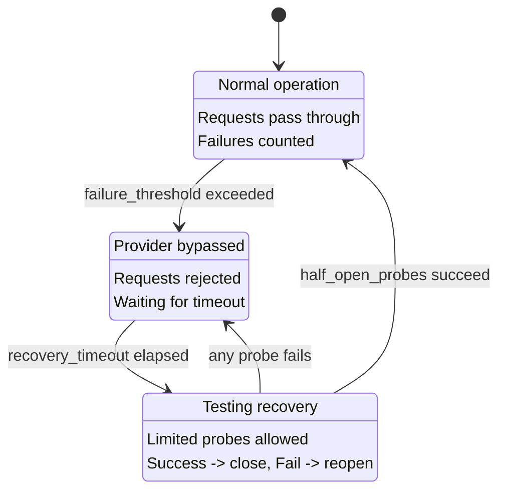

<objective>
Create comprehensive English health and circuit breaker documentation for the cc-relay docs-site.

Purpose: Close the documentation gap identified in v0.0.1-MILESTONE-AUDIT.md - users need clear guidance on configuring health checks and understanding circuit breaker behavior.

Output: `docs-site/content/en/docs/health.md` with complete configuration reference and circuit breaker state machine explanation.
</objective>

<execution_context>
@~/.claude/get-shit-done/workflows/execute-plan.md
@~/.claude/get-shit-done/templates/summary.md
</execution_context>

<context>
@.planning/PROJECT.md
@.planning/ROADMAP.md
@.planning/STATE.md
@.planning/phases/04.3-health-configuration-documentation/04.3-RESEARCH.md

# Source files for accurate documentation
@internal/health/config.go
@example.yaml

# Pattern references
@docs-site/content/en/docs/routing.md
@docs-site/content/en/docs/caching.md
</context>

<tasks>

<task type="auto">
  <name>Task 1: Create English health.md documentation</name>
  <files>docs-site/content/en/docs/health.md</files>
  <action>
Create `docs-site/content/en/docs/health.md` with the following structure:

**Frontmatter:**
```yaml
---
title: Health & Circuit Breaker
weight: 5
---
```

**Required sections (follow routing.md/caching.md pattern):**

1. **Opening paragraph** - What health tracking and circuit breaker does in cc-relay

2. **Overview table** - Circuit breaker states summary:
   | State | Description | Behavior |
   |-------|-------------|----------|
   | CLOSED | Normal operation | Requests pass through, failures counted |
   | OPEN | Provider bypassed | Requests rejected, waiting for recovery |
   | HALF-OPEN | Testing recovery | Limited probes allowed, success closes |

3. **Circuit Breaker States section** - Detailed explanation of each state with Mermaid state diagram:


4. **Configuration section** - Full YAML example from example.yaml with comments:
```yaml
health:
  check_interval_seconds: 30

  circuit_breaker:
    failure_threshold: 5
    recovery_timeout_seconds: 60

    triggers:
      rate_limit_errors: 3
      timeout_errors: 2
      server_errors: 3
```

5. **Configuration Reference table** - All options with defaults:
   | Option | Default | Description |
   |--------|---------|-------------|
   | `check_interval_seconds` | 30 | How often to check provider health |
   | `failure_threshold` | 5 | Consecutive failures to open circuit |
   | `recovery_timeout_seconds` | 60 | Time before half-open state |

6. **How It Works section** - Explain failure counting:
   - What counts as failure: 429 (rate limit), 5xx (server errors), timeouts
   - What does NOT count: 4xx client errors (except 429)
   - Note: The `triggers` block in config shows planned per-type thresholds; current implementation counts all failures equally toward threshold

7. **Integration with Routing section** - How unhealthy providers are handled:
   - Providers with OPEN circuits are excluded from routing
   - Health status visible via `X-CC-Relay-Health` debug header
   - Recovery is automatic after timeout + successful probes

8. **Debug Header section** - Document X-CC-Relay-Health:
   | Header | Value | When |
   |--------|-------|------|
   | `X-CC-Relay-Health` | `healthy` or `unhealthy:{state}` | `routing.debug: true` |

9. **Troubleshooting section** - Common issues:
   - "Provider keeps getting bypassed" - check failure_threshold, may be too low
   - "Recovery takes too long" - reduce recovery_timeout_seconds
   - "Circuit opens on valid errors" - only 5xx and 429 should trigger

10. **Next Steps section** - Links to related docs:
    - [Configuration reference](/docs/configuration/)
    - [Routing strategies](/docs/routing/)
    - [Architecture overview](/docs/architecture/)

**Important notes:**
- Use Mermaid for the state diagram (already supported, see caching.md)
- Keep code blocks in English (YAML, Go examples)
- Follow the established tone of routing.md (technical but accessible)
- Document ACTUAL behavior from config.go, not aspirational features
  </action>
  <verify>
```bash
# File exists with correct weight
head -5 docs-site/content/en/docs/health.md | grep -q "weight: 5"

# Contains required sections
grep -q "## Configuration" docs-site/content/en/docs/health.md
grep -q "## Circuit Breaker" docs-site/content/en/docs/health.md
grep -q "stateDiagram-v2" docs-site/content/en/docs/health.md
grep -q "## Troubleshooting" docs-site/content/en/docs/health.md

# Hugo site builds
cd docs-site && hugo --minify 2>&1 | grep -v "WARN" | tail -5
```
  </verify>
  <done>
- health.md exists at docs-site/content/en/docs/health.md with weight: 5
- Contains all required sections (Overview, States, Configuration, Troubleshooting, Next Steps)
- Mermaid state diagram renders correctly
- Hugo builds without errors
- All config options from example.yaml documented with accurate defaults
  </done>
</task>

</tasks>

<verification>
```bash
# Verify file structure
ls -la docs-site/content/en/docs/health.md

# Verify Hugo build
cd docs-site && hugo --minify

# Check page appears in nav (weight 5 between routing 4 and caching 6)
grep -l "weight: 5" docs-site/content/en/docs/*.md

# Verify minimum content
wc -l docs-site/content/en/docs/health.md  # Should be 150+ lines
```
</verification>

<success_criteria>
- [ ] docs-site/content/en/docs/health.md exists with weight: 5
- [ ] All health config options documented (check_interval_seconds, failure_threshold, recovery_timeout_seconds, triggers)
- [ ] Circuit breaker states explained with Mermaid diagram
- [ ] Failure counting behavior accurately documented
- [ ] Debug header (X-CC-Relay-Health) documented
- [ ] Troubleshooting section covers common issues
- [ ] Hugo site builds without errors
- [ ] Page has proper Next Steps links to related docs
</success_criteria>

<output>
After completion, create `.planning/phases/04.3-health-configuration-documentation/04.3-01-SUMMARY.md`
</output>
