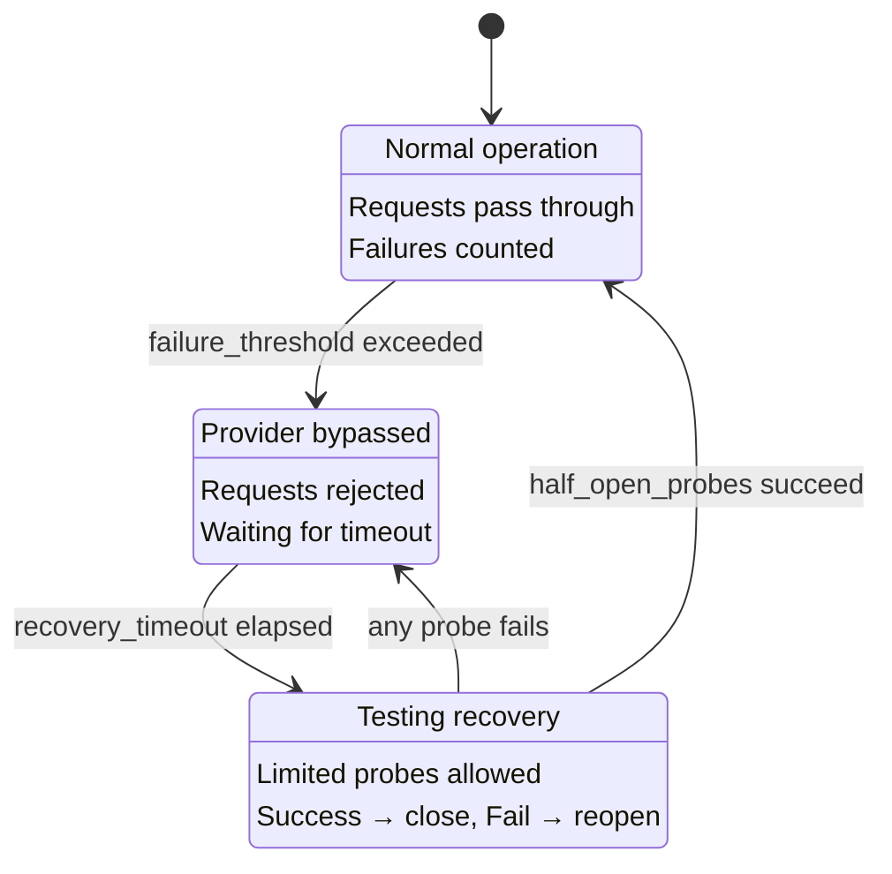

# Phase 4.3: Health Configuration Documentation - Research

**Researched:** 2026-01-23
**Domain:** Technical documentation for circuit breaker and health checking configuration
**Confidence:** HIGH

## Summary

This phase addresses a documentation gap identified in v0.0.1-MILESTONE-AUDIT.md: the docs-site is missing a dedicated health/circuit-breaker configuration page. The implementation is complete in `internal/health/` with full circuit breaker support via sony/gobreaker v2.

The documentation task is straightforward: create a new `health.md` page following the established pattern of existing docs (routing.md, caching.md) and translate it to all 5 supported languages (DE, ES, JA, ZH-CN, KO). The page should document all config options from `example.yaml` and explain the circuit breaker state machine.

**Primary recommendation:** Create `docs-site/content/en/docs/health.md` with dedicated health configuration section, then translate to all 5 languages following the established pattern.

## Standard Stack

### Core
| Tool | Version | Purpose | Why Standard |
|------|---------|---------|--------------|
| Hugo | (site-docs) | Static site generator | Already used by docs-site |
| Markdown | - | Documentation format | Standard for Hugo sites |
| Mermaid | - | Diagrams | Already used in caching.md |

### Documentation Structure
| Language | Path | Status |
|----------|------|--------|
| English | `docs-site/content/en/docs/health.md` | To create |
| German | `docs-site/content/de/docs/health.md` | To translate |
| Spanish | `docs-site/content/es/docs/health.md` | To translate |
| Japanese | `docs-site/content/ja/docs/health.md` | To translate |
| Chinese (Simplified) | `docs-site/content/zh-cn/docs/health.md` | To translate |
| Korean | `docs-site/content/ko/docs/health.md` | To translate |

## Architecture Patterns

### Documentation File Structure
```
docs-site/content/
├── en/docs/
│   ├── _index.md        # weight: 1
│   ├── getting-started.md  # weight: 2
│   ├── configuration.md # weight: 3
│   ├── routing.md       # weight: 4
│   ├── health.md        # weight: 5 (NEW)
│   ├── caching.md       # weight: 6
│   ├── architecture.md  # weight: 7
│   └── api.md           # weight: 8
├── de/docs/health.md    # Translation
├── es/docs/health.md    # Translation
├── ja/docs/health.md    # Translation
├── zh-cn/docs/health.md # Translation
└── ko/docs/health.md    # Translation
```

### Pattern 1: Documentation Page Structure
**What:** Standard Hugo frontmatter + structured sections
**When to use:** All new documentation pages
**Example:**
```markdown
---
title: Health & Circuit Breaker
weight: 5
---

CC-Relay includes [intro paragraph]...

## Overview

[Summary table]

## Configuration

[YAML examples with comments]

## [Topic] Explained

[Diagrams and detailed explanation]

## Troubleshooting

[Common issues and solutions]

## Next Steps

[Links to related docs]
```

### Pattern 2: Translation Structure
**What:** Full translation of prose, code blocks unchanged
**When to use:** All localized documentation
**Example from routing.md:**
```markdown
# English
routing determines how cc-relay chooses which provider handles each request.

# German (DE)
Routing bestimmt, wie cc-relay entscheidet, welcher Provider jede Anfrage bearbeitet.

# Spanish (ES)
El routing determina como cc-relay elige que proveedor maneja cada solicitud.
```

### Anti-Patterns to Avoid
- **Incomplete translation:** Leaving English text in translated files
- **Missing YAML blocks:** Code examples must be included in all languages (unchanged)
- **Inconsistent weight:** All language versions must have same weight value
- **Undocumented config options:** All settings from example.yaml must be documented

## Don't Hand-Roll

| Problem | Don't Build | Use Instead | Why |
|---------|-------------|-------------|-----|
| Diagrams | ASCII art | Mermaid | Already used in caching.md, renders nicely |
| Translation | Machine translation only | Review existing patterns | Established style in routing.md/caching.md |
| Config reference | Manual extraction | Copy from example.yaml | Single source of truth |

## Common Pitfalls

### Pitfall 1: Inconsistent Config Naming
**What goes wrong:** Documentation uses different names than actual config
**Why it happens:** Config evolved, docs not updated
**How to avoid:** Verify all config keys match `internal/health/config.go` and `example.yaml`
**Warning signs:** Users report "unknown config key" errors

### Pitfall 2: Missing State Transition Explanation
**What goes wrong:** Users don't understand when circuit opens/closes
**Why it happens:** Circuit breaker is complex, tempting to over-simplify
**How to avoid:** Include state diagram and explicit trigger conditions
**Warning signs:** Support questions about "why is my provider being skipped"

### Pitfall 3: Config vs Implementation Mismatch
**What goes wrong:** example.yaml shows settings not yet implemented
**Why it happens:** example.yaml has aspirational config (triggers block)
**How to avoid:** Note what's implemented vs planned; verify against code
**Warning signs:** `triggers` block in example.yaml - check if implemented in code

### Pitfall 4: Missing Weight Assignment
**What goes wrong:** Page doesn't appear in navigation
**Why it happens:** Forgot frontmatter weight
**How to avoid:** Check existing files for weight sequence, assign next available
**Warning signs:** New page doesn't show in sidebar

## Code Examples

### Configuration Reference (from example.yaml)
```yaml
# ============================================================================
# Health Checking
# ============================================================================
health:
  # How often to check provider health
  check_interval_seconds: 30

  # Circuit breaker settings
  circuit_breaker:
    # Number of failures before opening circuit
    failure_threshold: 5

    # Time to wait before trying again (half-open state)
    recovery_timeout_seconds: 60

    # Triggers for circuit breaker
    triggers:
      rate_limit_errors: 3 # 429 responses
      timeout_errors: 2 # Request timeouts
      server_errors: 3 # 5xx responses
```

### Actual Implementation Config (from internal/health/config.go)
```go
type CircuitBreakerConfig struct {
    FailureThreshold int `yaml:"failure_threshold"`  // Default: 5
    OpenDurationMS   int `yaml:"open_duration_ms"`   // Default: 30000 (30s)
    HalfOpenProbes   int `yaml:"half_open_probes"`   // Default: 3
}

type CheckConfig struct {
    Enabled    *bool `yaml:"enabled"`     // Default: true
    IntervalMS int   `yaml:"interval_ms"` // Default: 10000 (10s)
}
```

### Circuit Breaker State Diagram (Mermaid)


## State of the Art

| Old Approach | Current Approach | When Changed | Impact |
|--------------|------------------|--------------|--------|
| Manual circuit breaker | sony/gobreaker v2 | Current impl | Well-tested library |
| Single failure threshold | Configurable threshold | Current impl | More flexibility |

**Implementation notes:**
- Circuit breaker uses gobreaker v2 TwoStepCircuitBreaker
- States: CLOSED (normal), OPEN (bypassed), HALF-OPEN (probing)
- Failure triggers: consecutive failures meeting threshold
- Recovery: automatic after timeout, accelerated by health checker probes

## Config Option Reference

### Documented vs Implemented Analysis

| Config Key (example.yaml) | Implemented | Internal Field | Notes |
|---------------------------|-------------|----------------|-------|
| `health.check_interval_seconds` | YES | `CheckConfig.IntervalMS` | Unit mismatch: yaml=seconds, code=ms |
| `health.circuit_breaker.failure_threshold` | YES | `CircuitBreakerConfig.FailureThreshold` | Direct mapping |
| `health.circuit_breaker.recovery_timeout_seconds` | YES | `CircuitBreakerConfig.OpenDurationMS` | Unit mismatch: yaml=seconds, code=ms |
| `health.circuit_breaker.triggers` | PARTIAL | N/A | Triggers block in example.yaml not fully wired |

**Important:** The `triggers` block (rate_limit_errors, timeout_errors, server_errors) appears in example.yaml but the actual failure counting uses `ShouldCountAsFailure()` helper which counts 429s, 5xx, and timeouts as failures without configurable thresholds per type. Document current behavior, note future enhancement potential.

## Content Sections to Include

Based on routing.md and caching.md patterns:

### Required Sections
1. **Overview** - What circuit breaker does, why it matters
2. **Circuit Breaker States** - CLOSED, OPEN, HALF-OPEN explained
3. **State Transitions** - When and why state changes
4. **Configuration** - All YAML options with defaults
5. **How It Works** - Request flow with circuit breaker
6. **Integration with Routing** - How unhealthy providers are skipped
7. **Troubleshooting** - Common issues
8. **Next Steps** - Links to related docs

### Diagrams to Include
1. State machine diagram (CLOSED/OPEN/HALF-OPEN)
2. Request flow with circuit breaker check (sequence diagram)

## Open Questions

1. **Triggers configuration status**
   - What we know: `triggers` block exists in example.yaml
   - What's unclear: Whether per-trigger thresholds are implemented vs just presence
   - Recommendation: Verify in code, document actual behavior, note enhancement opportunity

2. **Configuration unit consistency**
   - What we know: example.yaml uses seconds, code uses milliseconds
   - What's unclear: Whether config loader converts units
   - Recommendation: Check config parsing, document user-facing units

## Sources

### Primary (HIGH confidence)
- `internal/health/config.go` - Authoritative config structure
- `internal/health/circuit.go` - Circuit breaker implementation
- `internal/health/tracker.go` - Per-provider tracking
- `internal/health/checker.go` - Health check implementation
- `example.yaml` - User-facing configuration reference
- `v0.0.1-MILESTONE-AUDIT.md` - Gap identification

### Secondary (MEDIUM confidence)
- sony/gobreaker GitHub README - Circuit breaker state machine
- `docs-site/content/en/docs/routing.md` - Documentation pattern reference
- `docs-site/content/en/docs/caching.md` - Documentation pattern reference

### Tertiary (LOW confidence)
- None

## Metadata

**Confidence breakdown:**
- Documentation structure: HIGH - verified existing patterns in routing.md, caching.md
- Config options: HIGH - verified against config.go and example.yaml
- Circuit breaker behavior: HIGH - verified gobreaker library and implementation
- Translation patterns: HIGH - verified existing DE/ES translations

**Research date:** 2026-01-23
**Valid until:** 90 days (documentation is stable domain)
