  

<h1 align="center">CC-Relay</h1>

<h4 align="center">
Boost Claude Code by routing to multiple Anthropic-compatible providers simultaneously
</h4>

  
  
  
  
  
  
  
   
  
  
  
  
  
  

<h2>Why?</h2>

  Claude Code connects to one provider at a time. But what if you want to:

  <strong>🔑 Pool rate limits</strong> across multiple Anthropic API keys 
  <strong>💰 Save money</strong> by routing simple tasks to lighter models 
  <strong>🛡️ Never get stuck</strong> with automatic failover between providers 
  <strong>🏢 Use your company's Bedrock/Azure/Vertex</strong> alongside personal API keys

  <strong>cc-relay</strong> makes all of this possible.

```mermaid
%%{init: {'theme': 'base', 'themeVariables': { 'primaryColor': '#6366f1', 'primaryTextColor': '#fff', 'primaryBorderColor': '#4f46e5', 'lineColor': '#94a3b8', 'secondaryColor': 'transparent', 'tertiaryColor': 'transparent', 'background': 'transparent', 'mainBkg': 'transparent', 'nodeBorder': '#4f46e5', 'clusterBkg': 'transparent', 'clusterBorder': 'transparent', 'titleColor': '#1e293b', 'edgeLabelBackground': 'transparent'}}}%%

flowchart LR
    CC["👾 Claude Code"]
    RELAY["⚡ CC-Relay"]

    subgraph providers[" "]
        direction TB
        ANT["🤖 Anthropic"]
        ZAI["🤖 Z.AI"]
        OLL["🦙 Ollama"]
        BED["🤖 AWS Bedrock"]
        AZU["🤖 Azure Foundry"]
        VTX["🤖 Vertex AI"]
    end

    CC --> RELAY
    RELAY --> ANT
    RELAY --> ZAI
    RELAY --> OLL
    RELAY --> BED
    RELAY --> AZU
    RELAY --> VTX

    style CC fill:#1e1e2e,stroke:#6366f1,stroke-width:2px,color:#fff
    style RELAY fill:#6366f1,stroke:#4f46e5,stroke-width:3px,color:#fff
    style ANT fill:#ff6b35,stroke:#e55a2b,stroke-width:2px,color:#fff
    style ZAI fill:#3b82f6,stroke:#2563eb,stroke-width:2px,color:#fff
    style OLL fill:#22c55e,stroke:#16a34a,stroke-width:2px,color:#fff
    style BED fill:#f59e0b,stroke:#d97706,stroke-width:2px,color:#fff
    style AZU fill:#0ea5e9,stroke:#0284c7,stroke-width:2px,color:#fff
    style VTX fill:#ef4444,stroke:#dc2626,stroke-width:2px,color:#fff
    style providers fill:transparent,stroke:transparent
```

## License

[AGPL-3.0](https://github.com/omarluq/cc-relay/blob/main/LICENSE) - © 2026 [Omar Alani](https://github.com/omarluq)

## Contributing

Contributions welcome! Please open an issue before submitting PRs.
