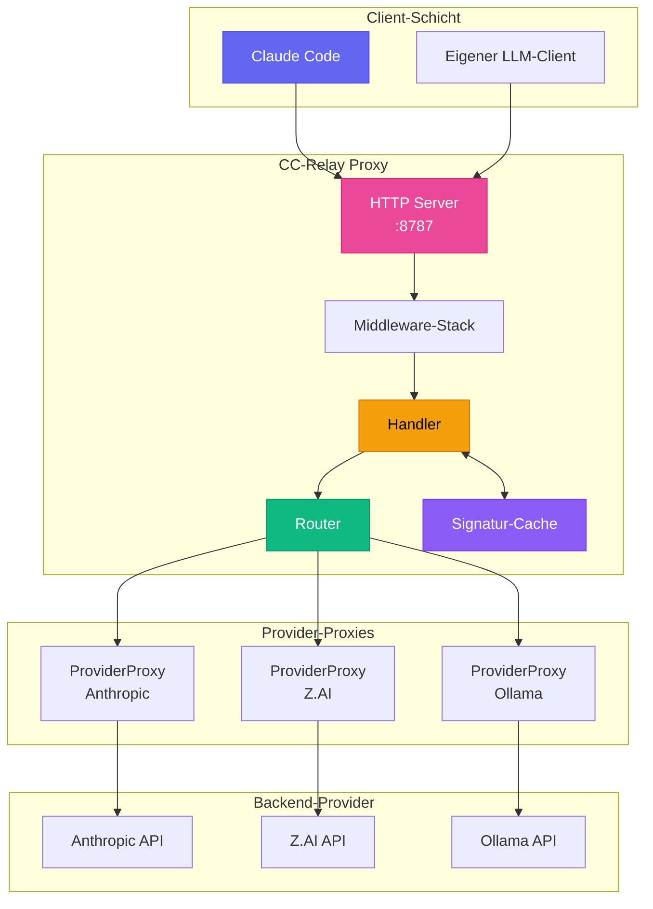
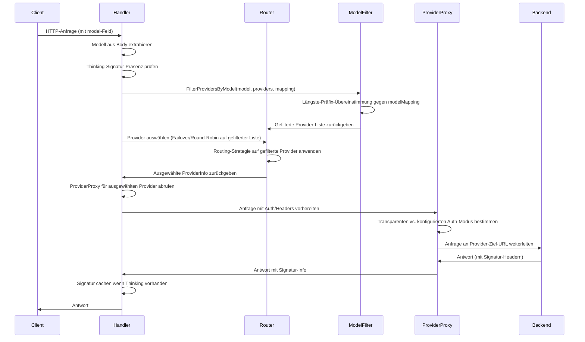
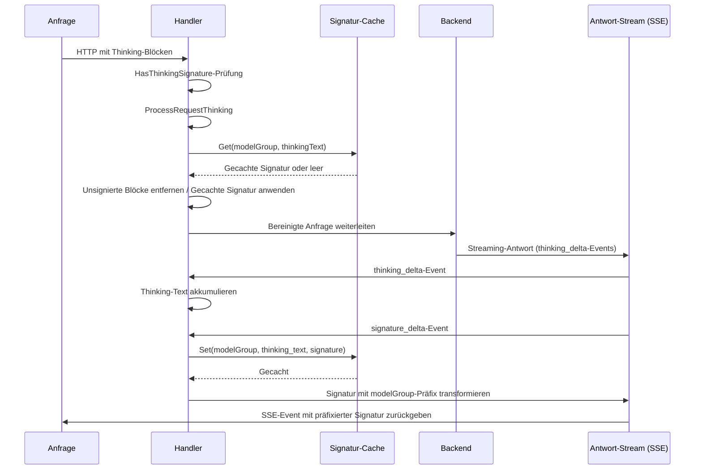
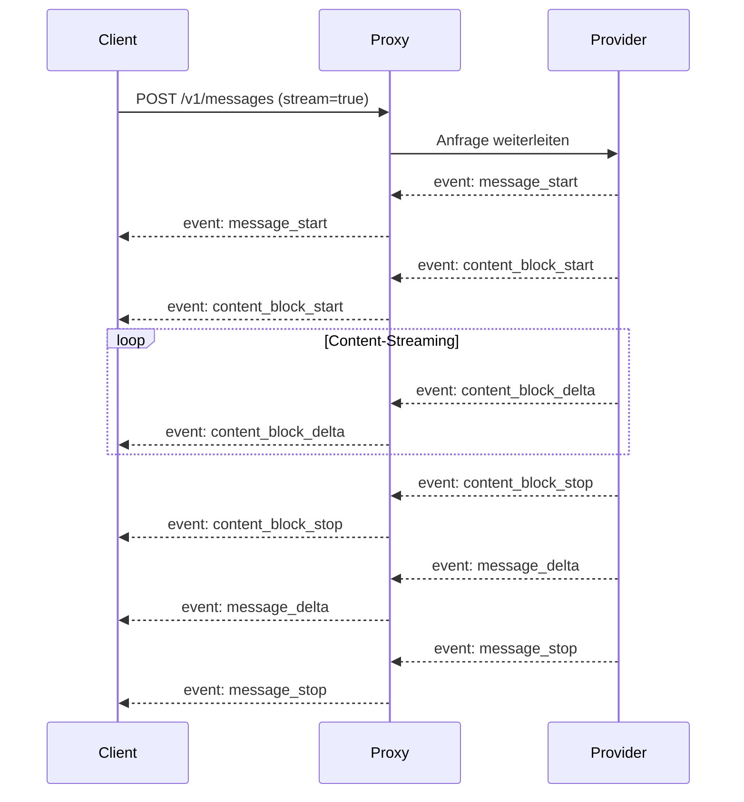
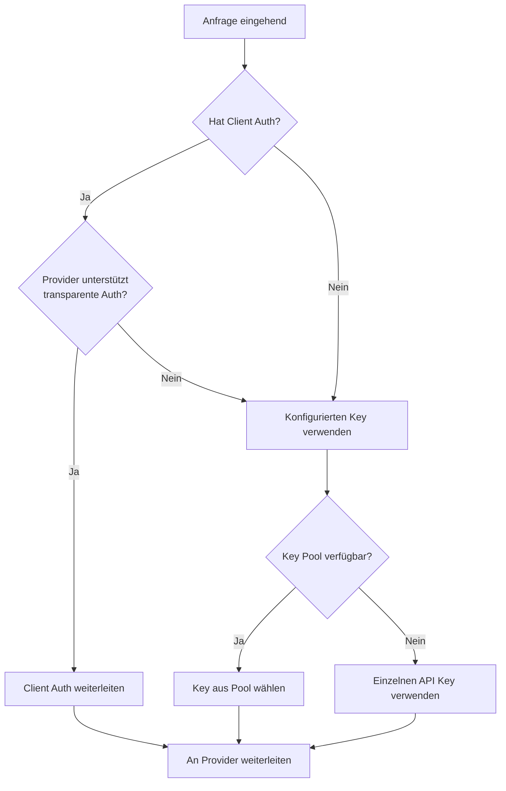

CC-Relay ist ein hochperformanter, Multi-Provider HTTP-Proxy, der für LLM-Anwendungen entwickelt wurde. Er bietet intelligentes Routing, Caching von Thinking-Signaturen und nahtloses Failover zwischen Providern.

## Systemübersicht



## Kernkomponenten

### 1. Handler

**Speicherort**: `internal/proxy/handler.go`

Der Handler ist der zentrale Koordinator für die Anfrageverarbeitung:

```go
type Handler struct {
    providerProxies map[string]*ProviderProxy  // Reverse-Proxies pro Provider
    defaultProvider providers.Provider          // Fallback für Single-Provider-Modus
    router          router.ProviderRouter       // Implementierung der Routing-Strategie
    healthTracker   *health.Tracker             // Circuit-Breaker-Tracking
    signatureCache  *SignatureCache             // Thinking-Signatur-Cache
    routingConfig   *config.RoutingConfig       // Modellbasierte Routing-Konfiguration
    providers       []router.ProviderInfo       // Verfügbare Provider
}
```

**Verantwortlichkeiten:**
- Extrahieren des Modellnamens aus dem Request-Body
- Erkennen von Thinking-Signaturen für Provider-Affinität
- Auswählen des Providers über den Router
- Delegieren an den entsprechenden ProviderProxy
- Verarbeiten von Thinking-Blöcken und Cachen von Signaturen

### 2. ProviderProxy

**Speicherort**: `internal/proxy/provider_proxy.go`

Jeder Provider erhält einen dedizierten Reverse-Proxy mit vorkonfigurierter URL und Authentifizierung:

```go
type ProviderProxy struct {
    Provider           providers.Provider
    Proxy              *httputil.ReverseProxy
    KeyPool            *keypool.KeyPool  // Für Multi-Key-Rotation
    APIKey             string            // Fallback-Einzelschlüssel
    targetURL          *url.URL          // Basis-URL des Providers
    modifyResponseHook ModifyResponseFunc
}
```

**Hauptmerkmale:**
- URL-Parsing erfolgt einmalig bei der Initialisierung (nicht pro Anfrage)
- Unterstützt transparente Authentifizierung (Weiterleitung von Client-Credentials) oder konfigurierte Authentifizierung
- Automatische SSE-Header-Injektion für Streaming-Antworten
- Key-Pool-Integration für Rate-Limit-Verteilung

### 3. Router

**Speicherort**: `internal/router/`

Der Router wählt aus, welcher Provider jede Anfrage bearbeitet:

| Strategie | Beschreibung |
|----------|-------------|
| `failover` | Prioritätsbasiert mit automatischem Retry (Standard) |
| `round_robin` | Sequentielle Rotation |
| `weighted_round_robin` | Proportional nach Gewichtung |
| `shuffle` | Faire Zufallsverteilung |
| `model_based` | Routing nach Modellnamen-Präfix |

### 4. Signatur-Cache

**Speicherort**: `internal/proxy/signature_cache.go`

Cached Thinking-Block-Signaturen für Cross-Provider-Kompatibilität:

```go
type SignatureCache struct {
    cache cache.Cache  // Ristretto-gestützter Cache
}

// Cache-Schlüsselformat: "sig:{modelGroup}:{textHash}"
// TTL: 3 Stunden (entspricht Claude API)
```

## Anfragefluss

### Multi-Provider-Routing



### Verarbeitung von Thinking-Signaturen

Wenn erweitertes Thinking aktiviert ist, geben Provider signierte Thinking-Blöcke zurück. Diese Signaturen müssen vom selben Provider bei nachfolgenden Turns validiert werden. CC-Relay löst Cross-Provider-Signatur-Probleme durch Caching:



**Modellgruppen für Signatur-Sharing:**

| Modell-Pattern | Gruppe | Signaturen geteilt |
|--------------|-------|-------------------|
| `claude-*` | `claude` | Ja, über alle Claude-Modelle |
| `gpt-*` | `gpt` | Ja, über alle GPT-Modelle |
| `gemini-*` | `gemini` | Ja, verwendet Sentinel-Wert |
| Andere | Exakter Name | Kein Sharing |

### SSE-Streaming-Ablauf



**Erforderliche SSE-Header:**
```text
Content-Type: text/event-stream
Cache-Control: no-cache, no-transform
X-Accel-Buffering: no
Connection: keep-alive
```

## Middleware-Stack

**Speicherort**: `internal/proxy/middleware.go`

| Middleware | Zweck |
|------------|-------|
| `RequestIDMiddleware` | Generiert/extrahiert X-Request-ID für Tracing |
| `LoggingMiddleware` | Protokolliert Anfrage/Antwort mit Timing |
| `AuthMiddleware` | Validiert x-api-key-Header |
| `MultiAuthMiddleware` | Unterstützt API-Key- und Bearer-Token-Auth |

## Provider-Schnittstelle

**Speicherort**: `internal/providers/provider.go`

```go
type Provider interface {
    Name() string
    BaseURL() string
    Owner() string
    Authenticate(req *http.Request, key string) error
    ForwardHeaders(originalHeaders http.Header) http.Header
    SupportsStreaming() bool
    SupportsTransparentAuth() bool
    ListModels() []Model
    GetModelMapping() map[string]string
    MapModel(requestModel string) string
}
```

**Implementierte Provider:**

| Provider | Typ | Funktionen |
|----------|------|----------|
| `AnthropicProvider` | `anthropic` | Natives Format, volle Funktionsunterstützung |
| `ZAIProvider` | `zai` | Anthropic-kompatibel, GLM-Modelle |
| `OllamaProvider` | `ollama` | Lokale Modelle, kein Prompt-Caching |

## Authentifizierungsmodi

### Transparente Authentifizierung
Wenn der Client Credentials bereitstellt und der Provider es unterstützt:
- `Authorization`- oder `x-api-key`-Header des Clients werden unverändert weitergeleitet
- CC-Relay agiert als reiner Proxy

### Konfigurierte Authentifizierung
Bei Verwendung von CC-Relays verwalteten Schlüsseln:
- Client-Credentials werden entfernt
- CC-Relay injiziert konfigurierten API-Schlüssel
- Unterstützt Key-Pool-Rotation für Rate-Limit-Verteilung



## Health-Tracking & Circuit Breaker

**Speicherort**: `internal/health/`

CC-Relay verfolgt Provider-Gesundheit und implementiert Circuit-Breaker-Muster:

| Status | Verhalten |
|--------|----------|
| CLOSED | Normalbetrieb, Anfragen fließen durch |
| OPEN | Provider als ungesund markiert, Anfragen scheitern schnell |
| HALF-OPEN | Prüfung mit begrenzten Anfragen nach Abkühlung |

**Auslöser für OPEN-Status:**
- HTTP 429 (Rate-limitiert)
- HTTP 5xx (Server-Fehler)
- Verbindungs-Timeouts
- Aufeinanderfolgende Fehler überschreiten Schwellenwert

## Verzeichnisstruktur

```text
cc-relay/
├── cmd/cc-relay/           # CLI-Einstiegspunkt
│   ├── main.go             # Root-Befehl
│   ├── serve.go            # Serve-Befehl
│   └── di/                 # Dependency Injection
│       └── providers.go    # Service-Verdrahtung
├── internal/
│   ├── config/             # Konfiguration laden
│   ├── providers/          # Provider-Implementierungen
│   │   ├── provider.go     # Provider-Schnittstelle
│   │   ├── base.go         # Basis-Provider
│   │   ├── anthropic.go    # Anthropic-Provider
│   │   ├── zai.go          # Z.AI-Provider
│   │   └── ollama.go       # Ollama-Provider
│   ├── proxy/              # HTTP-Proxy-Server
│   │   ├── handler.go      # Haupt-Request-Handler
│   │   ├── provider_proxy.go # Pro-Provider-Proxy
│   │   ├── thinking.go     # Thinking-Block-Verarbeitung
│   │   ├── signature_cache.go # Signatur-Caching
│   │   ├── sse.go          # SSE-Hilfsfunktionen
│   │   └── middleware.go   # Middleware-Kette
│   ├── router/             # Routing-Strategien
│   │   ├── router.go       # Router-Schnittstelle
│   │   ├── failover.go     # Failover-Strategie
│   │   ├── round_robin.go  # Round-Robin-Strategie
│   │   └── model_filter.go # Modellbasierte Filterung
│   ├── health/             # Health-Tracking
│   │   └── tracker.go      # Circuit Breaker
│   ├── keypool/            # API-Key-Pooling
│   │   └── keypool.go      # Key-Rotation
│   └── cache/              # Caching-Schicht
│       └── cache.go        # Ristretto-Wrapper
└── docs-site/              # Dokumentation
```

## Leistungsüberlegungen

### Verbindungshandling
- **Connection Pooling**: HTTP-Verbindungen zu Backends werden wiederverwendet
- **HTTP/2-Unterstützung**: Multiplexed Requests wo unterstützt
- **Sofortiges Flushing**: SSE-Events werden ohne Pufferung geflusht

### Nebenläufigkeit
- **Goroutine pro Anfrage**: Leichtgewichtige Go-Nebenläufigkeit
- **Context-Propagierung**: Korrektes Timeout und Abbruch
- **Thread-sicheres Caching**: Ristretto bietet nebenläufigen Zugriff

### Speicher
- **Streaming-Antworten**: Keine Pufferung von Response-Bodies
- **Signatur-Cache**: Begrenzte Größe mit LRU-Eviction
- **Request-Body-Wiederherstellung**: Effizientes Body-Neulesen

## Nächste Schritte

- [Konfigurationsreferenz](/docs/configuration/)
- [Routing-Strategien](/docs/routing/)
- [Provider-Einrichtung](/docs/providers/)
