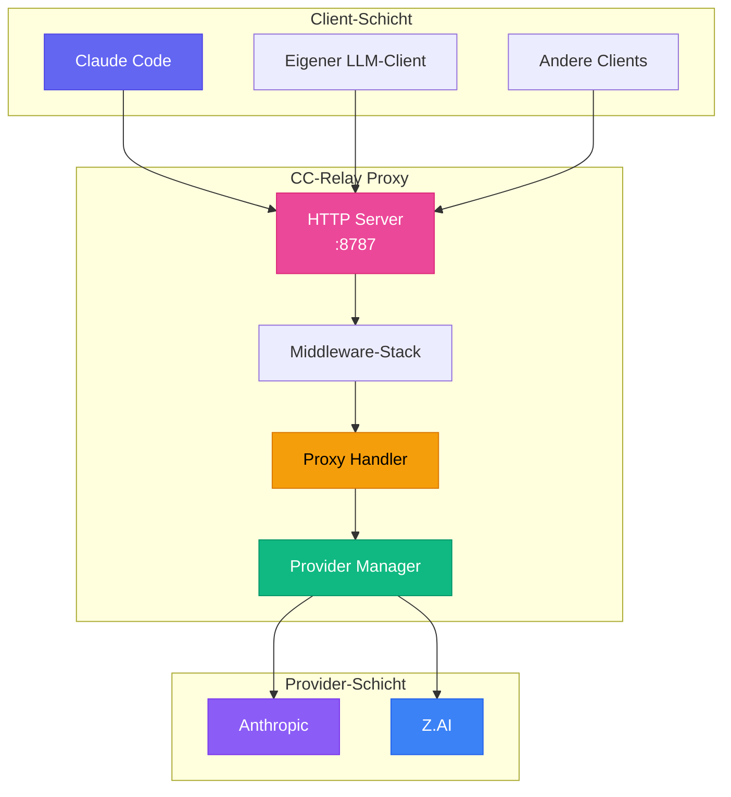
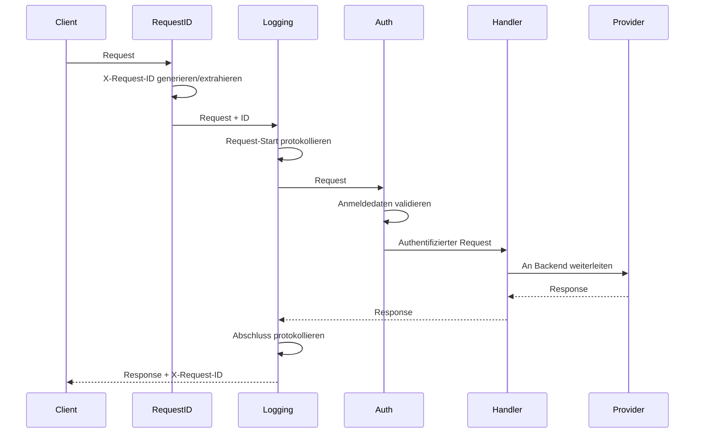
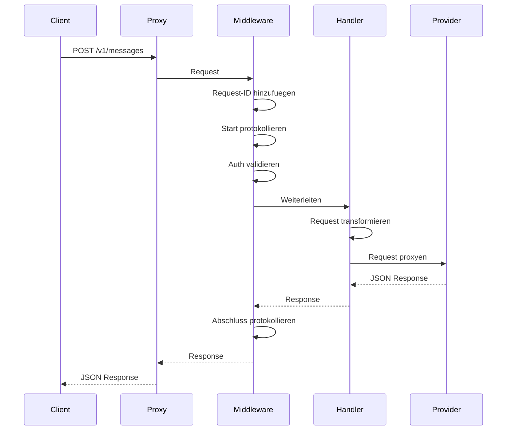
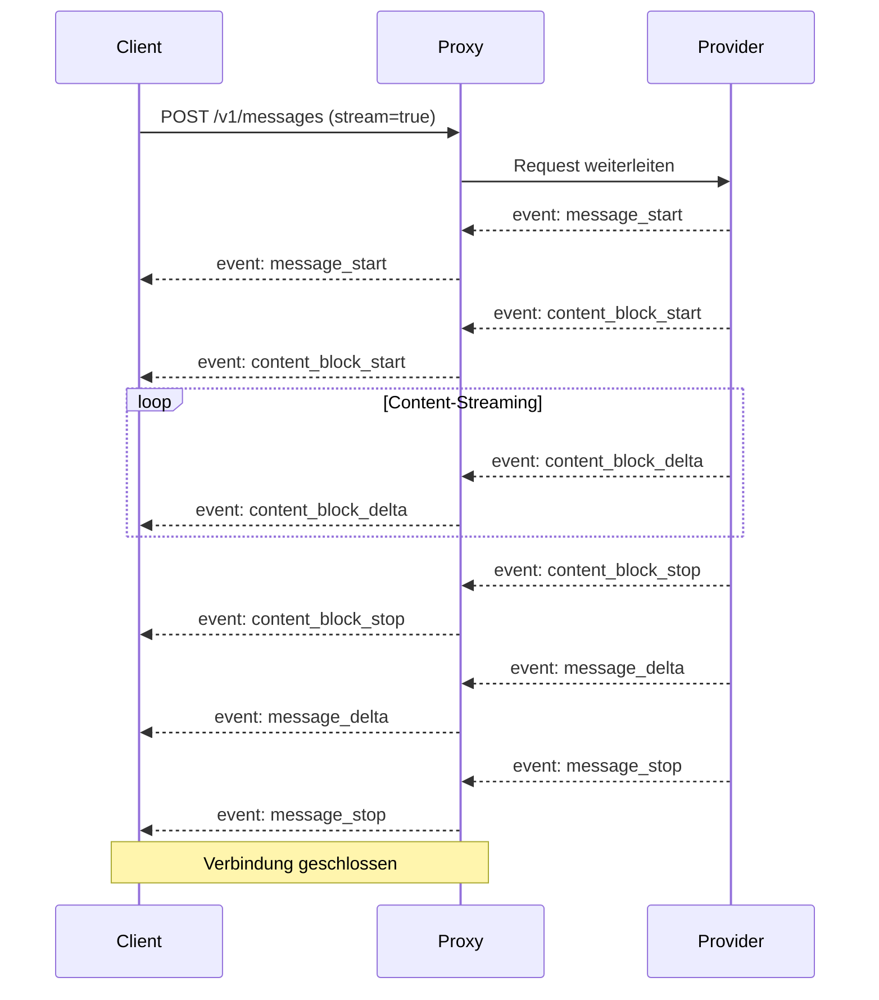
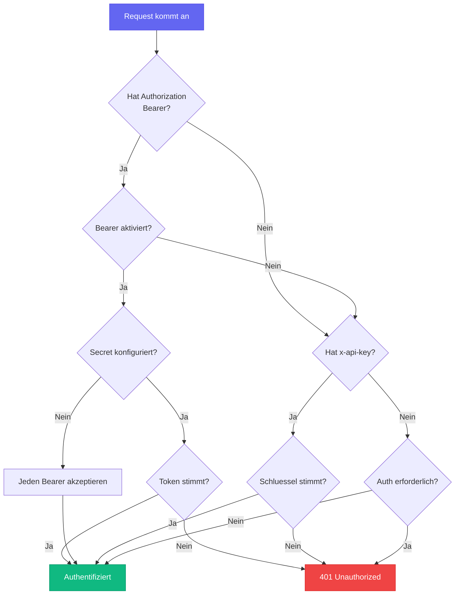

CC-Relay ist als leistungsstarker Multi-Provider HTTP-Proxy konzipiert, der zwischen LLM-Clients (wie Claude Code) und Backend-Providern vermittelt.

## Systemuebersicht



## Kernkomponenten

### 1. HTTP Proxy Server

**Speicherort**: `internal/proxy/`

Der HTTP-Server implementiert die Anthropic Messages API (`/v1/messages`) mit exakter Kompatibilitaet fuer Claude Code.

**Funktionen:**
- SSE-Streaming mit korrekter Event-Sequenz
- Request-Validierung und -Transformation
- Middleware-Kette (Request-ID, Protokollierung, Authentifizierung)
- Context-Propagation fuer Timeouts und Abbruch
- HTTP/2-Unterstuetzung fuer gleichzeitige Anfragen

**Endpunkte:**

| Endpunkt | Methode | Beschreibung |
|----------|---------|--------------|
| `/v1/messages` | POST | Anfragen an Backend-Provider weiterleiten |
| `/v1/models` | GET | Verfuegbare Modelle aller Provider auflisten |
| `/v1/providers` | GET | Aktive Provider mit Metadaten auflisten |
| `/health` | GET | Health-Check-Endpunkt |

### 2. Middleware-Stack

**Speicherort**: `internal/proxy/middleware.go`

Die Middleware-Kette verarbeitet Anfragen in dieser Reihenfolge:



**Middleware-Komponenten:**

| Middleware | Zweck |
|------------|-------|
| `RequestIDMiddleware` | Generiert/extrahiert X-Request-ID fuer Tracing |
| `LoggingMiddleware` | Protokolliert Request/Response mit Timing |
| `AuthMiddleware` | Validiert x-api-key Header |
| `MultiAuthMiddleware` | Unterstuetzt API-Schluessel und Bearer-Token Auth |

### 3. Provider Manager

**Speicherort**: `internal/providers/`

Jeder Provider implementiert das `Provider` Interface:

```go
type Provider interface {
    // Name returns the provider identifier
    Name() string

    // BaseURL returns the backend API base URL
    BaseURL() string

    // Owner returns the owner identifier (e.g., "anthropic", "zhipu")
    Owner() string

    // Authenticate adds provider-specific authentication
    Authenticate(req *http.Request, key string) error

    // ForwardHeaders returns headers to forward to the backend
    ForwardHeaders(originalHeaders http.Header) http.Header

    // SupportsStreaming indicates if the provider supports SSE
    SupportsStreaming() bool

    // ListModels returns available models
    ListModels() []Model
}
```

**Implementierte Provider:**

| Provider | Typ | Beschreibung |
|----------|-----|--------------|
| `AnthropicProvider` | `anthropic` | Anthropic Direct API |
| `ZAIProvider` | `zai` | Z.AI/Zhipu GLM (Anthropic-kompatibel) |

### 4. Proxy Handler

**Speicherort**: `internal/proxy/handler.go`

Der Proxy-Handler verwendet Go's `httputil.ReverseProxy` fuer effiziente Request-Weiterleitung:

```go
type Handler struct {
    provider  providers.Provider
    proxy     *httputil.ReverseProxy
    apiKey    string
    debugOpts config.DebugOptions
}
```

**Hauptmerkmale:**
- Sofortiges Flush fuer SSE-Streaming (`FlushInterval: -1`)
- Provider-spezifische Authentifizierung
- Header-Weiterleitung fuer `anthropic-*` Header
- Fehlerbehandlung mit Anthropic-Format-Responses

### 5. Configuration Manager

**Speicherort**: `internal/config/`

**Funktionen:**
- YAML-Parsing mit Umgebungsvariablen-Erweiterung
- Validierung von Provider- und Server-Konfigurationen
- Unterstuetzung fuer mehrere Authentifizierungsmethoden

## Request-Ablauf

### Nicht-Streaming Request



### Streaming Request (SSE)



## SSE-Streaming

CC-Relay bewahrt die exakte SSE-Event-Reihenfolge fuer Claude Code Kompatibilitaet:

**Erforderliche Header:**
```
Content-Type: text/event-stream
Cache-Control: no-cache, no-transform
X-Accel-Buffering: no
Connection: keep-alive
```

**Event-Sequenz:**
1. `message_start` - Nachrichtenmetadaten
2. `content_block_start` - Inhaltsblock beginnt
3. `content_block_delta` - Inhaltsfragmente (wiederholt)
4. `content_block_stop` - Inhaltsblock endet
5. `message_delta` - Nutzungsinformationen
6. `message_stop` - Nachricht abgeschlossen

Der `X-Accel-Buffering: no` Header ist entscheidend, um zu verhindern, dass nginx/Cloudflare SSE-Events puffern.

## Authentifizierungsablauf



## API-Kompatibilitaet

### Anthropic API-Format

CC-Relay implementiert exakte Kompatibilitaet mit der Anthropic Messages API:

**Endpunkt**: `POST /v1/messages`

**Header**:
- `x-api-key`: API-Schluessel (von CC-Relay verwaltet)
- `anthropic-version`: API-Version (z.B. `2023-06-01`)
- `content-type`: `application/json`

**Request Body**:
```json
{
  "model": "claude-sonnet-4-5-20250514",
  "max_tokens": 1024,
  "messages": [
    {"role": "user", "content": "Hallo!"}
  ],
  "stream": true
}
```

### Provider-Transformationen

Beide derzeit unterstuetzten Provider (Anthropic und Z.AI) verwenden dasselbe Anthropic-kompatible API-Format:

| Provider | Transformation |
|----------|----------------|
| **Anthropic** | Keine (natives Format) |
| **Z.AI** | Nur Modellnamen-Mapping |

## Performance-Ueberlegungen

### Verbindungshandling

CC-Relay verwendet Go's Standard-Bibliothek HTTP-Client mit optimierten Einstellungen:

- **Connection Pooling**: Wiederverwendung von HTTP-Verbindungen zu Backends
- **HTTP/2-Unterstuetzung**: Optionales h2c fuer multiplexte Anfragen
- **Sofortiges Flush**: SSE-Events werden sofort geflusht

### Nebenlaeufigkeit

- **Goroutine pro Request**: Leichtgewichtiges Nebenlaeufigkeitsmodell
- **Context-Propagation**: Korrektes Timeout- und Abbruch-Handling
- **Thread-sicheres Logging**: Verwendet zerolog fuer strukturierte Protokollierung

### Speicherverwaltung

- **Streaming Responses**: Kein Puffern von Response-Bodies
- **Request-Body-Limits**: Konfigurierbare maximale Body-Groesse
- **Graceful Shutdown**: 30-Sekunden-Timeout fuer laufende Anfragen

## Verzeichnisstruktur

```
cc-relay/
├── cmd/cc-relay/        # CLI-Einstiegspunkt
│   ├── main.go          # Root-Command
│   ├── serve.go         # Serve-Command
│   ├── status.go        # Status-Command
│   ├── version.go       # Version-Command
│   ├── config.go        # Config-Command
│   ├── config_init.go   # Config init Subcommand
│   ├── config_cc.go     # Config cc Subcommand
│   ├── config_cc_init.go    # Claude Code Config
│   └── config_cc_remove.go  # CC Config entfernen
├── internal/
│   ├── config/          # Konfiguration laden
│   │   ├── config.go    # Config-Strukturen
│   │   └── loader.go    # YAML/env laden
│   ├── providers/       # Provider-Implementierungen
│   │   ├── provider.go  # Provider-Interface
│   │   ├── base.go      # Basis-Provider
│   │   ├── anthropic.go # Anthropic-Provider
│   │   └── zai.go       # Z.AI-Provider
│   ├── proxy/           # HTTP-Proxy-Server
│   │   ├── server.go    # Server-Setup
│   │   ├── routes.go    # Route-Registrierung
│   │   ├── handler.go   # Proxy-Handler
│   │   ├── middleware.go # Middleware-Kette
│   │   ├── sse.go       # SSE-Utilities
│   │   ├── errors.go    # Fehler-Responses
│   │   └── logger.go    # Logging-Setup
│   ├── auth/            # Authentifizierung
│   │   ├── auth.go      # Auth-Interface
│   │   ├── apikey.go    # API-Schluessel Auth
│   │   ├── oauth.go     # Bearer-Token Auth
│   │   └── chain.go     # Auth-Kette
│   └── version/         # Versionsinformationen
└── config.yaml          # Beispielkonfiguration
```

## Zukuenftige Architektur

Folgende Funktionen sind fuer zukuenftige Releases geplant:

- **Router-Komponente**: Intelligente Routing-Strategien (Round-Robin, Failover, kostenbasiert)
- **Rate Limiter**: Token-Bucket Rate-Limiting pro API-Schluessel
- **Health Tracker**: Circuit Breaker mit automatischer Wiederherstellung
- **gRPC Management API**: Echtzeit-Statistiken und Konfiguration
- **TUI Dashboard**: Terminal-basierte Monitoring-Oberflaeche
- **Zusaetzliche Provider**: Ollama, AWS Bedrock, Azure, Vertex AI

## Naechste Schritte

- [Konfigurationsreferenz](/de/docs/configuration/)
- [API-Dokumentation](/de/docs/api/)
