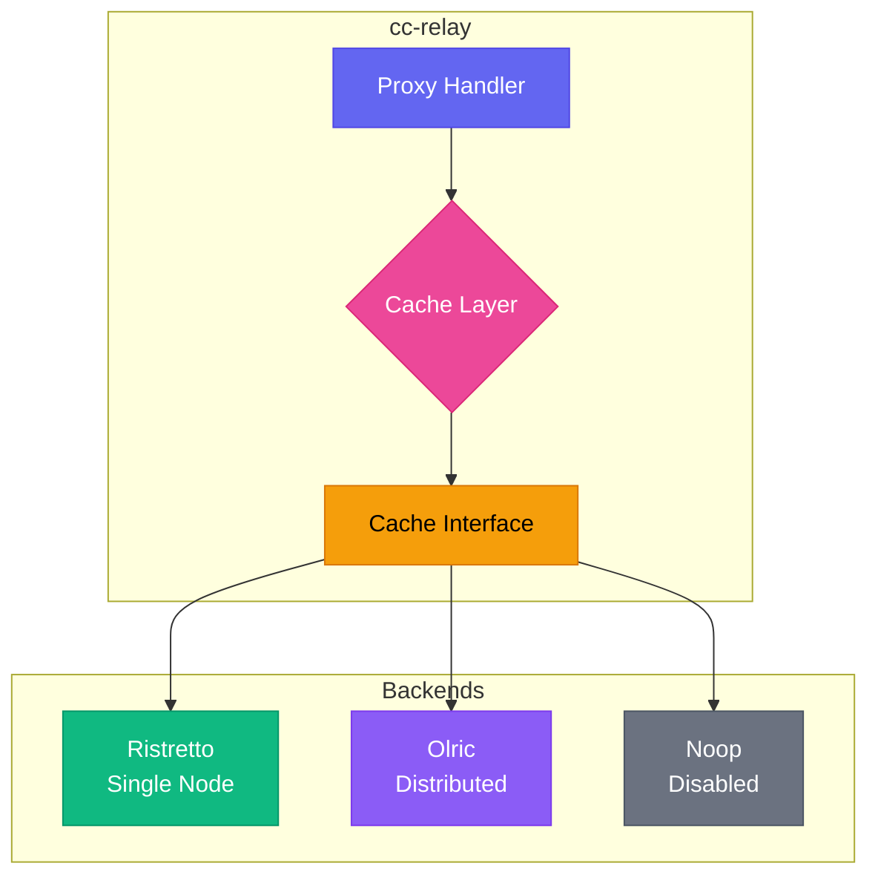
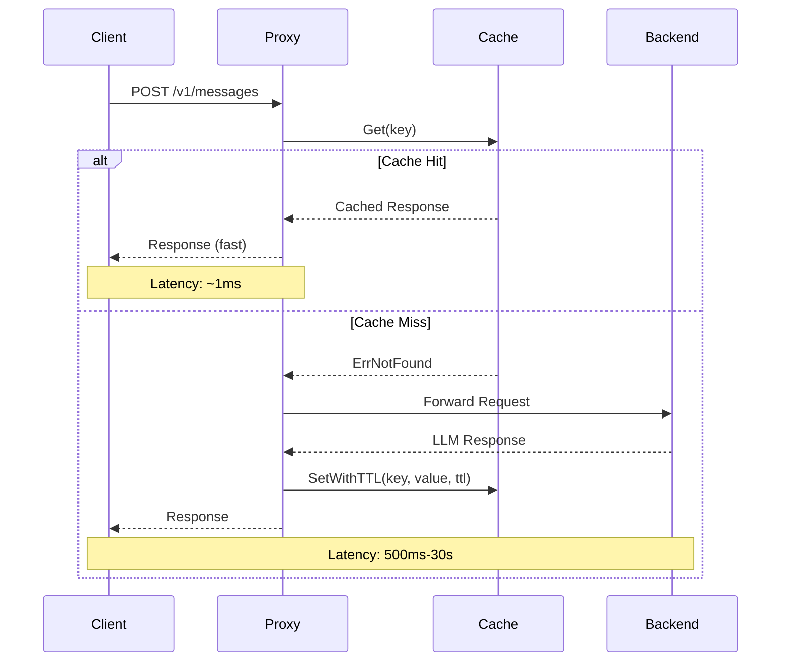

CC-Relay enthaelt eine flexible Caching-Schicht, die Latenz und Backend-Last durch Zwischenspeichern von Antworten von LLM-Providern erheblich reduzieren kann.

## Uebersicht

Das Cache-Subsystem unterstuetzt drei Betriebsmodi:

| Modus | Backend | Beschreibung |
|-------|---------|--------------|
| `single` | Ristretto | Hochleistungs-In-Memory-Cache fuer einzelne Knoten (Standard) |
| `ha` | Olric | Verteilter Cache fuer Hochverfuegbarkeits-Deployments |
| `disabled` | Noop | Durchleitungsmodus ohne Caching |

**Wann welchen Modus verwenden:**

- **Single-Modus**: Entwicklung, Tests oder Einzel-Instanz-Produktions-Deployments. Bietet die niedrigste Latenz ohne Netzwerk-Overhead.
- **HA-Modus**: Multi-Instanz-Produktions-Deployments, bei denen Cache-Konsistenz ueber Knoten hinweg erforderlich ist.
- **Disabled-Modus**: Debugging, Compliance-Anforderungen oder wenn Caching anderweitig gehandhabt wird.

## Architektur



Die Cache-Schicht implementiert ein einheitliches `Cache`-Interface, das alle Backends abstrahiert:

```go
type Cache interface {
    Get(ctx context.Context, key string) ([]byte, error)
    Set(ctx context.Context, key string, value []byte) error
    SetWithTTL(ctx context.Context, key string, value []byte, ttl time.Duration) error
    Delete(ctx context.Context, key string) error
    Exists(ctx context.Context, key string) (bool, error)
    Close() error
}
```

## Cache-Ablauf



## Konfiguration

### Single-Modus (Ristretto)

Ristretto ist ein hochleistungsfaehiger, nebenlaeufiger Cache basierend auf Forschung der Caffeine-Bibliothek. Er verwendet eine TinyLFU-Admission-Policy fuer optimale Trefferquoten.


  
```yaml
cache:
  mode: single

  ristretto:
    # Anzahl der 4-Bit-Zugriffszaehler
    # Empfohlen: 10x der erwarteten maximalen Eintraege fuer optimale Admission-Policy
    # Beispiel: Fuer 100.000 Eintraege, verwenden Sie 1.000.000 Zaehler
    num_counters: 1000000

    # Maximaler Speicher fuer zwischengespeicherte Werte (in Bytes)
    # 104857600 = 100 MB
    max_cost: 104857600

    # Anzahl der Schluessel pro Get-Buffer (Standard: 64)
    # Steuert die Groesse des Admission-Buffers
    buffer_items: 64
```
  
  
```toml
[cache]
mode = "single"

[cache.ristretto]
# Number of 4-bit access counters
# Recommended: 10x expected max items for optimal admission policy
# Example: For 100,000 items, use 1,000,000 counters
num_counters = 1000000

# Maximum memory for cached values (in bytes)
# 104857600 = 100 MB
max_cost = 104857600

# Number of keys per Get buffer (default: 64)
# Controls admission buffer size
buffer_items = 64
```
  


**Speicherberechnung:**

Der `max_cost`-Parameter steuert, wie viel Speicher der Cache fuer Werte verwenden kann. Um die angemessene Groesse zu schaetzen:

1. Schaetzen Sie die durchschnittliche Antwortgroesse (typischerweise 1-10 KB fuer LLM-Antworten)
2. Multiplizieren Sie mit der Anzahl der eindeutigen Anfragen, die Sie zwischenspeichern moechten
3. Fuegen Sie 20% Overhead fuer Metadaten hinzu

Beispiel: 10.000 zwischengespeicherte Antworten x 5 KB Durchschnitt = 50 MB, also setzen Sie `max_cost: 52428800`

### HA-Modus (Olric)

Olric bietet verteiltes Caching mit automatischer Cluster-Erkennung und Datenreplikation.

**Client-Modus** (Verbindung zu externem Cluster):


  
```yaml
cache:
  mode: ha

  olric:
    # Olric-Cluster-Mitglieder-Adressen
    addresses:
      - "olric-1:3320"
      - "olric-2:3320"
      - "olric-3:3320"

    # Name der verteilten Map (Standard: "cc-relay")
    dmap_name: "cc-relay"
```
  
  
```toml
[cache]
mode = "ha"

[cache.olric]
# Olric cluster member addresses
addresses = ["olric-1:3320", "olric-2:3320", "olric-3:3320"]

# Distributed map name (default: "cc-relay")
dmap_name = "cc-relay"
```
  


**Embedded-Modus** (Einzel-Knoten-HA oder Entwicklung):


  
```yaml
cache:
  mode: ha

  olric:
    # Eingebetteten Olric-Knoten ausfuehren
    embedded: true

    # Adresse fuer den eingebetteten Knoten
    bind_addr: "0.0.0.0:3320"

    # Peer-Adressen fuer Cluster-Erkennung (optional)
    peers:
      - "cc-relay-2:3320"
      - "cc-relay-3:3320"

    dmap_name: "cc-relay"
```
  
  
```toml
[cache]
mode = "ha"

[cache.olric]
# Run embedded Olric node
embedded = true

# Address to bind the embedded node
bind_addr = "0.0.0.0:3320"

# Peer addresses for cluster discovery (optional)
peers = ["cc-relay-2:3320", "cc-relay-3:3320"]

dmap_name = "cc-relay"
```
  


### Disabled-Modus


  
```yaml
cache:
  mode: disabled
```
  
  
```toml
[cache]
mode = "disabled"
```
  


Alle Cache-Operationen kehren sofort zurueck, ohne Daten zu speichern. `Get`-Operationen geben immer `ErrNotFound` zurueck.

## HA-Clustering-Anleitung

Dieser Abschnitt behandelt die Bereitstellung von cc-relay mit verteiltem Caching ueber mehrere Knoten fuer Hochverfuegbarkeit.

### Voraussetzungen

Bevor Sie den HA-Modus konfigurieren:

1. **Netzwerkkonnektivitaet**: Alle Knoten muessen sich gegenseitig erreichen koennen
2. **Port-Zugaenglichkeit**: Sowohl Olric- als auch memberlist-Ports muessen offen sein
3. **Konsistente Konfiguration**: Alle Knoten muessen denselben `dmap_name` und dieselbe `environment`-Einstellung verwenden

### Port-Anforderungen

**Kritisch:** Olric verwendet zwei Ports:

| Port | Zweck | Standard |
|------|-------|----------|
| `bind_addr`-Port | Olric-Client-Verbindungen | 3320 |
| `bind_addr`-Port + 2 | Memberlist-Gossip-Protokoll | 3322 |

**Beispiel:** Wenn `bind_addr: "0.0.0.0:3320"`, verwendet memberlist automatisch Port 3322.

Stellen Sie sicher, dass beide Ports in Firewalls offen sind:

```bash
# Olric-Client-Port erlauben
sudo ufw allow 3320/tcp

# Memberlist-Gossip-Port erlauben (bind_addr-Port + 2)
sudo ufw allow 3322/tcp
```

### Umgebungseinstellungen

| Einstellung | Gossip-Intervall | Probe-Intervall | Probe-Timeout | Verwendung |
|-------------|------------------|-----------------|---------------|------------|
| `local` | 100ms | 100ms | 200ms | Gleicher Host, Entwicklung |
| `lan` | 200ms | 1s | 500ms | Gleiches Rechenzentrum |
| `wan` | 500ms | 3s | 2s | Rechenzentrum-uebergreifend |

**Alle Knoten in einem Cluster muessen dieselbe Umgebungseinstellung verwenden.**

### Zwei-Knoten-Cluster Beispiel

**Knoten 1 (cc-relay-1):**


  
```yaml
cache:
  mode: ha
  olric:
    embedded: true
    bind_addr: "0.0.0.0:3320"
    dmap_name: "cc-relay"
    environment: lan
    peers:
      - "cc-relay-2:3322"  # Memberlist-Port von Knoten 2
    replica_count: 2
    read_quorum: 1
    write_quorum: 1
    member_count_quorum: 2
    leave_timeout: 5s
```
  
  
```toml
[cache]
mode = "ha"

[cache.olric]
embedded = true
bind_addr = "0.0.0.0:3320"
dmap_name = "cc-relay"
environment = "lan"
peers = ["cc-relay-2:3322"]  # Memberlist port of node 2
replica_count = 2
read_quorum = 1
write_quorum = 1
member_count_quorum = 2
leave_timeout = "5s"
```
  


**Knoten 2 (cc-relay-2):**


  
```yaml
cache:
  mode: ha
  olric:
    embedded: true
    bind_addr: "0.0.0.0:3320"
    dmap_name: "cc-relay"
    environment: lan
    peers:
      - "cc-relay-1:3322"  # Memberlist-Port von Knoten 1
    replica_count: 2
    read_quorum: 1
    write_quorum: 1
    member_count_quorum: 2
    leave_timeout: 5s
```
  
  
```toml
[cache]
mode = "ha"

[cache.olric]
embedded = true
bind_addr = "0.0.0.0:3320"
dmap_name = "cc-relay"
environment = "lan"
peers = ["cc-relay-1:3322"]  # Memberlist port of node 1
replica_count = 2
read_quorum = 1
write_quorum = 1
member_count_quorum = 2
leave_timeout = "5s"
```
  


### Drei-Knoten Docker Compose Beispiel


  
```yaml
version: '3.8'

services:
  cc-relay-1:
    image: cc-relay:latest
    environment:
      - CC_RELAY_CONFIG=/config/config.yaml
    volumes:
      - ./config-node1.yaml:/config/config.yaml:ro
    ports:
      - "8787:8787"   # HTTP-Proxy
      - "3320:3320"   # Olric-Client-Port
      - "3322:3322"   # Memberlist-Gossip-Port
    networks:
      - cc-relay-net

  cc-relay-2:
    image: cc-relay:latest
    environment:
      - CC_RELAY_CONFIG=/config/config.yaml
    volumes:
      - ./config-node2.yaml:/config/config.yaml:ro
    ports:
      - "8788:8787"
      - "3330:3320"
      - "3332:3322"
    networks:
      - cc-relay-net

  cc-relay-3:
    image: cc-relay:latest
    environment:
      - CC_RELAY_CONFIG=/config/config.yaml
    volumes:
      - ./config-node3.yaml:/config/config.yaml:ro
    ports:
      - "8789:8787"
      - "3340:3320"
      - "3342:3322"
    networks:
      - cc-relay-net

networks:
  cc-relay-net:
    driver: bridge
```
  
  
```toml
# Docker Compose uses YAML format for the compose file itself.
# This tab shows the cc-relay config file (config-node1.toml):

[cache]
mode = "ha"

[cache.olric]
embedded = true
bind_addr = "0.0.0.0:3320"
dmap_name = "cc-relay"
environment = "lan"
peers = ["cc-relay-2:3322", "cc-relay-3:3322"]
replica_count = 2
read_quorum = 1
write_quorum = 1
member_count_quorum = 2
leave_timeout = "5s"
```
  


**config-node1.yaml:**


  
```yaml
cache:
  mode: ha
  olric:
    embedded: true
    bind_addr: "0.0.0.0:3320"
    dmap_name: "cc-relay"
    environment: lan
    peers:
      - "cc-relay-2:3322"
      - "cc-relay-3:3322"
    replica_count: 2
    read_quorum: 1
    write_quorum: 1
    member_count_quorum: 2
    leave_timeout: 5s
```
  
  
```toml
[cache]
mode = "ha"

[cache.olric]
embedded = true
bind_addr = "0.0.0.0:3320"
dmap_name = "cc-relay"
environment = "lan"
peers = ["cc-relay-2:3322", "cc-relay-3:3322"]
replica_count = 2
read_quorum = 1
write_quorum = 1
member_count_quorum = 2
leave_timeout = "5s"
```
  


**config-node2.yaml und config-node3.yaml:** Identisch zu node1, aber mit unterschiedlichen Peers-Listen, die auf die anderen Knoten verweisen.

### Replikation und Quorum Erklaert

**replica_count:** Anzahl der Kopien jedes Schluessels, die im Cluster gespeichert werden.

| replica_count | Verhalten |
|---------------|-----------|
| 1 | Keine Replikation (einzelne Kopie) |
| 2 | Ein Primary + ein Backup |
| 3 | Ein Primary + zwei Backups |

**read_quorum / write_quorum:** Mindestanzahl erfolgreicher Operationen, bevor Erfolg zurueckgegeben wird.

| Einstellung | Konsistenz | Verfuegbarkeit |
|-------------|------------|----------------|
| quorum = 1 | Eventual | Hoch |
| quorum = replica_count | Stark | Niedriger |
| quorum = (replica_count/2)+1 | Mehrheit | Ausgewogen |

**Empfehlungen:**

| Cluster-Groesse | replica_count | read_quorum | write_quorum | Fehlertoleranz |
|-----------------|---------------|-------------|--------------|----------------|
| 2 Knoten | 2 | 1 | 1 | 1 Knoten-Ausfall |
| 3 Knoten | 2 | 1 | 1 | 1 Knoten-Ausfall |
| 3 Knoten | 3 | 2 | 2 | 1 Knoten-Ausfall (starke Konsistenz) |

## Vergleich der Cache-Modi

| Funktion | Single (Ristretto) | HA (Olric) | Disabled (Noop) |
|----------|-------------------|------------|-----------------|
| **Backend** | Lokaler Speicher | Verteilt | Keines |
| **Anwendungsfall** | Entwicklung, Einzel-Instanz | Produktion HA | Debugging |
| **Persistenz** | Nein | Optional | N/A |
| **Multi-Knoten** | Nein | Ja | N/A |
| **Latenz** | ~1 Mikrosekunde | ~1-10 ms (Netzwerk) | ~0 |
| **Speicher** | Nur lokal | Verteilt | Keiner |
| **Konsistenz** | N/A | Eventual | N/A |
| **Komplexitaet** | Niedrig | Mittel | Keine |

## Optionale Schnittstellen

Einige Cache-Backends unterstuetzen zusaetzliche Faehigkeiten ueber optionale Schnittstellen:

### Statistiken

```go
if sp, ok := cache.(cache.StatsProvider); ok {
    stats := sp.Stats()
    fmt.Printf("Hits: %d, Misses: %d\n", stats.Hits, stats.Misses)
}
```

Statistiken umfassen:
- `Hits`: Anzahl der Cache-Treffer
- `Misses`: Anzahl der Cache-Fehlschlaege
- `KeyCount`: Aktuelle Anzahl der Schluessel
- `BytesUsed`: Ungefaehrer verwendeter Speicher
- `Evictions`: Wegen Kapazitaet entfernte Schluessel

### Gesundheitspruefung (Ping)

```go
if p, ok := cache.(cache.Pinger); ok {
    if err := p.Ping(ctx); err != nil {
        // Cache ist nicht gesund
    }
}
```

Die `Pinger`-Schnittstelle ist hauptsaechlich fuer verteilte Caches (Olric) nuetzlich, um die Cluster-Konnektivitaet zu ueberpruefen.

### Batch-Operationen

```go
// Batch-Get
if mg, ok := cache.(cache.MultiGetter); ok {
    results, err := mg.GetMulti(ctx, []string{"key1", "key2", "key3"})
}

// Batch-Set
if ms, ok := cache.(cache.MultiSetter); ok {
    err := ms.SetMultiWithTTL(ctx, items, 5*time.Minute)
}
```

## Performance-Tipps

### Ristretto optimieren

1. **`num_counters` angemessen setzen**: Verwenden Sie 10x Ihrer erwarteten maximalen Eintraege. Zu niedrig reduziert die Trefferquote; zu hoch verschwendet Speicher.

2. **`max_cost` basierend auf Antwortgroessen dimensionieren**: LLM-Antworten variieren stark. Ueberwachen Sie die tatsaechliche Nutzung und passen Sie an.

3. **TTL weise verwenden**: Kurze TTLs (1-5 Min) fuer dynamischen Inhalt, laengere TTLs (1 Stunde+) fuer deterministische Antworten.

4. **Metriken ueberwachen**: Verfolgen Sie die Trefferquote, um die Cache-Effektivitaet zu validieren:
   ```
   hit_rate = hits / (hits + misses)
   ```
   Streben Sie >80% Trefferquote fuer effektives Caching an.

### Olric optimieren

1. **Nahe an cc-relay-Instanzen bereitstellen**: Netzwerklatenz dominiert die Performance verteilter Caches.

2. **Embedded-Modus fuer Einzel-Knoten-Deployments verwenden**: Vermeidet externe Abhaengigkeiten bei Beibehaltung der HA-faehigen Konfiguration.

3. **Cluster angemessen dimensionieren**: Jeder Knoten sollte genuegend Speicher fuer den vollstaendigen Datensatz haben (Olric repliziert Daten).

4. **Cluster-Gesundheit ueberwachen**: Verwenden Sie die `Pinger`-Schnittstelle in Gesundheitspruefungen.

### Allgemeine Tipps

1. **Cache-Schluessel-Design**: Verwenden Sie deterministische Schluessel basierend auf Anfrageinhalten. Schliessen Sie Modellname, Prompt-Hash und relevante Parameter ein.

2. **Streaming-Antworten nicht zwischenspeichern**: Streaming-SSE-Antworten werden standardmaessig aufgrund ihrer inkrementellen Natur nicht zwischengespeichert.

3. **Cache-Aufwaermung erwaegen**: Fuer vorhersehbare Workloads den Cache mit haeufigen Abfragen vorausfuellen.

## Fehlerbehebung

### Cache-Fehlschlaege bei erwarteten Treffern

1. **Schluesselgenerierung pruefen**: Stellen Sie sicher, dass Cache-Schluessel deterministisch sind und keine Zeitstempel oder Anfrage-IDs enthalten.

2. **TTL-Einstellungen ueberpruefen**: Eintraege koennten abgelaufen sein. Pruefen Sie, ob die TTL fuer Ihren Anwendungsfall zu kurz ist.

3. **Evictions ueberwachen**: Hohe Eviction-Zaehler zeigen an, dass `max_cost` zu niedrig ist:
   ```go
   stats := cache.Stats()
   if stats.Evictions > 0 {
       // Erwaegen Sie, max_cost zu erhoehen
   }
   ```

### Ristretto speichert keine Eintraege

Ristretto verwendet eine Admission-Policy, die Eintraege ablehnen kann, um hohe Trefferquoten zu erhalten. Dies ist normales Verhalten:

1. **Neue Eintraege koennen abgelehnt werden**: TinyLFU erfordert, dass Eintraege ihren Wert durch wiederholten Zugriff "beweisen".

2. **Auf Buffer-Flush warten**: Ristretto puffert Schreibvorgaenge. Rufen Sie `cache.Wait()` in Tests auf, um sicherzustellen, dass Schreibvorgaenge verarbeitet werden.

3. **Kostenberechnung pruefen**: Eintraege mit Kosten > `max_cost` werden nie gespeichert.

### Olric-Cluster-Konnektivitaetsprobleme

1. **Netzwerkkonnektivitaet ueberpruefen**: Stellen Sie sicher, dass alle Knoten sich gegenseitig auf Port 3320 (oder konfiguriertem Port) erreichen koennen.

2. **Firewall-Regeln pruefen**: Olric erfordert bidirektionale Kommunikation zwischen Knoten.

3. **Adressen validieren**: Im Client-Modus stellen Sie sicher, dass mindestens eine Adresse in der Liste erreichbar ist.

4. **Logs ueberwachen**: Aktivieren Sie Debug-Protokollierung, um Cluster-Mitgliedschafts-Ereignisse zu sehen:


  
```yaml
logging:
  level: debug
```
  
  
```toml
[logging]
level = "debug"
```
  


### Speicherdruck

1. **`max_cost` reduzieren**: Verringern Sie die Cache-Groesse, um den Speicherverbrauch zu reduzieren.

2. **Kuerzere TTLs verwenden**: Eintraege schneller ablaufen lassen, um Speicher freizugeben.

3. **Zu Olric wechseln**: Speicherdruck auf mehrere Knoten verteilen.

4. **Mit Metriken ueberwachen**: Verfolgen Sie `BytesUsed`, um den tatsaechlichen Speicherverbrauch zu verstehen.

### Knoten koennen dem Cluster nicht beitreten

**Symptom:** Knoten starten, aber finden sich nicht gegenseitig.

**Ursachen und Loesungen:**

1. **Falscher Peer-Port:** Peers muessen den memberlist-Port verwenden (bind_addr + 2), nicht den Olric-Port.


  
```yaml
# Falsch
peers:
  - "other-node:3320"  # Dies ist der Olric-Port

# Richtig
peers:
  - "other-node:3322"  # Memberlist-Port = 3320 + 2
```
  
  
```toml
# Wrong
peers = ["other-node:3320"]  # This is the Olric port

# Correct
peers = ["other-node:3322"]  # Memberlist port = 3320 + 2
```
  


2. **Firewall blockiert:** Stellen Sie sicher, dass sowohl Olric- als auch memberlist-Ports offen sind.
   ```bash
   # Konnektivitaet pruefen
   nc -zv other-node 3320  # Olric-Port
   nc -zv other-node 3322  # Memberlist-Port
   ```

3. **DNS-Aufloesung:** Ueberpruefen Sie, ob Hostnamen korrekt aufgeloest werden.
   ```bash
   getent hosts other-node
   ```

4. **Umgebungs-Mismatch:** Alle Knoten muessen dieselbe `environment`-Einstellung verwenden.

### Quorum-Fehler

**Symptom:** "not enough members" oder Operationen schlagen fehl, obwohl Knoten laufen.

**Loesung:** Stellen Sie sicher, dass `member_count_quorum` kleiner oder gleich der Anzahl tatsaechlich laufender Knoten ist.


  
```yaml
# Fuer 2-Knoten-Cluster
member_count_quorum: 2  # Erfordert beide Knoten

# Fuer 3-Knoten-Cluster mit 1-Knoten-Fehlertoleranz
member_count_quorum: 2  # Erlaubt, dass 1 Knoten ausfaellt
```
  
  
```toml
# For 2-node cluster
member_count_quorum = 2  # Requires both nodes

# For 3-node cluster with 1-node fault tolerance
member_count_quorum = 2  # Allows 1 node to be down
```
  


### Daten werden nicht repliziert

**Symptom:** Daten verschwinden, wenn ein Knoten ausfaellt.

**Loesung:** Stellen Sie sicher, dass `replica_count` > 1 ist und genuegend Knoten vorhanden sind.


  
```yaml
replica_count: 2          # 2 Kopien speichern
member_count_quorum: 2    # 2 Knoten zum Schreiben benoetigt
```
  
  
```toml
replica_count = 2          # Store 2 copies
member_count_quorum = 2    # Need 2 nodes to write
```
  


## Fehlerbehandlung

Das Cache-Paket definiert Standardfehler fuer haeufige Bedingungen:

```go
import "github.com/anthropics/cc-relay/internal/cache"

data, err := c.Get(ctx, key)
switch {
case errors.Is(err, cache.ErrNotFound):
    // Cache-Fehlschlag - vom Backend abrufen
case errors.Is(err, cache.ErrClosed):
    // Cache wurde geschlossen - neu erstellen oder fehlschlagen
case err != nil:
    // Anderer Fehler (Netzwerk, Serialisierung, etc.)
}
```

## Naechste Schritte

- [Konfigurationsreferenz](/de/docs/configuration/)
- [Architektur-Uebersicht](/de/docs/architecture/)
- [API-Dokumentation](/de/docs/api/)
