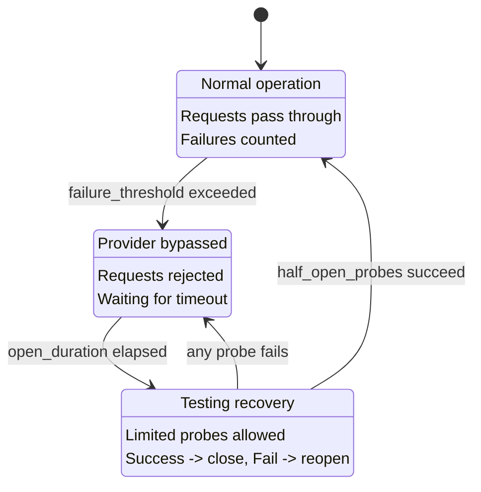

CC-Relay enthaelt ein Circuit-Breaker-System, das automatisch fehlerhafte Provider erkennt und temporaer vom Routing ausschliesst. Dies verhindert kaskadierende Fehler und gibt Providern Zeit zur Erholung, bevor sie neue Anfragen erhalten.

## Ueberblick

Der Circuit Breaker verfolgt Fehler pro Provider und durchlaeuft drei Zustaende:

| Zustand | Beschreibung | Verhalten |
|---------|--------------|-----------|
| CLOSED | Normalbetrieb | Anfragen werden durchgeleitet, Fehler gezaehlt |
| OPEN | Provider umgangen | Anfragen abgelehnt, warten auf Erholung |
| HALF-OPEN | Erholungstest | Begrenzte Testanfragen erlaubt, Erfolg schliesst |

## Circuit Breaker Zustaende

Der Circuit Breaker implementiert eine Zustandsmaschine, die Ihr System vor wiederholten Anfragen an fehlerhafte Provider schuetzt:



### Zustandsuebergaenge

**CLOSED zu OPEN:** Wenn ein Provider `failure_threshold` aufeinanderfolgende Fehler ansammelt, oeffnet der Circuit. Dies stoppt sofort das Routing von Anfragen an diesen Provider.

**OPEN zu HALF-OPEN:** Nach Ablauf von `open_duration_ms` wechselt der Circuit in den Halb-Offen-Zustand. Dies erlaubt begrenzte Testanfragen, um zu pruefen, ob der Provider sich erholt hat.

**HALF-OPEN zu CLOSED:** Wenn `half_open_probes` aufeinanderfolgende Anfragen erfolgreich sind, schliesst sich der Circuit und der Normalbetrieb wird fortgesetzt.

**HALF-OPEN zu OPEN:** Wenn eine Testanfrage im Halb-Offen-Zustand fehlschlaegt, oeffnet sich der Circuit sofort wieder und der Timeout startet neu.

## Konfiguration

Konfigurieren Sie das Gesundheits-Tracking in Ihrer `config.yaml`:

```yaml
health:
  # Health-Check-Einstellungen
  health_check:
    # Periodische Health-Checks aktivieren (Standard: true)
    enabled: true
    # Check-Intervall in Millisekunden (Standard: 10000 = 10s)
    interval_ms: 10000

  # Circuit-Breaker-Einstellungen
  circuit_breaker:
    # Aufeinanderfolgende Fehler vor Oeffnung des Circuits (Standard: 5)
    failure_threshold: 5

    # Zeit, die der Circuit offen bleibt vor Half-Open, in Millisekunden (Standard: 30000 = 30s)
    open_duration_ms: 30000

    # Im Halb-Offen-Zustand erlaubte Testanfragen (Standard: 3)
    half_open_probes: 3
```

**Hinweis:** Die `example.yaml` zeigt eine etwas andere Struktur mit `recovery_timeout_seconds` und `triggers`. Die tatsaechliche Implementierung verwendet `open_duration_ms` und `half_open_probes` wie oben gezeigt.

## Konfigurationsreferenz

| Option | Standard | Beschreibung |
|--------|----------|--------------|
| `health_check.enabled` | `true` | Periodische Health-Checks fuer offene Circuits aktivieren |
| `health_check.interval_ms` | `10000` | Millisekunden zwischen Health-Check-Probes |
| `circuit_breaker.failure_threshold` | `5` | Aufeinanderfolgende Fehler vor Oeffnung des Circuits |
| `circuit_breaker.open_duration_ms` | `30000` | Millisekunden, die der Circuit offen bleibt vor Half-Open |
| `circuit_breaker.half_open_probes` | `3` | Erfolgreiche Probes, die zum Schliessen des Circuits benoetigt werden |

## Funktionsweise

### Fehlerzaehlung

Der Circuit Breaker zaehlt aufeinanderfolgende Fehler. Wenn `failure_threshold` erreicht ist, oeffnet sich der Circuit.

**Was als Fehler zaehlt:**

| Fehlertyp | Statuscode | Zaehlt als Fehler? |
|-----------|------------|-------------------|
| Rate Limited | `429` | Ja |
| Internal Server Error | `500` | Ja |
| Bad Gateway | `502` | Ja |
| Service Unavailable | `503` | Ja |
| Gateway Timeout | `504` | Ja |
| Request Timeout | (timeout) | Ja |
| Network Error | (Verbindung fehlgeschlagen) | Ja |

**Was NICHT als Fehler zaehlt:**

| Fehlertyp | Statuscode | Zaehlt als Fehler? |
|-----------|------------|-------------------|
| Bad Request | `400` | Nein |
| Unauthorized | `401` | Nein |
| Forbidden | `403` | Nein |
| Not Found | `404` | Nein |
| Andere 4xx | (ausser 429) | Nein |

Client-Fehler (4xx ausser 429) zeigen Probleme mit der Anfrage selbst an, nicht mit der Provider-Gesundheit, daher beeinflussen sie den Circuit-Breaker-Zustand nicht.

### Erfolg setzt zurueck

Wenn eine Anfrage erfolgreich ist, wird der Fehlerzaehler auf Null zurueckgesetzt. Das bedeutet, dass gelegentliche Fehler den Circuit Breaker nicht ausloesen, solange Erfolge dazwischen liegen.

### Health-Check-Probes

Wenn ein Circuit im OPEN-Zustand ist, fuehrt cc-relay periodische Health-Checks durch, um eine Erholung schneller zu erkennen als durch Warten auf den vollen Timeout:

1. Health-Checks laufen alle `health_check.interval_ms` Millisekunden
2. Checks zielen nur auf Provider mit OPEN Circuits (nicht CLOSED oder HALF-OPEN)
3. Ein erfolgreicher Health-Check versetzt den Circuit in den HALF-OPEN-Zustand
4. Health-Checks verwenden leichte HTTP-Konnektivitaetstests, keine vollstaendigen API-Aufrufe

## Integration mit Routing

Der Circuit Breaker integriert sich mit allen Routing-Strategien:

### Provider-Ausschluss

Provider mit OPEN Circuits werden automatisch von Routing-Entscheidungen ausgeschlossen:

- **Failover-Strategie:** Springt zum naechsten Provider in der Prioritaetskette
- **Round-Robin:** Aus der Rotation ausgeschlossen
- **Weighted Round-Robin:** Gewichtung wird effektiv Null
- **Shuffle:** Aus dem Deck ausgeschlossen

### Automatische Erholung

Die Erholung erfolgt vollautomatisch:

1. Provider beginnt zu versagen (Rate-Limited, Fehler, Timeouts)
2. Nach `failure_threshold` Fehlern oeffnet sich der Circuit
3. Anfragen werden an andere gesunde Provider geroutet
4. Nach `open_duration_ms` wird der Circuit halb offen
5. Begrenzte Testanfragen testen den Provider
6. Wenn Probes erfolgreich sind, schliesst sich der Circuit und der Provider kehrt in die Rotation zurueck

Es ist kein manueller Eingriff fuer die Erholung erforderlich.

## Debug-Header

Wenn `routing.debug: true` aktiviert ist, fuegt cc-relay Gesundheitsstatus in Antwort-Headern ein:

| Header | Wert | Wann |
|--------|------|------|
| `X-CC-Relay-Provider` | Provider-Name | Immer (wenn Debug aktiviert) |
| `X-CC-Relay-Strategy` | Verwendete Strategie | Immer (wenn Debug aktiviert) |

Um Debug-Header zu aktivieren:

```yaml
routing:
  strategy: failover
  debug: true  # Diagnose-Header aktivieren
```

**Sicherheitswarnung:** Debug-Header offenbaren interne Routing-Entscheidungen. Nur in Entwicklungs- oder vertrauenswuerdigen Umgebungen verwenden. Niemals in Produktion mit nicht vertrauenswuerdigen Clients aktivieren.

## Fehlerbehebung

### Provider wird staendig umgangen

**Symptom:** Der Circuit eines Providers oeffnet sich wiederholt, obwohl der Provider gesund erscheint.

**Moegliche Ursachen:**

1. **`failure_threshold` zu niedrig:** Erhoehen, um mehr voruebergehende Fehler zu tolerieren
   ```yaml
   circuit_breaker:
     failure_threshold: 10  # Toleranter
   ```

2. **Rate-Limits loesen Oeffnungen aus:** Wenn Sie Rate-Limits erreichen, fuegen Sie mehr API-Schluessel zu Ihrem Pool hinzu, anstatt den Circuit Breaker anzupassen

3. **Langsame Antworten verursachen Timeouts:** Server-Timeout erhoehen
   ```yaml
   server:
     timeout_ms: 300000  # 5 Minuten
   ```

### Erholung dauert zu lange

**Symptom:** Provider hat sich erholt, aber der Circuit bleibt lange offen.

**Loesungen:**

1. **Open-Duration reduzieren:**
   ```yaml
   circuit_breaker:
     open_duration_ms: 15000  # 15 Sekunden statt 30
   ```

2. **Schnellere Health-Checks aktivieren:**
   ```yaml
   health_check:
     enabled: true
     interval_ms: 5000  # Alle 5 Sekunden pruefen
   ```

### Circuit oeffnet bei gueltigen Fehlern

**Symptom:** Circuit oeffnet sich, wenn Provider Client-Fehler (400, 401) zurueckgibt.

**Dies sollte nicht passieren.** Client-Fehler (4xx ausser 429) zaehlen nicht als Fehler. Wenn Sie dies beobachten:

1. Pruefen Sie, ob die tatsaechliche Antwort 429 (Rate-Limited) ist
2. Verifizieren Sie, dass der Fehler nicht tatsaechlich ein 5xx ist, der falsch gemeldet wird
3. Aktivieren Sie Debug-Logging, um tatsaechliche Antwortcodes zu sehen:
   ```yaml
   logging:
     level: debug
   ```

### Alle Provider ungesund

**Symptom:** Alle Circuits offen, Anfragen schlagen komplett fehl.

**Moegliche Ursachen:**

1. **Netzwerk-Konnektivitaetsproblem:** Pruefen Sie, ob cc-relay alle Provider erreichen kann
2. **Ungueltige API-Schluessel:** Verifizieren Sie, dass Schluessel gueltig sind (obwohl 401 keine Oeffnungen ausloesen sollte)
3. **Globaler Ausfall:** Alle Provider sind wirklich nicht verfuegbar

**Sofortige Abhilfe:**

- `failure_threshold` erhoehen, um Circuits laenger geschlossen zu halten
- `open_duration_ms` verringern fuer schnellere Erholungsversuche

## Naechste Schritte

- [Konfigurationsreferenz](/de/docs/configuration/) - Vollstaendige Konfigurationsoptionen
- [Routing-Strategien](/de/docs/routing/) - Wie Provider ausgewaehlt werden
- [Architektur-Uebersicht](/de/docs/architecture/) - System-Interna
