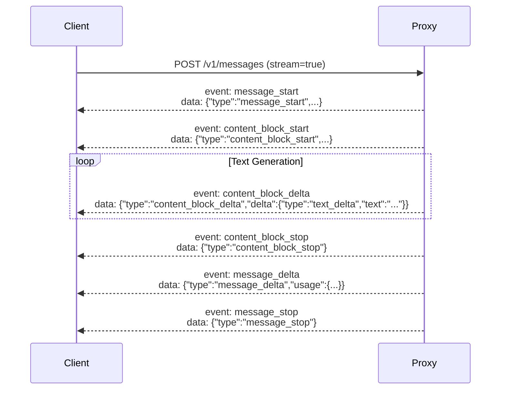

# API Reference

CC-Relay exposes two APIs: the HTTP proxy API (Anthropic-compatible) and the gRPC management API.

## HTTP Proxy API

### POST /v1/messages

Creates a message using the Anthropic Messages API format.

**Endpoint**: `POST /v1/messages`

**Headers**:
```
Content-Type: application/json
x-api-key: <your-api-key>
anthropic-version: 2023-06-01
```

**Request Body**:
```json
{
  "model": "claude-3-5-sonnet-20241022",
  "max_tokens": 1024,
  "messages": [
    {
      "role": "user",
      "content": "Hello, Claude!"
    }
  ],
  "temperature": 1.0,
  "stream": false
}
```

**Response** (non-streaming):
```json
{
  "id": "msg_01XYZ...",
  "type": "message",
  "role": "assistant",
  "content": [
    {
      "type": "text",
      "text": "Hello! How can I help you today?"
    }
  ],
  "model": "claude-3-5-sonnet-20241022",
  "stop_reason": "end_turn",
  "usage": {
    "input_tokens": 12,
    "output_tokens": 15
  }
}
```

### SSE Streaming

Set `"stream": true` in the request to enable Server-Sent Events streaming.

**Event Sequence**:



**Example Stream**:

```
event: message_start
data: {"type":"message_start","message":{"id":"msg_01ABC","type":"message","role":"assistant","content":[],"model":"claude-3-5-sonnet-20241022","usage":{"input_tokens":12,"output_tokens":0}}}

event: content_block_start
data: {"type":"content_block_start","index":0,"content_block":{"type":"text","text":""}}

event: content_block_delta
data: {"type":"content_block_delta","index":0,"delta":{"type":"text_delta","text":"Hello"}}

event: content_block_delta
data: {"type":"content_block_delta","index":0,"delta":{"type":"text_delta","text":"!"}}

event: content_block_stop
data: {"type":"content_block_stop","index":0}

event: message_delta
data: {"type":"message_delta","usage":{"output_tokens":2}}

event: message_stop
data: {"type":"message_stop"}
```

### Tool Use

Claude Code uses parallel tool execution. CC-Relay preserves `tool_use_id` for correct association:

**Request**:
```json
{
  "model": "claude-3-5-sonnet-20241022",
  "max_tokens": 1024,
  "tools": [
    {
      "name": "get_weather",
      "description": "Get weather for a location",
      "input_schema": {
        "type": "object",
        "properties": {
          "location": {"type": "string"}
        }
      }
    }
  ],
  "messages": [
    {"role": "user", "content": "What's the weather in NYC?"}
  ]
}
```

**Response**:
```json
{
  "content": [
    {
      "type": "text",
      "text": "I'll check the weather for you."
    },
    {
      "type": "tool_use",
      "id": "toolu_01ABC",
      "name": "get_weather",
      "input": {"location": "NYC"}
    }
  ]
}
```

### Error Responses

**Rate Limit Exceeded** (429):
```json
{
  "type": "error",
  "error": {
    "type": "rate_limit_error",
    "message": "Rate limit exceeded for all available API keys"
  }
}
```

**Provider Unhealthy** (503):
```json
{
  "type": "error",
  "error": {
    "type": "overloaded_error",
    "message": "All providers are currently unavailable"
  }
}
```

**Invalid Request** (400):
```json
{
  "type": "error",
  "error": {
    "type": "invalid_request_error",
    "message": "Missing required field: messages"
  }
}
```

## gRPC Management API

The gRPC API is defined in `proto/relay.proto` and exposed on port 9090 (configurable).

### Service Definition

```protobuf
service RelayService {
  // Get statistics for a specific provider
  rpc GetProviderStats(ProviderStatsRequest) returns (ProviderStatsResponse);
  
  // Stream real-time statistics
  rpc StreamStats(StreamStatsRequest) returns (stream StatsUpdate);
  
  // Update provider configuration
  rpc UpdateProvider(UpdateProviderRequest) returns (UpdateProviderResponse);
  
  // Reload configuration from file
  rpc ReloadConfig(ReloadConfigRequest) returns (ReloadConfigResponse);
  
  // Get provider health status
  rpc GetProviderHealth(HealthRequest) returns (HealthResponse);
  
  // List all configured providers
  rpc ListProviders(ListProvidersRequest) returns (ListProvidersResponse);
  
  // Enable or disable a provider
  rpc ToggleProvider(ToggleProviderRequest) returns (ToggleProviderResponse);
  
  // Get routing statistics
  rpc GetRoutingStats(RoutingStatsRequest) returns (RoutingStatsResponse);
}
```

### GetProviderStats

Get statistics for a specific provider.

**Request**:
```protobuf
message ProviderStatsRequest {
  string provider_name = 1;
}
```

**Response**:
```protobuf
message ProviderStatsResponse {
  string name = 1;
  string type = 2;
  bool enabled = 3;
  int64 total_requests = 4;
  int64 successful_requests = 5;
  int64 failed_requests = 6;
  double average_latency_ms = 7;
  double p95_latency_ms = 8;
  double p99_latency_ms = 9;
  int64 total_tokens_used = 10;
  double current_rpm = 11;
  double current_tpm = 12;
}
```

**Example (grpcurl)**:
```bash
grpcurl -plaintext -d '{"provider_name": "anthropic"}' \
  localhost:9090 relay.RelayService/GetProviderStats
```

### StreamStats

Stream real-time statistics updates.

**Request**:
```protobuf
message StreamStatsRequest {
  int32 interval_seconds = 1;  // Update interval (default: 5)
  repeated string provider_names = 2;  // Empty = all providers
}
```

**Response Stream**:
```protobuf
message StatsUpdate {
  int64 timestamp = 1;
  repeated ProviderStats providers = 2;
  RoutingStats routing = 3;
}
```

**Example**:
```bash
grpcurl -plaintext -d '{"interval_seconds": 1}' \
  localhost:9090 relay.RelayService/StreamStats
```

### UpdateProvider

Update provider configuration dynamically.

**Request**:
```protobuf
message UpdateProviderRequest {
  string provider_name = 1;
  optional bool enabled = 2;
  optional int32 priority = 3;
  optional RateLimit rate_limit = 4;
}
```

**Example**:
```bash
grpcurl -plaintext -d '{
  "provider_name": "anthropic",
  "enabled": false
}' localhost:9090 relay.RelayService/UpdateProvider
```

### ReloadConfig

Reload configuration from file without restarting.

**Request**:
```protobuf
message ReloadConfigRequest {}
```

**Response**:
```protobuf
message ReloadConfigResponse {
  bool success = 1;
  string message = 2;
  repeated string errors = 3;
}
```

**Example**:
```bash
grpcurl -plaintext -d '{}' \
  localhost:9090 relay.RelayService/ReloadConfig
```

### GetProviderHealth

Get health status for a provider.

**Request**:
```protobuf
message HealthRequest {
  string provider_name = 1;
}
```

**Response**:
```protobuf
message HealthResponse {
  string provider_name = 1;
  string state = 2;  // "CLOSED", "OPEN", "HALF_OPEN"
  int32 failure_count = 3;
  int32 success_count = 4;
  int64 last_failure_time = 5;
  int64 next_attempt_time = 6;
}
```

**Example**:
```bash
grpcurl -plaintext -d '{"provider_name": "anthropic"}' \
  localhost:9090 relay.RelayService/GetProviderHealth
```

### ListProviders

List all configured providers.

**Request**:
```protobuf
message ListProvidersRequest {}
```

**Response**:
```protobuf
message ListProvidersResponse {
  repeated ProviderInfo providers = 1;
}

message ProviderInfo {
  string name = 1;
  string type = 2;
  bool enabled = 3;
  int32 priority = 4;
  int32 api_key_count = 5;
}
```

**Example**:
```bash
grpcurl -plaintext -d '{}' \
  localhost:9090 relay.RelayService/ListProviders
```

### ToggleProvider

Enable or disable a provider.

**Request**:
```protobuf
message ToggleProviderRequest {
  string provider_name = 1;
  bool enabled = 2;
}
```

**Example**:
```bash
grpcurl -plaintext -d '{
  "provider_name": "anthropic",
  "enabled": true
}' localhost:9090 relay.RelayService/ToggleProvider
```

### GetRoutingStats

Get statistics about routing decisions.

**Request**:
```protobuf
message RoutingStatsRequest {}
```

**Response**:
```protobuf
message RoutingStatsResponse {
  string current_strategy = 1;
  map<string, int64> provider_selection_count = 2;
  int64 total_routing_decisions = 3;
  int64 failed_routing_attempts = 4;
  double average_routing_time_ms = 5;
}
```

**Example**:
```bash
grpcurl -plaintext -d '{}' \
  localhost:9090 relay.RelayService/GetRoutingStats
```

## Using grpcurl

Install grpcurl:

```bash
go install github.com/fullstorydev/grpcurl/cmd/grpcurl@latest
```

List available services:

```bash
grpcurl -plaintext localhost:9090 list
```

Describe a service:

```bash
grpcurl -plaintext localhost:9090 describe relay.RelayService
```

## Prometheus Metrics

Access metrics at `http://localhost:9091/metrics` (configurable).

### Available Metrics

**Request Metrics**:
```
cc_relay_requests_total{provider="anthropic",status="200"}
cc_relay_request_duration_seconds{provider="anthropic",quantile="0.5"}
cc_relay_request_duration_seconds{provider="anthropic",quantile="0.95"}
cc_relay_request_duration_seconds{provider="anthropic",quantile="0.99"}
```

**Rate Limit Metrics**:
```
cc_relay_rate_limit_hits_total{provider="anthropic",key_id="key1"}
cc_relay_available_tokens{provider="anthropic",key_id="key1",type="rpm"}
cc_relay_available_tokens{provider="anthropic",key_id="key1",type="tpm"}
```

**Health Metrics**:
```
cc_relay_provider_health{provider="anthropic",state="closed"} 1
cc_relay_circuit_breaker_transitions_total{provider="anthropic",from="closed",to="open"}
```

**Routing Metrics**:
```
cc_relay_routing_decisions_total{strategy="shuffle"}
cc_relay_provider_selections_total{provider="anthropic"}
cc_relay_routing_failures_total{reason="no_healthy_provider"}
```

### Example Grafana Queries

**Request Rate**:
```promql
rate(cc_relay_requests_total[5m])
```

**Success Rate**:
```promql
sum(rate(cc_relay_requests_total{status=~"2.."}[5m])) /
sum(rate(cc_relay_requests_total[5m]))
```

**P95 Latency**:
```promql
histogram_quantile(0.95, rate(cc_relay_request_duration_seconds_bucket[5m]))
```

**Provider Health**:
```promql
cc_relay_provider_health{state="closed"}
```

## Client Libraries

### Go Client (gRPC)

```go
import (
    "context"
    "google.golang.org/grpc"
    pb "github.com/omarluq/cc-relay/proto"
)

conn, err := grpc.Dial("localhost:9090", grpc.WithInsecure())
if err != nil {
    log.Fatal(err)
}
defer conn.Close()

client := pb.NewRelayServiceClient(conn)

// Get provider stats
stats, err := client.GetProviderStats(context.Background(), &pb.ProviderStatsRequest{
    ProviderName: "anthropic",
})
```

### Python Client (HTTP)

```python
import requests

response = requests.post(
    "http://localhost:8787/v1/messages",
    headers={
        "Content-Type": "application/json",
        "x-api-key": "managed-by-cc-relay",
        "anthropic-version": "2023-06-01",
    },
    json={
        "model": "claude-3-5-sonnet-20241022",
        "max_tokens": 1024,
        "messages": [
            {"role": "user", "content": "Hello!"}
        ],
    },
)

print(response.json())
```

### cURL Examples

**Non-streaming request**:
```bash
curl -X POST http://localhost:8787/v1/messages \
  -H "Content-Type: application/json" \
  -H "x-api-key: test" \
  -H "anthropic-version: 2023-06-01" \
  -d '{
    "model": "claude-3-5-sonnet-20241022",
    "max_tokens": 100,
    "messages": [{"role": "user", "content": "Hello!"}]
  }'
```

**Streaming request**:
```bash
curl -N -X POST http://localhost:8787/v1/messages \
  -H "Content-Type: application/json" \
  -H "x-api-key: test" \
  -H "anthropic-version: 2023-06-01" \
  -d '{
    "model": "claude-3-5-sonnet-20241022",
    "max_tokens": 100,
    "messages": [{"role": "user", "content": "Hello!"}],
    "stream": true
  }'
```

## Next Steps

- [Configure providers](/docs/configuration/#provider-setup)
- [Set up routing strategies](/docs/configuration/#routing-strategies)
- [Use the TUI dashboard](/docs/tui/)
- [Monitor with Prometheus](/docs/monitoring/)
