# Architecture Overview

CC-Relay is designed as a high-performance, multi-provider HTTP proxy with intelligent routing, rate limiting, and health tracking.

## System Overview

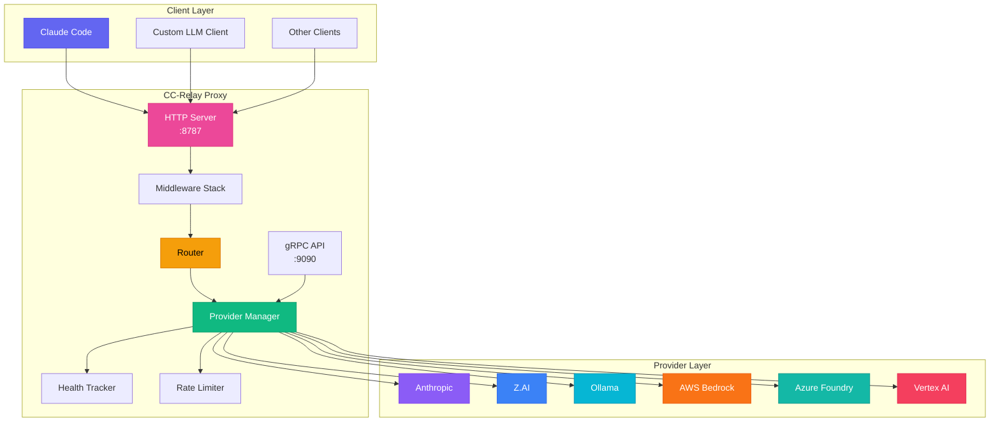

## Core Components

### 1. HTTP Proxy Server

**Location**: `internal/proxy/`

The HTTP server implements the Anthropic Messages API (`/v1/messages`) with exact compatibility for Claude Code.

**Features:**
- SSE streaming with proper event sequencing
- Request validation and transformation
- Middleware chain (logging, metrics, auth)
- Context propagation for timeouts and cancellation

**Request Flow:**

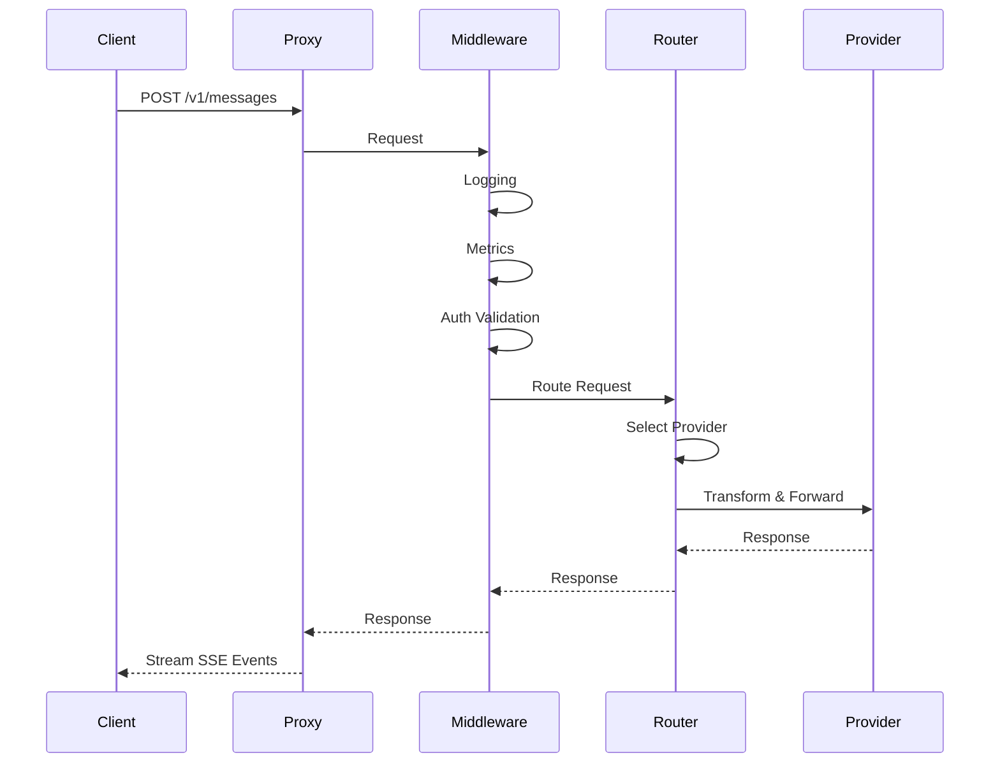

### 2. Router

**Location**: `internal/router/`

The router selects the optimal provider based on configured strategy.

**Strategies:**
- `shuffle`: Random selection
- `round-robin`: Even distribution
- `failover`: Priority-based fallback chain
- `cost-based`: Cheapest provider meeting threshold
- `latency-based`: Fastest provider (P95 latency)
- `model-based`: Route by model availability

**Decision Tree:**

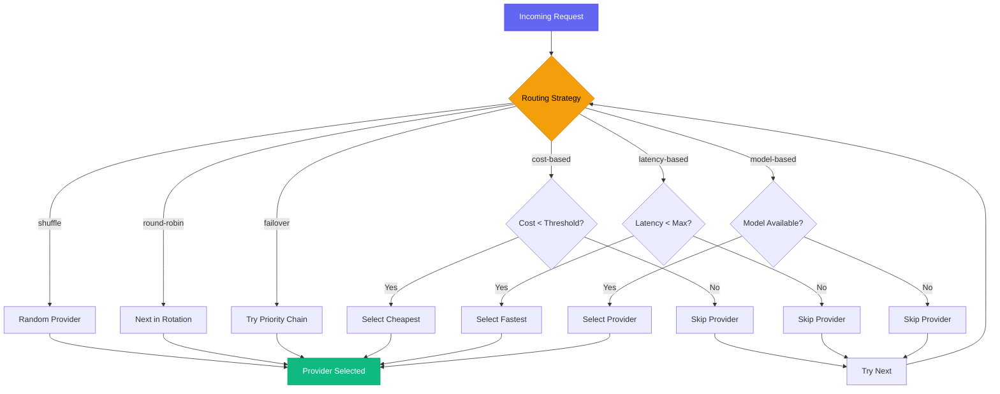

### 3. Provider Manager

**Location**: `internal/providers/`

Each provider implements the `Provider` interface:

```go
type Provider interface {
    Name() string
    Type() string
    TransformRequest(req *Request) (*ProviderRequest, error)
    TransformResponse(resp *ProviderResponse) (*Response, error)
    Authenticate(req *http.Request) error
    HealthCheck(ctx context.Context) error
}
```

**Provider-Specific Transformations:**

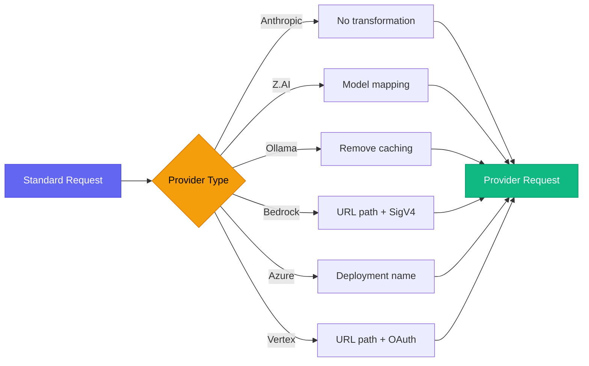

### 4. Health Tracker

**Location**: `internal/health/`

Circuit breaker pattern with three states:

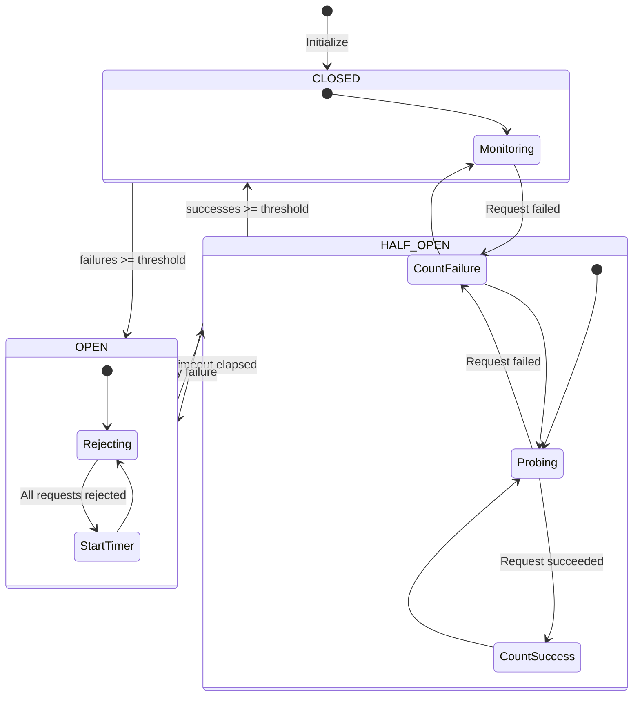

**Failure Detection:**
- HTTP 429 (rate limit exceeded)
- HTTP 5xx (server errors)
- Timeout errors
- Network connection failures

### 5. Rate Limiter

**Location**: `internal/ratelimit/`

Token bucket algorithm per API key:

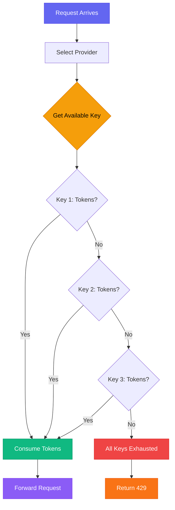

**Per-Key Tracking:**
- Requests per minute (RPM)
- Tokens per minute (TPM)
- Automatic refill at configured rate
- Round-robin key selection

### 6. Configuration Manager

**Location**: `internal/config/`

**Features:**
- YAML/TOML parsing with validation
- Environment variable expansion (`${VAR}`)
- Hot reload via `fsnotify` file watcher
- Schema validation on load

**Hot Reload Flow:**

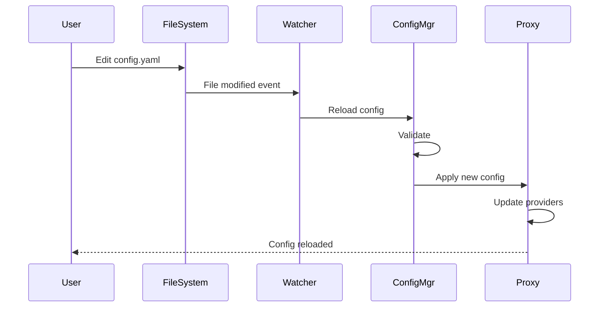

### 7. gRPC Management API

**Location**: `internal/grpc/`, `proto/relay.proto`

Exposes management operations for stats, config, and provider control.

**Service Definition:**

```protobuf
service RelayService {
  rpc GetProviderStats(ProviderStatsRequest) returns (ProviderStatsResponse);
  rpc StreamStats(StreamStatsRequest) returns (stream StatsUpdate);
  rpc UpdateProvider(UpdateProviderRequest) returns (UpdateProviderResponse);
  rpc ReloadConfig(ReloadConfigRequest) returns (ReloadConfigResponse);
  rpc GetProviderHealth(HealthRequest) returns (HealthResponse);
}
```

## Request Flow

### Non-Streaming Request

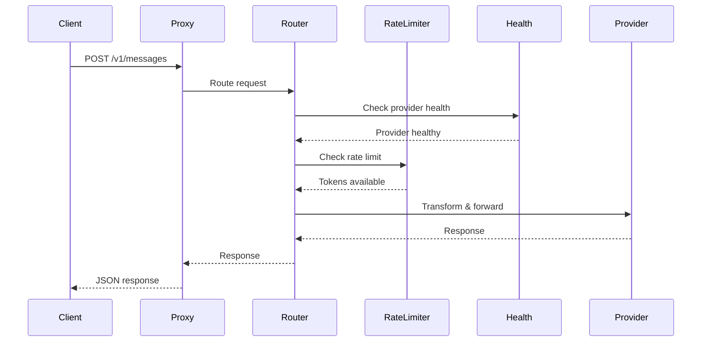

### Streaming Request (SSE)

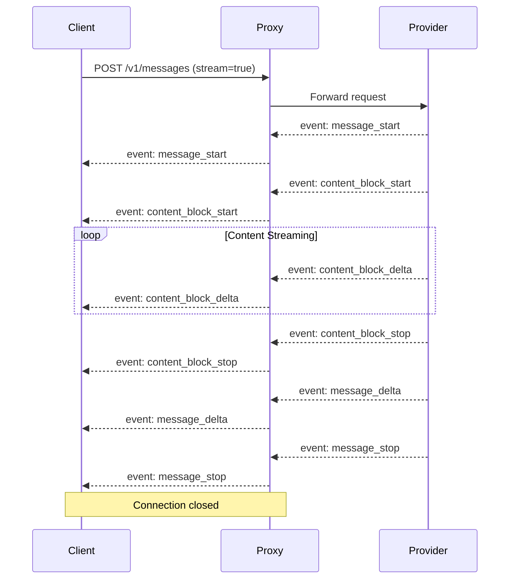

## API Compatibility

### Anthropic API Format

CC-Relay implements exact compatibility with the Anthropic Messages API:

**Endpoint**: `POST /v1/messages`

**Headers**:
- `x-api-key`: API key (managed by CC-Relay)
- `anthropic-version`: API version (e.g., `2023-06-01`)
- `content-type`: `application/json`

**Body**:
```json
{
  "model": "claude-3-5-sonnet-20241022",
  "max_tokens": 1024,
  "messages": [
    {"role": "user", "content": "Hello!"}
  ],
  "stream": true
}
```

### Provider Transformations

Different providers require different API formats:

| Provider | Transformation |
|----------|----------------|
| **Anthropic** | None (native format) |
| **Z.AI** | Model name mapping only |
| **Ollama** | Remove `prompt_cache_config`, convert image URLs to base64 |
| **Bedrock** | Model in URL path, `anthropic_version: bedrock-2023-05-31`, AWS SigV4 signing |
| **Azure** | Use `x-api-key` header, deployment name as model ID |
| **Vertex** | Model in URL path, `anthropic_version: vertex-2023-10-16`, OAuth bearer token |

## Performance Considerations

### Connection Pooling

CC-Relay maintains persistent HTTP/2 connections to providers:

```go
transport := &http.Transport{
    MaxIdleConns:        100,
    MaxIdleConnsPerHost: 10,
    IdleConnTimeout:     90 * time.Second,
}
```

### Concurrency

- Goroutine per request (lightweight)
- Request context for cancellation
- Rate limiter uses sync.Mutex for thread safety
- Circuit breaker uses atomic operations

### Memory Management

- Streaming responses (no buffering)
- Request body size limits
- Connection pooling
- Graceful shutdown with timeout

## Deployment Architecture

### Single Instance

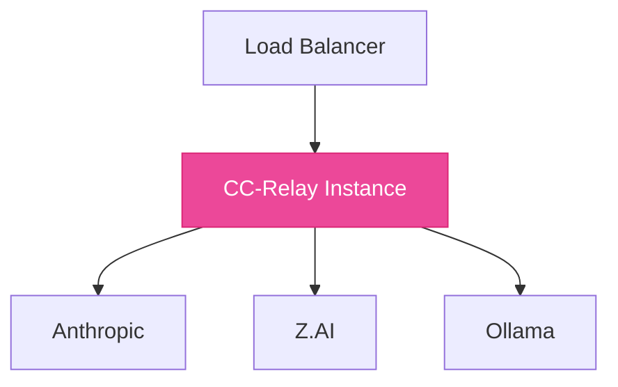

### High Availability

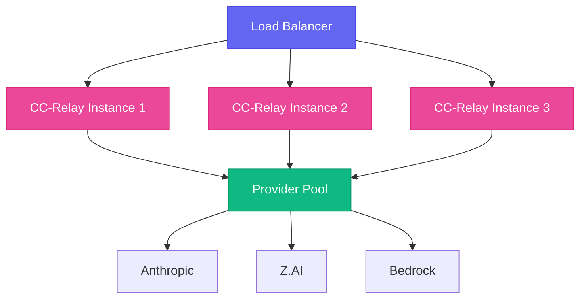

## Next Steps

- [Configure routing strategies](/docs/configuration/#routing-strategies)
- [Set up health tracking](/docs/configuration/#health-tracking)
- [Use the management API](/docs/api/)
- [Monitor with Prometheus](/docs/monitoring/)
