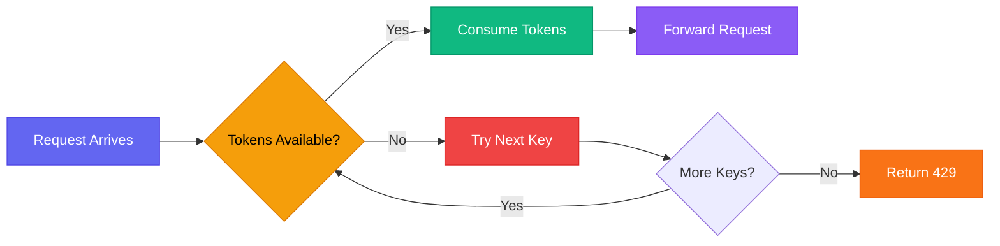
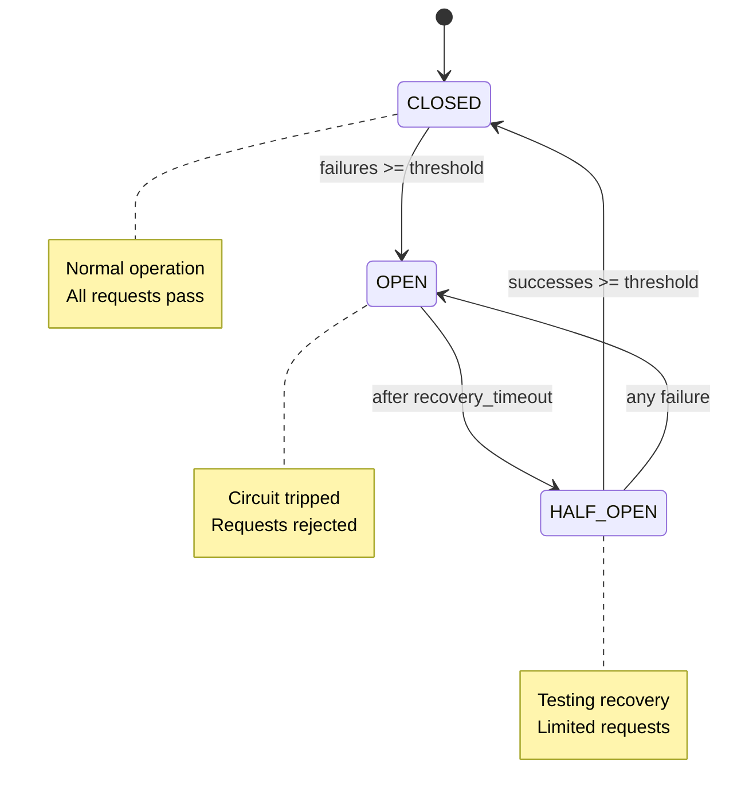

# Configuration Guide

CC-Relay is configured via YAML or TOML files. This guide covers all configuration options.

## Configuration File Location

Default locations (checked in order):

1. `--config` flag: `cc-relay serve --config /path/to/config.yaml`
2. `CC_RELAY_CONFIG` environment variable
3. `~/.config/cc-relay/config.yaml`
4. `./config.yaml` (current directory)

## Configuration Structure

```yaml
server:
  # Server configuration
  
routing:
  # Routing strategy configuration
  
providers:
  # Provider definitions
  
grpc:
  # gRPC management API
  
logging:
  # Logging configuration
  
metrics:
  # Prometheus metrics
  
health:
  # Health checking configuration
```

## Server Configuration

```yaml
server:
  listen_address: "127.0.0.1:8787"
  read_timeout: 30s
  write_timeout: 30s
  idle_timeout: 120s
  max_concurrent_requests: 100
  max_request_body_size: 10485760  # 10MB
```

**Options:**
- `listen_address`: IP and port to bind to
- `read_timeout`: Maximum time to read request
- `write_timeout`: Maximum time to write response
- `idle_timeout`: Keep-alive timeout
- `max_concurrent_requests`: Maximum concurrent requests
- `max_request_body_size`: Maximum request body size in bytes

## Provider Setup

### Anthropic Provider

```yaml
providers:
  - name: anthropic-primary
    type: anthropic
    base_url: https://api.anthropic.com  # Optional, defaults to official API
    api_keys:
      - key: ${ANTHROPIC_API_KEY}
        rate_limit:
          requests_per_minute: 50
          tokens_per_minute: 40000
    model_mapping:
      "claude-3-5-sonnet-20241022": "claude-3-5-sonnet-20241022"
    enabled: true
    priority: 1
```

### Z.AI Provider

```yaml
providers:
  - name: zai-primary
    type: zai
    base_url: https://api.z.ai
    api_keys:
      - key: ${ZAI_API_KEY}
        rate_limit:
          requests_per_minute: 100
          tokens_per_minute: 100000
    model_mapping:
      "claude-3-5-sonnet-20241022": "glm-4-plus"
    enabled: true
```

### Ollama Provider

```yaml
providers:
  - name: ollama-local
    type: ollama
    base_url: http://localhost:11434
    api_keys:
      - key: "not-required"  # Ollama doesn't need auth
    model_mapping:
      "claude-3-5-sonnet-20241022": "llama3:latest"
    enabled: true
```

### AWS Bedrock Provider

```yaml
providers:
  - name: bedrock-us-east
    type: bedrock
    region: us-east-1
    access_key_id: ${AWS_ACCESS_KEY_ID}
    secret_access_key: ${AWS_SECRET_ACCESS_KEY}
    model_mapping:
      "claude-3-5-sonnet-20241022": "anthropic.claude-3-5-sonnet-20241022-v2:0"
    enabled: true
```

### Azure Foundry Provider

```yaml
providers:
  - name: azure-eastus
    type: azure
    base_url: https://your-deployment.openai.azure.com
    api_keys:
      - key: ${AZURE_API_KEY}
    deployment_name: your-deployment-name
    api_version: "2023-05-15"
    enabled: true
```

### Vertex AI Provider

```yaml
providers:
  - name: vertex-us-central
    type: vertex
    project_id: your-gcp-project
    region: us-central1
    credentials_file: /path/to/service-account.json
    model_mapping:
      "claude-3-5-sonnet-20241022": "claude-3-5-sonnet@20241022"
    enabled: true
```

## Routing Strategies

### Shuffle (Random)

Randomly select from available providers:

```yaml
routing:
  strategy: shuffle
```

### Round-Robin

Evenly distribute requests across providers:

```yaml
routing:
  strategy: round-robin
```

### Failover (Priority-Based)

Try providers in order of priority:

```yaml
routing:
  strategy: failover
  failover_chain:
    - anthropic-primary
    - anthropic-secondary
    - zai-backup
    
providers:
  - name: anthropic-primary
    priority: 1
    
  - name: anthropic-secondary
    priority: 2
    
  - name: zai-backup
    priority: 3
```

### Cost-Based

Route to cheapest provider meeting cost threshold:

```yaml
routing:
  strategy: cost-based
  max_cost_per_million_tokens: 15.0
  
providers:
  - name: anthropic
    cost_per_million_input_tokens: 3.0
    cost_per_million_output_tokens: 15.0
    
  - name: zai
    cost_per_million_input_tokens: 2.0
    cost_per_million_output_tokens: 10.0
```

### Latency-Based

Route to fastest provider (based on historical P95 latency):

```yaml
routing:
  strategy: latency-based
  max_latency_ms: 2000
```

### Model-Based

Route based on model availability:

```yaml
routing:
  strategy: model-based
  
providers:
  - name: anthropic
    model_mapping:
      "claude-3-5-sonnet-20241022": "claude-3-5-sonnet-20241022"
      
  - name: ollama
    model_mapping:
      "llama3": "llama3:latest"
```

## Rate Limiting

### Per-Key Rate Limits

```yaml
providers:
  - name: anthropic
    api_keys:
      - key: ${ANTHROPIC_KEY_1}
        rate_limit:
          requests_per_minute: 50
          tokens_per_minute: 40000
          
      - key: ${ANTHROPIC_KEY_2}
        rate_limit:
          requests_per_minute: 100
          tokens_per_minute: 80000
```

### Token Bucket Algorithm

CC-Relay uses a token bucket algorithm for rate limiting:



### Global Rate Limits

```yaml
server:
  global_rate_limit:
    requests_per_second: 500
    burst_size: 1000
```

## Health Tracking

### Circuit Breaker Configuration

```yaml
health:
  check_interval: 30s
  failure_threshold: 3
  success_threshold: 2
  recovery_timeout: 60s
  half_open_max_requests: 10
```

**States:**
- **CLOSED**: Provider is healthy, all requests pass through
- **OPEN**: Provider failed, requests are rejected
- **HALF-OPEN**: Testing recovery, limited requests allowed

### State Transition Diagram



### Failure Detection

Failures are counted for:
- HTTP 429 (rate limit)
- HTTP 5xx (server errors)
- Timeout errors
- Network errors

## gRPC Management API

```yaml
grpc:
  listen_address: "127.0.0.1:9090"
  enable_reflection: true
  max_concurrent_streams: 100
```

Access stats, update config, and manage providers via gRPC:

```bash
# Example: Get provider stats
grpcurl -plaintext localhost:9090 relay.RelayService/GetProviderStats

# Example: Update provider
grpcurl -plaintext -d '{"provider_name": "anthropic", "enabled": false}' \
  localhost:9090 relay.RelayService/UpdateProvider
```

## Logging

```yaml
logging:
  level: info  # debug, info, warn, error
  format: json  # json or text
  output_file: /var/log/cc-relay/cc-relay.log
  max_size_mb: 100
  max_backups: 3
  max_age_days: 30
  compress: true
```

## Metrics (Prometheus)

```yaml
metrics:
  enabled: true
  listen_address: "127.0.0.1:9091"
  endpoint: /metrics
```

Access metrics at `http://localhost:9091/metrics`:

```
cc_relay_requests_total{provider="anthropic",status="200"} 1234
cc_relay_request_duration_seconds{provider="anthropic",quantile="0.95"} 0.523
cc_relay_rate_limit_hits_total{provider="anthropic",key_id="key1"} 45
cc_relay_provider_health{provider="anthropic",state="closed"} 1
```

## Hot Reload

CC-Relay supports hot-reloading configuration without restart:

```bash
# Send SIGHUP to reload config
kill -HUP $(pidof cc-relay)

# Or use the management API
grpcurl -plaintext -d '{}' localhost:9090 relay.RelayService/ReloadConfig
```

## Environment Variable Expansion

Use `${VAR_NAME}` syntax in config files:

```yaml
providers:
  - name: anthropic
    api_keys:
      - key: ${ANTHROPIC_API_KEY}
      - key: ${ANTHROPIC_API_KEY_2}
```

Set environment variables before starting:

```bash
export ANTHROPIC_API_KEY="sk-ant-..."
export ANTHROPIC_API_KEY_2="sk-ant-..."
cc-relay serve
```

## Example Configurations

### Minimal Configuration

```yaml
routing:
  strategy: shuffle
  
providers:
  - name: anthropic
    type: anthropic
    api_keys:
      - key: ${ANTHROPIC_API_KEY}
```

### Production Configuration

```yaml
server:
  listen_address: "0.0.0.0:8787"
  max_concurrent_requests: 500
  
routing:
  strategy: failover
  failover_chain:
    - anthropic-tier1
    - anthropic-tier2
    - bedrock-backup
    
providers:
  - name: anthropic-tier1
    type: anthropic
    api_keys:
      - key: ${ANTHROPIC_KEY_1}
        rate_limit:
          requests_per_minute: 100
          tokens_per_minute: 80000
      - key: ${ANTHROPIC_KEY_2}
        rate_limit:
          requests_per_minute: 100
          tokens_per_minute: 80000
    priority: 1
    
  - name: anthropic-tier2
    type: anthropic
    api_keys:
      - key: ${ANTHROPIC_KEY_3}
        rate_limit:
          requests_per_minute: 50
          tokens_per_minute: 40000
    priority: 2
    
  - name: bedrock-backup
    type: bedrock
    region: us-east-1
    access_key_id: ${AWS_ACCESS_KEY_ID}
    secret_access_key: ${AWS_SECRET_ACCESS_KEY}
    priority: 3
    
grpc:
  listen_address: "127.0.0.1:9090"
  
metrics:
  enabled: true
  listen_address: "0.0.0.0:9091"
  
logging:
  level: info
  format: json
  output_file: /var/log/cc-relay/cc-relay.log
  
health:
  check_interval: 30s
  failure_threshold: 3
  recovery_timeout: 60s
```

## Next Steps

- [Understand the architecture](/docs/architecture/)
- [Use the management API](/docs/api/)
- [Monitor with the TUI](/docs/tui/)
- [Set up Prometheus metrics](/docs/monitoring/)
