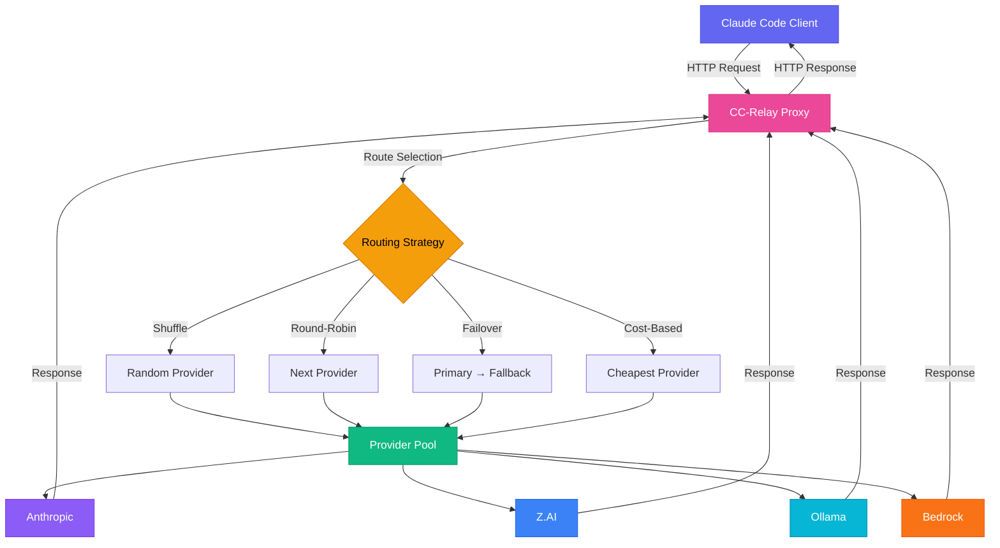

# Getting Started with CC-Relay

This guide will walk you through installing, configuring, and running CC-Relay for the first time.

## Prerequisites

- **Go 1.21+** for building from source
- **API keys** for at least one supported provider
- **Claude Code** or another LLM client (optional, for testing)

## Installation

### Using Go Install

```bash
go install github.com/omarluq/cc-relay@latest
```

The binary will be installed to `$GOPATH/bin/cc-relay` or `$HOME/go/bin/cc-relay`.

### Building from Source

```bash
# Clone the repository
git clone https://github.com/omarluq/cc-relay.git
cd cc-relay

# Build using task
task build

# Or build manually
go build -o cc-relay ./cmd/cc-relay

# Run
./cc-relay --help
```

### Pre-built Binaries

Download pre-built binaries from the [releases page](https://github.com/omarluq/cc-relay/releases).

## Quick Start

### 1. Create Configuration File

Create a configuration file at `~/.config/cc-relay/config.yaml`:

```yaml
server:
  listen_address: "127.0.0.1:8787"
  read_timeout: 30s
  write_timeout: 30s
  max_concurrent_requests: 100

routing:
  strategy: shuffle
  
providers:
  - name: anthropic-primary
    type: anthropic
    api_keys:
      - key: ${ANTHROPIC_API_KEY}
        rate_limit:
          requests_per_minute: 50
          tokens_per_minute: 40000
    enabled: true
    
logging:
  level: info
  format: text
  
health:
  check_interval: 30s
  failure_threshold: 3
  recovery_timeout: 60s
```

### 2. Set Environment Variables

```bash
export ANTHROPIC_API_KEY="your-api-key-here"
```

### 3. Run CC-Relay

```bash
cc-relay serve --config ~/.config/cc-relay/config.yaml
```

You should see output like:

```
INFO  Starting CC-Relay proxy server
INFO  Listening on 127.0.0.1:8787
INFO  Loaded 1 provider(s)
INFO  Health check enabled (interval: 30s)
```

## Testing with Claude Code

Point Claude Code to use CC-Relay as the API endpoint:

```bash
# Set the base URL to CC-Relay
export ANTHROPIC_BASE_URL="http://localhost:8787"

# Use any non-empty string as the API key
# (CC-Relay manages the real keys)
export ANTHROPIC_API_KEY="managed-by-cc-relay"

# Run Claude Code
claude
```

Claude Code will now route all requests through CC-Relay!

## Verify It's Working

### Check Server Status

```bash
cc-relay status
```

### Test the API Endpoint

```bash
curl -X POST http://localhost:8787/v1/messages \
  -H "Content-Type: application/json" \
  -H "x-api-key: test" \
  -H "anthropic-version: 2023-06-01" \
  -d '{
    "model": "claude-3-5-sonnet-20241022",
    "max_tokens": 100,
    "messages": [
      {"role": "user", "content": "Hello!"}
    ]
  }'
```

### View Logs

Logs are written to:
- **Console**: Real-time output
- **File**: `~/.config/cc-relay/logs/cc-relay.log` (if configured)

## Architecture Diagram



## Next Steps

- [Configure multiple providers](/docs/configuration/#provider-setup)
- [Set up rate limiting](/docs/configuration/#rate-limiting)
- [Enable health tracking](/docs/configuration/#health-tracking)
- [Explore routing strategies](/docs/configuration/#routing-strategies)
- [Use the TUI dashboard](/docs/tui/)
- [Access the management API](/docs/api/)

## Troubleshooting

### Port Already in Use

If port 8787 is already in use, change the listen address in your config:

```yaml
server:
  listen_address: "127.0.0.1:8788"
```

### Provider Not Responding

Check provider health:

```bash
cc-relay health
```

Enable debug logging:

```yaml
logging:
  level: debug
```

### Rate Limit Errors

Increase rate limits in provider configuration or add more API keys to the pool.

## Common Configuration Patterns

### Development Setup (Single Provider)

```yaml
routing:
  strategy: shuffle
  
providers:
  - name: anthropic-dev
    type: anthropic
    api_keys:
      - key: ${ANTHROPIC_API_KEY}
```

### Production Setup (Multi-Provider with Failover)

```yaml
routing:
  strategy: failover
  failover_chain:
    - anthropic-primary
    - anthropic-secondary
    - zai-backup
    
providers:
  - name: anthropic-primary
    type: anthropic
    api_keys:
      - key: ${ANTHROPIC_API_KEY_1}
      - key: ${ANTHROPIC_API_KEY_2}
    priority: 1
    
  - name: anthropic-secondary
    type: anthropic
    api_keys:
      - key: ${ANTHROPIC_API_KEY_3}
    priority: 2
    
  - name: zai-backup
    type: zai
    api_keys:
      - key: ${ZAI_API_KEY}
    priority: 3
```

### Cost-Optimized Setup

```yaml
routing:
  strategy: cost-based
  max_cost_per_million_tokens: 15.0
  
providers:
  - name: anthropic
    type: anthropic
    cost_per_million_input_tokens: 3.0
    cost_per_million_output_tokens: 15.0
    
  - name: zai
    type: zai
    cost_per_million_input_tokens: 2.0
    cost_per_million_output_tokens: 10.0
    
  - name: ollama-local
    type: ollama
    cost_per_million_input_tokens: 0.0
    cost_per_million_output_tokens: 0.0
```
