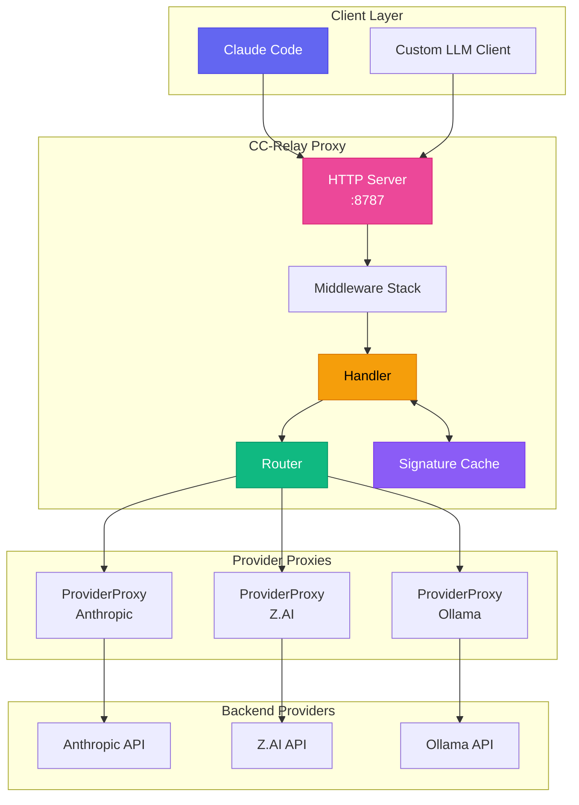
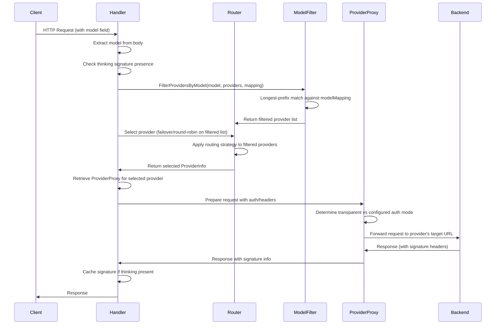
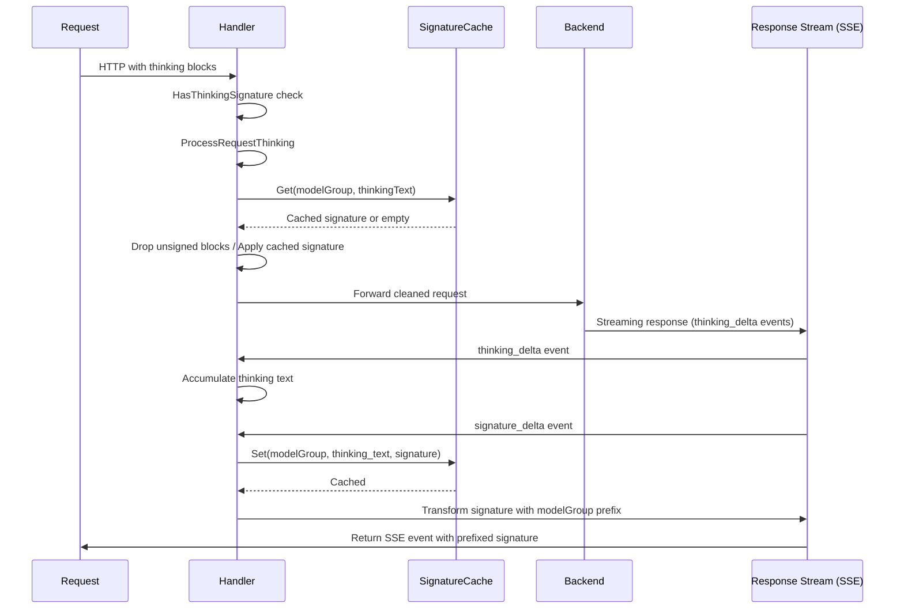
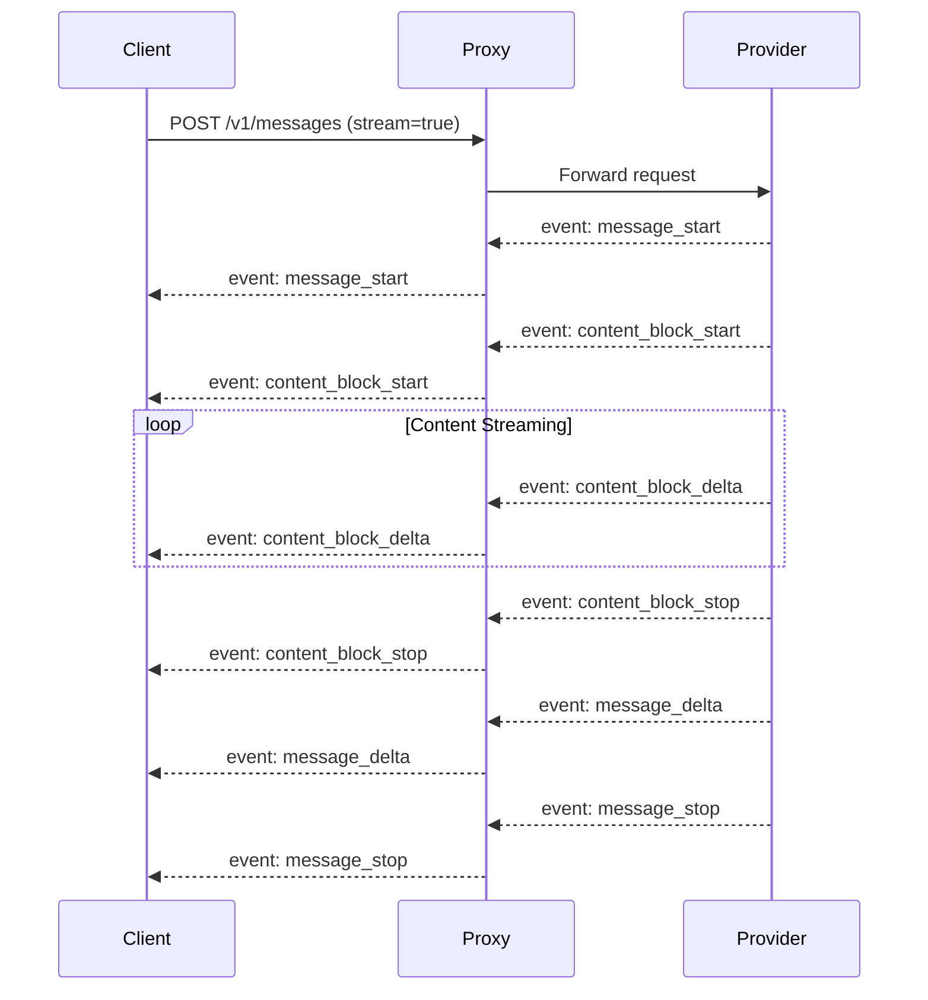
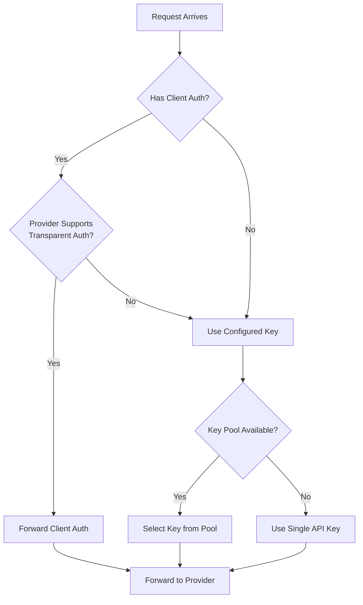

CC-Relay is a high-performance, multi-provider HTTP proxy designed for LLM applications. It provides intelligent routing, thinking signature caching, and seamless failover between providers.

## System Overview



## Core Components

### 1. Handler

**Location**: `internal/proxy/handler.go`

The Handler is the central coordinator for request processing:

```go
type Handler struct {
    providerProxies map[string]*ProviderProxy  // Per-provider reverse proxies
    defaultProvider providers.Provider          // Fallback for single-provider mode
    router          router.ProviderRouter       // Routing strategy implementation
    healthTracker   *health.Tracker             // Circuit breaker tracking
    signatureCache  *SignatureCache             // Thinking signature cache
    routingConfig   *config.RoutingConfig       // Model-based routing config
    providers       []router.ProviderInfo       // Available providers
}
```

**Responsibilities:**
- Extract model name from request body
- Detect thinking signatures for provider affinity
- Select provider via router
- Delegate to appropriate ProviderProxy
- Process thinking blocks and cache signatures

### 2. ProviderProxy

**Location**: `internal/proxy/provider_proxy.go`

Each provider gets a dedicated reverse proxy with pre-configured URL and authentication:

```go
type ProviderProxy struct {
    Provider           providers.Provider
    Proxy              *httputil.ReverseProxy
    KeyPool            *keypool.KeyPool  // For multi-key rotation
    APIKey             string            // Fallback single key
    targetURL          *url.URL          // Provider's base URL
    modifyResponseHook ModifyResponseFunc
}
```

**Key Features:**
- URL parsing happens once at initialization (not per-request)
- Supports transparent auth (forward client credentials) or configured auth
- Automatic SSE header injection for streaming responses
- Key pool integration for rate limit distribution

### 3. Router

**Location**: `internal/router/`

The router selects which provider handles each request:

| Strategy | Description |
|----------|-------------|
| `failover` | Priority-based with automatic retry (default) |
| `round_robin` | Sequential rotation |
| `weighted_round_robin` | Proportional by weight |
| `shuffle` | Fair random distribution |
| `model_based` | Route by model name prefix |

### 4. Signature Cache

**Location**: `internal/proxy/signature_cache.go`

Caches thinking block signatures for cross-provider compatibility:

```go
type SignatureCache struct {
    cache cache.Cache  // Ristretto-backed cache
}

// Cache key format: "sig:{modelGroup}:{textHash}"
// TTL: 3 hours (matches Claude API)
```

## Request Flow

### Multi-Provider Routing



### Thinking Signature Processing

When extended thinking is enabled, providers return signed thinking blocks. These signatures must be validated by the same provider on subsequent turns. CC-Relay solves cross-provider signature issues through caching:



**Model Groups for Signature Sharing:**

| Model Pattern | Group | Signatures Shared |
|--------------|-------|-------------------|
| `claude-*` | `claude` | Yes, across all Claude models |
| `gpt-*` | `gpt` | Yes, across all GPT models |
| `gemini-*` | `gemini` | Yes, uses sentinel value |
| Other | Exact name | No sharing |

### SSE Streaming Flow



**Required SSE Headers:**
```text
Content-Type: text/event-stream
Cache-Control: no-cache, no-transform
X-Accel-Buffering: no
Connection: keep-alive
```

## Middleware Stack

**Location**: `internal/proxy/middleware.go`

| Middleware | Purpose |
|------------|---------|
| `RequestIDMiddleware` | Generates/extracts X-Request-ID for tracing |
| `LoggingMiddleware` | Logs request/response with timing |
| `AuthMiddleware` | Validates x-api-key header |
| `MultiAuthMiddleware` | Supports API key and Bearer token auth |

## Provider Interface

**Location**: `internal/providers/provider.go`

```go
type Provider interface {
    Name() string
    BaseURL() string
    Owner() string
    Authenticate(req *http.Request, key string) error
    ForwardHeaders(originalHeaders http.Header) http.Header
    SupportsStreaming() bool
    SupportsTransparentAuth() bool
    ListModels() []Model
    GetModelMapping() map[string]string
    MapModel(requestModel string) string
}
```

**Implemented Providers:**

| Provider | Type | Features |
|----------|------|----------|
| `AnthropicProvider` | `anthropic` | Native format, full feature support |
| `ZAIProvider` | `zai` | Anthropic-compatible, GLM models |
| `OllamaProvider` | `ollama` | Local models, no prompt caching |

## Authentication Modes

### Transparent Auth
When the client provides credentials and the provider supports it:
- Client's `Authorization` or `x-api-key` headers forwarded unchanged
- CC-Relay acts as a pure proxy

### Configured Auth
When using CC-Relay's managed keys:
- Client credentials stripped
- CC-Relay injects configured API key
- Supports key pool rotation for rate limit distribution



## Health Tracking & Circuit Breaker

**Location**: `internal/health/`

CC-Relay tracks provider health and implements circuit breaker patterns:

| State | Behavior |
|-------|----------|
| CLOSED | Normal operation, requests flow through |
| OPEN | Provider marked unhealthy, requests fail fast |
| HALF-OPEN | Probing with limited requests after cooldown |

**Triggers for OPEN state:**
- HTTP 429 (rate limited)
- HTTP 5xx (server errors)
- Connection timeouts
- Consecutive failures exceed threshold

## Directory Structure

```text
cc-relay/
├── cmd/cc-relay/           # CLI entry point
│   ├── main.go             # Root command
│   ├── serve.go            # Serve command
│   └── di/                 # Dependency injection
│       └── providers.go    # Service wiring
├── internal/
│   ├── config/             # Configuration loading
│   ├── providers/          # Provider implementations
│   │   ├── provider.go     # Provider interface
│   │   ├── base.go         # Base provider
│   │   ├── anthropic.go    # Anthropic provider
│   │   ├── zai.go          # Z.AI provider
│   │   └── ollama.go       # Ollama provider
│   ├── proxy/              # HTTP proxy server
│   │   ├── handler.go      # Main request handler
│   │   ├── provider_proxy.go # Per-provider proxy
│   │   ├── thinking.go     # Thinking block processing
│   │   ├── signature_cache.go # Signature caching
│   │   ├── sse.go          # SSE utilities
│   │   └── middleware.go   # Middleware chain
│   ├── router/             # Routing strategies
│   │   ├── router.go       # Router interface
│   │   ├── failover.go     # Failover strategy
│   │   ├── round_robin.go  # Round-robin strategy
│   │   └── model_filter.go # Model-based filtering
│   ├── health/             # Health tracking
│   │   └── tracker.go      # Circuit breaker
│   ├── keypool/            # API key pooling
│   │   └── keypool.go      # Key rotation
│   └── cache/              # Caching layer
│       └── cache.go        # Ristretto wrapper
└── docs-site/              # Documentation
```

## Performance Considerations

### Connection Handling
- **Connection pooling**: HTTP connections reused to backends
- **HTTP/2 support**: Multiplexed requests where supported
- **Immediate flush**: SSE events flushed without buffering

### Concurrency
- **Goroutine per request**: Lightweight Go concurrency
- **Context propagation**: Proper timeout and cancellation
- **Thread-safe caching**: Ristretto provides concurrent access

### Memory
- **Streaming responses**: No buffering of response bodies
- **Signature cache**: Bounded size with LRU eviction
- **Request body restoration**: Efficient body re-reading

## Next Steps

- [Configuration reference](/docs/configuration/)
- [Routing strategies](/docs/routing/)
- [Provider setup](/docs/providers/)
