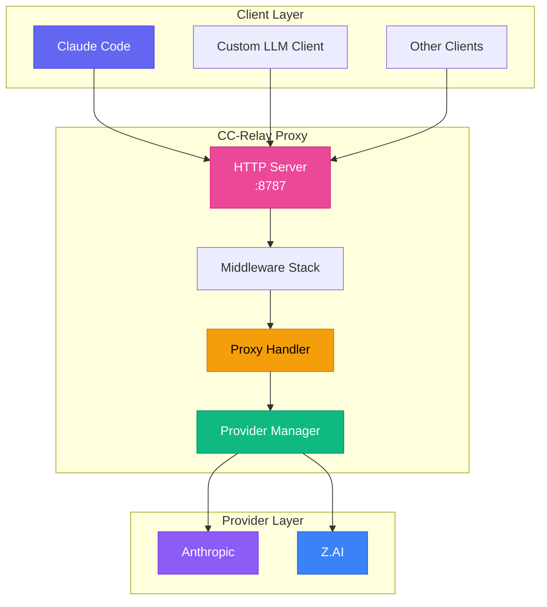
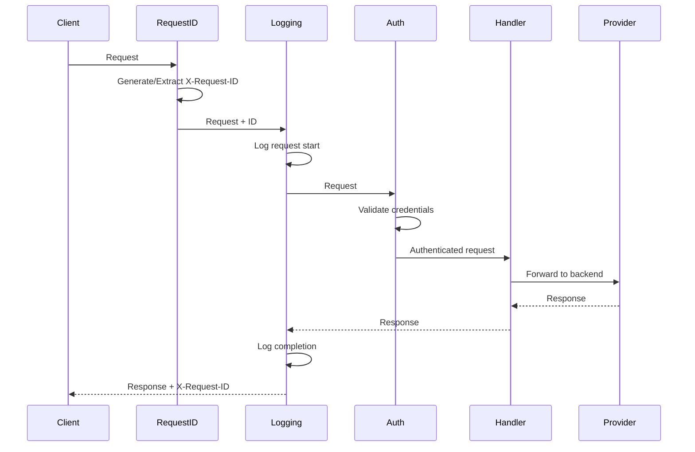
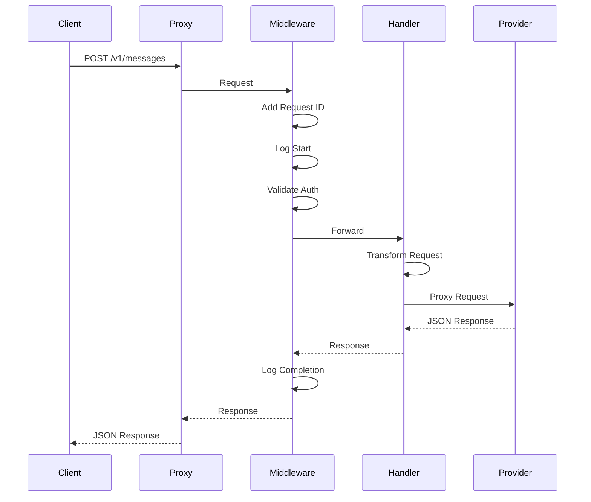
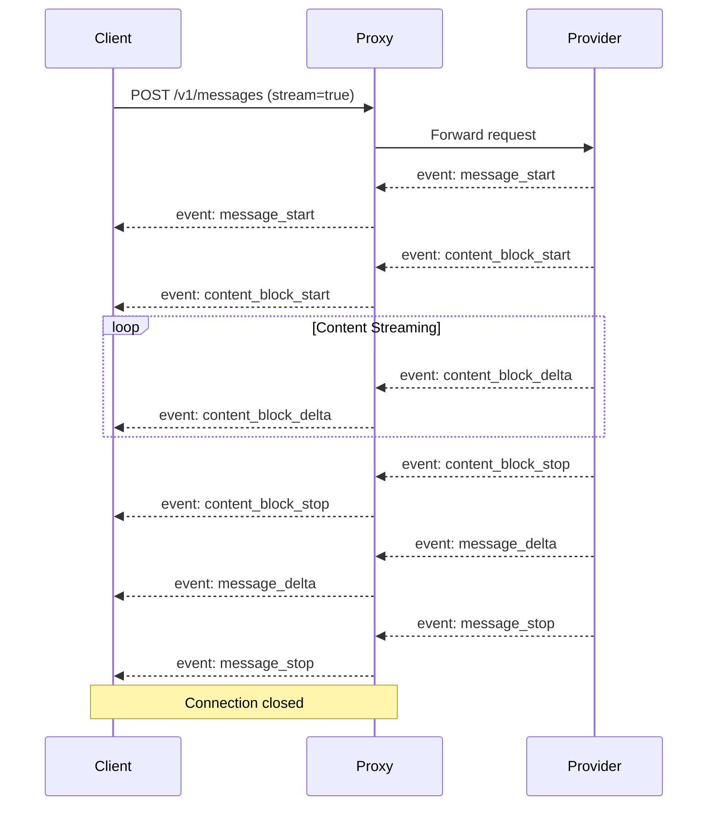
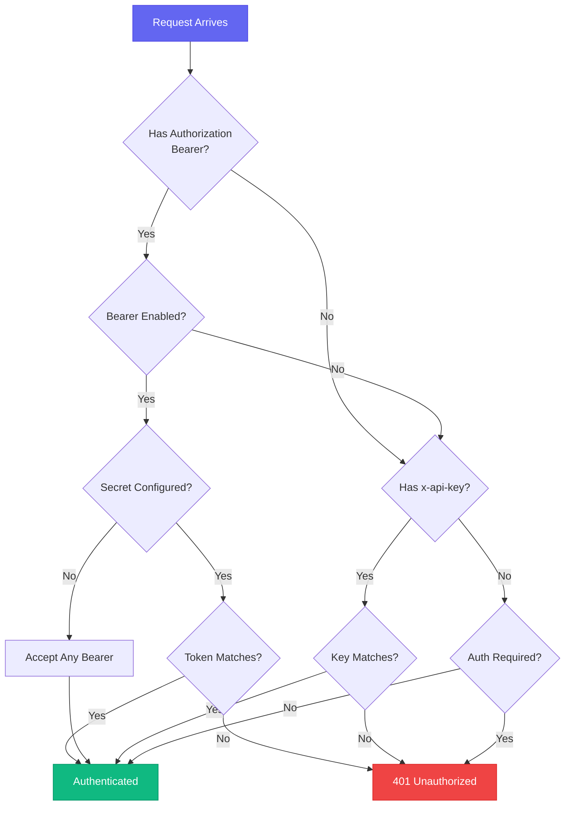

CC-Relay is designed as a high-performance, multi-provider HTTP proxy that sits between LLM clients (like Claude Code) and backend providers.

## System Overview



## Core Components

### 1. HTTP Proxy Server

**Location**: `internal/proxy/`

The HTTP server implements the Anthropic Messages API (`/v1/messages`) with exact compatibility for Claude Code.

**Features:**
- SSE streaming with proper event sequencing
- Request validation and transformation
- Middleware chain (request ID, logging, authentication)
- Context propagation for timeouts and cancellation
- HTTP/2 support for concurrent requests

**Endpoints:**

| Endpoint | Method | Description |
|----------|--------|-------------|
| `/v1/messages` | POST | Proxy requests to backend provider |
| `/v1/models` | GET | List available models from all providers |
| `/v1/providers` | GET | List active providers with metadata |
| `/health` | GET | Health check endpoint |

### 2. Middleware Stack

**Location**: `internal/proxy/middleware.go`

The middleware chain processes requests in order:



**Middleware Components:**

| Middleware | Purpose |
|------------|---------|
| `RequestIDMiddleware` | Generates/extracts X-Request-ID for tracing |
| `LoggingMiddleware` | Logs request/response with timing |
| `AuthMiddleware` | Validates x-api-key header |
| `MultiAuthMiddleware` | Supports API key and Bearer token auth |

### 3. Provider Manager

**Location**: `internal/providers/`

Each provider implements the `Provider` interface:

```go
type Provider interface {
    // Name returns the provider identifier
    Name() string

    // BaseURL returns the backend API base URL
    BaseURL() string

    // Owner returns the owner identifier (e.g., "anthropic", "zhipu")
    Owner() string

    // Authenticate adds provider-specific authentication
    Authenticate(req *http.Request, key string) error

    // ForwardHeaders returns headers to forward to the backend
    ForwardHeaders(originalHeaders http.Header) http.Header

    // SupportsStreaming indicates if the provider supports SSE
    SupportsStreaming() bool

    // ListModels returns available models
    ListModels() []Model
}
```

**Implemented Providers:**

| Provider | Type | Description |
|----------|------|-------------|
| `AnthropicProvider` | `anthropic` | Anthropic Direct API |
| `ZAIProvider` | `zai` | Z.AI/Zhipu GLM (Anthropic-compatible) |

### 4. Proxy Handler

**Location**: `internal/proxy/handler.go`

The proxy handler uses Go's `httputil.ReverseProxy` for efficient request forwarding:

```go
type Handler struct {
    provider  providers.Provider
    proxy     *httputil.ReverseProxy
    apiKey    string
    debugOpts config.DebugOptions
}
```

**Key Features:**
- Immediate flush for SSE streaming (`FlushInterval: -1`)
- Provider-specific authentication
- Header forwarding for `anthropic-*` headers
- Error handling with Anthropic-format responses

### 5. Configuration Manager

**Location**: `internal/config/`

**Features:**
- YAML parsing with environment variable expansion
- Validation of provider and server configurations
- Support for multiple authentication methods

## Request Flow

### Non-Streaming Request



### Streaming Request (SSE)



## SSE Streaming

CC-Relay preserves exact SSE event ordering for Claude Code compatibility:

**Required Headers:**
```
Content-Type: text/event-stream
Cache-Control: no-cache, no-transform
X-Accel-Buffering: no
Connection: keep-alive
```

**Event Sequence:**
1. `message_start` - Message metadata
2. `content_block_start` - Content block begins
3. `content_block_delta` - Content chunks (repeated)
4. `content_block_stop` - Content block ends
5. `message_delta` - Usage information
6. `message_stop` - Message complete

The `X-Accel-Buffering: no` header is critical for preventing nginx/Cloudflare from buffering SSE events.

## Authentication Flow



## API Compatibility

### Anthropic API Format

CC-Relay implements exact compatibility with the Anthropic Messages API:

**Endpoint**: `POST /v1/messages`

**Headers**:
- `x-api-key`: API key (managed by CC-Relay)
- `anthropic-version`: API version (e.g., `2023-06-01`)
- `content-type`: `application/json`

**Request Body**:
```json
{
  "model": "claude-sonnet-4-5-20250514",
  "max_tokens": 1024,
  "messages": [
    {"role": "user", "content": "Hello!"}
  ],
  "stream": true
}
```

### Provider Transformations

Both currently supported providers (Anthropic and Z.AI) use the same Anthropic-compatible API format:

| Provider | Transformation |
|----------|----------------|
| **Anthropic** | None (native format) |
| **Z.AI** | Model name mapping only |

## Performance Considerations

### Connection Handling

CC-Relay uses Go's standard library HTTP client with optimized settings:

- **Connection pooling**: Reuses HTTP connections to backends
- **HTTP/2 support**: Optional h2c for multiplexed requests
- **Immediate flush**: SSE events are flushed immediately

### Concurrency

- **Goroutine per request**: Lightweight concurrency model
- **Context propagation**: Proper timeout and cancellation handling
- **Thread-safe logging**: Uses zerolog for structured logging

### Memory Management

- **Streaming responses**: No buffering of response bodies
- **Request body limits**: Configurable max body size
- **Graceful shutdown**: 30-second timeout for in-flight requests

## Directory Structure

```
cc-relay/
├── cmd/cc-relay/        # CLI entry point
│   ├── main.go          # Root command
│   ├── serve.go         # Serve command
│   ├── status.go        # Status command
│   ├── version.go       # Version command
│   ├── config.go        # Config command
│   ├── config_init.go   # Config init subcommand
│   ├── config_cc.go     # Config cc subcommand
│   ├── config_cc_init.go    # Claude Code config
│   └── config_cc_remove.go  # Remove CC config
├── internal/
│   ├── config/          # Configuration loading
│   │   ├── config.go    # Config structures
│   │   └── loader.go    # YAML/env loading
│   ├── providers/       # Provider implementations
│   │   ├── provider.go  # Provider interface
│   │   ├── base.go      # Base provider
│   │   ├── anthropic.go # Anthropic provider
│   │   └── zai.go       # Z.AI provider
│   ├── proxy/           # HTTP proxy server
│   │   ├── server.go    # Server setup
│   │   ├── routes.go    # Route registration
│   │   ├── handler.go   # Proxy handler
│   │   ├── middleware.go # Middleware chain
│   │   ├── sse.go       # SSE utilities
│   │   ├── errors.go    # Error responses
│   │   └── logger.go    # Logging setup
│   ├── auth/            # Authentication
│   │   ├── auth.go      # Auth interface
│   │   ├── apikey.go    # API key auth
│   │   ├── oauth.go     # Bearer token auth
│   │   └── chain.go     # Auth chain
│   └── version/         # Version information
└── config.yaml          # Example configuration
```

## Future Architecture

The following features are planned for future releases:

- **Router Component**: Intelligent routing strategies (round-robin, failover, cost-based)
- **Rate Limiter**: Token bucket rate limiting per API key
- **Health Tracker**: Circuit breaker with automatic recovery
- **gRPC Management API**: Real-time stats and configuration
- **TUI Dashboard**: Terminal-based monitoring interface
- **Additional Providers**: Ollama, AWS Bedrock, Azure, Vertex AI

## Next Steps

- [Configuration reference](/docs/configuration/)
- [API documentation](/docs/api/)
