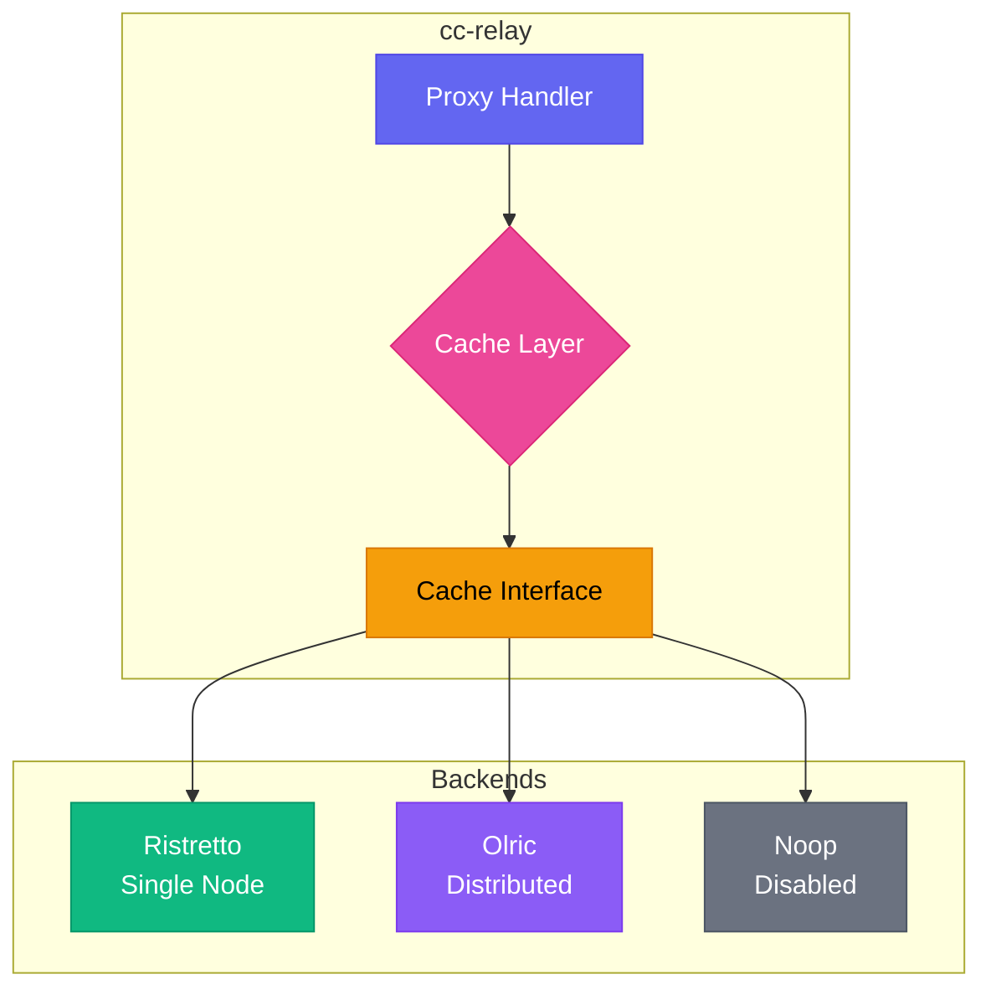
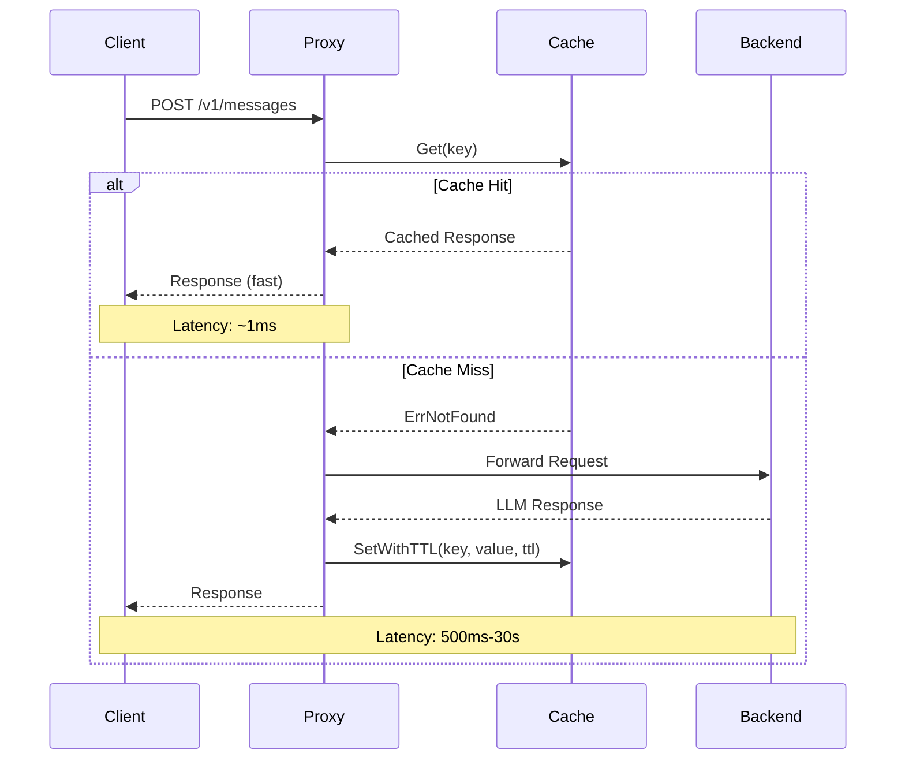

CC-Relay includes a flexible caching layer that can significantly reduce latency and backend load by caching responses from LLM providers.

## Overview

The cache subsystem supports three operating modes:

| Mode | Backend | Description |
|------|---------|-------------|
| `single` | Ristretto | High-performance local in-memory cache (default) |
| `ha` | Olric | Distributed cache for high-availability deployments |
| `disabled` | Noop | Passthrough mode with no caching |

**When to use each mode:**

- **Single mode**: Development, testing, or single-instance production deployments. Provides the lowest latency with zero network overhead.
- **HA mode**: Multi-instance production deployments where cache consistency across nodes is required.
- **Disabled mode**: Debugging, compliance requirements, or when caching is handled elsewhere.

## Architecture



The cache layer implements a unified `Cache` interface that abstracts over all backends:

```go
type Cache interface {
    Get(ctx context.Context, key string) ([]byte, error)
    Set(ctx context.Context, key string, value []byte) error
    SetWithTTL(ctx context.Context, key string, value []byte, ttl time.Duration) error
    Delete(ctx context.Context, key string) error
    Exists(ctx context.Context, key string) (bool, error)
    Close() error
}
```

## Cache Flow



## Configuration

### Single Mode (Ristretto)

Ristretto is a high-performance, concurrent cache based on research from the Caffeine library. It uses TinyLFU admission policy for optimal hit rates.

```yaml
cache:
  mode: single

  ristretto:
    # Number of 4-bit access counters
    # Recommended: 10x expected max items for optimal admission policy
    # Example: For 100,000 items, use 1,000,000 counters
    num_counters: 1000000

    # Maximum memory for cached values (in bytes)
    # 104857600 = 100 MB
    max_cost: 104857600

    # Number of keys per Get buffer (default: 64)
    # Controls admission buffer size
    buffer_items: 64
```

**Memory calculation:**

The `max_cost` parameter controls how much memory the cache can use for values. To estimate the appropriate size:

1. Estimate average response size (typically 1-10 KB for LLM responses)
2. Multiply by the number of unique requests you want to cache
3. Add 20% overhead for metadata

Example: 10,000 cached responses x 5 KB average = 50 MB, so set `max_cost: 52428800`

### HA Mode (Olric)

Olric provides distributed caching with automatic cluster discovery and data replication.

**Client Mode** (connecting to external cluster):

```yaml
cache:
  mode: ha

  olric:
    # Olric cluster member addresses
    addresses:
      - "olric-1:3320"
      - "olric-2:3320"
      - "olric-3:3320"

    # Distributed map name (default: "cc-relay")
    dmap_name: "cc-relay"
```

**Embedded Mode** (single-node HA or development):

```yaml
cache:
  mode: ha

  olric:
    # Run embedded Olric node
    embedded: true

    # Address to bind the embedded node
    bind_addr: "0.0.0.0:3320"

    # Peer addresses for cluster discovery (optional)
    peers:
      - "cc-relay-2:3320"
      - "cc-relay-3:3320"

    dmap_name: "cc-relay"
```

### Disabled Mode

```yaml
cache:
  mode: disabled
```

All cache operations return immediately without storing data. `Get` operations always return `ErrNotFound`.

## HA Clustering Guide

This section covers deploying cc-relay with distributed caching across multiple nodes for high availability.

### Prerequisites

Before configuring HA mode:

1. **Network connectivity**: All nodes must be able to reach each other
2. **Port accessibility**: Both Olric and memberlist ports must be open
3. **Consistent configuration**: All nodes must use the same `dmap_name` and `environment`

### Port Requirements

**Critical:** Olric uses two ports:

| Port | Purpose | Default |
|------|---------|---------|
| `bind_addr` port | Olric client connections | 3320 |
| `bind_addr` port + 2 | Memberlist gossip protocol | 3322 |

**Example:** If `bind_addr: "0.0.0.0:3320"`, memberlist automatically uses port 3322.

Ensure both ports are open in firewalls:

```bash
# Allow Olric client port
sudo ufw allow 3320/tcp

# Allow memberlist gossip port (bind_addr port + 2)
sudo ufw allow 3322/tcp
```

### Environment Settings

| Setting | Gossip Interval | Probe Interval | Probe Timeout | Use When |
|---------|-----------------|----------------|---------------|----------|
| `local` | 100ms | 100ms | 200ms | Same host, development |
| `lan` | 200ms | 1s | 500ms | Same datacenter |
| `wan` | 500ms | 3s | 2s | Cross-datacenter |

**All nodes in a cluster must use the same environment setting.**

### Two-Node Cluster Example

**Node 1 (cc-relay-1):**

```yaml
cache:
  mode: ha
  olric:
    embedded: true
    bind_addr: "0.0.0.0:3320"
    dmap_name: "cc-relay"
    environment: lan
    peers:
      - "cc-relay-2:3322"  # Memberlist port of node 2
    replica_count: 2
    read_quorum: 1
    write_quorum: 1
    member_count_quorum: 2
    leave_timeout: 5s
```

**Node 2 (cc-relay-2):**

```yaml
cache:
  mode: ha
  olric:
    embedded: true
    bind_addr: "0.0.0.0:3320"
    dmap_name: "cc-relay"
    environment: lan
    peers:
      - "cc-relay-1:3322"  # Memberlist port of node 1
    replica_count: 2
    read_quorum: 1
    write_quorum: 1
    member_count_quorum: 2
    leave_timeout: 5s
```

### Three-Node Docker Compose Example

```yaml
version: '3.8'

services:
  cc-relay-1:
    image: cc-relay:latest
    environment:
      - CC_RELAY_CONFIG=/config/config.yaml
    volumes:
      - ./config-node1.yaml:/config/config.yaml:ro
    ports:
      - "8787:8787"   # HTTP proxy
      - "3320:3320"   # Olric client port
      - "3322:3322"   # Memberlist gossip port
    networks:
      - cc-relay-net

  cc-relay-2:
    image: cc-relay:latest
    environment:
      - CC_RELAY_CONFIG=/config/config.yaml
    volumes:
      - ./config-node2.yaml:/config/config.yaml:ro
    ports:
      - "8788:8787"
      - "3330:3320"
      - "3332:3322"
    networks:
      - cc-relay-net

  cc-relay-3:
    image: cc-relay:latest
    environment:
      - CC_RELAY_CONFIG=/config/config.yaml
    volumes:
      - ./config-node3.yaml:/config/config.yaml:ro
    ports:
      - "8789:8787"
      - "3340:3320"
      - "3342:3322"
    networks:
      - cc-relay-net

networks:
  cc-relay-net:
    driver: bridge
```

**config-node1.yaml:**

```yaml
cache:
  mode: ha
  olric:
    embedded: true
    bind_addr: "0.0.0.0:3320"
    dmap_name: "cc-relay"
    environment: lan
    peers:
      - "cc-relay-2:3322"
      - "cc-relay-3:3322"
    replica_count: 2
    read_quorum: 1
    write_quorum: 1
    member_count_quorum: 2
    leave_timeout: 5s
```

**config-node2.yaml and config-node3.yaml:** Same as node1, but with different peers lists pointing to the other nodes.

### Replication and Quorum Explained

**replica_count:** Number of copies of each key stored in the cluster.

| replica_count | Behavior |
|---------------|----------|
| 1 | No replication (single copy) |
| 2 | One primary + one backup |
| 3 | One primary + two backups |

**read_quorum / write_quorum:** Minimum successful operations before returning success.

| Setting | Consistency | Availability |
|---------|-------------|--------------|
| quorum = 1 | Eventual | High |
| quorum = replica_count | Strong | Lower |
| quorum = (replica_count/2)+1 | Majority | Balanced |

**Recommendations:**

| Cluster Size | replica_count | read_quorum | write_quorum | Fault Tolerance |
|--------------|---------------|-------------|--------------|-----------------|
| 2 nodes | 2 | 1 | 1 | 1 node failure |
| 3 nodes | 2 | 1 | 1 | 1 node failure |
| 3 nodes | 3 | 2 | 2 | 1 node failure (strong consistency) |

## Cache Modes Comparison

| Feature | Single (Ristretto) | HA (Olric) | Disabled (Noop) |
|---------|-------------------|------------|-----------------|
| **Backend** | Local memory | Distributed | None |
| **Use Case** | Development, single instance | Production HA | Debugging |
| **Persistence** | No | Optional | N/A |
| **Multi-Node** | No | Yes | N/A |
| **Latency** | ~1 microsecond | ~1-10 ms (network) | ~0 |
| **Memory** | Local only | Distributed | None |
| **Consistency** | N/A | Eventual | N/A |
| **Complexity** | Low | Medium | None |

## Optional Interfaces

Some cache backends support additional capabilities via optional interfaces:

### Statistics

```go
if sp, ok := cache.(cache.StatsProvider); ok {
    stats := sp.Stats()
    fmt.Printf("Hits: %d, Misses: %d\n", stats.Hits, stats.Misses)
}
```

Statistics include:
- `Hits`: Number of cache hits
- `Misses`: Number of cache misses
- `KeyCount`: Current number of keys
- `BytesUsed`: Approximate memory used
- `Evictions`: Keys evicted due to capacity

### Health Check (Ping)

```go
if p, ok := cache.(cache.Pinger); ok {
    if err := p.Ping(ctx); err != nil {
        // Cache is unhealthy
    }
}
```

The `Pinger` interface is primarily useful for distributed caches (Olric) to verify cluster connectivity.

### Batch Operations

```go
// Batch get
if mg, ok := cache.(cache.MultiGetter); ok {
    results, err := mg.GetMulti(ctx, []string{"key1", "key2", "key3"})
}

// Batch set
if ms, ok := cache.(cache.MultiSetter); ok {
    err := ms.SetMultiWithTTL(ctx, items, 5*time.Minute)
}
```

## Performance Tips

### Optimizing Ristretto

1. **Set `num_counters` appropriately**: Use 10x your expected max items. Too low reduces hit rate; too high wastes memory.

2. **Size `max_cost` based on response sizes**: LLM responses vary widely. Monitor actual usage and adjust.

3. **Use TTL wisely**: Short TTLs (1-5 min) for dynamic content, longer TTLs (1 hour+) for deterministic responses.

4. **Monitor metrics**: Track hit rate to validate cache effectiveness:
   ```
   hit_rate = hits / (hits + misses)
   ```
   Aim for >80% hit rate for effective caching.

### Optimizing Olric

1. **Deploy close to cc-relay instances**: Network latency dominates distributed cache performance.

2. **Use embedded mode for single-node deployments**: Avoids external dependencies while maintaining HA-ready configuration.

3. **Size the cluster appropriately**: Each node should have enough memory for the full dataset (Olric replicates data).

4. **Monitor cluster health**: Use the `Pinger` interface in health checks.

### General Tips

1. **Cache key design**: Use deterministic keys based on request content. Include model name, prompt hash, and relevant parameters.

2. **Avoid caching streaming responses**: Streaming SSE responses are not cached by default due to their incremental nature.

3. **Consider cache warming**: For predictable workloads, pre-populate the cache with common queries.

## Troubleshooting

### Cache misses when expected hits

1. **Check key generation**: Ensure cache keys are deterministic and don't include timestamps or request IDs.

2. **Verify TTL settings**: Items may have expired. Check if TTL is too short for your use case.

3. **Monitor evictions**: High eviction counts indicate `max_cost` is too low:
   ```go
   stats := cache.Stats()
   if stats.Evictions > 0 {
       // Consider increasing max_cost
   }
   ```

### Ristretto not storing items

Ristretto uses admission policy that may reject items to maintain high hit rates. This is normal behavior:

1. **New items may be rejected**: TinyLFU requires items to "prove" their value through repeated access.

2. **Wait for buffer flush**: Ristretto buffers writes. Call `cache.Wait()` in tests to ensure writes are processed.

3. **Check cost calculation**: Items with cost > `max_cost` are never stored.

### Olric cluster connectivity issues

1. **Verify network connectivity**: Ensure all nodes can reach each other on port 3320 (or configured port).

2. **Check firewall rules**: Olric requires bidirectional communication between nodes.

3. **Validate addresses**: In client mode, ensure at least one address in the list is reachable.

4. **Monitor logs**: Enable debug logging to see cluster membership events:
   ```yaml
   logging:
     level: debug
   ```

### Memory pressure

1. **Reduce `max_cost`**: Lower the cache size to reduce memory usage.

2. **Use shorter TTLs**: Expire items faster to free memory.

3. **Switch to Olric**: Distribute memory pressure across multiple nodes.

4. **Monitor with metrics**: Track `BytesUsed` to understand actual memory consumption.

### Nodes Cannot Join Cluster

**Symptom:** Nodes start but don't discover each other.

**Causes and Solutions:**

1. **Wrong peer port:** Peers must use memberlist port (bind_addr + 2), not Olric port.
   ```yaml
   # Wrong
   peers:
     - "other-node:3320"  # This is the Olric port

   # Correct
   peers:
     - "other-node:3322"  # Memberlist port = 3320 + 2
   ```

2. **Firewall blocking:** Ensure both Olric and memberlist ports are open.
   ```bash
   # Check connectivity
   nc -zv other-node 3320  # Olric port
   nc -zv other-node 3322  # Memberlist port
   ```

3. **DNS resolution:** Verify hostnames resolve correctly.
   ```bash
   getent hosts other-node
   ```

4. **Environment mismatch:** All nodes must use the same `environment` setting.

### Quorum Errors

**Symptom:** "not enough members" or operations fail despite nodes being up.

**Solution:** Ensure `member_count_quorum` is less than or equal to actual running nodes.

```yaml
# For 2-node cluster
member_count_quorum: 2  # Requires both nodes

# For 3-node cluster with 1-node fault tolerance
member_count_quorum: 2  # Allows 1 node to be down
```

### Data Not Replicated

**Symptom:** Data disappears when a node goes down.

**Solution:** Ensure `replica_count` > 1 and have enough nodes.

```yaml
replica_count: 2          # Store 2 copies
member_count_quorum: 2    # Need 2 nodes to write
```

## Error Handling

The cache package defines standard errors for common conditions:

```go
import "github.com/anthropics/cc-relay/internal/cache"

data, err := c.Get(ctx, key)
switch {
case errors.Is(err, cache.ErrNotFound):
    // Cache miss - fetch from backend
case errors.Is(err, cache.ErrClosed):
    // Cache was closed - recreate or fail
case err != nil:
    // Other error (network, serialization, etc.)
}
```

## Next Steps

- [Configuration reference](/docs/configuration/)
- [Architecture overview](/docs/architecture/)
- [API documentation](/docs/api/)
