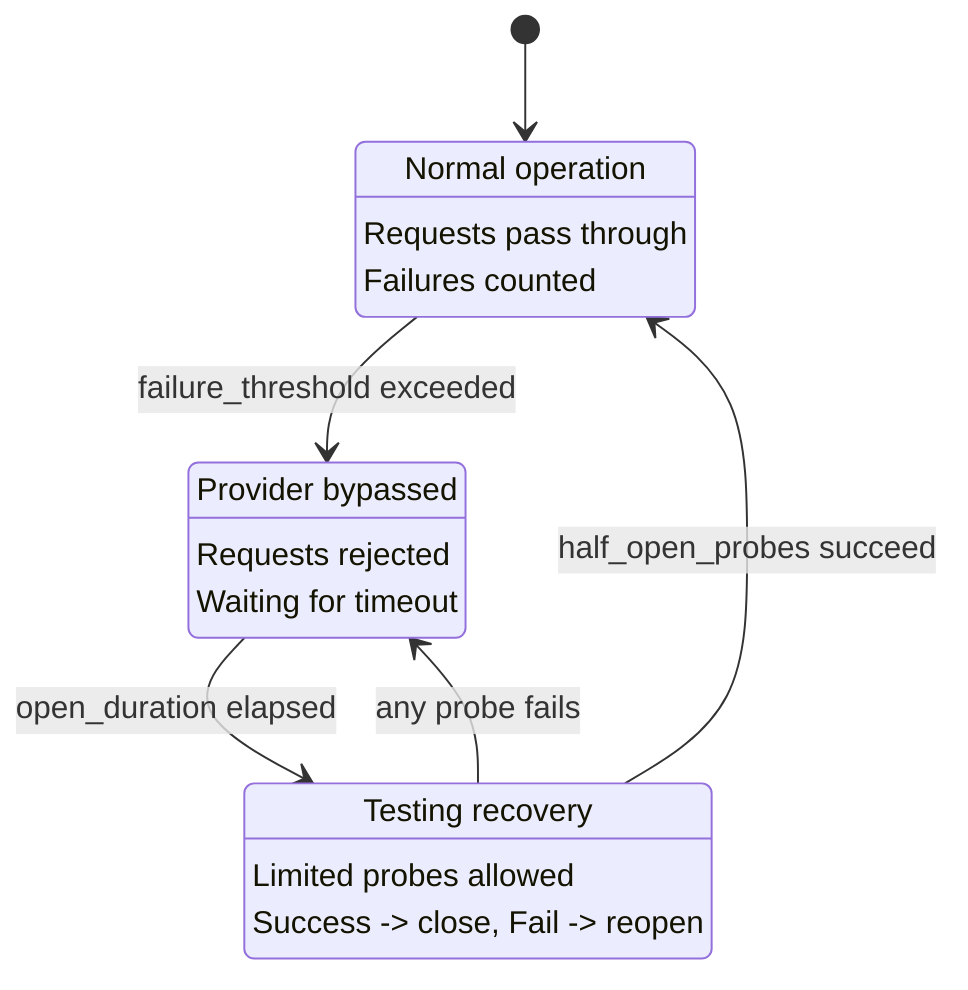

CC-Relay includes a circuit breaker system that automatically detects failing providers and temporarily excludes them from routing. This prevents cascading failures and allows providers time to recover before receiving new requests.

## Overview

The circuit breaker tracks failures per provider and transitions through three states:

| State | Description | Behavior |
|-------|-------------|----------|
| CLOSED | Normal operation | Requests pass through, failures counted |
| OPEN | Provider bypassed | Requests rejected, waiting for recovery |
| HALF-OPEN | Testing recovery | Limited probes allowed, success closes |

## Circuit Breaker States

The circuit breaker implements a state machine that protects your system from repeatedly hitting failing providers:



### State Transitions

**CLOSED to OPEN:** When a provider accumulates `failure_threshold` consecutive failures, the circuit opens. This immediately stops routing requests to that provider.

**OPEN to HALF-OPEN:** After `open_duration_ms` elapses, the circuit transitions to half-open. This allows limited probe requests to test if the provider has recovered.

**HALF-OPEN to CLOSED:** If `half_open_probes` consecutive requests succeed, the circuit closes and normal operation resumes.

**HALF-OPEN to OPEN:** If any probe request fails while in half-open state, the circuit immediately reopens and the timeout restarts.

## Configuration

Configure health tracking in your config file:


  
```yaml
health:
  # Health check settings
  health_check:
    # Enable periodic health checks (default: true)
    enabled: true
    # Check interval in milliseconds (default: 10000 = 10s)
    interval_ms: 10000

  # Circuit breaker settings
  circuit_breaker:
    # Consecutive failures before opening circuit (default: 5)
    failure_threshold: 5

    # Time circuit stays open before half-open, in milliseconds (default: 30000 = 30s)
    open_duration_ms: 30000

    # Probes allowed in half-open state (default: 3)
    half_open_probes: 3
```
  
  
```toml
[health]

[health.health_check]
# Enable periodic health checks (default: true)
enabled = true
# Check interval in milliseconds (default: 10000 = 10s)
interval_ms = 10000

[health.circuit_breaker]
# Consecutive failures before opening circuit (default: 5)
failure_threshold = 5

# Time circuit stays open before half-open, in milliseconds (default: 30000 = 30s)
open_duration_ms = 30000

# Probes allowed in half-open state (default: 3)
half_open_probes = 3
```
  


## Configuration Reference

| Option | Default | Description |
|--------|---------|-------------|
| `health_check.enabled` | `true` | Enable periodic health checks for open circuits |
| `health_check.interval_ms` | `10000` | Milliseconds between health check probes |
| `circuit_breaker.failure_threshold` | `5` | Consecutive failures before opening circuit |
| `circuit_breaker.open_duration_ms` | `30000` | Milliseconds circuit stays open before half-open |
| `circuit_breaker.half_open_probes` | `3` | Successful probes needed to close circuit |

## How It Works

### Failure Counting

The circuit breaker counts consecutive failures. When `failure_threshold` is reached, the circuit opens.

**What counts as a failure:**

| Error Type | Status Code | Counts as Failure? |
|------------|-------------|-------------------|
| Rate Limited | `429` | Yes |
| Internal Server Error | `500` | Yes |
| Bad Gateway | `502` | Yes |
| Service Unavailable | `503` | Yes |
| Gateway Timeout | `504` | Yes |
| Request Timeout | (timeout) | Yes |
| Network Error | (connection failed) | Yes |

**What does NOT count as a failure:**

| Error Type | Status Code | Counts as Failure? |
|------------|-------------|-------------------|
| Bad Request | `400` | No |
| Unauthorized | `401` | No |
| Forbidden | `403` | No |
| Not Found | `404` | No |
| Other 4xx | (except 429) | No |

Client errors (4xx except 429) indicate problems with the request itself, not provider health, so they don't affect circuit breaker state.

### Success Resets

When a request succeeds, the failure counter resets to zero. This means occasional failures won't trigger the circuit breaker as long as successes intersperse.

### Health Check Probes

When a circuit is in OPEN state, cc-relay runs periodic health checks to detect recovery faster than waiting for the full timeout:

1. Health checks run every `health_check.interval_ms` milliseconds
2. Checks only target providers with OPEN circuits (not CLOSED or HALF-OPEN)
3. A successful health check transitions the circuit to HALF-OPEN
4. Health checks use lightweight HTTP connectivity tests, not full API calls

## Integration with Routing

The circuit breaker integrates with all routing strategies:

### Provider Exclusion

Providers with OPEN circuits are automatically excluded from routing decisions:

- **Failover strategy:** Skips to next provider in priority chain
- **Round-robin:** Excludes from rotation
- **Weighted round-robin:** Weight effectively becomes zero
- **Shuffle:** Excluded from deck

### Automatic Recovery

Recovery is fully automatic:

1. Provider starts failing (rate limited, errors, timeouts)
2. After `failure_threshold` failures, circuit opens
3. Requests route to other healthy providers
4. After `open_duration_ms`, circuit becomes half-open
5. Limited probe requests test the provider
6. If probes succeed, circuit closes and provider rejoins rotation

No manual intervention is required for recovery.

## Debug Headers

When `routing.debug: true` is enabled, cc-relay includes health status in response headers:

| Header | Value | When |
|--------|-------|------|
| `X-CC-Relay-Provider` | Provider name | Always (when debug enabled) |
| `X-CC-Relay-Strategy` | Strategy used | Always (when debug enabled) |

To enable debug headers:


  
```yaml
routing:
  strategy: failover
  debug: true  # Enable diagnostic headers
```
  
  
```toml
[routing]
strategy = "failover"
debug = true  # Enable diagnostic headers
```
  


**Security Warning:** Debug headers expose internal routing decisions. Use only in development or trusted environments. Never enable in production with untrusted clients.

## Troubleshooting

### Provider keeps getting bypassed

**Symptom:** A provider's circuit keeps opening even when the provider seems healthy.

**Possible causes:**

1. **`failure_threshold` too low:** Increase to tolerate more transient failures


  
```yaml
circuit_breaker:
  failure_threshold: 10  # More tolerant
```
  
  
```toml
[circuit_breaker]
failure_threshold = 10  # More tolerant
```
  


2. **Rate limits triggering opens:** If you're hitting rate limits, add more API keys to your pool rather than adjusting the circuit breaker

3. **Slow responses causing timeouts:** Increase server timeout


  
```yaml
server:
  timeout_ms: 300000  # 5 minutes
```
  
  
```toml
[server]
timeout_ms = 300000  # 5 minutes
```
  


### Recovery takes too long

**Symptom:** Provider recovered but circuit stays open for a long time.

**Solutions:**

1. **Reduce open duration:**


  
```yaml
circuit_breaker:
  open_duration_ms: 15000  # 15 seconds instead of 30
```
  
  
```toml
[circuit_breaker]
open_duration_ms = 15000  # 15 seconds instead of 30
```
  


2. **Enable faster health checks:**


  
```yaml
health_check:
  enabled: true
  interval_ms: 5000  # Check every 5 seconds
```
  
  
```toml
[health_check]
enabled = true
interval_ms = 5000  # Check every 5 seconds
```
  


### Circuit opens on valid errors

**Symptom:** Circuit opens when provider returns client errors (400, 401).

**This should not happen.** Client errors (4xx except 429) do not count as failures. If you're seeing this:

1. Check if the actual response is 429 (rate limited)
2. Verify the error isn't actually a 5xx being misreported
3. Enable debug logging to see actual response codes:


  
```yaml
logging:
  level: debug
```
  
  
```toml
[logging]
level = "debug"
```
  


### All providers unhealthy

**Symptom:** All circuits open, requests fail entirely.

**Possible causes:**

1. **Network connectivity issue:** Check that cc-relay can reach all providers
2. **Invalid API keys:** Verify keys are valid (though 401 shouldn't trigger opens)
3. **Global outage:** All providers genuinely unavailable

**Immediate mitigation:**

- Increase `failure_threshold` to keep circuits closed longer
- Decrease `open_duration_ms` for faster recovery attempts

## Next Steps

- [Configuration reference](/docs/configuration/) - Complete configuration options
- [Routing strategies](/docs/routing/) - How providers are selected
- [Architecture overview](/docs/architecture/) - System internals
