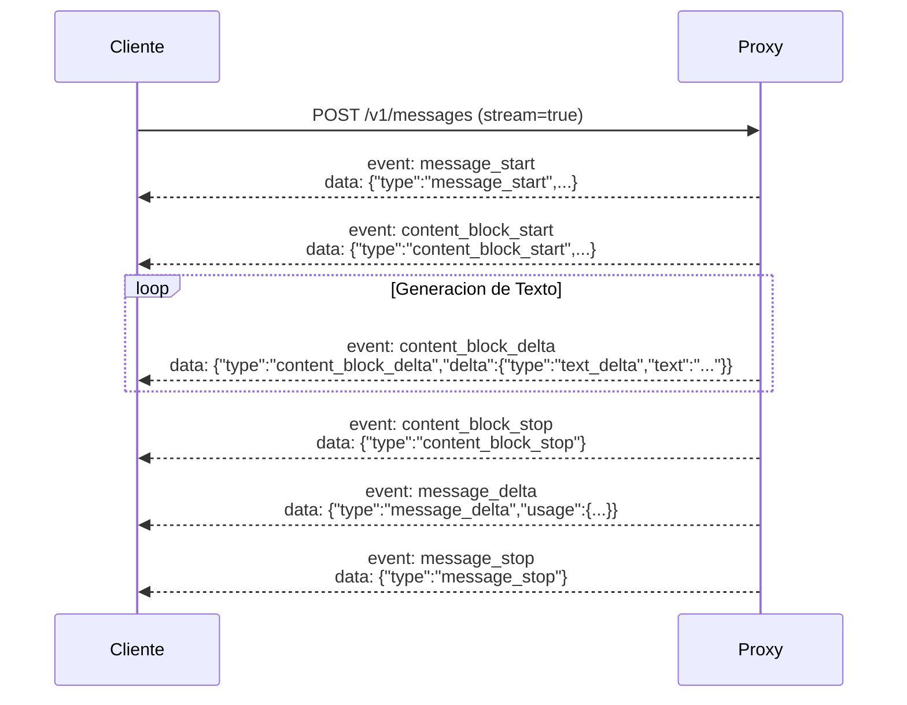

CC-Relay expone una API HTTP que es completamente compatible con la API de Mensajes de Anthropic.

## API de Proxy HTTP

### POST /v1/messages

Crea un mensaje usando el formato de API de Mensajes de Anthropic. Este es el endpoint principal usado por Claude Code y otros clientes LLM.

**Endpoint**: `POST /v1/messages`

**Headers**:
```
Content-Type: application/json
x-api-key: <tu-api-key>
anthropic-version: 2023-06-01
```

**Cuerpo de Solicitud**:
```json
{
  "model": "claude-sonnet-4-5-20250514",
  "max_tokens": 1024,
  "messages": [
    {
      "role": "user",
      "content": "Hola, Claude!"
    }
  ],
  "temperature": 1.0,
  "stream": false
}
```

**Respuesta** (sin streaming):
```json
{
  "id": "msg_01XYZ...",
  "type": "message",
  "role": "assistant",
  "content": [
    {
      "type": "text",
      "text": "Hola! Como puedo ayudarte hoy?"
    }
  ],
  "model": "claude-sonnet-4-5-20250514",
  "stop_reason": "end_turn",
  "usage": {
    "input_tokens": 12,
    "output_tokens": 15
  }
}
```

### Streaming SSE

Establece `"stream": true` en la solicitud para habilitar streaming de Server-Sent Events.

**Secuencia de Eventos**:



**Ejemplo de Stream**:

```
event: message_start
data: {"type":"message_start","message":{"id":"msg_01ABC","type":"message","role":"assistant","content":[],"model":"claude-sonnet-4-5-20250514","usage":{"input_tokens":12,"output_tokens":0}}}

event: content_block_start
data: {"type":"content_block_start","index":0,"content_block":{"type":"text","text":""}}

event: content_block_delta
data: {"type":"content_block_delta","index":0,"delta":{"type":"text_delta","text":"Hola"}}

event: content_block_delta
data: {"type":"content_block_delta","index":0,"delta":{"type":"text_delta","text":"!"}}

event: content_block_stop
data: {"type":"content_block_stop","index":0}

event: message_delta
data: {"type":"message_delta","usage":{"output_tokens":2}}

event: message_stop
data: {"type":"message_stop"}
```

### Uso de Herramientas

Claude Code usa ejecucion de herramientas para operaciones de archivos y otras tareas. CC-Relay preserva `tool_use_id` para asociacion correcta:

**Solicitud**:
```json
{
  "model": "claude-sonnet-4-5-20250514",
  "max_tokens": 1024,
  "tools": [
    {
      "name": "get_weather",
      "description": "Obtener clima de una ubicacion",
      "input_schema": {
        "type": "object",
        "properties": {
          "location": {"type": "string"}
        }
      }
    }
  ],
  "messages": [
    {"role": "user", "content": "Cual es el clima en CDMX?"}
  ]
}
```

**Respuesta**:
```json
{
  "content": [
    {
      "type": "text",
      "text": "Voy a revisar el clima para ti."
    },
    {
      "type": "tool_use",
      "id": "toolu_01ABC",
      "name": "get_weather",
      "input": {"location": "CDMX"}
    }
  ]
}
```

### Respuestas de Error

Todos los errores se retornan en formato de API de Anthropic:

**Error Upstream** (502):
```json
{
  "type": "error",
  "error": {
    "type": "api_error",
    "message": "upstream connection failed"
  }
}
```

**Error de Autenticacion** (401):
```json
{
  "type": "error",
  "error": {
    "type": "authentication_error",
    "message": "missing x-api-key header"
  }
}
```

**Solicitud Invalida** (400):
```json
{
  "type": "error",
  "error": {
    "type": "invalid_request_error",
    "message": "Missing required field: messages"
  }
}
```

## GET /v1/models

Lista modelos disponibles de todos los proveedores configurados.

**Endpoint**: `GET /v1/models`

**Headers**: Ninguno requerido (sin autenticacion)

**Respuesta**:
```json
{
  "object": "list",
  "data": [
    {
      "id": "claude-sonnet-4-5-20250514",
      "object": "model",
      "owned_by": "anthropic",
      "provider": "anthropic",
      "created": 1737446400
    },
    {
      "id": "claude-opus-4-5-20250514",
      "object": "model",
      "owned_by": "anthropic",
      "provider": "anthropic",
      "created": 1737446400
    },
    {
      "id": "GLM-4.7",
      "object": "model",
      "owned_by": "zhipu",
      "provider": "zai",
      "created": 1737446400
    }
  ]
}
```

## GET /v1/providers

Lista proveedores activos con metadata.

**Endpoint**: `GET /v1/providers`

**Headers**: Ninguno requerido (sin autenticacion)

**Respuesta**:
```json
{
  "object": "list",
  "data": [
    {
      "name": "anthropic",
      "type": "anthropic",
      "base_url": "https://api.anthropic.com",
      "models": [
        "claude-sonnet-4-5-20250514",
        "claude-opus-4-5-20250514",
        "claude-haiku-3-5-20241022"
      ],
      "active": true
    },
    {
      "name": "zai",
      "type": "zhipu",
      "base_url": "https://api.z.ai/api/anthropic",
      "models": [
        "GLM-4.7",
        "GLM-4.5-Air",
        "GLM-4-Plus"
      ],
      "active": true
    }
  ]
}
```

## GET /health

Endpoint de verificacion de salud para monitoreo y balanceadores de carga.

**Endpoint**: `GET /health`

**Headers**: Ninguno requerido (sin autenticacion)

**Respuesta**:
```json
{"status":"ok"}
```

**Codigos de Estado HTTP**:
- `200 OK`: Servidor saludable
- `503 Service Unavailable`: Servidor no saludable (implementacion futura)

## Autenticacion

CC-Relay soporta multiples metodos de autenticacion para el endpoint `/v1/messages`:

### Autenticacion con API Key

Incluir el header `x-api-key`:

```bash
curl -X POST http://localhost:8787/v1/messages \
  -H "Content-Type: application/json" \
  -H "x-api-key: tu-proxy-key" \
  -H "anthropic-version: 2023-06-01" \
  -d '{"model": "claude-sonnet-4-5-20250514", ...}'
```

### Autenticacion con Bearer Token

Incluir el header `Authorization`:

```bash
curl -X POST http://localhost:8787/v1/messages \
  -H "Content-Type: application/json" \
  -H "Authorization: Bearer tu-token" \
  -H "anthropic-version: 2023-06-01" \
  -d '{"model": "claude-sonnet-4-5-20250514", ...}'
```

Esto es usado por usuarios con suscripcion de Claude Code.

## Headers de Solicitud

CC-Relay reenvia todos los headers `anthropic-*` al proveedor backend:

| Header | Descripcion |
|--------|-------------|
| `anthropic-version` | Version de API (requerido) |
| `anthropic-beta` | Funciones beta a habilitar |
| `anthropic-dangerous-direct-browser-access` | Flag de acceso desde navegador |

## Headers de Respuesta

CC-Relay agrega los siguientes headers a las respuestas:

| Header | Descripcion |
|--------|-------------|
| `X-Request-ID` | Identificador unico de solicitud para trazabilidad |
| `Content-Type` | `application/json` o `text/event-stream` |
| `Cache-Control` | `no-cache, no-transform` para SSE |
| `X-Accel-Buffering` | `no` para deshabilitar buffering de proxy |

## Ejemplos cURL

### Solicitud Sin Streaming

```bash
curl -X POST http://localhost:8787/v1/messages \
  -H "Content-Type: application/json" \
  -H "x-api-key: test" \
  -H "anthropic-version: 2023-06-01" \
  -d '{
    "model": "claude-sonnet-4-5-20250514",
    "max_tokens": 100,
    "messages": [{"role": "user", "content": "Hola!"}]
  }'
```

### Solicitud con Streaming

```bash
curl -N -X POST http://localhost:8787/v1/messages \
  -H "Content-Type: application/json" \
  -H "x-api-key: test" \
  -H "anthropic-version: 2023-06-01" \
  -d '{
    "model": "claude-sonnet-4-5-20250514",
    "max_tokens": 100,
    "messages": [{"role": "user", "content": "Hola!"}],
    "stream": true
  }'
```

### Listar Modelos

```bash
curl http://localhost:8787/v1/models
```

### Listar Proveedores

```bash
curl http://localhost:8787/v1/providers
```

### Verificacion de Salud

```bash
curl http://localhost:8787/health
```

## Ejemplo de Cliente Python

```python
import requests

response = requests.post(
    "http://localhost:8787/v1/messages",
    headers={
        "Content-Type": "application/json",
        "x-api-key": "managed-by-cc-relay",
        "anthropic-version": "2023-06-01",
    },
    json={
        "model": "claude-sonnet-4-5-20250514",
        "max_tokens": 1024,
        "messages": [
            {"role": "user", "content": "Hola!"}
        ],
    },
)

print(response.json())
```

## Ejemplo de Streaming en Python

```python
import requests

response = requests.post(
    "http://localhost:8787/v1/messages",
    headers={
        "Content-Type": "application/json",
        "x-api-key": "managed-by-cc-relay",
        "anthropic-version": "2023-06-01",
    },
    json={
        "model": "claude-sonnet-4-5-20250514",
        "max_tokens": 1024,
        "messages": [
            {"role": "user", "content": "Hola!"}
        ],
        "stream": True,
    },
    stream=True,
)

for line in response.iter_lines():
    if line:
        print(line.decode('utf-8'))
```

## Ejemplo de Cliente Go

```go
package main

import (
    "bytes"
    "encoding/json"
    "fmt"
    "io"
    "net/http"
)

func main() {
    body := map[string]interface{}{
        "model":      "claude-sonnet-4-5-20250514",
        "max_tokens": 100,
        "messages": []map[string]string{
            {"role": "user", "content": "Hola!"},
        },
    }

    jsonBody, _ := json.Marshal(body)

    req, _ := http.NewRequest("POST", "http://localhost:8787/v1/messages", bytes.NewReader(jsonBody))
    req.Header.Set("Content-Type", "application/json")
    req.Header.Set("x-api-key", "test")
    req.Header.Set("anthropic-version", "2023-06-01")

    resp, err := http.DefaultClient.Do(req)
    if err != nil {
        panic(err)
    }
    defer resp.Body.Close()

    data, _ := io.ReadAll(resp.Body)
    fmt.Println(string(data))
}
```

## Siguientes Pasos

- [Referencia de configuracion](/es/docs/configuration/)
- [Vision general de arquitectura](/es/docs/architecture/)
