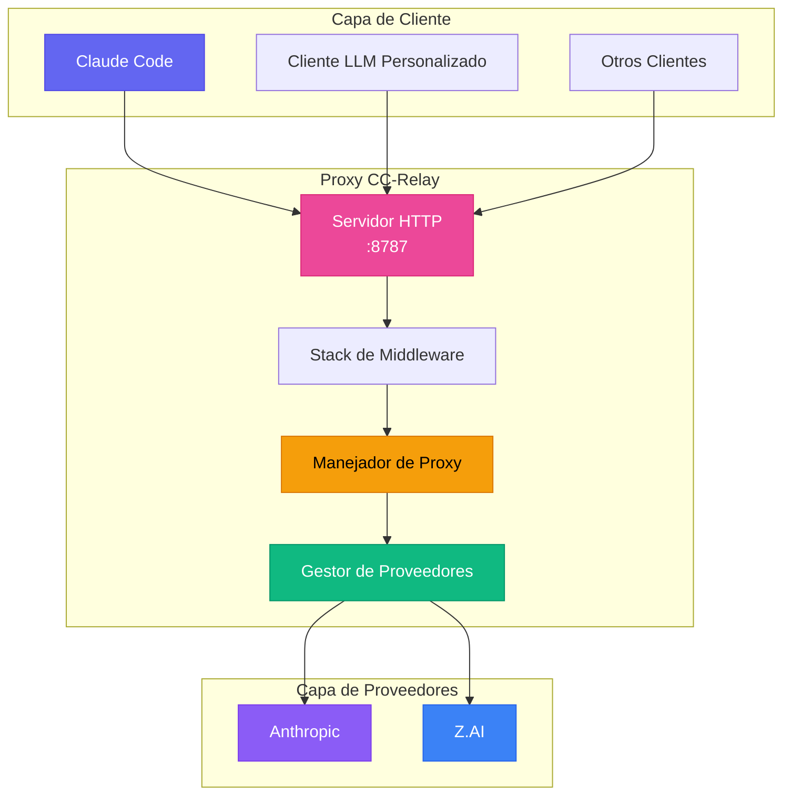
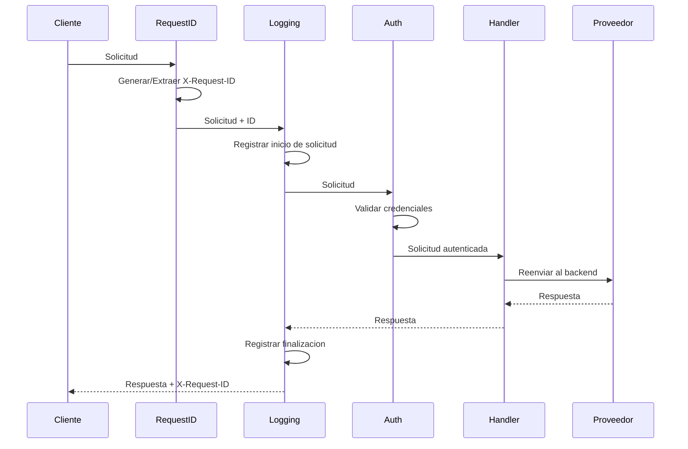
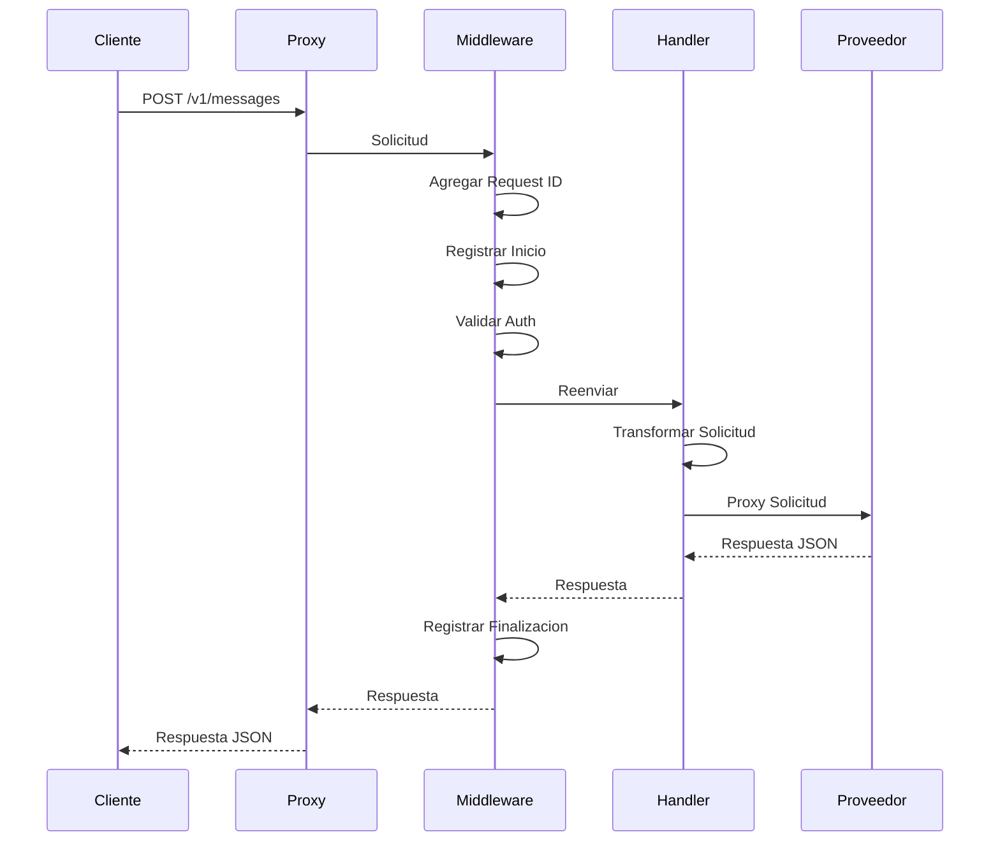
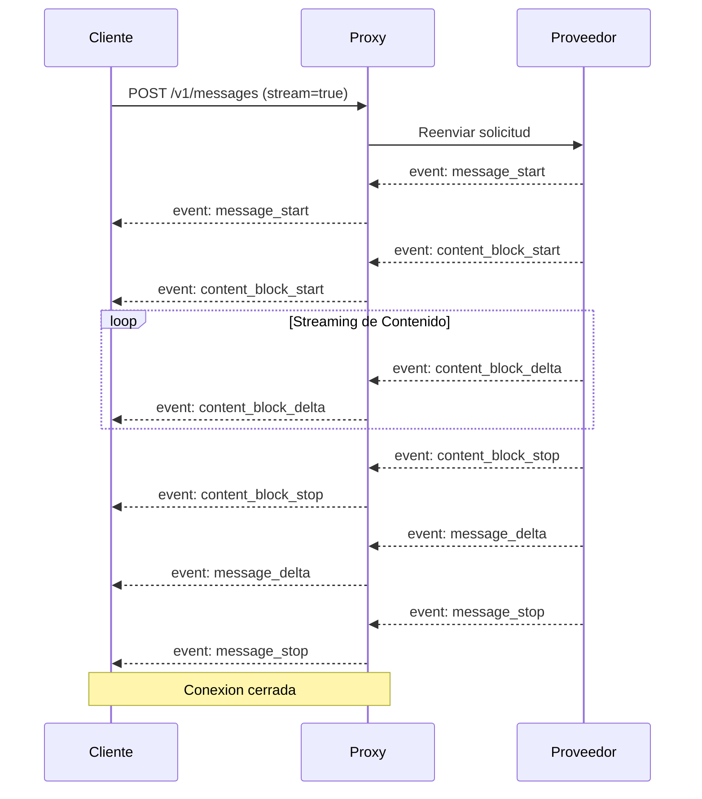
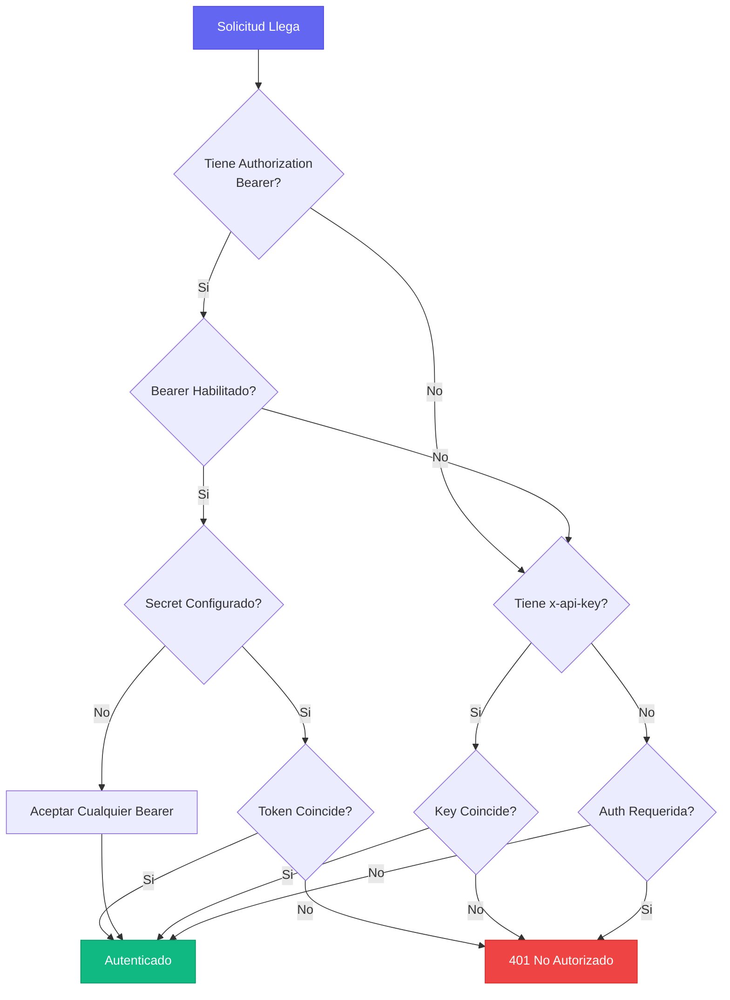

CC-Relay esta disenado como un proxy HTTP de alto rendimiento y multi-proveedor que se ubica entre clientes LLM (como Claude Code) y proveedores backend.

## Vision General del Sistema



## Componentes Principales

### 1. Servidor Proxy HTTP

**Ubicacion**: `internal/proxy/`

El servidor HTTP implementa la API de Mensajes de Anthropic (`/v1/messages`) con compatibilidad exacta para Claude Code.

**Caracteristicas:**
- Streaming SSE con secuenciacion correcta de eventos
- Validacion y transformacion de solicitudes
- Cadena de middleware (request ID, logging, autenticacion)
- Propagacion de contexto para timeouts y cancelacion
- Soporte HTTP/2 para solicitudes concurrentes

**Endpoints:**

| Endpoint | Metodo | Descripcion |
|----------|--------|-------------|
| `/v1/messages` | POST | Redirigir solicitudes al proveedor backend |
| `/v1/models` | GET | Listar modelos disponibles de todos los proveedores |
| `/v1/providers` | GET | Listar proveedores activos con metadata |
| `/health` | GET | Endpoint de verificacion de salud |

### 2. Stack de Middleware

**Ubicacion**: `internal/proxy/middleware.go`

La cadena de middleware procesa solicitudes en orden:



**Componentes de Middleware:**

| Middleware | Proposito |
|------------|-----------|
| `RequestIDMiddleware` | Genera/extrae X-Request-ID para trazabilidad |
| `LoggingMiddleware` | Registra solicitud/respuesta con tiempos |
| `AuthMiddleware` | Valida header x-api-key |
| `MultiAuthMiddleware` | Soporta autenticacion API key y Bearer token |

### 3. Gestor de Proveedores

**Ubicacion**: `internal/providers/`

Cada proveedor implementa la interfaz `Provider`:

```go
type Provider interface {
    // Name retorna el identificador del proveedor
    Name() string

    // BaseURL retorna la URL base de la API backend
    BaseURL() string

    // Owner retorna el identificador del propietario (ej., "anthropic", "zhipu")
    Owner() string

    // Authenticate agrega autenticacion especifica del proveedor
    Authenticate(req *http.Request, key string) error

    // ForwardHeaders retorna headers a reenviar al backend
    ForwardHeaders(originalHeaders http.Header) http.Header

    // SupportsStreaming indica si el proveedor soporta SSE
    SupportsStreaming() bool

    // ListModels retorna modelos disponibles
    ListModels() []Model
}
```

**Proveedores Implementados:**

| Proveedor | Tipo | Descripcion |
|-----------|------|-------------|
| `AnthropicProvider` | `anthropic` | API Directa de Anthropic |
| `ZAIProvider` | `zai` | Z.AI/Zhipu GLM (compatible con Anthropic) |

### 4. Manejador de Proxy

**Ubicacion**: `internal/proxy/handler.go`

El manejador de proxy usa `httputil.ReverseProxy` de Go para reenvio eficiente de solicitudes:

```go
type Handler struct {
    provider  providers.Provider
    proxy     *httputil.ReverseProxy
    apiKey    string
    debugOpts config.DebugOptions
}
```

**Caracteristicas Clave:**
- Flush inmediato para streaming SSE (`FlushInterval: -1`)
- Autenticacion especifica del proveedor
- Reenvio de headers para headers `anthropic-*`
- Manejo de errores con respuestas en formato Anthropic

### 5. Gestor de Configuracion

**Ubicacion**: `internal/config/`

**Caracteristicas:**
- Parseo de YAML con expansion de variables de entorno
- Validacion de configuraciones de proveedor y servidor
- Soporte para multiples metodos de autenticacion

## Flujo de Solicitudes

### Solicitud Sin Streaming



### Solicitud con Streaming (SSE)



## Streaming SSE

CC-Relay preserva el orden exacto de eventos SSE para compatibilidad con Claude Code:

**Headers Requeridos:**
```
Content-Type: text/event-stream
Cache-Control: no-cache, no-transform
X-Accel-Buffering: no
Connection: keep-alive
```

**Secuencia de Eventos:**
1. `message_start` - Metadata del mensaje
2. `content_block_start` - Inicia bloque de contenido
3. `content_block_delta` - Chunks de contenido (repetido)
4. `content_block_stop` - Termina bloque de contenido
5. `message_delta` - Informacion de uso
6. `message_stop` - Mensaje completo

El header `X-Accel-Buffering: no` es critico para prevenir que nginx/Cloudflare almacenen en buffer los eventos SSE.

## Flujo de Autenticacion



## Compatibilidad de API

### Formato de API Anthropic

CC-Relay implementa compatibilidad exacta con la API de Mensajes de Anthropic:

**Endpoint**: `POST /v1/messages`

**Headers**:
- `x-api-key`: API key (gestionada por CC-Relay)
- `anthropic-version`: Version de API (ej., `2023-06-01`)
- `content-type`: `application/json`

**Cuerpo de Solicitud**:
```json
{
  "model": "claude-sonnet-4-5-20250514",
  "max_tokens": 1024,
  "messages": [
    {"role": "user", "content": "Hola!"}
  ],
  "stream": true
}
```

### Transformaciones de Proveedores

Ambos proveedores actualmente soportados (Anthropic y Z.AI) usan el mismo formato de API compatible con Anthropic:

| Proveedor | Transformacion |
|-----------|----------------|
| **Anthropic** | Ninguna (formato nativo) |
| **Z.AI** | Solo mapeo de nombres de modelo |

## Consideraciones de Rendimiento

### Manejo de Conexiones

CC-Relay usa el cliente HTTP de la biblioteca estandar de Go con configuraciones optimizadas:

- **Pool de conexiones**: Reutiliza conexiones HTTP a backends
- **Soporte HTTP/2**: h2c opcional para solicitudes multiplexadas
- **Flush inmediato**: Eventos SSE se envian inmediatamente

### Concurrencia

- **Goroutine por solicitud**: Modelo de concurrencia liviano
- **Propagacion de contexto**: Manejo apropiado de timeout y cancelacion
- **Logging thread-safe**: Usa zerolog para logging estructurado

### Gestion de Memoria

- **Respuestas en streaming**: Sin buffering de cuerpos de respuesta
- **Limites de cuerpo de solicitud**: Tamano maximo de cuerpo configurable
- **Apagado graceful**: Timeout de 30 segundos para solicitudes en vuelo

## Estructura de Directorios

```
cc-relay/
├── cmd/cc-relay/        # Punto de entrada CLI
│   ├── main.go          # Comando raiz
│   ├── serve.go         # Comando serve
│   ├── status.go        # Comando status
│   ├── version.go       # Comando version
│   ├── config.go        # Comando config
│   ├── config_init.go   # Subcomando config init
│   ├── config_cc.go     # Subcomando config cc
│   ├── config_cc_init.go    # Config de Claude Code
│   └── config_cc_remove.go  # Remover config CC
├── internal/
│   ├── config/          # Carga de configuracion
│   │   ├── config.go    # Estructuras de config
│   │   └── loader.go    # Carga de YAML/env
│   ├── providers/       # Implementaciones de proveedores
│   │   ├── provider.go  # Interfaz de proveedor
│   │   ├── base.go      # Proveedor base
│   │   ├── anthropic.go # Proveedor Anthropic
│   │   └── zai.go       # Proveedor Z.AI
│   ├── proxy/           # Servidor proxy HTTP
│   │   ├── server.go    # Setup del servidor
│   │   ├── routes.go    # Registro de rutas
│   │   ├── handler.go   # Manejador de proxy
│   │   ├── middleware.go # Cadena de middleware
│   │   ├── sse.go       # Utilidades SSE
│   │   ├── errors.go    # Respuestas de error
│   │   └── logger.go    # Setup de logging
│   ├── auth/            # Autenticacion
│   │   ├── auth.go      # Interfaz de auth
│   │   ├── apikey.go    # Auth de API key
│   │   ├── oauth.go     # Auth de Bearer token
│   │   └── chain.go     # Cadena de auth
│   └── version/         # Informacion de version
└── config.yaml          # Configuracion de ejemplo
```

## Arquitectura Futura

Las siguientes funciones estan planeadas para versiones futuras:

- **Componente de Router**: Estrategias de enrutamiento inteligente (round-robin, failover, basado en costo)
- **Limitador de Tasa**: Limitacion de tasa token bucket por API key
- **Seguimiento de Salud**: Circuit breaker con recuperacion automatica
- **API de Gestion gRPC**: Estadisticas en tiempo real y configuracion
- **Dashboard TUI**: Interfaz de monitoreo basada en terminal
- **Proveedores Adicionales**: Ollama, AWS Bedrock, Azure, Vertex AI

## Siguientes Pasos

- [Referencia de configuracion](/es/docs/configuration/)
- [Documentacion de API](/es/docs/api/)
