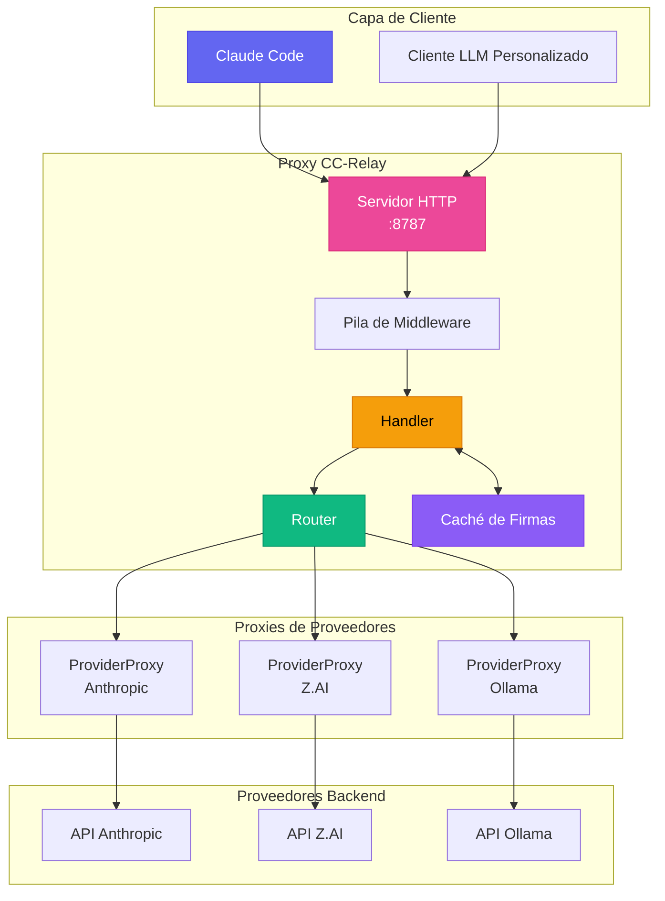
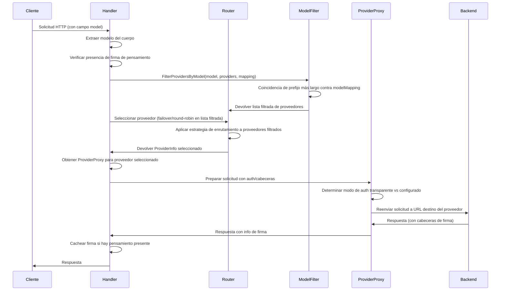
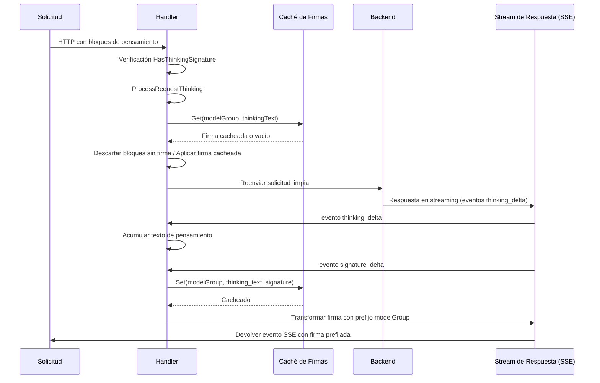
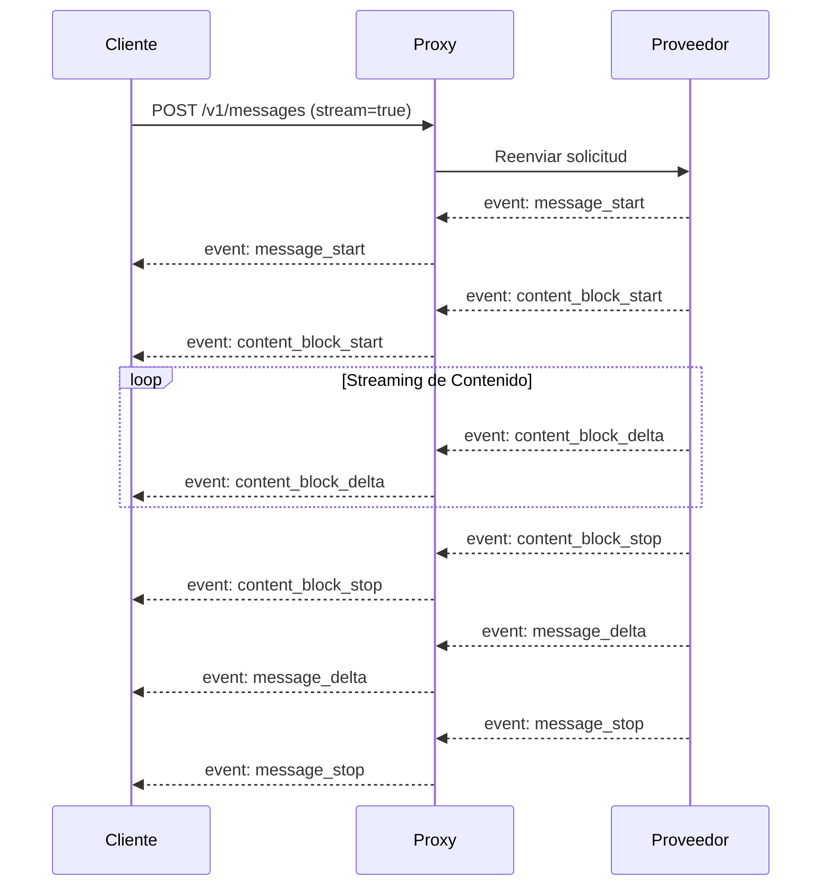
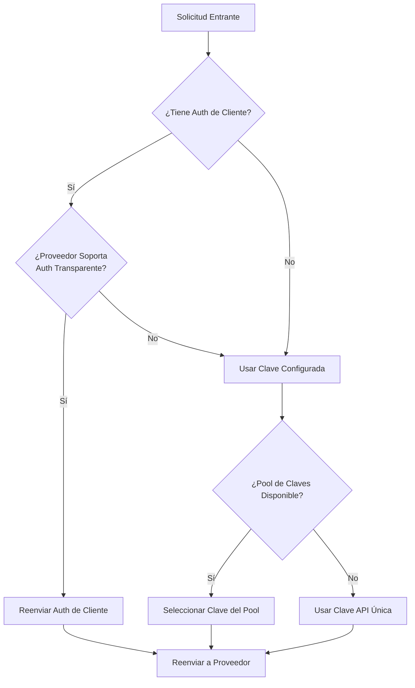

CC-Relay es un proxy HTTP de alto rendimiento y multi-proveedor diseñado para aplicaciones LLM. Proporciona enrutamiento inteligente, caché de firmas de pensamiento y conmutación por error sin interrupciones entre proveedores.

## Descripción General del Sistema



## Componentes Principales

### 1. Handler

**Ubicación**: `internal/proxy/handler.go`

El Handler es el coordinador central para el procesamiento de solicitudes:

```go
type Handler struct {
    providerProxies map[string]*ProviderProxy  // Proxies inversos por proveedor
    defaultProvider providers.Provider          // Respaldo para modo de proveedor único
    router          router.ProviderRouter       // Implementación de estrategia de enrutamiento
    healthTracker   *health.Tracker             // Seguimiento de circuit breaker
    signatureCache  *SignatureCache             // Caché de firmas de pensamiento
    routingConfig   *config.RoutingConfig       // Configuración de enrutamiento basado en modelo
    providers       []router.ProviderInfo       // Proveedores disponibles
}
```

**Responsabilidades:**
- Extraer nombre del modelo del cuerpo de la solicitud
- Detectar firmas de pensamiento para afinidad de proveedor
- Seleccionar proveedor a través del router
- Delegar al ProviderProxy apropiado
- Procesar bloques de pensamiento y cachear firmas

### 2. ProviderProxy

**Ubicación**: `internal/proxy/provider_proxy.go`

Cada proveedor obtiene un proxy inverso dedicado con URL y autenticación preconfiguradas:

```go
type ProviderProxy struct {
    Provider           providers.Provider
    Proxy              *httputil.ReverseProxy
    KeyPool            *keypool.KeyPool  // Para rotación multi-clave
    APIKey             string            // Clave única de respaldo
    targetURL          *url.URL          // URL base del proveedor
    modifyResponseHook ModifyResponseFunc
}
```

**Características Principales:**
- El análisis de URL ocurre una vez en la inicialización (no por solicitud)
- Soporta autenticación transparente (reenvío de credenciales del cliente) o autenticación configurada
- Inyección automática de cabeceras SSE para respuestas en streaming
- Integración de pool de claves para distribución de límites de tasa

### 3. Router

**Ubicación**: `internal/router/`

El router selecciona qué proveedor maneja cada solicitud:

| Estrategia | Descripción |
|----------|-------------|
| `failover` | Basado en prioridad con reintento automático (predeterminado) |
| `round_robin` | Rotación secuencial |
| `weighted_round_robin` | Proporcional por peso |
| `shuffle` | Distribución aleatoria justa |
| `model_based` | Enrutar por prefijo de nombre de modelo |

### 4. Caché de Firmas

**Ubicación**: `internal/proxy/signature_cache.go`

Cachea firmas de bloques de pensamiento para compatibilidad entre proveedores:

```go
type SignatureCache struct {
    cache cache.Cache  // Caché respaldado por Ristretto
}

// Formato de clave de caché: "sig:{modelGroup}:{textHash}"
// TTL: 3 horas (coincide con API de Claude)
```

## Flujo de Solicitudes

### Enrutamiento Multi-Proveedor



### Procesamiento de Firmas de Pensamiento

Cuando el pensamiento extendido está habilitado, los proveedores devuelven bloques de pensamiento firmados. Estas firmas deben ser validadas por el mismo proveedor en turnos subsecuentes. CC-Relay resuelve problemas de firmas entre proveedores mediante caché:



**Grupos de Modelos para Compartir Firmas:**

| Patrón de Modelo | Grupo | Firmas Compartidas |
|--------------|-------|-------------------|
| `claude-*` | `claude` | Sí, entre todos los modelos Claude |
| `gpt-*` | `gpt` | Sí, entre todos los modelos GPT |
| `gemini-*` | `gemini` | Sí, usa valor centinela |
| Otro | Nombre exacto | Sin compartir |

### Flujo de Streaming SSE



**Cabeceras SSE Requeridas:**
```
Content-Type: text/event-stream
Cache-Control: no-cache, no-transform
X-Accel-Buffering: no
Connection: keep-alive
```

## Pila de Middleware

**Ubicación**: `internal/proxy/middleware.go`

| Middleware | Propósito |
|------------|---------|
| `RequestIDMiddleware` | Genera/extrae X-Request-ID para trazabilidad |
| `LoggingMiddleware` | Registra solicitud/respuesta con tiempos |
| `AuthMiddleware` | Valida cabecera x-api-key |
| `MultiAuthMiddleware` | Soporta autenticación por API key y Bearer token |

## Interfaz de Proveedor

**Ubicación**: `internal/providers/provider.go`

```go
type Provider interface {
    Name() string
    BaseURL() string
    Owner() string
    Authenticate(req *http.Request, key string) error
    ForwardHeaders(originalHeaders http.Header) http.Header
    SupportsStreaming() bool
    SupportsTransparentAuth() bool
    ListModels() []Model
    GetModelMapping() map[string]string
    MapModel(requestModel string) string
}
```

**Proveedores Implementados:**

| Proveedor | Tipo | Características |
|----------|------|----------|
| `AnthropicProvider` | `anthropic` | Formato nativo, soporte completo de funciones |
| `ZAIProvider` | `zai` | Compatible con Anthropic, modelos GLM |
| `OllamaProvider` | `ollama` | Modelos locales, sin caché de prompts |

## Modos de Autenticación

### Autenticación Transparente
Cuando el cliente proporciona credenciales y el proveedor lo soporta:
- Las cabeceras `Authorization` o `x-api-key` del cliente se reenvían sin cambios
- CC-Relay actúa como un proxy puro

### Autenticación Configurada
Al usar claves gestionadas por CC-Relay:
- Se eliminan las credenciales del cliente
- CC-Relay inyecta la clave API configurada
- Soporta rotación de pool de claves para distribución de límites de tasa



## Seguimiento de Salud & Circuit Breaker

**Ubicación**: `internal/health/`

CC-Relay rastrea la salud de los proveedores e implementa patrones de circuit breaker:

| Estado | Comportamiento |
|--------|----------|
| CLOSED | Operación normal, las solicitudes fluyen |
| OPEN | Proveedor marcado como no saludable, solicitudes fallan rápido |
| HALF-OPEN | Sondeo con solicitudes limitadas después de enfriamiento |

**Disparadores para estado OPEN:**
- HTTP 429 (límite de tasa)
- HTTP 5xx (errores de servidor)
- Timeouts de conexión
- Fallos consecutivos exceden umbral

## Estructura de Directorios

```
cc-relay/
├── cmd/cc-relay/           # Punto de entrada CLI
│   ├── main.go             # Comando raíz
│   ├── serve.go            # Comando serve
│   └── di/                 # Inyección de dependencias
│       └── providers.go    # Cableado de servicios
├── internal/
│   ├── config/             # Carga de configuración
│   ├── providers/          # Implementaciones de proveedores
│   │   ├── provider.go     # Interfaz de proveedor
│   │   ├── base.go         # Proveedor base
│   │   ├── anthropic.go    # Proveedor Anthropic
│   │   ├── zai.go          # Proveedor Z.AI
│   │   └── ollama.go       # Proveedor Ollama
│   ├── proxy/              # Servidor proxy HTTP
│   │   ├── handler.go      # Handler principal de solicitudes
│   │   ├── provider_proxy.go # Proxy por proveedor
│   │   ├── thinking.go     # Procesamiento de bloques de pensamiento
│   │   ├── signature_cache.go # Caché de firmas
│   │   ├── sse.go          # Utilidades SSE
│   │   └── middleware.go   # Cadena de middleware
│   ├── router/             # Estrategias de enrutamiento
│   │   ├── router.go       # Interfaz de router
│   │   ├── failover.go     # Estrategia de failover
│   │   ├── round_robin.go  # Estrategia round-robin
│   │   └── model_filter.go # Filtrado basado en modelo
│   ├── health/             # Seguimiento de salud
│   │   └── tracker.go      # Circuit breaker
│   ├── keypool/            # Pooling de claves API
│   │   └── keypool.go      # Rotación de claves
│   └── cache/              # Capa de caché
│       └── cache.go        # Wrapper de Ristretto
└── docs-site/              # Documentación
```

## Consideraciones de Rendimiento

### Manejo de Conexiones
- **Connection pooling**: Conexiones HTTP reutilizadas hacia backends
- **Soporte HTTP/2**: Solicitudes multiplexadas donde se soporta
- **Flush inmediato**: Eventos SSE enviados sin buffering

### Concurrencia
- **Goroutine por solicitud**: Concurrencia ligera de Go
- **Propagación de contexto**: Timeout y cancelación apropiados
- **Caché thread-safe**: Ristretto proporciona acceso concurrente

### Memoria
- **Respuestas en streaming**: Sin buffering de cuerpos de respuesta
- **Caché de firmas**: Tamaño limitado con evicción LRU
- **Restauración de cuerpo de solicitud**: Re-lectura eficiente del cuerpo

## Próximos Pasos

- [Referencia de configuración](/docs/configuration/)
- [Estrategias de enrutamiento](/docs/routing/)
- [Configuración de proveedores](/docs/providers/)
