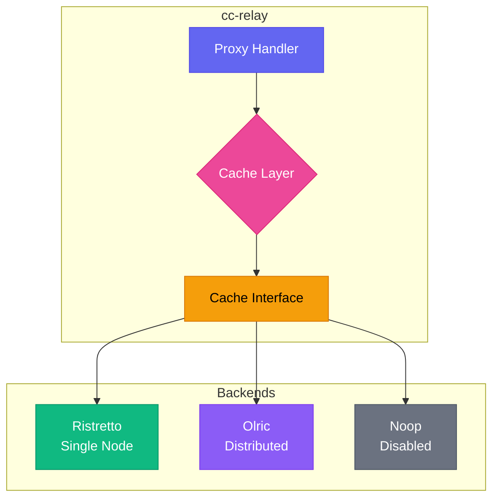
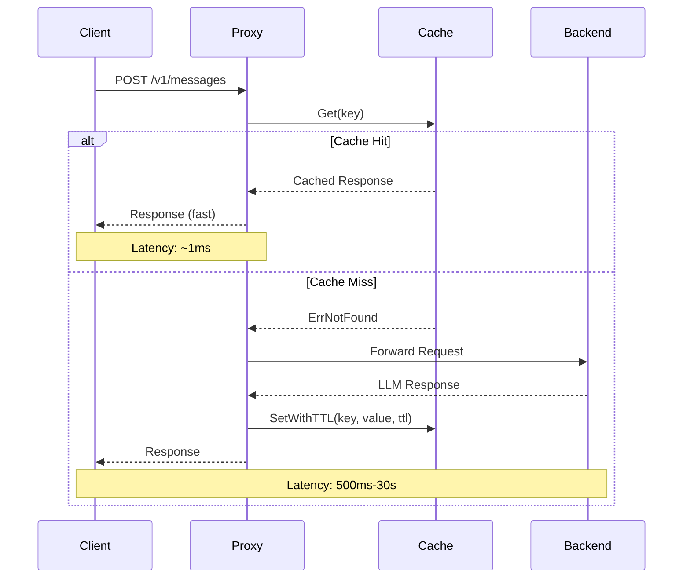

CC-Relay incluye una capa de cache flexible que puede reducir significativamente la latencia y la carga del backend mediante el almacenamiento en cache de respuestas de proveedores LLM.

## Descripcion General

El subsistema de cache soporta tres modos de operacion:

| Modo | Backend | Descripcion |
|------|---------|-------------|
| `single` | Ristretto | Cache de alto rendimiento en memoria local (predeterminado) |
| `ha` | Olric | Cache distribuido para despliegues de alta disponibilidad |
| `disabled` | Noop | Modo de paso directo sin cache |

**Cuando usar cada modo:**

- **Modo Single**: Desarrollo, pruebas o despliegues de produccion de una sola instancia. Proporciona la latencia mas baja sin sobrecarga de red.
- **Modo HA**: Despliegues de produccion multi-instancia donde se requiere consistencia de cache entre nodos.
- **Modo Disabled**: Depuracion, requisitos de cumplimiento o cuando el cache se maneja en otro lugar.

## Arquitectura



La capa de cache implementa una interfaz `Cache` unificada que abstrae todos los backends:

```go
type Cache interface {
    Get(ctx context.Context, key string) ([]byte, error)
    Set(ctx context.Context, key string, value []byte) error
    SetWithTTL(ctx context.Context, key string, value []byte, ttl time.Duration) error
    Delete(ctx context.Context, key string) error
    Exists(ctx context.Context, key string) (bool, error)
    Close() error
}
```

## Flujo del Cache



## Configuracion

### Modo Single (Ristretto)

Ristretto es un cache concurrente de alto rendimiento basado en investigacion de la biblioteca Caffeine. Utiliza la politica de admision TinyLFU para tasas de aciertos optimas.


  
```yaml
cache:
  mode: single

  ristretto:
    # Numero de contadores de acceso de 4 bits
    # Recomendado: 10x el maximo esperado de elementos para una politica de admision optima
    # Ejemplo: Para 100,000 elementos, use 1,000,000 contadores
    num_counters: 1000000

    # Memoria maxima para valores en cache (en bytes)
    # 104857600 = 100 MB
    max_cost: 104857600

    # Numero de claves por buffer de Get (predeterminado: 64)
    # Controla el tamano del buffer de admision
    buffer_items: 64
```
  
  
```toml
[cache]
mode = "single"

[cache.ristretto]
# Number of 4-bit access counters
# Recommended: 10x expected max items for optimal admission policy
# Example: For 100,000 items, use 1,000,000 counters
num_counters = 1000000

# Maximum memory for cached values (in bytes)
# 104857600 = 100 MB
max_cost = 104857600

# Number of keys per Get buffer (default: 64)
# Controls admission buffer size
buffer_items = 64
```
  


**Calculo de memoria:**

El parametro `max_cost` controla cuanta memoria puede usar el cache para valores. Para estimar el tamano apropiado:

1. Estime el tamano promedio de respuesta (tipicamente 1-10 KB para respuestas LLM)
2. Multiplique por el numero de solicitudes unicas que desea almacenar en cache
3. Agregue 20% de sobrecarga para metadatos

Ejemplo: 10,000 respuestas en cache x 5 KB promedio = 50 MB, entonces establezca `max_cost: 52428800`

### Modo HA (Olric)

Olric proporciona cache distribuido con descubrimiento automatico de cluster y replicacion de datos.

**Modo Cliente** (conectando a cluster externo):


  
```yaml
cache:
  mode: ha

  olric:
    # Direcciones de miembros del cluster Olric
    addresses:
      - "olric-1:3320"
      - "olric-2:3320"
      - "olric-3:3320"

    # Nombre del mapa distribuido (predeterminado: "cc-relay")
    dmap_name: "cc-relay"
```
  
  
```toml
[cache]
mode = "ha"

[cache.olric]
# Olric cluster member addresses
addresses = ["olric-1:3320", "olric-2:3320", "olric-3:3320"]

# Distributed map name (default: "cc-relay")
dmap_name = "cc-relay"
```
  


**Modo Embebido** (HA de un solo nodo o desarrollo):


  
```yaml
cache:
  mode: ha

  olric:
    # Ejecutar nodo Olric embebido
    embedded: true

    # Direccion para vincular el nodo embebido
    bind_addr: "0.0.0.0:3320"

    # Direcciones de pares para descubrimiento de cluster (opcional)
    peers:
      - "cc-relay-2:3320"
      - "cc-relay-3:3320"

    dmap_name: "cc-relay"
```
  
  
```toml
[cache]
mode = "ha"

[cache.olric]
# Run embedded Olric node
embedded = true

# Address to bind the embedded node
bind_addr = "0.0.0.0:3320"

# Peer addresses for cluster discovery (optional)
peers = ["cc-relay-2:3320", "cc-relay-3:3320"]

dmap_name = "cc-relay"
```
  


### Modo Disabled


  
```yaml
cache:
  mode: disabled
```
  
  
```toml
[cache]
mode = "disabled"
```
  


Todas las operaciones de cache retornan inmediatamente sin almacenar datos. Las operaciones `Get` siempre retornan `ErrNotFound`.

## Guia de Clustering de Alta Disponibilidad (HA)

Esta seccion cubre el despliegue de cc-relay con cache distribuido en multiples nodos para alta disponibilidad.

### Requisitos Previos

Antes de configurar el modo HA:

1. **Conectividad de red**: Todos los nodos deben poder alcanzarse mutuamente
2. **Accesibilidad de puertos**: Tanto los puertos de Olric como de memberlist deben estar abiertos
3. **Configuracion consistente**: Todos los nodos deben usar el mismo `dmap_name` y `environment`

### Requisitos de Puertos

**Critico:** Olric usa dos puertos:

| Puerto | Proposito | Predeterminado |
|--------|-----------|----------------|
| Puerto de `bind_addr` | Conexiones de cliente Olric | 3320 |
| Puerto de `bind_addr` + 2 | Protocolo gossip de memberlist | 3322 |

**Ejemplo:** Si `bind_addr: "0.0.0.0:3320"`, memberlist automaticamente usa el puerto 3322.

Asegurese de que ambos puertos esten abiertos en los firewalls:

```bash
# Permitir puerto de cliente Olric
sudo ufw allow 3320/tcp

# Permitir puerto gossip de memberlist (puerto bind_addr + 2)
sudo ufw allow 3322/tcp
```

### Configuracion de Entorno

| Configuracion | Intervalo Gossip | Intervalo Probe | Timeout Probe | Uso |
|---------------|------------------|-----------------|---------------|-----|
| `local` | 100ms | 100ms | 200ms | Mismo host, desarrollo |
| `lan` | 200ms | 1s | 500ms | Mismo centro de datos |
| `wan` | 500ms | 3s | 2s | Entre centros de datos |

**Todos los nodos en un cluster deben usar la misma configuracion de entorno.**

### Ejemplo de Cluster de Dos Nodos

**Nodo 1 (cc-relay-1):**


  
```yaml
cache:
  mode: ha
  olric:
    embedded: true
    bind_addr: "0.0.0.0:3320"
    dmap_name: "cc-relay"
    environment: lan
    peers:
      - "cc-relay-2:3322"  # Puerto memberlist del nodo 2
    replica_count: 2
    read_quorum: 1
    write_quorum: 1
    member_count_quorum: 2
    leave_timeout: 5s
```
  
  
```toml
[cache]
mode = "ha"

[cache.olric]
embedded = true
bind_addr = "0.0.0.0:3320"
dmap_name = "cc-relay"
environment = "lan"
peers = ["cc-relay-2:3322"]  # Memberlist port of node 2
replica_count = 2
read_quorum = 1
write_quorum = 1
member_count_quorum = 2
leave_timeout = "5s"
```
  


**Nodo 2 (cc-relay-2):**


  
```yaml
cache:
  mode: ha
  olric:
    embedded: true
    bind_addr: "0.0.0.0:3320"
    dmap_name: "cc-relay"
    environment: lan
    peers:
      - "cc-relay-1:3322"  # Puerto memberlist del nodo 1
    replica_count: 2
    read_quorum: 1
    write_quorum: 1
    member_count_quorum: 2
    leave_timeout: 5s
```
  
  
```toml
[cache]
mode = "ha"

[cache.olric]
embedded = true
bind_addr = "0.0.0.0:3320"
dmap_name = "cc-relay"
environment = "lan"
peers = ["cc-relay-1:3322"]  # Memberlist port of node 1
replica_count = 2
read_quorum = 1
write_quorum = 1
member_count_quorum = 2
leave_timeout = "5s"
```
  


### Ejemplo de Docker Compose de Tres Nodos


  
```yaml
version: '3.8'

services:
  cc-relay-1:
    image: cc-relay:latest
    environment:
      - CC_RELAY_CONFIG=/config/config.yaml
    volumes:
      - ./config-node1.yaml:/config/config.yaml:ro
    ports:
      - "8787:8787"   # Proxy HTTP
      - "3320:3320"   # Puerto cliente Olric
      - "3322:3322"   # Puerto gossip memberlist
    networks:
      - cc-relay-net

  cc-relay-2:
    image: cc-relay:latest
    environment:
      - CC_RELAY_CONFIG=/config/config.yaml
    volumes:
      - ./config-node2.yaml:/config/config.yaml:ro
    ports:
      - "8788:8787"
      - "3330:3320"
      - "3332:3322"
    networks:
      - cc-relay-net

  cc-relay-3:
    image: cc-relay:latest
    environment:
      - CC_RELAY_CONFIG=/config/config.yaml
    volumes:
      - ./config-node3.yaml:/config/config.yaml:ro
    ports:
      - "8789:8787"
      - "3340:3320"
      - "3342:3322"
    networks:
      - cc-relay-net

networks:
  cc-relay-net:
    driver: bridge
```
  
  
```toml
# Docker Compose uses YAML format for the compose file itself.
# This tab shows the cc-relay config file (config-node1.toml):

[cache]
mode = "ha"

[cache.olric]
embedded = true
bind_addr = "0.0.0.0:3320"
dmap_name = "cc-relay"
environment = "lan"
peers = ["cc-relay-2:3322", "cc-relay-3:3322"]
replica_count = 2
read_quorum = 1
write_quorum = 1
member_count_quorum = 2
leave_timeout = "5s"
```
  


**config-node1.yaml:**


  
```yaml
cache:
  mode: ha
  olric:
    embedded: true
    bind_addr: "0.0.0.0:3320"
    dmap_name: "cc-relay"
    environment: lan
    peers:
      - "cc-relay-2:3322"
      - "cc-relay-3:3322"
    replica_count: 2
    read_quorum: 1
    write_quorum: 1
    member_count_quorum: 2
    leave_timeout: 5s
```
  
  
```toml
[cache]
mode = "ha"

[cache.olric]
embedded = true
bind_addr = "0.0.0.0:3320"
dmap_name = "cc-relay"
environment = "lan"
peers = ["cc-relay-2:3322", "cc-relay-3:3322"]
replica_count = 2
read_quorum = 1
write_quorum = 1
member_count_quorum = 2
leave_timeout = "5s"
```
  


**config-node2.yaml y config-node3.yaml:** Identicos a node1, pero con diferentes listas de peers apuntando a los otros nodos.

### Replicacion y Quorum Explicados

**replica_count:** Numero de copias de cada clave almacenadas en el cluster.

| replica_count | Comportamiento |
|---------------|----------------|
| 1 | Sin replicacion (copia unica) |
| 2 | Un primario + un respaldo |
| 3 | Un primario + dos respaldos |

**read_quorum / write_quorum:** Minimo de operaciones exitosas antes de retornar exito.

| Configuracion | Consistencia | Disponibilidad |
|---------------|--------------|----------------|
| quorum = 1 | Eventual | Alta |
| quorum = replica_count | Fuerte | Menor |
| quorum = (replica_count/2)+1 | Mayoria | Balanceada |

**Recomendaciones:**

| Tamano Cluster | replica_count | read_quorum | write_quorum | Tolerancia a Fallos |
|----------------|---------------|-------------|--------------|---------------------|
| 2 nodos | 2 | 1 | 1 | 1 fallo de nodo |
| 3 nodos | 2 | 1 | 1 | 1 fallo de nodo |
| 3 nodos | 3 | 2 | 2 | 1 fallo de nodo (consistencia fuerte) |

## Comparacion de Modos de Cache

| Caracteristica | Single (Ristretto) | HA (Olric) | Disabled (Noop) |
|----------------|-------------------|------------|-----------------|
| **Backend** | Memoria local | Distribuido | Ninguno |
| **Caso de uso** | Desarrollo, instancia unica | Produccion HA | Depuracion |
| **Persistencia** | No | Opcional | N/A |
| **Multi-nodo** | No | Si | N/A |
| **Latencia** | ~1 microsegundo | ~1-10 ms (red) | ~0 |
| **Memoria** | Solo local | Distribuida | Ninguna |
| **Consistencia** | N/A | Eventual | N/A |
| **Complejidad** | Baja | Media | Ninguna |

## Interfaces Opcionales

Algunos backends de cache soportan capacidades adicionales via interfaces opcionales:

### Estadisticas

```go
if sp, ok := cache.(cache.StatsProvider); ok {
    stats := sp.Stats()
    fmt.Printf("Hits: %d, Misses: %d\n", stats.Hits, stats.Misses)
}
```

Las estadisticas incluyen:
- `Hits`: Numero de aciertos de cache
- `Misses`: Numero de fallos de cache
- `KeyCount`: Numero actual de claves
- `BytesUsed`: Memoria aproximada utilizada
- `Evictions`: Claves expulsadas por capacidad

### Verificacion de Salud (Ping)

```go
if p, ok := cache.(cache.Pinger); ok {
    if err := p.Ping(ctx); err != nil {
        // El cache no esta saludable
    }
}
```

La interfaz `Pinger` es principalmente util para caches distribuidos (Olric) para verificar la conectividad del cluster.

### Operaciones por Lotes

```go
// Get por lotes
if mg, ok := cache.(cache.MultiGetter); ok {
    results, err := mg.GetMulti(ctx, []string{"key1", "key2", "key3"})
}

// Set por lotes
if ms, ok := cache.(cache.MultiSetter); ok {
    err := ms.SetMultiWithTTL(ctx, items, 5*time.Minute)
}
```

## Consejos de Rendimiento

### Optimizando Ristretto

1. **Establecer `num_counters` apropiadamente**: Use 10x su maximo esperado de elementos. Muy bajo reduce la tasa de aciertos; muy alto desperdicia memoria.

2. **Dimensionar `max_cost` segun tamanos de respuesta**: Las respuestas LLM varian ampliamente. Monitoree el uso real y ajuste.

3. **Usar TTL sabiamente**: TTLs cortos (1-5 min) para contenido dinamico, TTLs mas largos (1 hora+) para respuestas deterministicas.

4. **Monitorear metricas**: Rastree la tasa de aciertos para validar la efectividad del cache:
   ```
   hit_rate = hits / (hits + misses)
   ```
   Apunte a >80% de tasa de aciertos para un cache efectivo.

### Optimizando Olric

1. **Desplegar cerca de instancias cc-relay**: La latencia de red domina el rendimiento del cache distribuido.

2. **Usar modo embebido para despliegues de un solo nodo**: Evita dependencias externas mientras mantiene la configuracion lista para HA.

3. **Dimensionar el cluster apropiadamente**: Cada nodo debe tener suficiente memoria para el conjunto de datos completo (Olric replica datos).

4. **Monitorear la salud del cluster**: Use la interfaz `Pinger` en verificaciones de salud.

### Consejos Generales

1. **Diseno de claves de cache**: Use claves deterministicas basadas en el contenido de la solicitud. Incluya nombre del modelo, hash del prompt y parametros relevantes.

2. **Evitar almacenar respuestas streaming en cache**: Las respuestas SSE streaming no se almacenan en cache por defecto debido a su naturaleza incremental.

3. **Considerar precalentamiento de cache**: Para cargas de trabajo predecibles, pre-poblar el cache con consultas comunes.

## Solucion de Problemas

### Fallos de cache cuando se esperaban aciertos

1. **Verificar generacion de claves**: Asegurese de que las claves de cache sean deterministicas y no incluyan timestamps o IDs de solicitud.

2. **Verificar configuracion de TTL**: Los elementos pueden haber expirado. Verifique si el TTL es muy corto para su caso de uso.

3. **Monitorear expulsiones**: Conteos altos de expulsion indican que `max_cost` es muy bajo:
   ```go
   stats := cache.Stats()
   if stats.Evictions > 0 {
       // Considere aumentar max_cost
   }
   ```

### Ristretto no almacena elementos

Ristretto usa una politica de admision que puede rechazar elementos para mantener altas tasas de aciertos. Este es un comportamiento normal:

1. **Nuevos elementos pueden ser rechazados**: TinyLFU requiere que los elementos "demuestren" su valor a traves de acceso repetido.

2. **Esperar el vaciado del buffer**: Ristretto almacena en buffer las escrituras. Llame `cache.Wait()` en pruebas para asegurar que las escrituras se procesen.

3. **Verificar calculo de costo**: Elementos con costo > `max_cost` nunca se almacenan.

### Problemas de conectividad del cluster Olric

1. **Verificar conectividad de red**: Asegurese de que todos los nodos puedan alcanzarse mutuamente en el puerto 3320 (o puerto configurado).

2. **Verificar reglas de firewall**: Olric requiere comunicacion bidireccional entre nodos.

3. **Validar direcciones**: En modo cliente, asegurese de que al menos una direccion en la lista sea alcanzable.

4. **Monitorear logs**: Habilite logging de depuracion para ver eventos de membresia del cluster:


  
```yaml
logging:
  level: debug
```
  
  
```toml
[logging]
level = "debug"
```
  


### Presion de Memoria

1. **Reducir `max_cost`**: Disminuya el tamano del cache para reducir el uso de memoria.

2. **Usar TTLs mas cortos**: Expirar elementos mas rapido para liberar memoria.

3. **Cambiar a Olric**: Distribuir la presion de memoria entre multiples nodos.

4. **Monitorear con metricas**: Rastree `BytesUsed` para entender el consumo real de memoria.

### Los Nodos No Pueden Unirse al Cluster

**Sintoma:** Los nodos inician pero no se descubren entre si.

**Causas y Soluciones:**

1. **Puerto de peer incorrecto:** Los peers deben usar el puerto memberlist (bind_addr + 2), no el puerto Olric.


  
```yaml
# Incorrecto
peers:
  - "other-node:3320"  # Este es el puerto Olric

# Correcto
peers:
  - "other-node:3322"  # Puerto memberlist = 3320 + 2
```
  
  
```toml
# Wrong
peers = ["other-node:3320"]  # This is the Olric port

# Correct
peers = ["other-node:3322"]  # Memberlist port = 3320 + 2
```
  


2. **Firewall bloqueando:** Asegurese de que ambos puertos Olric y memberlist esten abiertos.
   ```bash
   # Verificar conectividad
   nc -zv other-node 3320  # Puerto Olric
   nc -zv other-node 3322  # Puerto memberlist
   ```

3. **Resolucion DNS:** Verifique que los nombres de host se resuelvan correctamente.
   ```bash
   getent hosts other-node
   ```

4. **Desajuste de entorno:** Todos los nodos deben usar la misma configuracion de `environment`.

### Errores de Quorum

**Sintoma:** "not enough members" u operaciones fallan a pesar de que los nodos estan activos.

**Solucion:** Asegurese de que `member_count_quorum` sea menor o igual al numero de nodos realmente en ejecucion.


  
```yaml
# Para cluster de 2 nodos
member_count_quorum: 2  # Requiere ambos nodos

# Para cluster de 3 nodos con tolerancia a 1 fallo
member_count_quorum: 2  # Permite que 1 nodo este caido
```
  
  
```toml
# For 2-node cluster
member_count_quorum = 2  # Requires both nodes

# For 3-node cluster with 1-node fault tolerance
member_count_quorum = 2  # Allows 1 node to be down
```
  


### Datos No Replicados

**Sintoma:** Los datos desaparecen cuando un nodo cae.

**Solucion:** Asegurese de que `replica_count` > 1 y tenga suficientes nodos.


  
```yaml
replica_count: 2          # Almacenar 2 copias
member_count_quorum: 2    # Necesita 2 nodos para escribir
```
  
  
```toml
replica_count = 2          # Store 2 copies
member_count_quorum = 2    # Need 2 nodes to write
```
  


## Manejo de Errores

El paquete de cache define errores estandar para condiciones comunes:

```go
import "github.com/anthropics/cc-relay/internal/cache"

data, err := c.Get(ctx, key)
switch {
case errors.Is(err, cache.ErrNotFound):
    // Fallo de cache - obtener del backend
case errors.Is(err, cache.ErrClosed):
    // Cache fue cerrado - recrear o fallar
case err != nil:
    // Otro error (red, serializacion, etc.)
}
```

## Siguientes Pasos

- [Referencia de configuracion](/es/docs/configuration/)
- [Vision general de la arquitectura](/es/docs/architecture/)
- [Documentacion de API](/es/docs/api/)
