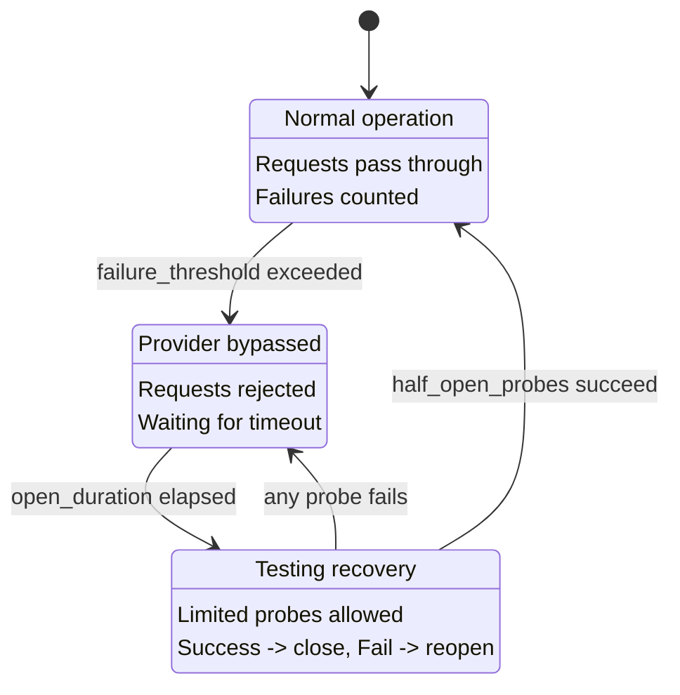

CC-Relay incluye un sistema de circuit breaker que detecta automaticamente proveedores con fallas y los excluye temporalmente del routing. Esto previene fallas en cascada y permite a los proveedores tiempo para recuperarse antes de recibir nuevas solicitudes.

## Descripcion General

El circuit breaker rastrea fallas por proveedor y transiciona a traves de tres estados:

| Estado | Descripcion | Comportamiento |
|--------|-------------|----------------|
| CLOSED | Operacion normal | Las solicitudes pasan, se cuentan las fallas |
| OPEN | Proveedor omitido | Solicitudes rechazadas, esperando recuperacion |
| HALF-OPEN | Probando recuperacion | Pruebas limitadas permitidas, el exito cierra |

## Estados del Circuit Breaker

El circuit breaker implementa una maquina de estados que protege su sistema de golpear repetidamente proveedores con fallas:



### Transiciones de Estado

**CLOSED a OPEN:** Cuando un proveedor acumula `failure_threshold` fallas consecutivas, el circuito se abre. Esto detiene inmediatamente el routing de solicitudes a ese proveedor.

**OPEN a HALF-OPEN:** Despues de que transcurre `open_duration_ms`, el circuito transiciona a medio abierto. Esto permite solicitudes de prueba limitadas para verificar si el proveedor se ha recuperado.

**HALF-OPEN a CLOSED:** Si `half_open_probes` solicitudes consecutivas tienen exito, el circuito se cierra y se reanuda la operacion normal.

**HALF-OPEN a OPEN:** Si cualquier solicitud de prueba falla mientras esta en estado medio abierto, el circuito se reabre inmediatamente y el timeout reinicia.

## Configuracion

Configure el rastreo de salud en su `config.yaml`:

```yaml
health:
  # Configuracion de health check
  health_check:
    # Habilitar health checks periodicos (predeterminado: true)
    enabled: true
    # Intervalo de verificacion en milisegundos (predeterminado: 10000 = 10s)
    interval_ms: 10000

  # Configuracion del circuit breaker
  circuit_breaker:
    # Fallas consecutivas antes de abrir el circuito (predeterminado: 5)
    failure_threshold: 5

    # Tiempo que el circuito permanece abierto antes de medio abierto, en milisegundos (predeterminado: 30000 = 30s)
    open_duration_ms: 30000

    # Pruebas permitidas en estado medio abierto (predeterminado: 3)
    half_open_probes: 3
```

**Nota:** El `example.yaml` muestra una estructura ligeramente diferente con `recovery_timeout_seconds` y `triggers`. La implementacion real usa `open_duration_ms` y `half_open_probes` como se muestra arriba.

## Referencia de Configuracion

| Opcion | Predeterminado | Descripcion |
|--------|----------------|-------------|
| `health_check.enabled` | `true` | Habilitar health checks periodicos para circuitos abiertos |
| `health_check.interval_ms` | `10000` | Milisegundos entre pruebas de health check |
| `circuit_breaker.failure_threshold` | `5` | Fallas consecutivas antes de abrir el circuito |
| `circuit_breaker.open_duration_ms` | `30000` | Milisegundos que el circuito permanece abierto antes de medio abierto |
| `circuit_breaker.half_open_probes` | `3` | Pruebas exitosas necesarias para cerrar el circuito |

## Como Funciona

### Conteo de Fallas

El circuit breaker cuenta fallas consecutivas. Cuando se alcanza `failure_threshold`, el circuito se abre.

**Que cuenta como una falla:**

| Tipo de Error | Codigo de Estado | Cuenta como Falla? |
|---------------|-----------------|-------------------|
| Rate Limited | `429` | Si |
| Internal Server Error | `500` | Si |
| Bad Gateway | `502` | Si |
| Service Unavailable | `503` | Si |
| Gateway Timeout | `504` | Si |
| Request Timeout | (timeout) | Si |
| Network Error | (conexion fallida) | Si |

**Que NO cuenta como una falla:**

| Tipo de Error | Codigo de Estado | Cuenta como Falla? |
|---------------|-----------------|-------------------|
| Bad Request | `400` | No |
| Unauthorized | `401` | No |
| Forbidden | `403` | No |
| Not Found | `404` | No |
| Otros 4xx | (excepto 429) | No |

Los errores de cliente (4xx excepto 429) indican problemas con la solicitud misma, no con la salud del proveedor, por lo que no afectan el estado del circuit breaker.

### El Exito Reinicia

Cuando una solicitud tiene exito, el contador de fallas se reinicia a cero. Esto significa que las fallas ocasionales no activaran el circuit breaker mientras haya exitos intercalados.

### Pruebas de Health Check

Cuando un circuito esta en estado OPEN, cc-relay ejecuta health checks periodicos para detectar la recuperacion mas rapido que esperando el timeout completo:

1. Los health checks se ejecutan cada `health_check.interval_ms` milisegundos
2. Las verificaciones solo apuntan a proveedores con circuitos OPEN (no CLOSED o HALF-OPEN)
3. Un health check exitoso transiciona el circuito a HALF-OPEN
4. Los health checks usan pruebas de conectividad HTTP livianas, no llamadas API completas

## Integracion con Routing

El circuit breaker se integra con todas las estrategias de routing:

### Exclusion de Proveedor

Los proveedores con circuitos OPEN son automaticamente excluidos de las decisiones de routing:

- **Estrategia Failover:** Salta al siguiente proveedor en la cadena de prioridad
- **Round-robin:** Excluido de la rotacion
- **Weighted round-robin:** El peso efectivamente se convierte en cero
- **Shuffle:** Excluido del mazo

### Recuperacion Automatica

La recuperacion es completamente automatica:

1. El proveedor comienza a fallar (rate limited, errores, timeouts)
2. Despues de `failure_threshold` fallas, el circuito se abre
3. Las solicitudes se dirigen a otros proveedores saludables
4. Despues de `open_duration_ms`, el circuito se vuelve medio abierto
5. Solicitudes de prueba limitadas prueban el proveedor
6. Si las pruebas tienen exito, el circuito se cierra y el proveedor vuelve a la rotacion

No se requiere intervencion manual para la recuperacion.

## Cabeceras de Depuracion

Cuando `routing.debug: true` esta habilitado, cc-relay incluye el estado de salud en las cabeceras de respuesta:

| Cabecera | Valor | Cuando |
|----------|-------|--------|
| `X-CC-Relay-Provider` | Nombre del proveedor | Siempre (cuando debug esta habilitado) |
| `X-CC-Relay-Strategy` | Estrategia usada | Siempre (cuando debug esta habilitado) |

Para habilitar cabeceras de depuracion:

```yaml
routing:
  strategy: failover
  debug: true  # Habilitar cabeceras de diagnostico
```

**Advertencia de Seguridad:** Las cabeceras de depuracion exponen decisiones internas de routing. Use solo en desarrollo o entornos confiables. Nunca habilite en produccion con clientes no confiables.

## Solucion de Problemas

### El proveedor sigue siendo omitido

**Sintoma:** El circuito de un proveedor sigue abriendose aunque el proveedor parece saludable.

**Posibles causas:**

1. **`failure_threshold` muy bajo:** Incremente para tolerar mas fallas transitorias
   ```yaml
   circuit_breaker:
     failure_threshold: 10  # Mas tolerante
   ```

2. **Rate limits activando aperturas:** Si esta alcanzando rate limits, agregue mas claves API a su pool en lugar de ajustar el circuit breaker

3. **Respuestas lentas causando timeouts:** Incremente el timeout del servidor
   ```yaml
   server:
     timeout_ms: 300000  # 5 minutos
   ```

### La recuperacion toma demasiado tiempo

**Sintoma:** El proveedor se recupero pero el circuito permanece abierto por mucho tiempo.

**Soluciones:**

1. **Reducir duracion abierta:**
   ```yaml
   circuit_breaker:
     open_duration_ms: 15000  # 15 segundos en lugar de 30
   ```

2. **Habilitar health checks mas rapidos:**
   ```yaml
   health_check:
     enabled: true
     interval_ms: 5000  # Verificar cada 5 segundos
   ```

### El circuito se abre con errores validos

**Sintoma:** El circuito se abre cuando el proveedor devuelve errores de cliente (400, 401).

**Esto no deberia pasar.** Los errores de cliente (4xx excepto 429) no cuentan como fallas. Si esta viendo esto:

1. Verifique si la respuesta real es 429 (rate limited)
2. Verifique que el error no sea realmente un 5xx mal reportado
3. Habilite el registro de depuracion para ver los codigos de respuesta reales:
   ```yaml
   logging:
     level: debug
   ```

### Todos los proveedores no saludables

**Sintoma:** Todos los circuitos abiertos, las solicitudes fallan completamente.

**Posibles causas:**

1. **Problema de conectividad de red:** Verifique que cc-relay pueda alcanzar todos los proveedores
2. **Claves API invalidas:** Verifique que las claves sean validas (aunque 401 no deberia activar aperturas)
3. **Interrupcion global:** Todos los proveedores estan genuinamente no disponibles

**Mitigacion inmediata:**

- Incremente `failure_threshold` para mantener los circuitos cerrados mas tiempo
- Disminuya `open_duration_ms` para intentos de recuperacion mas rapidos

## Proximos Pasos

- [Referencia de configuracion](/es/docs/configuration/) - Opciones de configuracion completas
- [Estrategias de routing](/es/docs/routing/) - Como se seleccionan los proveedores
- [Vision general de la arquitectura](/es/docs/architecture/) - Internos del sistema
