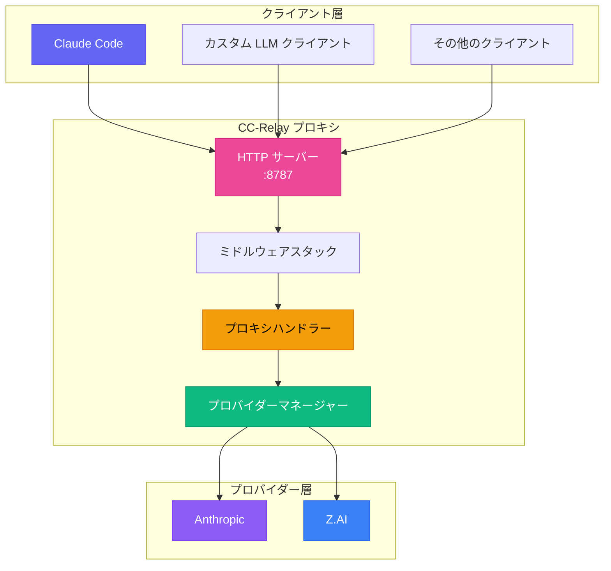
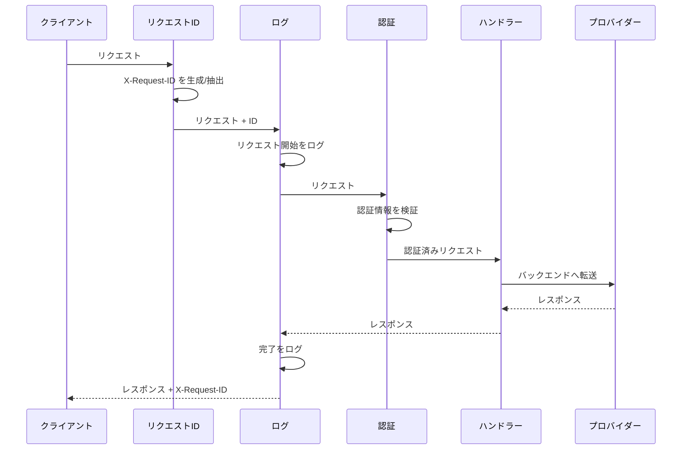
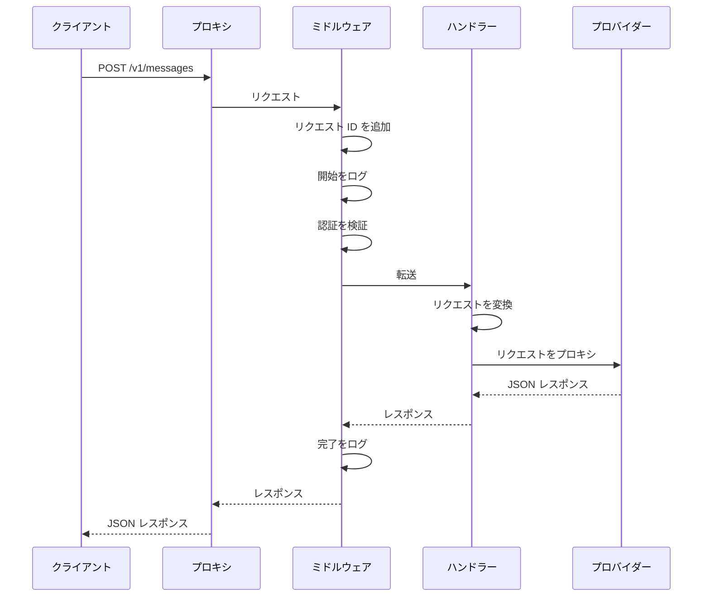
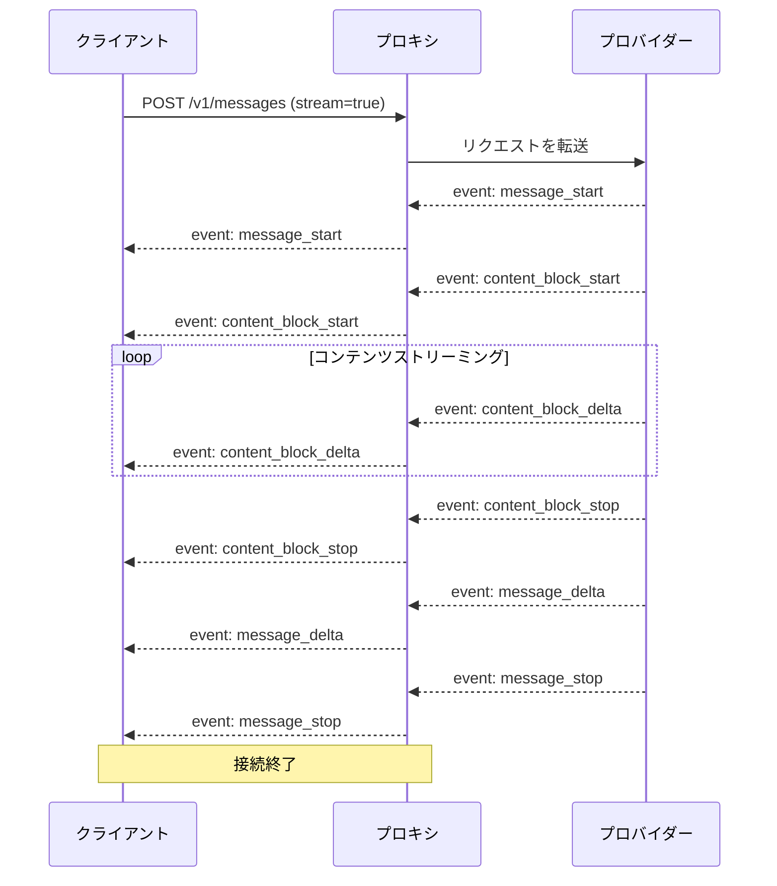
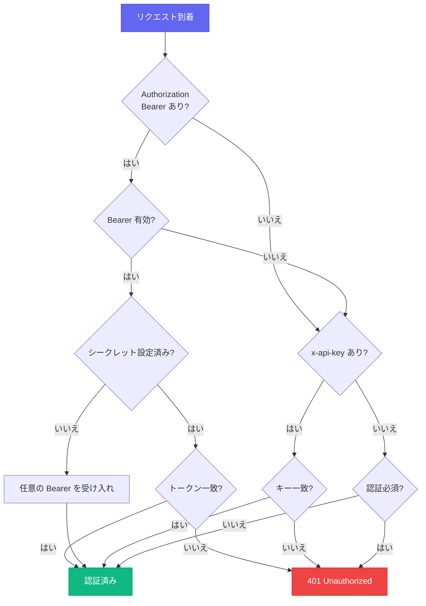

CC-Relay は、LLM クライアント（Claude Code など）とバックエンドプロバイダーの間に位置する高性能なマルチプロバイダー HTTP プロキシとして設計されています。

## システム概要



## コアコンポーネント

### 1. HTTP プロキシサーバー

**場所**: `internal/proxy/`

HTTP サーバーは Claude Code との完全な互換性を持つ Anthropic Messages API（`/v1/messages`）を実装しています。

**機能:**
- 適切なイベントシーケンスを持つ SSE ストリーミング
- リクエストの検証と変換
- ミドルウェアチェーン（リクエスト ID、ログ、認証）
- タイムアウトとキャンセルのためのコンテキスト伝播
- 同時リクエストのための HTTP/2 サポート

**エンドポイント:**

| エンドポイント | メソッド | 説明 |
|--------------|--------|------|
| `/v1/messages` | POST | バックエンドプロバイダーへのリクエストをプロキシ |
| `/v1/models` | GET | すべてのプロバイダーから利用可能なモデルを一覧 |
| `/v1/providers` | GET | メタデータ付きのアクティブプロバイダーを一覧 |
| `/health` | GET | ヘルスチェックエンドポイント |

### 2. ミドルウェアスタック

**場所**: `internal/proxy/middleware.go`

ミドルウェアチェーンは順番にリクエストを処理します：



**ミドルウェアコンポーネント:**

| ミドルウェア | 目的 |
|------------|------|
| `RequestIDMiddleware` | トレース用の X-Request-ID を生成/抽出 |
| `LoggingMiddleware` | タイミング付きでリクエスト/レスポンスをログ |
| `AuthMiddleware` | x-api-key ヘッダーを検証 |
| `MultiAuthMiddleware` | API キーと Bearer トークン認証をサポート |

### 3. プロバイダーマネージャー

**場所**: `internal/providers/`

各プロバイダーは `Provider` インターフェースを実装します：

```go
type Provider interface {
    // Name はプロバイダー識別子を返す
    Name() string

    // BaseURL はバックエンド API の Base URL を返す
    BaseURL() string

    // Owner はオーナー識別子を返す（例: "anthropic", "zhipu"）
    Owner() string

    // Authenticate はプロバイダー固有の認証を追加
    Authenticate(req *http.Request, key string) error

    // ForwardHeaders はバックエンドに転送するヘッダーを返す
    ForwardHeaders(originalHeaders http.Header) http.Header

    // SupportsStreaming はプロバイダーが SSE をサポートするか示す
    SupportsStreaming() bool

    // ListModels は利用可能なモデルを返す
    ListModels() []Model
}
```

**実装済みプロバイダー:**

| プロバイダー | タイプ | 説明 |
|------------|-------|------|
| `AnthropicProvider` | `anthropic` | Anthropic ダイレクト API |
| `ZAIProvider` | `zai` | Z.AI/Zhipu GLM（Anthropic 互換） |

### 4. プロキシハンドラー

**場所**: `internal/proxy/handler.go`

プロキシハンドラーは効率的なリクエスト転送のために Go の `httputil.ReverseProxy` を使用します：

```go
type Handler struct {
    provider  providers.Provider
    proxy     *httputil.ReverseProxy
    apiKey    string
    debugOpts config.DebugOptions
}
```

**主な機能:**
- SSE ストリーミング用の即時フラッシュ（`FlushInterval: -1`）
- プロバイダー固有の認証
- `anthropic-*` ヘッダーの転送
- Anthropic 形式のレスポンスによるエラーハンドリング

### 5. 設定マネージャー

**場所**: `internal/config/`

**機能:**
- 環境変数展開を含む YAML パース
- プロバイダーとサーバー設定の検証
- 複数の認証方法のサポート

## リクエストフロー

### 非ストリーミングリクエスト



### ストリーミングリクエスト（SSE）



## SSE ストリーミング

CC-Relay は Claude Code 互換性のために正確な SSE イベント順序を保持します：

**必須ヘッダー:**
```
Content-Type: text/event-stream
Cache-Control: no-cache, no-transform
X-Accel-Buffering: no
Connection: keep-alive
```

**イベントシーケンス:**
1. `message_start` - メッセージメタデータ
2. `content_block_start` - コンテンツブロック開始
3. `content_block_delta` - コンテンツチャンク（繰り返し）
4. `content_block_stop` - コンテンツブロック終了
5. `message_delta` - 使用量情報
6. `message_stop` - メッセージ完了

`X-Accel-Buffering: no` ヘッダーは、nginx/Cloudflare が SSE イベントをバッファリングするのを防ぐために重要です。

## 認証フロー



## API 互換性

### Anthropic API 形式

CC-Relay は Anthropic Messages API との完全な互換性を実装しています：

**エンドポイント**: `POST /v1/messages`

**ヘッダー**:
- `x-api-key`: API キー（CC-Relay で管理）
- `anthropic-version`: API バージョン（例: `2023-06-01`）
- `content-type`: `application/json`

**リクエストボディ**:
```json
{
  "model": "claude-sonnet-4-5-20250514",
  "max_tokens": 1024,
  "messages": [
    {"role": "user", "content": "Hello!"}
  ],
  "stream": true
}
```

### プロバイダー変換

現在サポートされている両プロバイダー（Anthropic と Z.AI）は同じ Anthropic 互換 API 形式を使用します：

| プロバイダー | 変換 |
|------------|------|
| **Anthropic** | なし（ネイティブ形式） |
| **Z.AI** | モデル名マッピングのみ |

## パフォーマンスに関する考慮事項

### 接続処理

CC-Relay は最適化された設定で Go 標準ライブラリの HTTP クライアントを使用します：

- **コネクションプーリング**: バックエンドへの HTTP 接続を再利用
- **HTTP/2 サポート**: 多重化リクエスト用のオプション h2c
- **即時フラッシュ**: SSE イベントは即座にフラッシュ

### 並行性

- **リクエストごとの goroutine**: 軽量な並行処理モデル
- **コンテキスト伝播**: 適切なタイムアウトとキャンセル処理
- **スレッドセーフなログ**: 構造化ログに zerolog を使用

### メモリ管理

- **ストリーミングレスポンス**: レスポンスボディのバッファリングなし
- **リクエストボディ制限**: 設定可能な最大ボディサイズ
- **グレースフルシャットダウン**: 進行中リクエストに 30 秒のタイムアウト

## ディレクトリ構造

```
cc-relay/
├── cmd/cc-relay/        # CLI エントリーポイント
│   ├── main.go          # ルートコマンド
│   ├── serve.go         # Serve コマンド
│   ├── status.go        # Status コマンド
│   ├── version.go       # Version コマンド
│   ├── config.go        # Config コマンド
│   ├── config_init.go   # Config init サブコマンド
│   ├── config_cc.go     # Config cc サブコマンド
│   ├── config_cc_init.go    # Claude Code 設定
│   └── config_cc_remove.go  # CC 設定削除
├── internal/
│   ├── config/          # 設定読み込み
│   │   ├── config.go    # 設定構造体
│   │   └── loader.go    # YAML/env 読み込み
│   ├── providers/       # プロバイダー実装
│   │   ├── provider.go  # Provider インターフェース
│   │   ├── base.go      # ベースプロバイダー
│   │   ├── anthropic.go # Anthropic プロバイダー
│   │   └── zai.go       # Z.AI プロバイダー
│   ├── proxy/           # HTTP プロキシサーバー
│   │   ├── server.go    # サーバーセットアップ
│   │   ├── routes.go    # ルート登録
│   │   ├── handler.go   # プロキシハンドラー
│   │   ├── middleware.go # ミドルウェアチェーン
│   │   ├── sse.go       # SSE ユーティリティ
│   │   ├── errors.go    # エラーレスポンス
│   │   └── logger.go    # ログセットアップ
│   ├── auth/            # 認証
│   │   ├── auth.go      # Auth インターフェース
│   │   ├── apikey.go    # API キー認証
│   │   ├── oauth.go     # Bearer トークン認証
│   │   └── chain.go     # 認証チェーン
│   └── version/         # バージョン情報
└── config.yaml          # 設定例
```

## 将来のアーキテクチャ

以下の機能は将来のリリースで予定されています：

- **Router コンポーネント**: インテリジェントなルーティング戦略（ラウンドロビン、フェイルオーバー、コストベース）
- **Rate Limiter**: API キーごとのトークンバケットレート制限
- **Health Tracker**: 自動回復を備えたサーキットブレーカー
- **gRPC 管理 API**: リアルタイム統計と設定
- **TUI ダッシュボード**: ターミナルベースの監視インターフェース
- **追加プロバイダー**: Ollama、AWS Bedrock、Azure、Vertex AI

## 次のステップ

- [設定リファレンス](/ja/docs/configuration/)
- [API ドキュメント](/ja/docs/api/)
