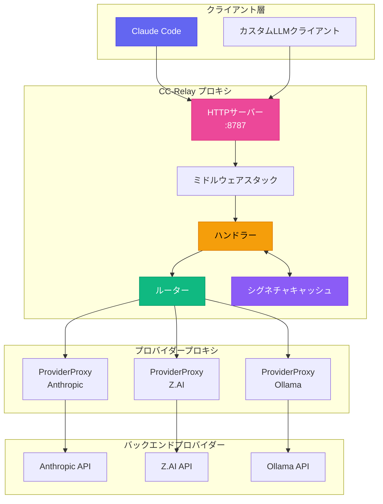

CC-Relayは、LLMアプリケーション向けに設計された高性能なマルチプロバイダーHTTPプロキシです。インテリジェントなルーティング、思考シグネチャのキャッシュ、プロバイダー間のシームレスなフェイルオーバーを提供します。

## システム概要



## コアコンポーネント

### 1. ハンドラー

**場所**: `internal/proxy/handler.go`

ハンドラーはリクエスト処理の中央コーディネーターです：

```go
type Handler struct {
    providerProxies map[string]*ProviderProxy  // プロバイダーごとのリバースプロキシ
    defaultProvider providers.Provider          // シングルプロバイダーモードのフォールバック
    router          router.ProviderRouter       // ルーティング戦略の実装
    healthTracker   *health.Tracker             // サーキットブレーカートラッキング
    signatureCache  *SignatureCache             // 思考シグネチャキャッシュ
    routingConfig   *config.RoutingConfig       // モデルベースルーティング設定
    providers       []router.ProviderInfo       // 利用可能なプロバイダー
}
```

**責務:**
- リクエストボディからモデル名を抽出
- プロバイダーアフィニティのための思考シグネチャを検出
- ルーター経由でプロバイダーを選択
- 適切なProviderProxyに委譲
- 思考ブロックを処理しシグネチャをキャッシュ

### 2. ProviderProxy

**場所**: `internal/proxy/provider_proxy.go`

各プロバイダーは、事前設定されたURLと認証を持つ専用のリバースプロキシを取得します：

```go
type ProviderProxy struct {
    Provider           providers.Provider
    Proxy              *httputil.ReverseProxy
    KeyPool            *keypool.KeyPool  // マルチキーローテーション用
    APIKey             string            // フォールバック単一キー
    targetURL          *url.URL          // プロバイダーのベースURL
    modifyResponseHook ModifyResponseFunc
}
```

**主な機能:**
- URL解析は初期化時に一度だけ実行（リクエストごとではない）
- 透過認証（クライアント資格情報の転送）または設定された認証をサポート
- ストリーミングレスポンス用のSSEヘッダー自動注入
- レート制限分散のためのキープール統合

### 3. ルーター

**場所**: `internal/router/`

ルーターは各リクエストを処理するプロバイダーを選択します：

| 戦略 | 説明 |
|----------|-------------|
| `failover` | 自動リトライ付きの優先度ベース（デフォルト） |
| `round_robin` | 順次ローテーション |
| `weighted_round_robin` | 重み付けに基づく比例配分 |
| `shuffle` | 公平なランダム分散 |
| `model_based` | モデル名プレフィックスによるルーティング |

### 4. シグネチャキャッシュ

**場所**: `internal/proxy/signature_cache.go`

クロスプロバイダー互換性のために思考ブロックシグネチャをキャッシュします：

```go
type SignatureCache struct {
    cache cache.Cache  // Ristrettoベースのキャッシュ
}

// キャッシュキーフォーマット: "sig:{modelGroup}:{textHash}"
// TTL: 3時間（Claude APIに合わせて）
```

## リクエストフロー

### マルチプロバイダールーティング


### 思考シグネチャ処理

拡張思考が有効な場合、プロバイダーは署名された思考ブロックを返します。これらのシグネチャは後続のターンで同じプロバイダーによって検証される必要があります。CC-Relayはキャッシュによってクロスプロバイダーシグネチャの問題を解決します：


**シグネチャ共有のためのモデルグループ:**

| モデルパターン | グループ | シグネチャ共有 |
|--------------|-------|-------------------|
| `claude-*` | `claude` | はい、すべてのClaudeモデル間で |
| `gpt-*` | `gpt` | はい、すべてのGPTモデル間で |
| `gemini-*` | `gemini` | はい、センチネル値を使用 |
| その他 | 正確な名前 | 共有なし |

### SSEストリーミングフロー


**必須SSEヘッダー:**
```text
Content-Type: text/event-stream
Cache-Control: no-cache, no-transform
X-Accel-Buffering: no
Connection: keep-alive
```

## ミドルウェアスタック

**場所**: `internal/proxy/middleware.go`

| ミドルウェア | 目的 |
|------------|---------|
| `RequestIDMiddleware` | トレーシング用のX-Request-IDを生成/抽出 |
| `LoggingMiddleware` | タイミング付きでリクエスト/レスポンスをログ |
| `AuthMiddleware` | x-api-keyヘッダーを検証 |
| `MultiAuthMiddleware` | APIキーとBearerトークン認証をサポート |

## プロバイダーインターフェース

**場所**: `internal/providers/provider.go`

```go
type Provider interface {
    Name() string
    BaseURL() string
    Owner() string
    Authenticate(req *http.Request, key string) error
    ForwardHeaders(originalHeaders http.Header) http.Header
    SupportsStreaming() bool
    SupportsTransparentAuth() bool
    ListModels() []Model
    GetModelMapping() map[string]string
    MapModel(requestModel string) string
}
```

**実装されたプロバイダー:**

| プロバイダー | タイプ | 機能 |
|----------|------|----------|
| `AnthropicProvider` | `anthropic` | ネイティブフォーマット、フル機能サポート |
| `ZAIProvider` | `zai` | Anthropic互換、GLMモデル |
| `OllamaProvider` | `ollama` | ローカルモデル、プロンプトキャッシュなし |

## 認証モード

### 透過認証
クライアントが資格情報を提供し、プロバイダーがサポートしている場合：
- クライアントの`Authorization`または`x-api-key`ヘッダーがそのまま転送される
- CC-Relayは純粋なプロキシとして動作

### 設定済み認証
CC-Relayの管理キーを使用する場合：
- クライアント資格情報が削除される
- CC-Relayが設定されたAPIキーを注入
- レート制限分散のためのキープールローテーションをサポート


## ヘルストラッキング & サーキットブレーカー

**場所**: `internal/health/`

CC-Relayはプロバイダーの健全性を追跡し、サーキットブレーカーパターンを実装します：

| 状態 | 動作 |
|--------|----------|
| CLOSED | 通常動作、リクエストは流れる |
| OPEN | プロバイダーが不健全とマーク、リクエストは即座に失敗 |
| HALF-OPEN | クールダウン後に限定的なリクエストでプローブ |

**OPEN状態のトリガー:**
- HTTP 429（レート制限）
- HTTP 5xx（サーバーエラー）
- 接続タイムアウト
- 連続失敗がしきい値を超過

## ディレクトリ構造

```text
cc-relay/
├── cmd/cc-relay/           # CLIエントリポイント
│   ├── main.go             # ルートコマンド
│   ├── serve.go            # サーブコマンド
│   └── di/                 # 依存性注入
│       └── providers.go    # サービスワイヤリング
├── internal/
│   ├── config/             # 設定の読み込み
│   ├── providers/          # プロバイダー実装
│   │   ├── provider.go     # プロバイダーインターフェース
│   │   ├── base.go         # ベースプロバイダー
│   │   ├── anthropic.go    # Anthropicプロバイダー
│   │   ├── zai.go          # Z.AIプロバイダー
│   │   └── ollama.go       # Ollamaプロバイダー
│   ├── proxy/              # HTTPプロキシサーバー
│   │   ├── handler.go      # メインリクエストハンドラー
│   │   ├── provider_proxy.go # プロバイダーごとのプロキシ
│   │   ├── thinking.go     # 思考ブロック処理
│   │   ├── signature_cache.go # シグネチャキャッシュ
│   │   ├── sse.go          # SSEユーティリティ
│   │   └── middleware.go   # ミドルウェアチェーン
│   ├── router/             # ルーティング戦略
│   │   ├── router.go       # ルーターインターフェース
│   │   ├── failover.go     # フェイルオーバー戦略
│   │   ├── round_robin.go  # ラウンドロビン戦略
│   │   └── model_filter.go # モデルベースフィルタリング
│   ├── health/             # ヘルストラッキング
│   │   └── tracker.go      # サーキットブレーカー
│   ├── keypool/            # APIキープーリング
│   │   └── keypool.go      # キーローテーション
│   └── cache/              # キャッシュレイヤー
│       └── cache.go        # Ristrettoラッパー
└── docs-site/              # ドキュメント
```

## パフォーマンスの考慮事項

### 接続ハンドリング
- **コネクションプーリング**: バックエンドへのHTTP接続を再利用
- **HTTP/2サポート**: サポートされている場所での多重化リクエスト
- **即時フラッシュ**: SSEイベントはバッファリングなしでフラッシュ

### 並行性
- **リクエストごとのゴルーチン**: 軽量なGoの並行性
- **コンテキスト伝播**: 適切なタイムアウトとキャンセル
- **スレッドセーフなキャッシュ**: Ristrettoが並行アクセスを提供

### メモリ
- **ストリーミングレスポンス**: レスポンスボディのバッファリングなし
- **シグネチャキャッシュ**: LRU削除による制限されたサイズ
- **リクエストボディの復元**: 効率的なボディの再読み込み

## 次のステップ

- [設定リファレンス](/docs/configuration/)
- [ルーティング戦略](/docs/routing/)
- [プロバイダーセットアップ](/docs/providers/)
