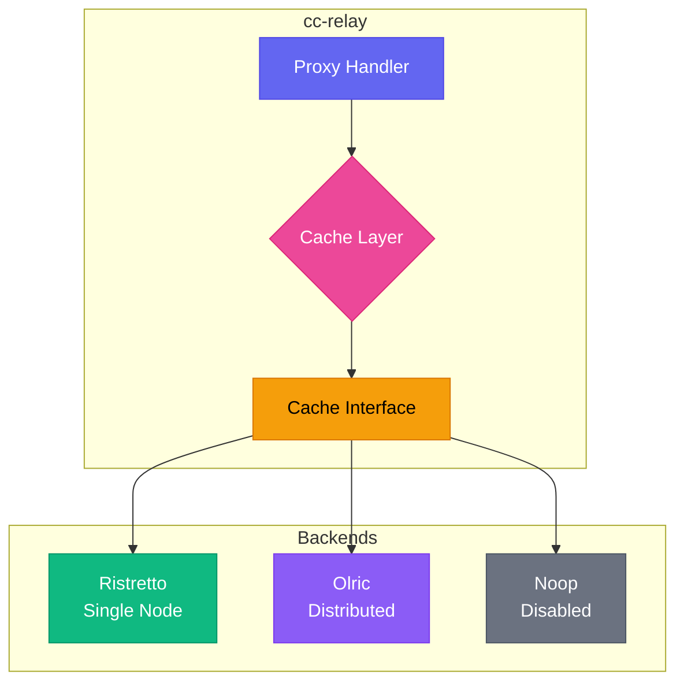
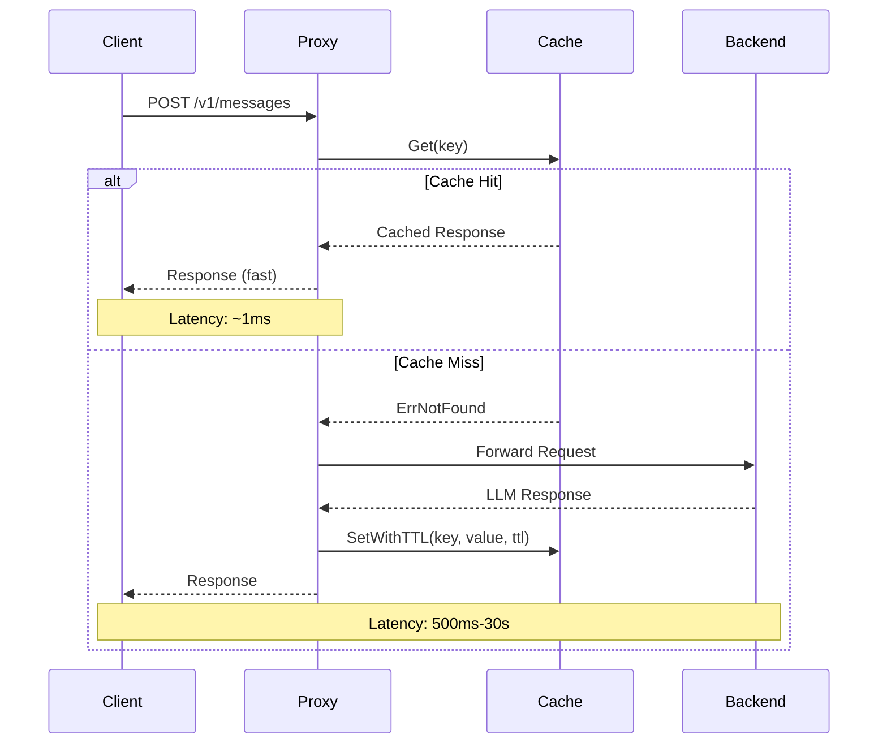

CC-Relay には、LLM プロバイダーからのレスポンスをキャッシュすることで、レイテンシーとバックエンド負荷を大幅に削減できる柔軟なキャッシュ層が含まれています。

## 概要

キャッシュサブシステムは3つの動作モードをサポートしています：

| モード | バックエンド | 説明 |
|--------|-------------|------|
| `single` | Ristretto | 高性能なローカルインメモリキャッシュ（デフォルト） |
| `ha` | Olric | 高可用性デプロイメント用の分散キャッシュ |
| `disabled` | Noop | キャッシュなしのパススルーモード |

**各モードの使用場面：**

- **Single モード**: 開発、テスト、または単一インスタンスの本番デプロイメント。ネットワークオーバーヘッドなしで最低レイテンシーを提供。
- **HA モード**: ノード間でキャッシュの一貫性が必要な複数インスタンスの本番デプロイメント。
- **Disabled モード**: デバッグ、コンプライアンス要件、または他の場所でキャッシュが処理される場合。

## アーキテクチャ



キャッシュ層は、すべてのバックエンドを抽象化する統一された `Cache` インターフェースを実装しています：

```go
type Cache interface {
    Get(ctx context.Context, key string) ([]byte, error)
    Set(ctx context.Context, key string, value []byte) error
    SetWithTTL(ctx context.Context, key string, value []byte, ttl time.Duration) error
    Delete(ctx context.Context, key string) error
    Exists(ctx context.Context, key string) (bool, error)
    Close() error
}
```

## キャッシュフロー



## 設定

### Single モード（Ristretto）

Ristretto は、Caffeine ライブラリの研究に基づいた高性能な並行キャッシュです。最適なヒット率のために TinyLFU アドミッションポリシーを使用しています。


  
```yaml
cache:
  mode: single

  ristretto:
    # 4ビットアクセスカウンターの数
    # 推奨：最適なアドミッションポリシーのために予想される最大アイテム数の10倍
    # 例：100,000 アイテムの場合、1,000,000 カウンターを使用
    num_counters: 1000000

    # キャッシュ値の最大メモリ（バイト単位）
    # 104857600 = 100 MB
    max_cost: 104857600

    # Get バッファあたりのキー数（デフォルト：64）
    # アドミッションバッファのサイズを制御
    buffer_items: 64
```
  
  
```toml
[cache]
mode = "single"

[cache.ristretto]
# Number of 4-bit access counters
# Recommended: 10x expected max items for optimal admission policy
# Example: For 100,000 items, use 1,000,000 counters
num_counters = 1000000

# Maximum memory for cached values (in bytes)
# 104857600 = 100 MB
max_cost = 104857600

# Number of keys per Get buffer (default: 64)
# Controls admission buffer size
buffer_items = 64
```
  


**メモリ計算：**

`max_cost` パラメータは、キャッシュが値に使用できるメモリ量を制御します。適切なサイズを見積もるには：

1. 平均レスポンスサイズを見積もる（通常 LLM レスポンスは 1-10 KB）
2. キャッシュしたいユニークなリクエスト数を掛ける
3. メタデータ用に 20% のオーバーヘッドを追加

例：10,000 キャッシュレスポンス x 平均 5 KB = 50 MB、よって `max_cost: 52428800` に設定

### HA モード（Olric）

Olric は自動クラスター検出とデータレプリケーションを備えた分散キャッシュを提供します。

**クライアントモード**（外部クラスターへの接続）：


  
```yaml
cache:
  mode: ha

  olric:
    # Olric クラスターメンバーのアドレス
    addresses:
      - "olric-1:3320"
      - "olric-2:3320"
      - "olric-3:3320"

    # 分散マップ名（デフォルト："cc-relay"）
    dmap_name: "cc-relay"
```
  
  
```toml
[cache]
mode = "ha"

[cache.olric]
# Olric cluster member addresses
addresses = ["olric-1:3320", "olric-2:3320", "olric-3:3320"]

# Distributed map name (default: "cc-relay")
dmap_name = "cc-relay"
```
  


**組み込みモード**（シングルノード HA または開発用）：


  
```yaml
cache:
  mode: ha

  olric:
    # 組み込み Olric ノードを実行
    embedded: true

    # 組み込みノードのバインドアドレス
    bind_addr: "0.0.0.0:3320"

    # クラスター検出用のピアアドレス（オプション）
    peers:
      - "cc-relay-2:3320"
      - "cc-relay-3:3320"

    dmap_name: "cc-relay"
```
  
  
```toml
[cache]
mode = "ha"

[cache.olric]
# Run embedded Olric node
embedded = true

# Address to bind the embedded node
bind_addr = "0.0.0.0:3320"

# Peer addresses for cluster discovery (optional)
peers = ["cc-relay-2:3320", "cc-relay-3:3320"]

dmap_name = "cc-relay"
```
  


### Disabled モード


  
```yaml
cache:
  mode: disabled
```
  
  
```toml
[cache]
mode = "disabled"
```
  


すべてのキャッシュ操作はデータを保存せずに即座に返します。`Get` 操作は常に `ErrNotFound` を返します。

## HAクラスタリングガイド

このセクションでは、高可用性のために複数のノードにわたって分散キャッシュを使用して cc-relay をデプロイする方法を説明します。

### 前提条件

HA モードを設定する前に：

1. **ネットワーク接続性**: すべてのノードが相互に到達可能である必要があります
2. **ポートアクセシビリティ**: Olric と memberlist の両方のポートが開いている必要があります
3. **一貫した設定**: すべてのノードで同じ `dmap_name` と `environment` を使用する必要があります

### ポート要件

**重要:** Olric は2つのポートを使用します：

| ポート | 目的 | デフォルト |
|--------|------|----------|
| `bind_addr` ポート | Olric クライアント接続 | 3320 |
| `bind_addr` ポート + 2 | Memberlist ゴシッププロトコル | 3322 |

**例:** `bind_addr: "0.0.0.0:3320"` の場合、memberlist は自動的にポート 3322 を使用します。

ファイアウォールで両方のポートが開いていることを確認してください：

```bash
# Olric クライアントポートを許可
sudo ufw allow 3320/tcp

# memberlist ゴシップポートを許可（bind_addr ポート + 2）
sudo ufw allow 3322/tcp
```

### 環境設定

| 設定 | ゴシップ間隔 | プローブ間隔 | プローブタイムアウト | 使用場面 |
|------|-------------|-------------|-------------------|---------|
| `local` | 100ms | 100ms | 200ms | 同一ホスト、開発 |
| `lan` | 200ms | 1s | 500ms | 同一データセンター |
| `wan` | 500ms | 3s | 2s | クロスデータセンター |

**クラスター内のすべてのノードは同じ environment 設定を使用する必要があります。**

### 2ノードクラスター例

**ノード1（cc-relay-1）:**


  
```yaml
cache:
  mode: ha
  olric:
    embedded: true
    bind_addr: "0.0.0.0:3320"
    dmap_name: "cc-relay"
    environment: lan
    peers:
      - "cc-relay-2:3322"  # ノード2の memberlist ポート
    replica_count: 2
    read_quorum: 1
    write_quorum: 1
    member_count_quorum: 2
    leave_timeout: 5s
```
  
  
```toml
[cache]
mode = "ha"

[cache.olric]
embedded = true
bind_addr = "0.0.0.0:3320"
dmap_name = "cc-relay"
environment = "lan"
peers = ["cc-relay-2:3322"]  # Memberlist port of node 2
replica_count = 2
read_quorum = 1
write_quorum = 1
member_count_quorum = 2
leave_timeout = "5s"
```
  


**ノード2（cc-relay-2）:**


  
```yaml
cache:
  mode: ha
  olric:
    embedded: true
    bind_addr: "0.0.0.0:3320"
    dmap_name: "cc-relay"
    environment: lan
    peers:
      - "cc-relay-1:3322"  # ノード1の memberlist ポート
    replica_count: 2
    read_quorum: 1
    write_quorum: 1
    member_count_quorum: 2
    leave_timeout: 5s
```
  
  
```toml
[cache]
mode = "ha"

[cache.olric]
embedded = true
bind_addr = "0.0.0.0:3320"
dmap_name = "cc-relay"
environment = "lan"
peers = ["cc-relay-1:3322"]  # Memberlist port of node 1
replica_count = 2
read_quorum = 1
write_quorum = 1
member_count_quorum = 2
leave_timeout = "5s"
```
  


### 3ノードDocker Compose例


  
```yaml
version: '3.8'

services:
  cc-relay-1:
    image: cc-relay:latest
    environment:
      - CC_RELAY_CONFIG=/config/config.yaml
    volumes:
      - ./config-node1.yaml:/config/config.yaml:ro
    ports:
      - "8787:8787"   # HTTP プロキシ
      - "3320:3320"   # Olric クライアントポート
      - "3322:3322"   # Memberlist ゴシップポート
    networks:
      - cc-relay-net

  cc-relay-2:
    image: cc-relay:latest
    environment:
      - CC_RELAY_CONFIG=/config/config.yaml
    volumes:
      - ./config-node2.yaml:/config/config.yaml:ro
    ports:
      - "8788:8787"
      - "3330:3320"
      - "3332:3322"
    networks:
      - cc-relay-net

  cc-relay-3:
    image: cc-relay:latest
    environment:
      - CC_RELAY_CONFIG=/config/config.yaml
    volumes:
      - ./config-node3.yaml:/config/config.yaml:ro
    ports:
      - "8789:8787"
      - "3340:3320"
      - "3342:3322"
    networks:
      - cc-relay-net

networks:
  cc-relay-net:
    driver: bridge
```
  
  
```toml
# Docker Compose uses YAML format for the compose file itself.
# This tab shows the cc-relay config file (config-node1.toml):

[cache]
mode = "ha"

[cache.olric]
embedded = true
bind_addr = "0.0.0.0:3320"
dmap_name = "cc-relay"
environment = "lan"
peers = ["cc-relay-2:3322", "cc-relay-3:3322"]
replica_count = 2
read_quorum = 1
write_quorum = 1
member_count_quorum = 2
leave_timeout = "5s"
```
  


**config-node1.yaml:**


  
```yaml
cache:
  mode: ha
  olric:
    embedded: true
    bind_addr: "0.0.0.0:3320"
    dmap_name: "cc-relay"
    environment: lan
    peers:
      - "cc-relay-2:3322"
      - "cc-relay-3:3322"
    replica_count: 2
    read_quorum: 1
    write_quorum: 1
    member_count_quorum: 2
    leave_timeout: 5s
```
  
  
```toml
[cache]
mode = "ha"

[cache.olric]
embedded = true
bind_addr = "0.0.0.0:3320"
dmap_name = "cc-relay"
environment = "lan"
peers = ["cc-relay-2:3322", "cc-relay-3:3322"]
replica_count = 2
read_quorum = 1
write_quorum = 1
member_count_quorum = 2
leave_timeout = "5s"
```
  


**config-node2.yaml と config-node3.yaml:** ノード1と同じですが、peers リストは他のノードを指すように変更します。

### レプリケーションとクォーラムの説明

**replica_count:** クラスター内に保存される各キーのコピー数。

| replica_count | 動作 |
|---------------|------|
| 1 | レプリケーションなし（単一コピー） |
| 2 | 1つのプライマリ + 1つのバックアップ |
| 3 | 1つのプライマリ + 2つのバックアップ |

**read_quorum / write_quorum:** 成功を返す前に必要な最小成功操作数。

| 設定 | 一貫性 | 可用性 |
|------|-------|-------|
| quorum = 1 | 結果整合性 | 高 |
| quorum = replica_count | 強一貫性 | 低 |
| quorum = (replica_count/2)+1 | 多数決 | バランス |

**推奨:**

| クラスターサイズ | replica_count | read_quorum | write_quorum | 障害耐性 |
|-----------------|---------------|-------------|--------------|---------|
| 2ノード | 2 | 1 | 1 | 1ノード障害 |
| 3ノード | 2 | 1 | 1 | 1ノード障害 |
| 3ノード | 3 | 2 | 2 | 1ノード障害（強一貫性） |

## キャッシュモードの比較

| 機能 | Single（Ristretto） | HA（Olric） | Disabled（Noop） |
|------|-------------------|------------|-----------------|
| **バックエンド** | ローカルメモリ | 分散 | なし |
| **ユースケース** | 開発、単一インスタンス | 本番 HA | デバッグ |
| **永続化** | なし | オプション | N/A |
| **マルチノード** | なし | あり | N/A |
| **レイテンシー** | 約1マイクロ秒 | 約1-10 ms（ネットワーク） | 約0 |
| **メモリ** | ローカルのみ | 分散 | なし |
| **一貫性** | N/A | 結果整合性 | N/A |
| **複雑さ** | 低 | 中 | なし |

## オプションインターフェース

一部のキャッシュバックエンドは、オプションインターフェースを通じて追加機能をサポートしています：

### 統計情報

```go
if sp, ok := cache.(cache.StatsProvider); ok {
    stats := sp.Stats()
    fmt.Printf("Hits: %d, Misses: %d\n", stats.Hits, stats.Misses)
}
```

統計情報には以下が含まれます：
- `Hits`: キャッシュヒット数
- `Misses`: キャッシュミス数
- `KeyCount`: 現在のキー数
- `BytesUsed`: 使用中の概算メモリ
- `Evictions`: 容量により削除されたキー数

### ヘルスチェック（Ping）

```go
if p, ok := cache.(cache.Pinger); ok {
    if err := p.Ping(ctx); err != nil {
        // キャッシュが正常ではない
    }
}
```

`Pinger` インターフェースは、主に分散キャッシュ（Olric）でクラスター接続性を確認するために有用です。

### バッチ操作

```go
// バッチ Get
if mg, ok := cache.(cache.MultiGetter); ok {
    results, err := mg.GetMulti(ctx, []string{"key1", "key2", "key3"})
}

// バッチ Set
if ms, ok := cache.(cache.MultiSetter); ok {
    err := ms.SetMultiWithTTL(ctx, items, 5*time.Minute)
}
```

## パフォーマンスのヒント

### Ristretto の最適化

1. **`num_counters` を適切に設定する**: 予想される最大アイテム数の10倍を使用。低すぎるとヒット率が下がり、高すぎるとメモリを浪費します。

2. **レスポンスサイズに基づいて `max_cost` をサイジングする**: LLM レスポンスは大きく異なります。実際の使用状況を監視して調整してください。

3. **TTL を賢く使用する**: 動的コンテンツには短い TTL（1-5分）、確定的なレスポンスには長い TTL（1時間以上）を使用。

4. **メトリクスを監視する**: キャッシュの有効性を検証するためにヒット率を追跡：
   ```
   hit_rate = hits / (hits + misses)
   ```
   効果的なキャッシュには 80% 以上のヒット率を目指してください。

### Olric の最適化

1. **cc-relay インスタンスの近くにデプロイする**: ネットワークレイテンシーが分散キャッシュのパフォーマンスを支配します。

2. **シングルノードデプロイメントには組み込みモードを使用する**: HA 対応の設定を維持しながら外部依存関係を回避します。

3. **クラスターを適切にサイジングする**: 各ノードは完全なデータセット用に十分なメモリを持つ必要があります（Olric はデータを複製します）。

4. **クラスターの健全性を監視する**: ヘルスチェックで `Pinger` インターフェースを使用します。

### 一般的なヒント

1. **キャッシュキーの設計**: リクエストの内容に基づく決定論的なキーを使用。モデル名、プロンプトハッシュ、関連パラメータを含めてください。

2. **ストリーミングレスポンスのキャッシュを避ける**: ストリーミング SSE レスポンスは、その増分的な性質のためデフォルトではキャッシュされません。

3. **キャッシュのウォームアップを検討する**: 予測可能なワークロードでは、一般的なクエリでキャッシュを事前に埋めてください。

## トラブルシューティング

### 期待されるヒットでキャッシュミスが発生する場合

1. **キー生成を確認する**: キャッシュキーが決定論的で、タイムスタンプやリクエスト ID を含まないことを確認してください。

2. **TTL 設定を確認する**: アイテムが期限切れになっている可能性があります。TTL がユースケースに対して短すぎないか確認してください。

3. **削除を監視する**: 高い削除カウントは `max_cost` が低すぎることを示しています：
   ```go
   stats := cache.Stats()
   if stats.Evictions > 0 {
       // max_cost の増加を検討してください
   }
   ```

### Ristretto がアイテムを保存しない場合

Ristretto は高いヒット率を維持するためにアイテムを拒否する可能性のあるアドミッションポリシーを使用しています。これは正常な動作です：

1. **新しいアイテムは拒否される可能性がある**: TinyLFU はアイテムが繰り返しアクセスされることでその価値を「証明」することを要求します。

2. **バッファフラッシュを待つ**: Ristretto は書き込みをバッファリングします。テストで書き込みが処理されることを確認するために `cache.Wait()` を呼び出してください。

3. **コスト計算を確認する**: コスト > `max_cost` のアイテムは保存されません。

### Olric クラスター接続性の問題

1. **ネットワーク接続性を確認する**: すべてのノードがポート 3320（または設定されたポート）で互いに到達できることを確認してください。

2. **ファイアウォールルールを確認する**: Olric はノード間の双方向通信を必要とします。

3. **アドレスを検証する**: クライアントモードでは、リスト内の少なくとも1つのアドレスが到達可能であることを確認してください。

4. **ログを監視する**: クラスターメンバーシップイベントを確認するためにデバッグログを有効にしてください：


  
```yaml
logging:
  level: debug
```
  
  
```toml
[logging]
level = "debug"
```
  


### メモリプレッシャー

1. **`max_cost` を減らす**: メモリ使用量を減らすためにキャッシュサイズを下げてください。

2. **短い TTL を使用する**: メモリを解放するためにアイテムをより速く期限切れにしてください。

3. **Olric に切り替える**: メモリプレッシャーを複数のノードに分散してください。

4. **メトリクスで監視する**: 実際のメモリ消費を理解するために `BytesUsed` を追跡してください。

### ノードがクラスターに参加できない

**症状:** ノードは起動するが、互いを検出しない。

**原因と解決策:**

1. **間違ったピアポート:** ピアは Olric ポートではなく memberlist ポート（bind_addr + 2）を使用する必要があります。


  
```yaml
# 間違い
peers:
  - "other-node:3320"  # これは Olric ポートです

# 正しい
peers:
  - "other-node:3322"  # memberlist ポート = 3320 + 2
```
  
  
```toml
# Wrong
peers = ["other-node:3320"]  # This is the Olric port

# Correct
peers = ["other-node:3322"]  # Memberlist port = 3320 + 2
```
  


2. **ファイアウォールのブロック:** Olric と memberlist の両方のポートが開いていることを確認してください。
   ```bash
   # 接続性を確認
   nc -zv other-node 3320  # Olric ポート
   nc -zv other-node 3322  # memberlist ポート
   ```

3. **DNS 解決:** ホスト名が正しく解決されることを確認してください。
   ```bash
   getent hosts other-node
   ```

4. **environment の不一致:** すべてのノードで同じ `environment` 設定を使用する必要があります。

### クォーラムエラー

**症状:** "not enough members" またはノードが稼働しているにもかかわらず操作が失敗する。

**解決策:** `member_count_quorum` が実際に稼働しているノード数以下であることを確認してください。


  
```yaml
# 2ノードクラスターの場合
member_count_quorum: 2  # 両方のノードが必要

# 1ノード障害を許容する3ノードクラスターの場合
member_count_quorum: 2  # 1ノードのダウンを許可
```
  
  
```toml
# For 2-node cluster
member_count_quorum = 2  # Requires both nodes

# For 3-node cluster with 1-node fault tolerance
member_count_quorum = 2  # Allows 1 node to be down
```
  


### データが複製されない

**症状:** ノードがダウンするとデータが消える。

**解決策:** `replica_count` > 1 であり、十分なノードがあることを確認してください。


  
```yaml
replica_count: 2          # 2つのコピーを保存
member_count_quorum: 2    # 書き込みに2ノードが必要
```
  
  
```toml
replica_count = 2          # Store 2 copies
member_count_quorum = 2    # Need 2 nodes to write
```
  


## エラーハンドリング

キャッシュパッケージは一般的な条件に対する標準エラーを定義しています：

```go
import "github.com/anthropics/cc-relay/internal/cache"

data, err := c.Get(ctx, key)
switch {
case errors.Is(err, cache.ErrNotFound):
    // キャッシュミス - バックエンドから取得
case errors.Is(err, cache.ErrClosed):
    // キャッシュが閉じられた - 再作成または失敗
case err != nil:
    // その他のエラー（ネットワーク、シリアライゼーションなど）
}
```

## 次のステップ

- [設定リファレンス](/ja/docs/configuration/)
- [アーキテクチャ概要](/ja/docs/architecture/)
- [API ドキュメント](/ja/docs/api/)
