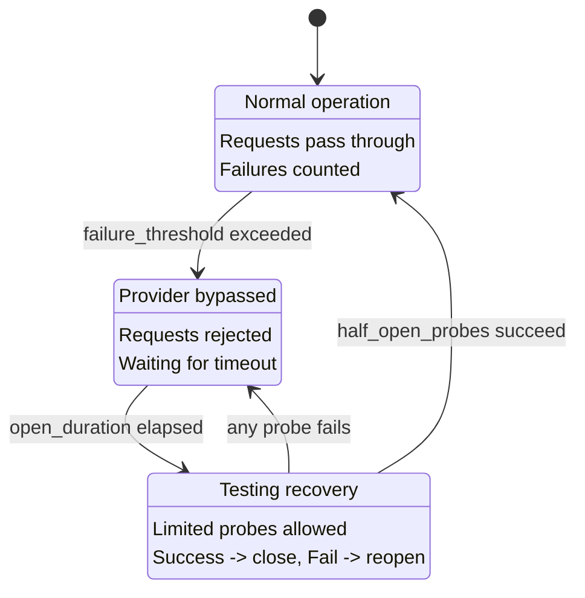

CC-Relay には、障害が発生しているプロバイダーを自動的に検出し、一時的にルーティングから除外するサーキットブレーカーシステムが含まれています。これにより、カスケード障害を防ぎ、プロバイダーが新しいリクエストを受け取る前に回復する時間を与えます。

## 概要

サーキットブレーカーはプロバイダーごとに障害を追跡し、3つの状態を遷移します：

| 状態 | 説明 | 動作 |
|------|------|------|
| CLOSED | 通常運用 | リクエストは通過、障害がカウントされる |
| OPEN | プロバイダーをバイパス | リクエストは拒否、回復待ち |
| HALF-OPEN | 回復テスト中 | 限定的なプローブが許可、成功で閉じる |

## サーキットブレーカーの状態

サーキットブレーカーは、障害が発生しているプロバイダーへの繰り返しリクエストからシステムを保護する状態マシンを実装しています：



### 状態遷移

**CLOSED から OPEN:** プロバイダーが `failure_threshold` 回の連続した障害を蓄積すると、サーキットが開きます。これにより、そのプロバイダーへのリクエストのルーティングが直ちに停止します。

**OPEN から HALF-OPEN:** `open_duration_ms` が経過すると、サーキットは半開状態に遷移します。これにより、プロバイダーが回復したかどうかをテストするための限定的なプローブリクエストが許可されます。

**HALF-OPEN から CLOSED:** `half_open_probes` 回の連続したリクエストが成功すると、サーキットが閉じて通常運用が再開されます。

**HALF-OPEN から OPEN:** 半開状態でプローブリクエストが失敗すると、サーキットは直ちに再度開き、タイムアウトが再開されます。

## 設定

`config.yaml` でヘルストラッキングを設定します：


  
```yaml
health:
  # ヘルスチェック設定
  health_check:
    # 定期的なヘルスチェックを有効化（デフォルト: true）
    enabled: true
    # チェック間隔（ミリ秒、デフォルト: 10000 = 10秒）
    interval_ms: 10000

  # サーキットブレーカー設定
  circuit_breaker:
    # サーキットが開くまでの連続障害回数（デフォルト: 5）
    failure_threshold: 5

    # 半開になるまでサーキットが開いている時間（ミリ秒、デフォルト: 30000 = 30秒）
    open_duration_ms: 30000

    # 半開状態で許可されるプローブ数（デフォルト: 3）
    half_open_probes: 3
```
  
  
```toml
[health]

[health.health_check]
# Enable periodic health checks (default: true)
enabled = true
# Check interval in milliseconds (default: 10000 = 10s)
interval_ms = 10000

[health.circuit_breaker]
# Consecutive failures before opening circuit (default: 5)
failure_threshold = 5

# Time circuit stays open before half-open, in milliseconds (default: 30000 = 30s)
open_duration_ms = 30000

# Probes allowed in half-open state (default: 3)
half_open_probes = 3
```
  


## 設定リファレンス

| オプション | デフォルト | 説明 |
|-----------|----------|------|
| `health_check.enabled` | `true` | 開いているサーキットの定期的なヘルスチェックを有効化 |
| `health_check.interval_ms` | `10000` | ヘルスチェックプローブ間のミリ秒 |
| `circuit_breaker.failure_threshold` | `5` | サーキットが開くまでの連続障害回数 |
| `circuit_breaker.open_duration_ms` | `30000` | 半開になるまでサーキットが開いているミリ秒 |
| `circuit_breaker.half_open_probes` | `3` | サーキットを閉じるために必要な成功プローブ数 |

## 動作の仕組み

### 障害カウント

サーキットブレーカーは連続した障害をカウントします。`failure_threshold` に達すると、サーキットが開きます。

**障害としてカウントされるもの:**

| エラータイプ | ステータスコード | 障害としてカウント? |
|-------------|-----------------|-------------------|
| Rate Limited | `429` | はい |
| Internal Server Error | `500` | はい |
| Bad Gateway | `502` | はい |
| Service Unavailable | `503` | はい |
| Gateway Timeout | `504` | はい |
| Request Timeout | (timeout) | はい |
| Network Error | (接続失敗) | はい |

**障害としてカウントされないもの:**

| エラータイプ | ステータスコード | 障害としてカウント? |
|-------------|-----------------|-------------------|
| Bad Request | `400` | いいえ |
| Unauthorized | `401` | いいえ |
| Forbidden | `403` | いいえ |
| Not Found | `404` | いいえ |
| その他の 4xx | (429を除く) | いいえ |

クライアントエラー（429を除く4xx）はプロバイダーの健全性ではなくリクエスト自体の問題を示すため、サーキットブレーカーの状態に影響しません。

### 成功でリセット

リクエストが成功すると、障害カウンターはゼロにリセットされます。これは、成功が間に挟まっている限り、たまの障害ではサーキットブレーカーがトリガーされないことを意味します。

### ヘルスチェックプローブ

サーキットが OPEN 状態の場合、cc-relay は完全なタイムアウトを待つよりも早く回復を検出するために定期的なヘルスチェックを実行します：

1. ヘルスチェックは `health_check.interval_ms` ミリ秒ごとに実行されます
2. チェックは OPEN サーキットを持つプロバイダーのみを対象とします（CLOSED や HALF-OPEN ではない）
3. 成功したヘルスチェックはサーキットを HALF-OPEN に遷移させます
4. ヘルスチェックは完全な API 呼び出しではなく、軽量な HTTP 接続テストを使用します

## ルーティングとの統合

サーキットブレーカーはすべてのルーティング戦略と統合されています：

### プロバイダー除外

OPEN サーキットを持つプロバイダーは自動的にルーティング決定から除外されます：

- **Failover 戦略:** 優先度チェーンの次のプロバイダーにスキップ
- **Round-robin:** ローテーションから除外
- **Weighted round-robin:** 重みが実質的にゼロになる
- **Shuffle:** デッキから除外

### 自動回復

回復は完全に自動です：

1. プロバイダーが障害を開始（rate limited、エラー、タイムアウト）
2. `failure_threshold` 回の障害後、サーキットが開く
3. リクエストは他の健全なプロバイダーにルーティングされる
4. `open_duration_ms` 後、サーキットが半開になる
5. 限定的なプローブリクエストがプロバイダーをテスト
6. プローブが成功すれば、サーキットが閉じてプロバイダーがローテーションに復帰

回復に手動介入は不要です。

## デバッグヘッダー

`routing.debug: true` が有効な場合、cc-relay はレスポンスヘッダーにヘルスステータスを含めます：

| ヘッダー | 値 | いつ |
|---------|-----|------|
| `X-CC-Relay-Provider` | プロバイダー名 | 常に（debug が有効な場合） |
| `X-CC-Relay-Strategy` | 使用された戦略 | 常に（debug が有効な場合） |

デバッグヘッダーを有効にするには：


  
```yaml
routing:
  strategy: failover
  debug: true  # 診断ヘッダーを有効化
```
  
  
```toml
[routing]
strategy = "failover"
debug = true  # Enable diagnostic headers
```
  


**セキュリティ警告:** デバッグヘッダーは内部のルーティング決定を公開します。開発環境または信頼できる環境でのみ使用してください。信頼できないクライアントがいる本番環境では決して有効にしないでください。

## トラブルシューティング

### プロバイダーがバイパスされ続ける

**症状:** プロバイダーのサーキットが、プロバイダーが健全に見えるにもかかわらず、開き続ける。

**考えられる原因:**

1. **`failure_threshold` が低すぎる:** 一時的な障害をより多く許容するために増加


  
```yaml
circuit_breaker:
  failure_threshold: 10  # より寛容
```
  
  
```toml
[circuit_breaker]
failure_threshold = 10  # More tolerant
```
  


2. **Rate limit がオープンをトリガー:** rate limit に達している場合は、サーキットブレーカーを調整するのではなく、プールに API キーを追加

3. **遅いレスポンスがタイムアウトを引き起こす:** サーバータイムアウトを増加


  
```yaml
server:
  timeout_ms: 300000  # 5分
```
  
  
```toml
[server]
timeout_ms = 300000  # 5 minutes
```
  


### 回復に時間がかかりすぎる

**症状:** プロバイダーが回復したが、サーキットが長時間開いたまま。

**解決策:**

1. **オープン期間を短縮:**


  
```yaml
circuit_breaker:
  open_duration_ms: 15000  # 30秒ではなく15秒
```
  
  
```toml
[circuit_breaker]
open_duration_ms = 15000  # 15 seconds instead of 30
```
  


2. **より速いヘルスチェックを有効化:**


  
```yaml
health_check:
  enabled: true
  interval_ms: 5000  # 5秒ごとにチェック
```
  
  
```toml
[health_check]
enabled = true
interval_ms = 5000  # Check every 5 seconds
```
  


### 有効なエラーでサーキットが開く

**症状:** プロバイダーがクライアントエラー（400、401）を返したときにサーキットが開く。

**これは起こるべきではありません。** クライアントエラー（429を除く4xx）は障害としてカウントされません。これが発生している場合：

1. 実際のレスポンスが 429（rate limited）かどうかを確認
2. エラーが実際には誤って報告されている 5xx ではないことを確認
3. 実際のレスポンスコードを確認するためにデバッグログを有効化：


  
```yaml
logging:
  level: debug
```
  
  
```toml
[logging]
level = "debug"
```
  


### すべてのプロバイダーが不健全

**症状:** すべてのサーキットが開き、リクエストが完全に失敗。

**考えられる原因:**

1. **ネットワーク接続の問題:** cc-relay がすべてのプロバイダーに到達できることを確認
2. **無効な API キー:** キーが有効であることを確認（ただし 401 はオープンをトリガーすべきではない）
3. **グローバル障害:** すべてのプロバイダーが本当に利用不可

**即時の軽減策:**

- サーキットをより長く閉じたままにするために `failure_threshold` を増加
- より速い回復試行のために `open_duration_ms` を減少

## 次のステップ

- [設定リファレンス](/ja/docs/configuration/) - 完全な設定オプション
- [ルーティング戦略](/ja/docs/routing/) - プロバイダーの選択方法
- [アーキテクチャ概要](/ja/docs/architecture/) - システム内部
