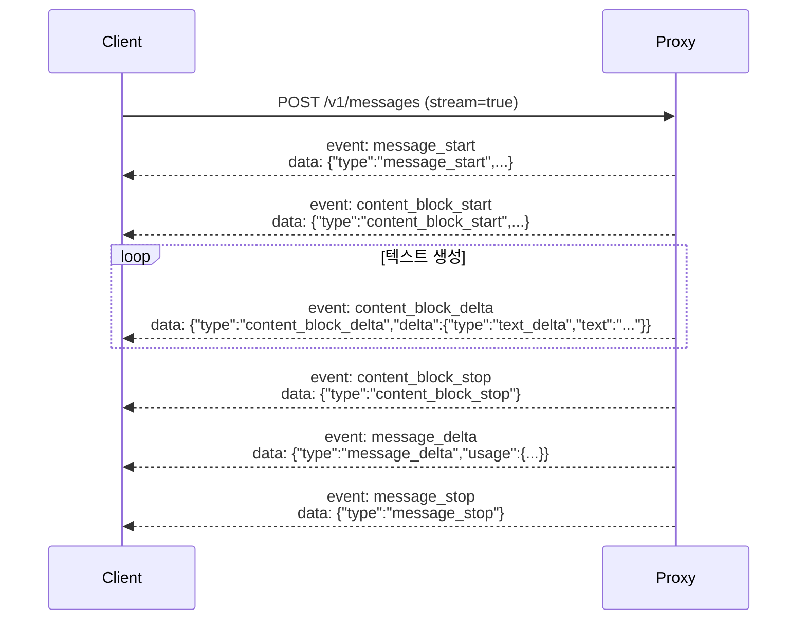

CC-Relay는 Anthropic Messages API와 완전히 호환되는 HTTP API를 제공합니다.

## HTTP 프록시 API

### POST /v1/messages

Anthropic Messages API 형식을 사용하여 메시지를 생성합니다. Claude Code 및 기타 LLM 클라이언트가 사용하는 주요 엔드포인트입니다.

**엔드포인트**: `POST /v1/messages`

**헤더**:
```
Content-Type: application/json
x-api-key: <your-api-key>
anthropic-version: 2023-06-01
```

**요청 본문**:
```json
{
  "model": "claude-sonnet-4-5-20250514",
  "max_tokens": 1024,
  "messages": [
    {
      "role": "user",
      "content": "Hello, Claude!"
    }
  ],
  "temperature": 1.0,
  "stream": false
}
```

**응답** (비스트리밍):
```json
{
  "id": "msg_01XYZ...",
  "type": "message",
  "role": "assistant",
  "content": [
    {
      "type": "text",
      "text": "Hello! How can I help you today?"
    }
  ],
  "model": "claude-sonnet-4-5-20250514",
  "stop_reason": "end_turn",
  "usage": {
    "input_tokens": 12,
    "output_tokens": 15
  }
}
```

### SSE 스트리밍

Server-Sent Events 스트리밍을 활성화하려면 요청에 `"stream": true`를 설정하세요.

**이벤트 순서**:



**스트림 예제**:

```
event: message_start
data: {"type":"message_start","message":{"id":"msg_01ABC","type":"message","role":"assistant","content":[],"model":"claude-sonnet-4-5-20250514","usage":{"input_tokens":12,"output_tokens":0}}}

event: content_block_start
data: {"type":"content_block_start","index":0,"content_block":{"type":"text","text":""}}

event: content_block_delta
data: {"type":"content_block_delta","index":0,"delta":{"type":"text_delta","text":"Hello"}}

event: content_block_delta
data: {"type":"content_block_delta","index":0,"delta":{"type":"text_delta","text":"!"}}

event: content_block_stop
data: {"type":"content_block_stop","index":0}

event: message_delta
data: {"type":"message_delta","usage":{"output_tokens":2}}

event: message_stop
data: {"type":"message_stop"}
```

### Tool Use

Claude Code는 파일 작업 및 기타 작업에 도구 실행을 사용합니다. CC-Relay는 올바른 연결을 위해 `tool_use_id`를 보존합니다:

**요청**:
```json
{
  "model": "claude-sonnet-4-5-20250514",
  "max_tokens": 1024,
  "tools": [
    {
      "name": "get_weather",
      "description": "Get weather for a location",
      "input_schema": {
        "type": "object",
        "properties": {
          "location": {"type": "string"}
        }
      }
    }
  ],
  "messages": [
    {"role": "user", "content": "What's the weather in NYC?"}
  ]
}
```

**응답**:
```json
{
  "content": [
    {
      "type": "text",
      "text": "I'll check the weather for you."
    },
    {
      "type": "tool_use",
      "id": "toolu_01ABC",
      "name": "get_weather",
      "input": {"location": "NYC"}
    }
  ]
}
```

### 오류 응답

모든 오류는 Anthropic API 형식으로 반환됩니다:

**업스트림 오류** (502):
```json
{
  "type": "error",
  "error": {
    "type": "api_error",
    "message": "upstream connection failed"
  }
}
```

**인증 오류** (401):
```json
{
  "type": "error",
  "error": {
    "type": "authentication_error",
    "message": "missing x-api-key header"
  }
}
```

**잘못된 요청** (400):
```json
{
  "type": "error",
  "error": {
    "type": "invalid_request_error",
    "message": "Missing required field: messages"
  }
}
```

## GET /v1/models

설정된 모든 프로바이더에서 사용 가능한 모델을 나열합니다.

**엔드포인트**: `GET /v1/models`

**헤더**: 필요 없음 (인증 불필요)

**응답**:
```json
{
  "object": "list",
  "data": [
    {
      "id": "claude-sonnet-4-5-20250514",
      "object": "model",
      "owned_by": "anthropic",
      "provider": "anthropic",
      "created": 1737446400
    },
    {
      "id": "claude-opus-4-5-20250514",
      "object": "model",
      "owned_by": "anthropic",
      "provider": "anthropic",
      "created": 1737446400
    },
    {
      "id": "GLM-4.7",
      "object": "model",
      "owned_by": "zhipu",
      "provider": "zai",
      "created": 1737446400
    }
  ]
}
```

## GET /v1/providers

메타데이터와 함께 활성 프로바이더를 나열합니다.

**엔드포인트**: `GET /v1/providers`

**헤더**: 필요 없음 (인증 불필요)

**응답**:
```json
{
  "object": "list",
  "data": [
    {
      "name": "anthropic",
      "type": "anthropic",
      "base_url": "https://api.anthropic.com",
      "models": [
        "claude-sonnet-4-5-20250514",
        "claude-opus-4-5-20250514",
        "claude-haiku-3-5-20241022"
      ],
      "active": true
    },
    {
      "name": "zai",
      "type": "zhipu",
      "base_url": "https://api.z.ai/api/anthropic",
      "models": [
        "GLM-4.7",
        "GLM-4.5-Air",
        "GLM-4-Plus"
      ],
      "active": true
    }
  ]
}
```

## GET /health

모니터링 및 로드 밸런서를 위한 헬스 체크 엔드포인트입니다.

**엔드포인트**: `GET /health`

**헤더**: 필요 없음 (인증 불필요)

**응답**:
```json
{"status":"ok"}
```

**HTTP 상태 코드**:
- `200 OK`: 서버가 정상
- `503 Service Unavailable`: 서버가 비정상 (향후 구현)

## 인증

CC-Relay는 `/v1/messages` 엔드포인트에 대해 여러 인증 방식을 지원합니다:

### API 키 인증

`x-api-key` 헤더를 포함하세요:

```bash
curl -X POST http://localhost:8787/v1/messages \
  -H "Content-Type: application/json" \
  -H "x-api-key: your-proxy-key" \
  -H "anthropic-version: 2023-06-01" \
  -d '{"model": "claude-sonnet-4-5-20250514", ...}'
```

### Bearer 토큰 인증

`Authorization` 헤더를 포함하세요:

```bash
curl -X POST http://localhost:8787/v1/messages \
  -H "Content-Type: application/json" \
  -H "Authorization: Bearer your-token" \
  -H "anthropic-version: 2023-06-01" \
  -d '{"model": "claude-sonnet-4-5-20250514", ...}'
```

이것은 Claude Code 구독 사용자가 사용합니다.

## 요청 헤더

CC-Relay는 모든 `anthropic-*` 헤더를 백엔드 프로바이더로 전달합니다:

| 헤더 | 설명 |
|--------|-------------|
| `anthropic-version` | API 버전 (필수) |
| `anthropic-beta` | 활성화할 베타 기능 |
| `anthropic-dangerous-direct-browser-access` | 브라우저 접근 플래그 |

## 응답 헤더

CC-Relay는 응답에 다음 헤더를 추가합니다:

| 헤더 | 설명 |
|--------|-------------|
| `X-Request-ID` | 추적을 위한 고유 요청 식별자 |
| `Content-Type` | `application/json` 또는 `text/event-stream` |
| `Cache-Control` | SSE용 `no-cache, no-transform` |
| `X-Accel-Buffering` | 프록시 버퍼링 비활성화를 위한 `no` |

## cURL 예제

### 비스트리밍 요청

```bash
curl -X POST http://localhost:8787/v1/messages \
  -H "Content-Type: application/json" \
  -H "x-api-key: test" \
  -H "anthropic-version: 2023-06-01" \
  -d '{
    "model": "claude-sonnet-4-5-20250514",
    "max_tokens": 100,
    "messages": [{"role": "user", "content": "Hello!"}]
  }'
```

### 스트리밍 요청

```bash
curl -N -X POST http://localhost:8787/v1/messages \
  -H "Content-Type: application/json" \
  -H "x-api-key: test" \
  -H "anthropic-version: 2023-06-01" \
  -d '{
    "model": "claude-sonnet-4-5-20250514",
    "max_tokens": 100,
    "messages": [{"role": "user", "content": "Hello!"}],
    "stream": true
  }'
```

### 모델 목록

```bash
curl http://localhost:8787/v1/models
```

### 프로바이더 목록

```bash
curl http://localhost:8787/v1/providers
```

### 헬스 체크

```bash
curl http://localhost:8787/health
```

## Python 클라이언트 예제

```python
import requests

response = requests.post(
    "http://localhost:8787/v1/messages",
    headers={
        "Content-Type": "application/json",
        "x-api-key": "managed-by-cc-relay",
        "anthropic-version": "2023-06-01",
    },
    json={
        "model": "claude-sonnet-4-5-20250514",
        "max_tokens": 1024,
        "messages": [
            {"role": "user", "content": "Hello!"}
        ],
    },
)

print(response.json())
```

## Python 스트리밍 예제

```python
import requests

response = requests.post(
    "http://localhost:8787/v1/messages",
    headers={
        "Content-Type": "application/json",
        "x-api-key": "managed-by-cc-relay",
        "anthropic-version": "2023-06-01",
    },
    json={
        "model": "claude-sonnet-4-5-20250514",
        "max_tokens": 1024,
        "messages": [
            {"role": "user", "content": "Hello!"}
        ],
        "stream": True,
    },
    stream=True,
)

for line in response.iter_lines():
    if line:
        print(line.decode('utf-8'))
```

## Go 클라이언트 예제

```go
package main

import (
    "bytes"
    "encoding/json"
    "fmt"
    "io"
    "net/http"
)

func main() {
    body := map[string]interface{}{
        "model":      "claude-sonnet-4-5-20250514",
        "max_tokens": 100,
        "messages": []map[string]string{
            {"role": "user", "content": "Hello!"},
        },
    }

    jsonBody, _ := json.Marshal(body)

    req, _ := http.NewRequest("POST", "http://localhost:8787/v1/messages", bytes.NewReader(jsonBody))
    req.Header.Set("Content-Type", "application/json")
    req.Header.Set("x-api-key", "test")
    req.Header.Set("anthropic-version", "2023-06-01")

    resp, err := http.DefaultClient.Do(req)
    if err != nil {
        panic(err)
    }
    defer resp.Body.Close()

    data, _ := io.ReadAll(resp.Body)
    fmt.Println(string(data))
}
```

## 다음 단계

- [설정 레퍼런스](/ko/docs/configuration/)
- [아키텍처 개요](/ko/docs/architecture/)
