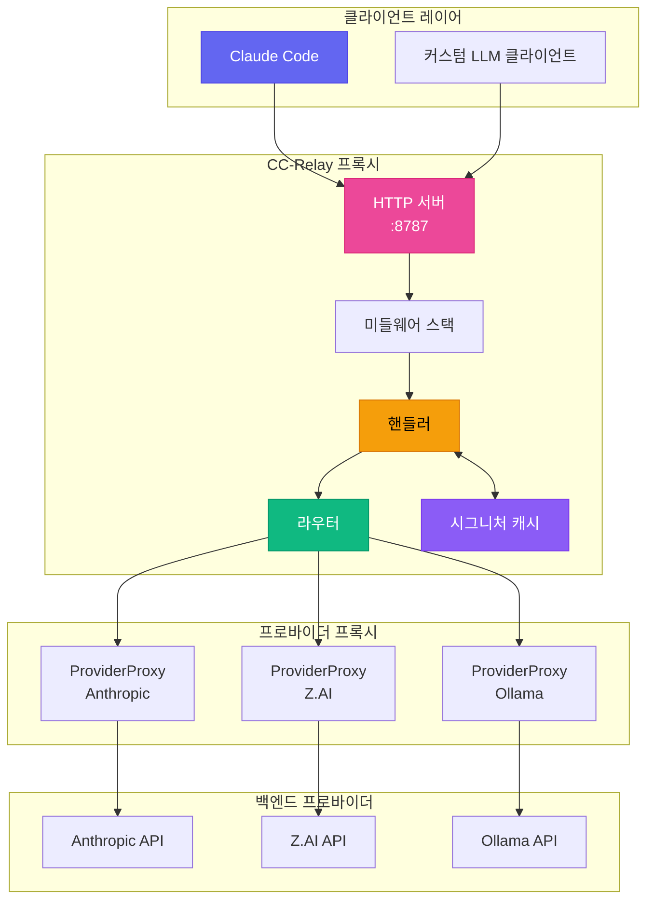
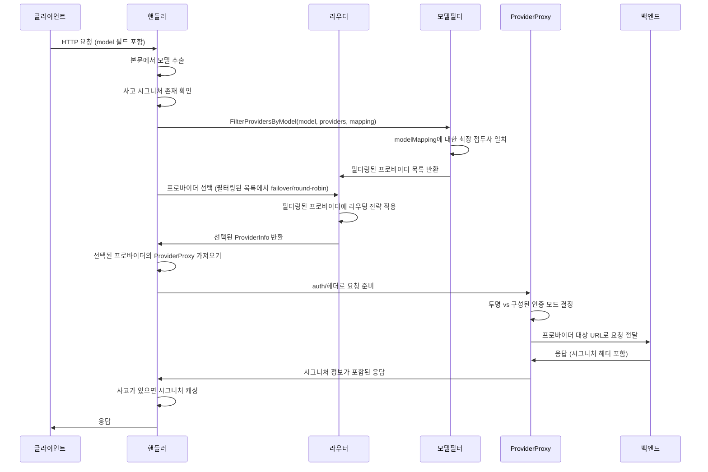
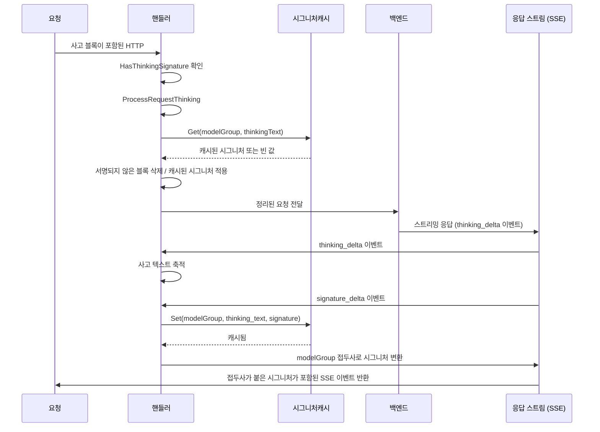
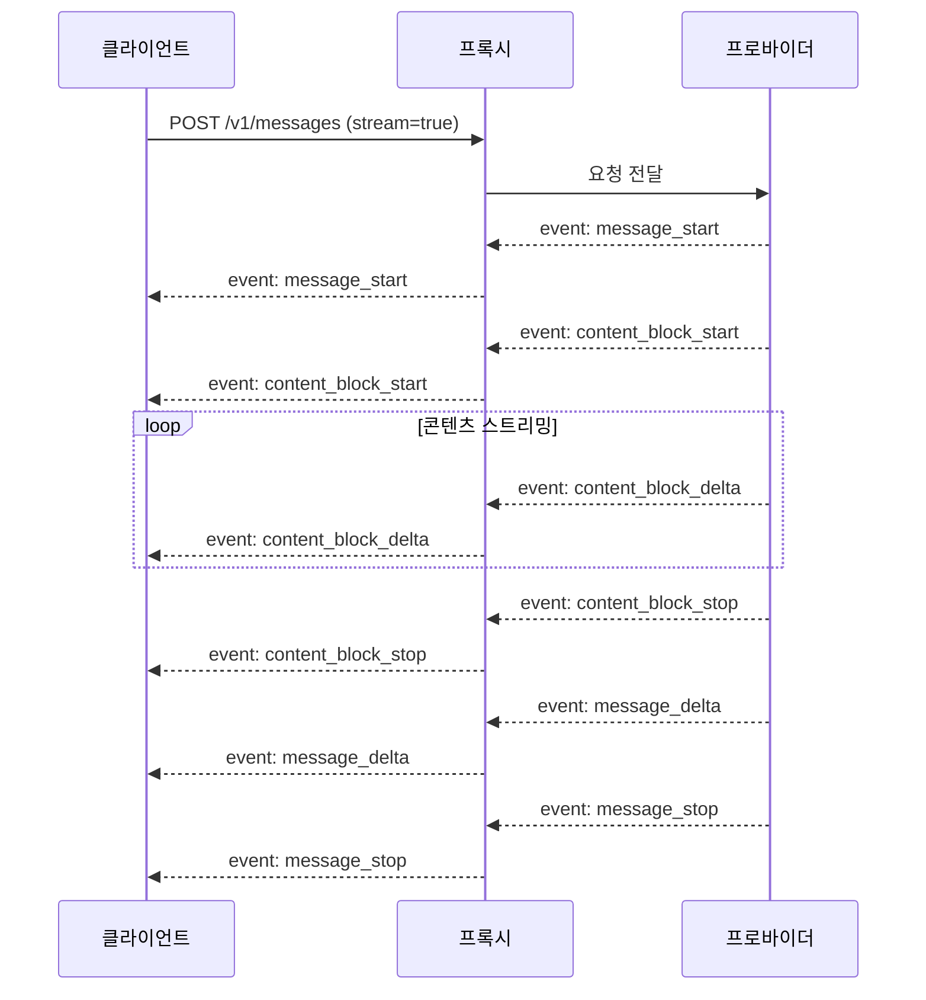
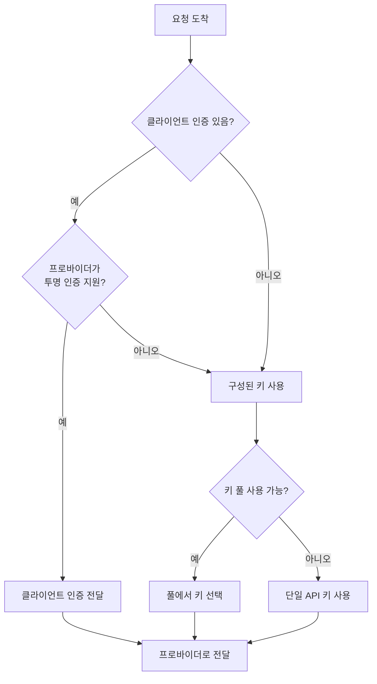

CC-Relay는 LLM 애플리케이션을 위해 설계된 고성능 멀티 프로바이더 HTTP 프록시입니다. 지능형 라우팅, 사고 시그니처 캐싱, 프로바이더 간 원활한 장애 조치를 제공합니다.

## 시스템 개요



## 핵심 컴포넌트

### 1. 핸들러

**위치**: `internal/proxy/handler.go`

핸들러는 요청 처리의 중앙 조정자입니다:

```go
type Handler struct {
    providerProxies map[string]*ProviderProxy  // 프로바이더별 리버스 프록시
    defaultProvider providers.Provider          // 단일 프로바이더 모드용 폴백
    router          router.ProviderRouter       // 라우팅 전략 구현
    healthTracker   *health.Tracker             // 서킷 브레이커 추적
    signatureCache  *SignatureCache             // 사고 시그니처 캐시
    routingConfig   *config.RoutingConfig       // 모델 기반 라우팅 설정
    providers       []router.ProviderInfo       // 사용 가능한 프로바이더
}
```

**책임:**
- 요청 본문에서 모델 이름 추출
- 프로바이더 친화도를 위한 사고 시그니처 감지
- 라우터를 통한 프로바이더 선택
- 적절한 ProviderProxy에 위임
- 사고 블록 처리 및 시그니처 캐싱

### 2. ProviderProxy

**위치**: `internal/proxy/provider_proxy.go`

각 프로바이더는 사전 구성된 URL과 인증을 가진 전용 리버스 프록시를 받습니다:

```go
type ProviderProxy struct {
    Provider           providers.Provider
    Proxy              *httputil.ReverseProxy
    KeyPool            *keypool.KeyPool  // 멀티 키 로테이션용
    APIKey             string            // 폴백 단일 키
    targetURL          *url.URL          // 프로바이더 기본 URL
    modifyResponseHook ModifyResponseFunc
}
```

**주요 기능:**
- URL 파싱은 초기화 시 한 번만 수행 (요청마다 아님)
- 투명 인증 (클라이언트 자격 증명 전달) 또는 구성된 인증 지원
- 스트리밍 응답을 위한 SSE 헤더 자동 주입
- 속도 제한 분산을 위한 키 풀 통합

### 3. 라우터

**위치**: `internal/router/`

라우터는 각 요청을 처리할 프로바이더를 선택합니다:

| 전략 | 설명 |
|----------|-------------|
| `failover` | 자동 재시도가 있는 우선순위 기반 (기본값) |
| `round_robin` | 순차 로테이션 |
| `weighted_round_robin` | 가중치에 따른 비례 배분 |
| `shuffle` | 공정한 무작위 분산 |
| `model_based` | 모델 이름 접두사로 라우팅 |

### 4. 시그니처 캐시

**위치**: `internal/proxy/signature_cache.go`

크로스 프로바이더 호환성을 위해 사고 블록 시그니처를 캐싱합니다:

```go
type SignatureCache struct {
    cache cache.Cache  // Ristretto 기반 캐시
}

// 캐시 키 형식: "sig:{modelGroup}:{textHash}"
// TTL: 3시간 (Claude API에 맞춤)
```

## 요청 흐름

### 멀티 프로바이더 라우팅



### 사고 시그니처 처리

확장된 사고가 활성화되면 프로바이더는 서명된 사고 블록을 반환합니다. 이 시그니처는 후속 턴에서 동일한 프로바이더에 의해 검증되어야 합니다. CC-Relay는 캐싱을 통해 크로스 프로바이더 시그니처 문제를 해결합니다:



**시그니처 공유를 위한 모델 그룹:**

| 모델 패턴 | 그룹 | 시그니처 공유 |
|--------------|-------|-------------------|
| `claude-*` | `claude` | 예, 모든 Claude 모델 간 |
| `gpt-*` | `gpt` | 예, 모든 GPT 모델 간 |
| `gemini-*` | `gemini` | 예, 센티넬 값 사용 |
| 기타 | 정확한 이름 | 공유 없음 |

### SSE 스트리밍 흐름



**필수 SSE 헤더:**
```text
Content-Type: text/event-stream
Cache-Control: no-cache, no-transform
X-Accel-Buffering: no
Connection: keep-alive
```

## 미들웨어 스택

**위치**: `internal/proxy/middleware.go`

| 미들웨어 | 목적 |
|------------|---------|
| `RequestIDMiddleware` | 추적을 위한 X-Request-ID 생성/추출 |
| `LoggingMiddleware` | 타이밍과 함께 요청/응답 로깅 |
| `AuthMiddleware` | x-api-key 헤더 검증 |
| `MultiAuthMiddleware` | API 키 및 Bearer 토큰 인증 지원 |

## 프로바이더 인터페이스

**위치**: `internal/providers/provider.go`

```go
type Provider interface {
    Name() string
    BaseURL() string
    Owner() string
    Authenticate(req *http.Request, key string) error
    ForwardHeaders(originalHeaders http.Header) http.Header
    SupportsStreaming() bool
    SupportsTransparentAuth() bool
    ListModels() []Model
    GetModelMapping() map[string]string
    MapModel(requestModel string) string
}
```

**구현된 프로바이더:**

| 프로바이더 | 타입 | 기능 |
|----------|------|----------|
| `AnthropicProvider` | `anthropic` | 네이티브 형식, 전체 기능 지원 |
| `ZAIProvider` | `zai` | Anthropic 호환, GLM 모델 |
| `OllamaProvider` | `ollama` | 로컬 모델, 프롬프트 캐싱 없음 |

## 인증 모드

### 투명 인증
클라이언트가 자격 증명을 제공하고 프로바이더가 지원하는 경우:
- 클라이언트의 `Authorization` 또는 `x-api-key` 헤더가 그대로 전달됨
- CC-Relay는 순수 프록시로 작동

### 구성된 인증
CC-Relay의 관리 키를 사용하는 경우:
- 클라이언트 자격 증명 제거
- CC-Relay가 구성된 API 키 주입
- 속도 제한 분산을 위한 키 풀 로테이션 지원



## 헬스 추적 & 서킷 브레이커

**위치**: `internal/health/`

CC-Relay는 프로바이더 상태를 추적하고 서킷 브레이커 패턴을 구현합니다:

| 상태 | 동작 |
|--------|----------|
| CLOSED | 정상 작동, 요청이 통과됨 |
| OPEN | 프로바이더가 비정상으로 표시됨, 요청이 빠르게 실패 |
| HALF-OPEN | 쿨다운 후 제한된 요청으로 프로빙 |

**OPEN 상태 트리거:**
- HTTP 429 (속도 제한)
- HTTP 5xx (서버 오류)
- 연결 타임아웃
- 연속 실패가 임계값 초과

## 디렉토리 구조

```text
cc-relay/
├── cmd/cc-relay/           # CLI 진입점
│   ├── main.go             # 루트 명령
│   ├── serve.go            # serve 명령
│   └── di/                 # 의존성 주입
│       └── providers.go    # 서비스 와이어링
├── internal/
│   ├── config/             # 설정 로딩
│   ├── providers/          # 프로바이더 구현
│   │   ├── provider.go     # 프로바이더 인터페이스
│   │   ├── base.go         # 베이스 프로바이더
│   │   ├── anthropic.go    # Anthropic 프로바이더
│   │   ├── zai.go          # Z.AI 프로바이더
│   │   └── ollama.go       # Ollama 프로바이더
│   ├── proxy/              # HTTP 프록시 서버
│   │   ├── handler.go      # 메인 요청 핸들러
│   │   ├── provider_proxy.go # 프로바이더별 프록시
│   │   ├── thinking.go     # 사고 블록 처리
│   │   ├── signature_cache.go # 시그니처 캐싱
│   │   ├── sse.go          # SSE 유틸리티
│   │   └── middleware.go   # 미들웨어 체인
│   ├── router/             # 라우팅 전략
│   │   ├── router.go       # 라우터 인터페이스
│   │   ├── failover.go     # 페일오버 전략
│   │   ├── round_robin.go  # 라운드 로빈 전략
│   │   └── model_filter.go # 모델 기반 필터링
│   ├── health/             # 헬스 추적
│   │   └── tracker.go      # 서킷 브레이커
│   ├── keypool/            # API 키 풀링
│   │   └── keypool.go      # 키 로테이션
│   └── cache/              # 캐싱 레이어
│       └── cache.go        # Ristretto 래퍼
└── docs-site/              # 문서
```

## 성능 고려사항

### 연결 처리
- **커넥션 풀링**: 백엔드로의 HTTP 연결 재사용
- **HTTP/2 지원**: 지원되는 곳에서 다중화된 요청
- **즉시 플러시**: SSE 이벤트가 버퍼링 없이 플러시됨

### 동시성
- **요청당 고루틴**: 경량 Go 동시성
- **컨텍스트 전파**: 적절한 타임아웃 및 취소
- **스레드 세이프 캐싱**: Ristretto가 동시 접근 제공

### 메모리
- **스트리밍 응답**: 응답 본문 버퍼링 없음
- **시그니처 캐시**: LRU 제거가 있는 제한된 크기
- **요청 본문 복원**: 효율적인 본문 재읽기

## 다음 단계

- [설정 레퍼런스](/docs/configuration/)
- [라우팅 전략](/docs/routing/)
- [프로바이더 설정](/docs/providers/)
