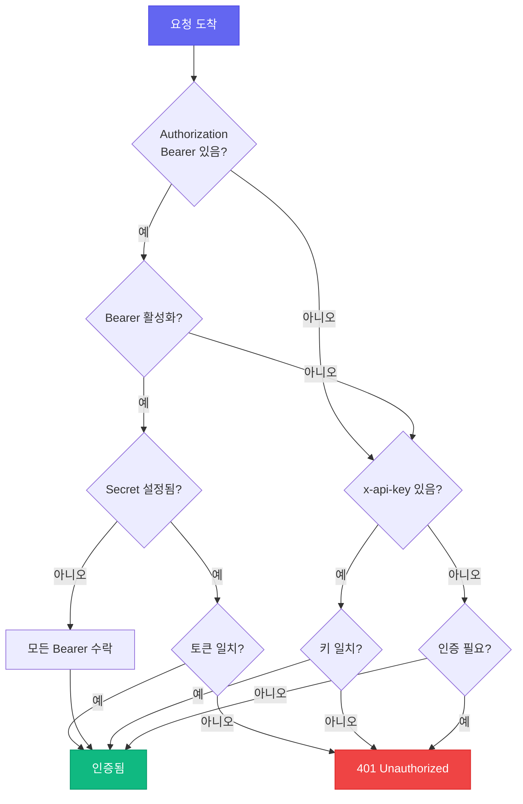

CC-Relay는 LLM 클라이언트(Claude Code 등)와 백엔드 프로바이더 사이에 위치하는 고성능 멀티 프로바이더 HTTP 프록시로 설계되었습니다.

## 시스템 개요


## 핵심 컴포넌트

### 1. HTTP 프록시 서버

**위치**: `internal/proxy/`

HTTP 서버는 Claude Code와 정확하게 호환되는 Anthropic Messages API (`/v1/messages`)를 구현합니다.

**기능:**
- 적절한 이벤트 순서로 SSE 스트리밍
- 요청 검증 및 변환
- 미들웨어 체인 (요청 ID, 로깅, 인증)
- 타임아웃 및 취소를 위한 컨텍스트 전파
- 동시 요청을 위한 HTTP/2 지원

**엔드포인트:**

| 엔드포인트 | 메서드 | 설명 |
|----------|--------|-------------|
| `/v1/messages` | POST | 백엔드 프로바이더로 요청 프록시 |
| `/v1/models` | GET | 모든 프로바이더에서 사용 가능한 모델 목록 |
| `/v1/providers` | GET | 메타데이터와 함께 활성 프로바이더 목록 |
| `/health` | GET | 헬스 체크 엔드포인트 |

### 2. 미들웨어 스택

**위치**: `internal/proxy/middleware.go`

미들웨어 체인은 요청을 순서대로 처리합니다:


**미들웨어 컴포넌트:**

| 미들웨어 | 목적 |
|------------|---------|
| `RequestIDMiddleware` | 추적을 위한 X-Request-ID 생성/추출 |
| `LoggingMiddleware` | 타이밍과 함께 요청/응답 로깅 |
| `AuthMiddleware` | x-api-key 헤더 검증 |
| `MultiAuthMiddleware` | API 키 및 Bearer 토큰 인증 지원 |

### 3. 프로바이더 매니저

**위치**: `internal/providers/`

각 프로바이더는 `Provider` 인터페이스를 구현합니다:

```go
type Provider interface {
    // Name은 프로바이더 식별자를 반환합니다
    Name() string

    // BaseURL은 백엔드 API base URL을 반환합니다
    BaseURL() string

    // Owner는 소유자 식별자를 반환합니다 (예: "anthropic", "zhipu")
    Owner() string

    // Authenticate는 프로바이더 특정 인증을 추가합니다
    Authenticate(req *http.Request, key string) error

    // ForwardHeaders는 백엔드로 전달할 헤더를 반환합니다
    ForwardHeaders(originalHeaders http.Header) http.Header

    // SupportsStreaming은 프로바이더가 SSE를 지원하는지 나타냅니다
    SupportsStreaming() bool

    // ListModels는 사용 가능한 모델을 반환합니다
    ListModels() []Model
}
```

**구현된 프로바이더:**

| 프로바이더 | 유형 | 설명 |
|----------|------|-------------|
| `AnthropicProvider` | `anthropic` | Anthropic 직접 API |
| `ZAIProvider` | `zai` | Z.AI/Zhipu GLM (Anthropic 호환) |

### 4. 프록시 핸들러

**위치**: `internal/proxy/handler.go`

프록시 핸들러는 효율적인 요청 전달을 위해 Go의 `httputil.ReverseProxy`를 사용합니다:

```go
type Handler struct {
    provider  providers.Provider
    proxy     *httputil.ReverseProxy
    apiKey    string
    debugOpts config.DebugOptions
}
```

**주요 기능:**
- SSE 스트리밍을 위한 즉시 플러시 (`FlushInterval: -1`)
- 프로바이더별 인증
- `anthropic-*` 헤더 전달
- Anthropic 형식 응답으로 오류 처리

### 5. 설정 매니저

**위치**: `internal/config/`

**기능:**
- 환경 변수 확장을 포함한 YAML 파싱
- 프로바이더 및 서버 설정 검증
- 다중 인증 방식 지원

## 요청 흐름

### 비스트리밍 요청


### 스트리밍 요청 (SSE)


## SSE 스트리밍

CC-Relay는 Claude Code 호환성을 위해 정확한 SSE 이벤트 순서를 유지합니다:

**필수 헤더:**
```
Content-Type: text/event-stream
Cache-Control: no-cache, no-transform
X-Accel-Buffering: no
Connection: keep-alive
```

**이벤트 순서:**
1. `message_start` - 메시지 메타데이터
2. `content_block_start` - 콘텐츠 블록 시작
3. `content_block_delta` - 콘텐츠 청크 (반복)
4. `content_block_stop` - 콘텐츠 블록 종료
5. `message_delta` - 사용량 정보
6. `message_stop` - 메시지 완료

`X-Accel-Buffering: no` 헤더는 nginx/Cloudflare가 SSE 이벤트를 버퍼링하는 것을 방지하는 데 중요합니다.

## 인증 흐름



## API 호환성

### Anthropic API 형식

CC-Relay는 Anthropic Messages API와 정확한 호환성을 구현합니다:

**엔드포인트**: `POST /v1/messages`

**헤더**:
- `x-api-key`: API 키 (CC-Relay에서 관리)
- `anthropic-version`: API 버전 (예: `2023-06-01`)
- `content-type`: `application/json`

**요청 본문**:
```json
{
  "model": "claude-sonnet-4-5-20250514",
  "max_tokens": 1024,
  "messages": [
    {"role": "user", "content": "Hello!"}
  ],
  "stream": true
}
```

### 프로바이더 변환

현재 지원되는 두 프로바이더(Anthropic과 Z.AI)는 모두 동일한 Anthropic 호환 API 형식을 사용합니다:

| 프로바이더 | 변환 |
|----------|----------------|
| **Anthropic** | 없음 (네이티브 형식) |
| **Z.AI** | 모델명 매핑만 |

## 성능 고려사항

### 연결 처리

CC-Relay는 최적화된 설정으로 Go 표준 라이브러리 HTTP 클라이언트를 사용합니다:

- **연결 풀링**: 백엔드로의 HTTP 연결 재사용
- **HTTP/2 지원**: 멀티플렉스 요청을 위한 선택적 h2c
- **즉시 플러시**: SSE 이벤트 즉시 플러시

### 동시성

- **요청당 고루틴**: 경량 동시성 모델
- **컨텍스트 전파**: 적절한 타임아웃 및 취소 처리
- **스레드 안전 로깅**: 구조화된 로깅을 위해 zerolog 사용

### 메모리 관리

- **스트리밍 응답**: 응답 본문 버퍼링 없음
- **요청 본문 제한**: 설정 가능한 최대 본문 크기
- **그레이스풀 셧다운**: 진행 중인 요청에 30초 타임아웃

## 디렉토리 구조

```
cc-relay/
├── cmd/cc-relay/        # CLI 진입점
│   ├── main.go          # 루트 명령
│   ├── serve.go         # Serve 명령
│   ├── status.go        # Status 명령
│   ├── version.go       # Version 명령
│   ├── config.go        # Config 명령
│   ├── config_init.go   # Config init 하위 명령
│   ├── config_cc.go     # Config cc 하위 명령
│   ├── config_cc_init.go    # Claude Code 설정
│   └── config_cc_remove.go  # CC 설정 제거
├── internal/
│   ├── config/          # 설정 로딩
│   │   ├── config.go    # 설정 구조체
│   │   └── loader.go    # YAML/env 로딩
│   ├── providers/       # 프로바이더 구현
│   │   ├── provider.go  # 프로바이더 인터페이스
│   │   ├── base.go      # 기본 프로바이더
│   │   ├── anthropic.go # Anthropic 프로바이더
│   │   └── zai.go       # Z.AI 프로바이더
│   ├── proxy/           # HTTP 프록시 서버
│   │   ├── server.go    # 서버 설정
│   │   ├── routes.go    # 라우트 등록
│   │   ├── handler.go   # 프록시 핸들러
│   │   ├── middleware.go # 미들웨어 체인
│   │   ├── sse.go       # SSE 유틸리티
│   │   ├── errors.go    # 오류 응답
│   │   └── logger.go    # 로깅 설정
│   ├── auth/            # 인증
│   │   ├── auth.go      # Auth 인터페이스
│   │   ├── apikey.go    # API 키 인증
│   │   ├── oauth.go     # Bearer 토큰 인증
│   │   └── chain.go     # Auth 체인
│   └── version/         # 버전 정보
└── config.yaml          # 예제 설정
```

## 향후 아키텍처

다음 기능들이 향후 릴리스에 계획되어 있습니다:

- **라우터 컴포넌트**: 지능형 라우팅 전략 (라운드 로빈, 페일오버, 비용 기반)
- **요청 제한기**: API 키별 토큰 버킷 요청 제한
- **상태 추적기**: 자동 복구 기능이 있는 서킷 브레이커
- **gRPC 관리 API**: 실시간 통계 및 설정
- **TUI 대시보드**: 터미널 기반 모니터링 인터페이스
- **추가 프로바이더**: Ollama, AWS Bedrock, Azure, Vertex AI

## 다음 단계

- [설정 레퍼런스](/ko/docs/configuration/)
- [API 문서](/ko/docs/api/)
