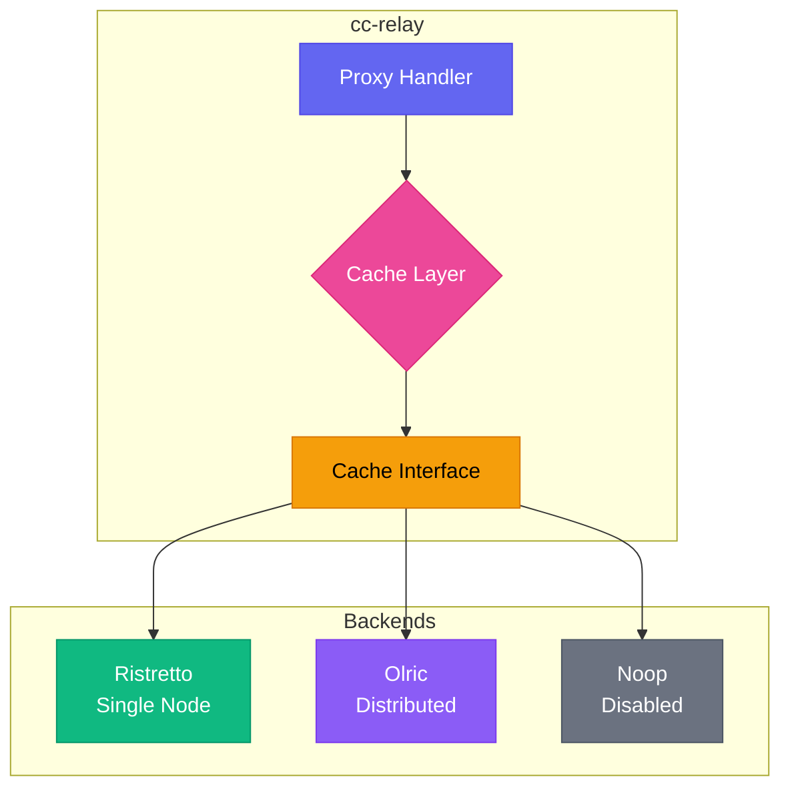
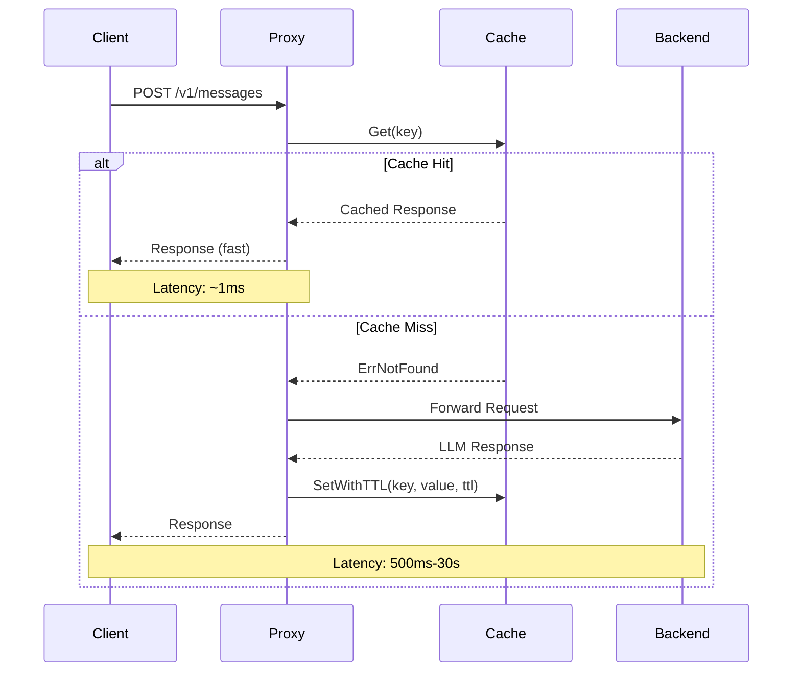

CC-Relay에는 LLM 프로바이더의 응답을 캐싱하여 지연 시간과 백엔드 부하를 크게 줄일 수 있는 유연한 캐싱 레이어가 포함되어 있습니다.

## 개요

캐시 서브시스템은 세 가지 작동 모드를 지원합니다:

| 모드 | 백엔드 | 설명 |
|------|--------|------|
| `single` | Ristretto | 고성능 로컬 인메모리 캐시 (기본값) |
| `ha` | Olric | 고가용성 배포를 위한 분산 캐시 |
| `disabled` | Noop | 캐싱 없는 패스스루 모드 |

**각 모드의 사용 시점:**

- **Single 모드**: 개발, 테스트 또는 단일 인스턴스 프로덕션 배포. 네트워크 오버헤드 없이 가장 낮은 지연 시간을 제공합니다.
- **HA 모드**: 노드 간 캐시 일관성이 필요한 다중 인스턴스 프로덕션 배포.
- **Disabled 모드**: 디버깅, 규정 준수 요구사항 또는 다른 곳에서 캐싱이 처리되는 경우.

## 아키텍처



캐시 레이어는 모든 백엔드를 추상화하는 통합된 `Cache` 인터페이스를 구현합니다:

```go
type Cache interface {
    Get(ctx context.Context, key string) ([]byte, error)
    Set(ctx context.Context, key string, value []byte) error
    SetWithTTL(ctx context.Context, key string, value []byte, ttl time.Duration) error
    Delete(ctx context.Context, key string) error
    Exists(ctx context.Context, key string) (bool, error)
    Close() error
}
```

## 캐시 흐름



## 설정

### Single 모드 (Ristretto)

Ristretto는 Caffeine 라이브러리의 연구를 기반으로 한 고성능 동시성 캐시입니다. 최적의 히트율을 위해 TinyLFU 승인 정책을 사용합니다.


  
```yaml
cache:
  mode: single

  ristretto:
    # 4비트 접근 카운터의 수
    # 권장: 최적의 승인 정책을 위해 예상 최대 항목 수의 10배
    # 예: 100,000 항목의 경우 1,000,000 카운터 사용
    num_counters: 1000000

    # 캐시된 값의 최대 메모리 (바이트)
    # 104857600 = 100 MB
    max_cost: 104857600

    # Get 버퍼당 키 수 (기본값: 64)
    # 승인 버퍼 크기 제어
    buffer_items: 64
```
  
  
```toml
[cache]
mode = "single"

[cache.ristretto]
# Number of 4-bit access counters
# Recommended: 10x expected max items for optimal admission policy
# Example: For 100,000 items, use 1,000,000 counters
num_counters = 1000000

# Maximum memory for cached values (in bytes)
# 104857600 = 100 MB
max_cost = 104857600

# Number of keys per Get buffer (default: 64)
# Controls admission buffer size
buffer_items = 64
```
  


**메모리 계산:**

`max_cost` 매개변수는 캐시가 값에 사용할 수 있는 메모리 양을 제어합니다. 적절한 크기를 추정하려면:

1. 평균 응답 크기 추정 (일반적으로 LLM 응답의 경우 1-10 KB)
2. 캐시하려는 고유 요청 수를 곱함
3. 메타데이터를 위해 20% 오버헤드 추가

예: 10,000 캐시된 응답 x 평균 5 KB = 50 MB, 따라서 `max_cost: 52428800` 설정

### HA 모드 (Olric)

Olric은 자동 클러스터 검색과 데이터 복제를 통한 분산 캐싱을 제공합니다.

**클라이언트 모드** (외부 클러스터에 연결):


  
```yaml
cache:
  mode: ha

  olric:
    # Olric 클러스터 멤버 주소
    addresses:
      - "olric-1:3320"
      - "olric-2:3320"
      - "olric-3:3320"

    # 분산 맵 이름 (기본값: "cc-relay")
    dmap_name: "cc-relay"
```
  
  
```toml
[cache]
mode = "ha"

[cache.olric]
# Olric cluster member addresses
addresses = ["olric-1:3320", "olric-2:3320", "olric-3:3320"]

# Distributed map name (default: "cc-relay")
dmap_name = "cc-relay"
```
  


**임베디드 모드** (단일 노드 HA 또는 개발):


  
```yaml
cache:
  mode: ha

  olric:
    # 임베디드 Olric 노드 실행
    embedded: true

    # 임베디드 노드의 바인드 주소
    bind_addr: "0.0.0.0:3320"

    # 클러스터 검색용 피어 주소 (선택 사항)
    peers:
      - "cc-relay-2:3320"
      - "cc-relay-3:3320"

    dmap_name: "cc-relay"
```
  
  
```toml
[cache]
mode = "ha"

[cache.olric]
# Run embedded Olric node
embedded = true

# Address to bind the embedded node
bind_addr = "0.0.0.0:3320"

# Peer addresses for cluster discovery (optional)
peers = ["cc-relay-2:3320", "cc-relay-3:3320"]

dmap_name = "cc-relay"
```
  


### Disabled 모드


  
```yaml
cache:
  mode: disabled
```
  
  
```toml
[cache]
mode = "disabled"
```
  


모든 캐시 작업은 데이터를 저장하지 않고 즉시 반환됩니다. `Get` 작업은 항상 `ErrNotFound`를 반환합니다.

## HA 클러스터링 가이드

이 섹션에서는 고가용성을 위해 여러 노드에 걸쳐 분산 캐싱을 사용하여 cc-relay를 배포하는 방법을 설명합니다.

### 전제 조건

HA 모드를 구성하기 전에:

1. **네트워크 연결성**: 모든 노드가 서로 도달할 수 있어야 합니다
2. **포트 접근성**: Olric 및 memberlist 포트가 모두 열려 있어야 합니다
3. **일관된 구성**: 모든 노드가 동일한 `dmap_name` 및 `environment`를 사용해야 합니다

### 포트 요구 사항

**중요:** Olric은 두 개의 포트를 사용합니다:

| 포트 | 용도 | 기본값 |
|------|------|-------|
| `bind_addr` 포트 | Olric 클라이언트 연결 | 3320 |
| `bind_addr` 포트 + 2 | Memberlist gossip 프로토콜 | 3322 |

**예:** `bind_addr: "0.0.0.0:3320"`인 경우 memberlist는 자동으로 포트 3322를 사용합니다.

방화벽에서 두 포트가 모두 열려 있는지 확인하세요:

```bash
# Olric 클라이언트 포트 허용
sudo ufw allow 3320/tcp

# memberlist gossip 포트 허용 (bind_addr 포트 + 2)
sudo ufw allow 3322/tcp
```

### 환경 설정

| 설정 | Gossip 간격 | 프로브 간격 | 프로브 타임아웃 | 사용 시기 |
|------|------------|-----------|---------------|---------|
| `local` | 100ms | 100ms | 200ms | 동일 호스트, 개발 환경 |
| `lan` | 200ms | 1s | 500ms | 동일 데이터센터 |
| `wan` | 500ms | 3s | 2s | 교차 데이터센터 |

**클러스터의 모든 노드는 동일한 environment 설정을 사용해야 합니다.**

### 2노드 클러스터 예제

**노드 1 (cc-relay-1):**


  
```yaml
cache:
  mode: ha
  olric:
    embedded: true
    bind_addr: "0.0.0.0:3320"
    dmap_name: "cc-relay"
    environment: lan
    peers:
      - "cc-relay-2:3322"  # 노드 2의 memberlist 포트
    replica_count: 2
    read_quorum: 1
    write_quorum: 1
    member_count_quorum: 2
    leave_timeout: 5s
```
  
  
```toml
[cache]
mode = "ha"

[cache.olric]
embedded = true
bind_addr = "0.0.0.0:3320"
dmap_name = "cc-relay"
environment = "lan"
peers = ["cc-relay-2:3322"]  # Memberlist port of node 2
replica_count = 2
read_quorum = 1
write_quorum = 1
member_count_quorum = 2
leave_timeout = "5s"
```
  


**노드 2 (cc-relay-2):**


  
```yaml
cache:
  mode: ha
  olric:
    embedded: true
    bind_addr: "0.0.0.0:3320"
    dmap_name: "cc-relay"
    environment: lan
    peers:
      - "cc-relay-1:3322"  # 노드 1의 memberlist 포트
    replica_count: 2
    read_quorum: 1
    write_quorum: 1
    member_count_quorum: 2
    leave_timeout: 5s
```
  
  
```toml
[cache]
mode = "ha"

[cache.olric]
embedded = true
bind_addr = "0.0.0.0:3320"
dmap_name = "cc-relay"
environment = "lan"
peers = ["cc-relay-1:3322"]  # Memberlist port of node 1
replica_count = 2
read_quorum = 1
write_quorum = 1
member_count_quorum = 2
leave_timeout = "5s"
```
  


### 3노드 Docker Compose 예제


  
```yaml
version: '3.8'

services:
  cc-relay-1:
    image: cc-relay:latest
    environment:
      - CC_RELAY_CONFIG=/config/config.yaml
    volumes:
      - ./config-node1.yaml:/config/config.yaml:ro
    ports:
      - "8787:8787"   # HTTP 프록시
      - "3320:3320"   # Olric 클라이언트 포트
      - "3322:3322"   # Memberlist gossip 포트
    networks:
      - cc-relay-net

  cc-relay-2:
    image: cc-relay:latest
    environment:
      - CC_RELAY_CONFIG=/config/config.yaml
    volumes:
      - ./config-node2.yaml:/config/config.yaml:ro
    ports:
      - "8788:8787"
      - "3330:3320"
      - "3332:3322"
    networks:
      - cc-relay-net

  cc-relay-3:
    image: cc-relay:latest
    environment:
      - CC_RELAY_CONFIG=/config/config.yaml
    volumes:
      - ./config-node3.yaml:/config/config.yaml:ro
    ports:
      - "8789:8787"
      - "3340:3320"
      - "3342:3322"
    networks:
      - cc-relay-net

networks:
  cc-relay-net:
    driver: bridge
```
  
  
```toml
# Docker Compose uses YAML format for the compose file itself.
# This tab shows the cc-relay config file (config-node1.toml):

[cache]
mode = "ha"

[cache.olric]
embedded = true
bind_addr = "0.0.0.0:3320"
dmap_name = "cc-relay"
environment = "lan"
peers = ["cc-relay-2:3322", "cc-relay-3:3322"]
replica_count = 2
read_quorum = 1
write_quorum = 1
member_count_quorum = 2
leave_timeout = "5s"
```
  


**config-node1.yaml:**


  
```yaml
cache:
  mode: ha
  olric:
    embedded: true
    bind_addr: "0.0.0.0:3320"
    dmap_name: "cc-relay"
    environment: lan
    peers:
      - "cc-relay-2:3322"
      - "cc-relay-3:3322"
    replica_count: 2
    read_quorum: 1
    write_quorum: 1
    member_count_quorum: 2
    leave_timeout: 5s
```
  
  
```toml
[cache]
mode = "ha"

[cache.olric]
embedded = true
bind_addr = "0.0.0.0:3320"
dmap_name = "cc-relay"
environment = "lan"
peers = ["cc-relay-2:3322", "cc-relay-3:3322"]
replica_count = 2
read_quorum = 1
write_quorum = 1
member_count_quorum = 2
leave_timeout = "5s"
```
  


**config-node2.yaml 및 config-node3.yaml:** 노드 1과 동일하지만 peers 목록이 다른 노드를 가리킵니다.

### 복제 및 쿼럼 설명

**replica_count:** 클러스터에 저장되는 각 키의 복사본 수.

| replica_count | 동작 |
|---------------|------|
| 1 | 복제 없음 (단일 복사본) |
| 2 | 하나의 프라이머리 + 하나의 백업 |
| 3 | 하나의 프라이머리 + 두 개의 백업 |

**read_quorum / write_quorum:** 성공을 반환하기 전에 필요한 최소 성공 작업 수.

| 설정 | 일관성 | 가용성 |
|------|-------|-------|
| quorum = 1 | 최종 일관성 | 높음 |
| quorum = replica_count | 강한 일관성 | 낮음 |
| quorum = (replica_count/2)+1 | 다수결 | 균형 |

**권장 사항:**

| 클러스터 크기 | replica_count | read_quorum | write_quorum | 장애 허용 |
|-------------|---------------|-------------|--------------|---------|
| 2노드 | 2 | 1 | 1 | 1노드 장애 |
| 3노드 | 2 | 1 | 1 | 1노드 장애 |
| 3노드 | 3 | 2 | 2 | 1노드 장애 (강한 일관성) |

## 캐시 모드 비교

| 기능 | Single (Ristretto) | HA (Olric) | Disabled (Noop) |
|------|-------------------|------------|-----------------|
| **백엔드** | 로컬 메모리 | 분산 | 없음 |
| **사용 사례** | 개발, 단일 인스턴스 | 프로덕션 HA | 디버깅 |
| **영속성** | 없음 | 선택 사항 | N/A |
| **다중 노드** | 없음 | 있음 | N/A |
| **지연 시간** | 약 1 마이크로초 | 약 1-10 ms (네트워크) | 약 0 |
| **메모리** | 로컬만 | 분산 | 없음 |
| **일관성** | N/A | 최종 일관성 | N/A |
| **복잡도** | 낮음 | 중간 | 없음 |

## 선택적 인터페이스

일부 캐시 백엔드는 선택적 인터페이스를 통해 추가 기능을 지원합니다:

### 통계

```go
if sp, ok := cache.(cache.StatsProvider); ok {
    stats := sp.Stats()
    fmt.Printf("Hits: %d, Misses: %d\n", stats.Hits, stats.Misses)
}
```

통계에는 다음이 포함됩니다:
- `Hits`: 캐시 히트 수
- `Misses`: 캐시 미스 수
- `KeyCount`: 현재 키 수
- `BytesUsed`: 대략적인 사용 메모리
- `Evictions`: 용량으로 인해 제거된 키

### 헬스 체크 (Ping)

```go
if p, ok := cache.(cache.Pinger); ok {
    if err := p.Ping(ctx); err != nil {
        // 캐시가 정상이 아님
    }
}
```

`Pinger` 인터페이스는 주로 분산 캐시(Olric)에서 클러스터 연결성을 확인하는 데 유용합니다.

### 배치 작업

```go
// 배치 Get
if mg, ok := cache.(cache.MultiGetter); ok {
    results, err := mg.GetMulti(ctx, []string{"key1", "key2", "key3"})
}

// 배치 Set
if ms, ok := cache.(cache.MultiSetter); ok {
    err := ms.SetMultiWithTTL(ctx, items, 5*time.Minute)
}
```

## 성능 팁

### Ristretto 최적화

1. **`num_counters`를 적절히 설정**: 예상 최대 항목의 10배를 사용하세요. 너무 낮으면 히트율이 감소하고, 너무 높으면 메모리가 낭비됩니다.

2. **응답 크기에 기반하여 `max_cost` 크기 조정**: LLM 응답은 크게 다릅니다. 실제 사용량을 모니터링하고 조정하세요.

3. **TTL을 현명하게 사용**: 동적 콘텐츠에는 짧은 TTL(1-5분), 결정론적 응답에는 긴 TTL(1시간 이상).

4. **메트릭 모니터링**: 캐시 효율성을 검증하기 위해 히트율을 추적하세요:
   ```
   hit_rate = hits / (hits + misses)
   ```
   효과적인 캐싱을 위해 80% 이상의 히트율을 목표로 하세요.

### Olric 최적화

1. **cc-relay 인스턴스 가까이에 배포**: 네트워크 지연 시간이 분산 캐시 성능을 지배합니다.

2. **단일 노드 배포에는 임베디드 모드 사용**: HA 준비 설정을 유지하면서 외부 종속성을 피합니다.

3. **클러스터를 적절히 크기 조정**: 각 노드는 전체 데이터셋에 충분한 메모리를 가져야 합니다(Olric은 데이터를 복제합니다).

4. **클러스터 상태 모니터링**: 헬스 체크에서 `Pinger` 인터페이스를 사용하세요.

### 일반 팁

1. **캐시 키 설계**: 요청 내용에 기반한 결정론적 키를 사용하세요. 모델 이름, 프롬프트 해시 및 관련 매개변수를 포함하세요.

2. **스트리밍 응답 캐싱 피하기**: 스트리밍 SSE 응답은 증분적 특성으로 인해 기본적으로 캐시되지 않습니다.

3. **캐시 워밍업 고려**: 예측 가능한 워크로드의 경우 일반적인 쿼리로 캐시를 미리 채우세요.

## 문제 해결

### 예상된 히트에서 캐시 미스 발생

1. **키 생성 확인**: 캐시 키가 결정론적이고 타임스탬프나 요청 ID를 포함하지 않는지 확인하세요.

2. **TTL 설정 확인**: 항목이 만료되었을 수 있습니다. TTL이 사용 사례에 너무 짧은지 확인하세요.

3. **제거 모니터링**: 높은 제거 횟수는 `max_cost`가 너무 낮음을 나타냅니다:
   ```go
   stats := cache.Stats()
   if stats.Evictions > 0 {
       // max_cost 증가를 고려하세요
   }
   ```

### Ristretto가 항목을 저장하지 않음

Ristretto는 높은 히트율을 유지하기 위해 항목을 거부할 수 있는 승인 정책을 사용합니다. 이는 정상적인 동작입니다:

1. **새 항목이 거부될 수 있음**: TinyLFU는 항목이 반복적인 접근을 통해 그 가치를 "증명"할 것을 요구합니다.

2. **버퍼 플러시 대기**: Ristretto는 쓰기를 버퍼링합니다. 테스트에서 쓰기가 처리되도록 `cache.Wait()`를 호출하세요.

3. **비용 계산 확인**: 비용 > `max_cost`인 항목은 저장되지 않습니다.

### Olric 클러스터 연결 문제

1. **네트워크 연결성 확인**: 모든 노드가 포트 3320(또는 설정된 포트)에서 서로 도달할 수 있는지 확인하세요.

2. **방화벽 규칙 확인**: Olric은 노드 간 양방향 통신이 필요합니다.

3. **주소 검증**: 클라이언트 모드에서 목록의 최소 하나의 주소가 도달 가능한지 확인하세요.

4. **로그 모니터링**: 클러스터 멤버십 이벤트를 보기 위해 디버그 로깅을 활성화하세요:


  
```yaml
logging:
  level: debug
```
  
  
```toml
[logging]
level = "debug"
```
  


### 메모리 압력

1. **`max_cost` 감소**: 메모리 사용량을 줄이기 위해 캐시 크기를 낮추세요.

2. **짧은 TTL 사용**: 메모리를 확보하기 위해 항목을 더 빨리 만료시키세요.

3. **Olric으로 전환**: 여러 노드에 메모리 압력을 분산하세요.

4. **메트릭으로 모니터링**: 실제 메모리 소비를 이해하기 위해 `BytesUsed`를 추적하세요.

### 노드가 클러스터에 참여할 수 없음

**증상:** 노드가 시작되지만 서로를 발견하지 못합니다.

**원인 및 해결 방법:**

1. **잘못된 피어 포트:** 피어는 Olric 포트가 아닌 memberlist 포트(bind_addr + 2)를 사용해야 합니다.


  
```yaml
# 잘못됨
peers:
  - "other-node:3320"  # 이것은 Olric 포트입니다

# 올바름
peers:
  - "other-node:3322"  # memberlist 포트 = 3320 + 2
```
  
  
```toml
# Wrong
peers = ["other-node:3320"]  # This is the Olric port

# Correct
peers = ["other-node:3322"]  # Memberlist port = 3320 + 2
```
  


2. **방화벽 차단:** Olric 및 memberlist 포트가 모두 열려 있는지 확인하세요.
   ```bash
   # 연결성 확인
   nc -zv other-node 3320  # Olric 포트
   nc -zv other-node 3322  # memberlist 포트
   ```

3. **DNS 해석:** 호스트 이름이 올바르게 해석되는지 확인하세요.
   ```bash
   getent hosts other-node
   ```

4. **environment 불일치:** 모든 노드가 동일한 `environment` 설정을 사용해야 합니다.

### 쿼럼 오류

**증상:** "not enough members" 또는 노드가 실행 중인데도 작업이 실패합니다.

**해결 방법:** `member_count_quorum`이 실제 실행 중인 노드 수보다 작거나 같은지 확인하세요.


  
```yaml
# 2노드 클러스터의 경우
member_count_quorum: 2  # 두 노드 모두 필요

# 1노드 장애를 허용하는 3노드 클러스터의 경우
member_count_quorum: 2  # 1노드 다운 허용
```
  
  
```toml
# For 2-node cluster
member_count_quorum = 2  # Requires both nodes

# For 3-node cluster with 1-node fault tolerance
member_count_quorum = 2  # Allows 1 node to be down
```
  


### 데이터가 복제되지 않음

**증상:** 노드가 다운되면 데이터가 사라집니다.

**해결 방법:** `replica_count` > 1이고 충분한 노드가 있는지 확인하세요.


  
```yaml
replica_count: 2          # 2개의 복사본 저장
member_count_quorum: 2    # 쓰기에 2노드 필요
```
  
  
```toml
replica_count = 2          # Store 2 copies
member_count_quorum = 2    # Need 2 nodes to write
```
  


## 오류 처리

캐시 패키지는 일반적인 조건에 대한 표준 오류를 정의합니다:

```go
import "github.com/anthropics/cc-relay/internal/cache"

data, err := c.Get(ctx, key)
switch {
case errors.Is(err, cache.ErrNotFound):
    // 캐시 미스 - 백엔드에서 가져오기
case errors.Is(err, cache.ErrClosed):
    // 캐시가 닫힘 - 재생성 또는 실패
case err != nil:
    // 다른 오류 (네트워크, 직렬화 등)
}
```

## 다음 단계

- [설정 레퍼런스](/ko/docs/configuration/)
- [아키텍처 개요](/ko/docs/architecture/)
- [API 문서](/ko/docs/api/)
