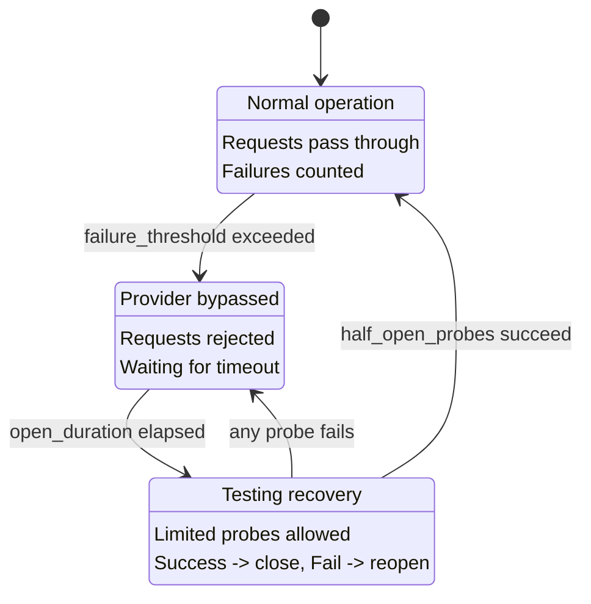

CC-Relay에는 장애가 발생한 프로바이더를 자동으로 감지하고 일시적으로 라우팅에서 제외하는 서킷 브레이커 시스템이 포함되어 있습니다. 이는 연쇄 장애를 방지하고 프로바이더가 새 요청을 받기 전에 복구할 시간을 제공합니다.

## 개요

서킷 브레이커는 프로바이더별로 장애를 추적하고 세 가지 상태를 전환합니다:

| 상태 | 설명 | 동작 |
|------|------|------|
| CLOSED | 정상 운영 | 요청이 통과, 장애가 집계됨 |
| OPEN | 프로바이더 우회 | 요청 거부, 복구 대기 |
| HALF-OPEN | 복구 테스트 중 | 제한된 프로브 허용, 성공 시 닫힘 |

## 서킷 브레이커 상태

서킷 브레이커는 장애가 발생한 프로바이더에 반복적으로 요청하는 것으로부터 시스템을 보호하는 상태 머신을 구현합니다:



### 상태 전환

**CLOSED에서 OPEN으로:** 프로바이더가 `failure_threshold` 횟수의 연속 장애를 누적하면 서킷이 열립니다. 이는 해당 프로바이더로의 요청 라우팅을 즉시 중지합니다.

**OPEN에서 HALF-OPEN으로:** `open_duration_ms`가 경과하면 서킷이 반열림 상태로 전환됩니다. 이는 프로바이더가 복구되었는지 테스트하기 위해 제한된 프로브 요청을 허용합니다.

**HALF-OPEN에서 CLOSED로:** `half_open_probes` 횟수의 연속 요청이 성공하면 서킷이 닫히고 정상 운영이 재개됩니다.

**HALF-OPEN에서 OPEN으로:** 반열림 상태에서 프로브 요청이 실패하면 서킷이 즉시 다시 열리고 타임아웃이 재시작됩니다.

## 설정

`config.yaml`에서 헬스 트래킹을 설정합니다:

```yaml
health:
  # 헬스 체크 설정
  health_check:
    # 주기적 헬스 체크 활성화 (기본값: true)
    enabled: true
    # 체크 간격 (밀리초, 기본값: 10000 = 10초)
    interval_ms: 10000

  # 서킷 브레이커 설정
  circuit_breaker:
    # 서킷이 열리기 전 연속 장애 횟수 (기본값: 5)
    failure_threshold: 5

    # 반열림 전 서킷이 열려 있는 시간 (밀리초, 기본값: 30000 = 30초)
    open_duration_ms: 30000

    # 반열림 상태에서 허용되는 프로브 수 (기본값: 3)
    half_open_probes: 3
```

**참고:** `example.yaml`에는 `recovery_timeout_seconds`와 `triggers`가 포함된 약간 다른 구조가 표시됩니다. 실제 구현은 위와 같이 `open_duration_ms`와 `half_open_probes`를 사용합니다.

## 설정 레퍼런스

| 옵션 | 기본값 | 설명 |
|------|--------|------|
| `health_check.enabled` | `true` | 열린 서킷에 대한 주기적 헬스 체크 활성화 |
| `health_check.interval_ms` | `10000` | 헬스 체크 프로브 간의 밀리초 |
| `circuit_breaker.failure_threshold` | `5` | 서킷이 열리기 전 연속 장애 횟수 |
| `circuit_breaker.open_duration_ms` | `30000` | 반열림 전 서킷이 열려 있는 밀리초 |
| `circuit_breaker.half_open_probes` | `3` | 서킷을 닫는 데 필요한 성공 프로브 수 |

## 작동 원리

### 장애 카운팅

서킷 브레이커는 연속 장애를 계산합니다. `failure_threshold`에 도달하면 서킷이 열립니다.

**장애로 간주되는 것:**

| 오류 유형 | 상태 코드 | 장애로 간주? |
|----------|----------|-------------|
| Rate Limited | `429` | 예 |
| Internal Server Error | `500` | 예 |
| Bad Gateway | `502` | 예 |
| Service Unavailable | `503` | 예 |
| Gateway Timeout | `504` | 예 |
| Request Timeout | (타임아웃) | 예 |
| Network Error | (연결 실패) | 예 |

**장애로 간주되지 않는 것:**

| 오류 유형 | 상태 코드 | 장애로 간주? |
|----------|----------|-------------|
| Bad Request | `400` | 아니오 |
| Unauthorized | `401` | 아니오 |
| Forbidden | `403` | 아니오 |
| Not Found | `404` | 아니오 |
| 기타 4xx | (429 제외) | 아니오 |

클라이언트 오류(429를 제외한 4xx)는 프로바이더 상태가 아닌 요청 자체의 문제를 나타내므로 서킷 브레이커 상태에 영향을 미치지 않습니다.

### 성공 시 리셋

요청이 성공하면 장애 카운터가 0으로 리셋됩니다. 이는 성공이 중간에 있는 한 가끔의 장애로는 서킷 브레이커가 트리거되지 않음을 의미합니다.

### 헬스 체크 프로브

서킷이 OPEN 상태일 때 cc-relay는 전체 타임아웃을 기다리는 것보다 빠르게 복구를 감지하기 위해 주기적인 헬스 체크를 실행합니다:

1. 헬스 체크는 `health_check.interval_ms` 밀리초마다 실행됩니다
2. 체크는 OPEN 서킷이 있는 프로바이더만 대상으로 합니다 (CLOSED 또는 HALF-OPEN이 아닌)
3. 성공적인 헬스 체크는 서킷을 HALF-OPEN으로 전환합니다
4. 헬스 체크는 전체 API 호출이 아닌 경량 HTTP 연결 테스트를 사용합니다

## 라우팅과의 통합

서킷 브레이커는 모든 라우팅 전략과 통합됩니다:

### 프로바이더 제외

OPEN 서킷이 있는 프로바이더는 라우팅 결정에서 자동으로 제외됩니다:

- **Failover 전략:** 우선순위 체인의 다음 프로바이더로 건너뜀
- **Round-robin:** 로테이션에서 제외
- **Weighted round-robin:** 가중치가 사실상 0이 됨
- **Shuffle:** 덱에서 제외

### 자동 복구

복구는 완전 자동입니다:

1. 프로바이더가 장애 시작 (rate limited, 오류, 타임아웃)
2. `failure_threshold` 장애 후 서킷이 열림
3. 요청이 다른 건강한 프로바이더로 라우팅됨
4. `open_duration_ms` 후 서킷이 반열림이 됨
5. 제한된 프로브 요청이 프로바이더를 테스트
6. 프로브가 성공하면 서킷이 닫히고 프로바이더가 로테이션에 복귀

복구에 수동 개입이 필요하지 않습니다.

## 디버그 헤더

`routing.debug: true`가 활성화되면 cc-relay는 응답 헤더에 상태 정보를 포함합니다:

| 헤더 | 값 | 언제 |
|------|-----|------|
| `X-CC-Relay-Provider` | 프로바이더 이름 | 항상 (debug 활성화 시) |
| `X-CC-Relay-Strategy` | 사용된 전략 | 항상 (debug 활성화 시) |

디버그 헤더를 활성화하려면:

```yaml
routing:
  strategy: failover
  debug: true  # 진단 헤더 활성화
```

**보안 경고:** 디버그 헤더는 내부 라우팅 결정을 노출합니다. 개발 환경 또는 신뢰할 수 있는 환경에서만 사용하세요. 신뢰할 수 없는 클라이언트가 있는 프로덕션 환경에서는 절대 활성화하지 마세요.

## 문제 해결

### 프로바이더가 계속 우회됨

**증상:** 프로바이더의 서킷이 프로바이더가 건강해 보이는데도 계속 열림.

**가능한 원인:**

1. **`failure_threshold`가 너무 낮음:** 더 많은 일시적 장애를 허용하도록 증가
   ```yaml
   circuit_breaker:
     failure_threshold: 10  # 더 관대함
   ```

2. **속도 제한이 열림을 트리거:** 속도 제한에 도달한 경우 서킷 브레이커를 조정하는 대신 풀에 API 키를 더 추가

3. **느린 응답이 타임아웃 발생:** 서버 타임아웃 증가
   ```yaml
   server:
     timeout_ms: 300000  # 5분
   ```

### 복구가 너무 오래 걸림

**증상:** 프로바이더가 복구되었지만 서킷이 오랫동안 열려 있음.

**해결책:**

1. **열림 지속 시간 감소:**
   ```yaml
   circuit_breaker:
     open_duration_ms: 15000  # 30초 대신 15초
   ```

2. **더 빠른 헬스 체크 활성화:**
   ```yaml
   health_check:
     enabled: true
     interval_ms: 5000  # 5초마다 체크
   ```

### 유효한 오류에서 서킷이 열림

**증상:** 프로바이더가 클라이언트 오류(400, 401)를 반환할 때 서킷이 열림.

**이는 발생해서는 안 됩니다.** 클라이언트 오류(429를 제외한 4xx)는 장애로 간주되지 않습니다. 이것이 발생하는 경우:

1. 실제 응답이 429(속도 제한)인지 확인
2. 오류가 실제로 잘못 보고된 5xx가 아닌지 확인
3. 실제 응답 코드를 보기 위해 디버그 로깅 활성화:
   ```yaml
   logging:
     level: debug
   ```

### 모든 프로바이더가 비정상

**증상:** 모든 서킷이 열려 있고 요청이 완전히 실패.

**가능한 원인:**

1. **네트워크 연결 문제:** cc-relay가 모든 프로바이더에 도달할 수 있는지 확인
2. **잘못된 API 키:** 키가 유효한지 확인 (401이 열림을 트리거해서는 안 됨)
3. **글로벌 장애:** 모든 프로바이더가 실제로 사용 불가

**즉각적인 완화:**

- 서킷을 더 오래 닫아 두기 위해 `failure_threshold` 증가
- 더 빠른 복구 시도를 위해 `open_duration_ms` 감소

## 다음 단계

- [설정 레퍼런스](/ko/docs/configuration/) - 전체 설정 옵션
- [라우팅 전략](/ko/docs/routing/) - 프로바이더 선택 방법
- [아키텍처 개요](/ko/docs/architecture/) - 시스템 내부
