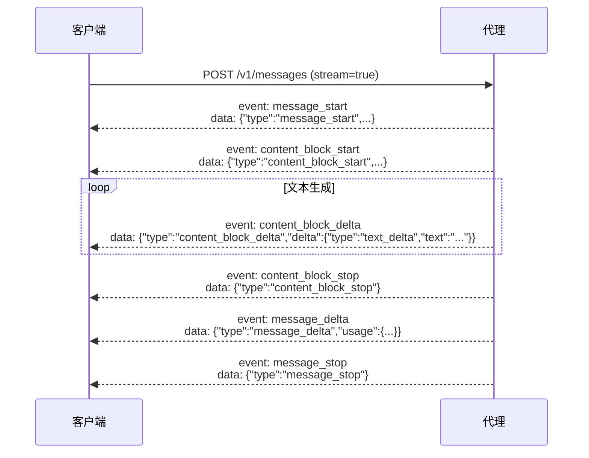

CC-Relay 暴露的 HTTP API 与 Anthropic Messages API 完全兼容。

## HTTP 代理 API

### POST /v1/messages

使用 Anthropic Messages API 格式创建消息。这是 Claude Code 和其他 LLM 客户端使用的主要端点。

**端点**：`POST /v1/messages`

**请求头**：
```
Content-Type: application/json
x-api-key: <your-api-key>
anthropic-version: 2023-06-01
```

**请求体**：
```json
{
  "model": "claude-sonnet-4-5-20250514",
  "max_tokens": 1024,
  "messages": [
    {
      "role": "user",
      "content": "Hello, Claude!"
    }
  ],
  "temperature": 1.0,
  "stream": false
}
```

**响应**（非流式）：
```json
{
  "id": "msg_01XYZ...",
  "type": "message",
  "role": "assistant",
  "content": [
    {
      "type": "text",
      "text": "Hello! How can I help you today?"
    }
  ],
  "model": "claude-sonnet-4-5-20250514",
  "stop_reason": "end_turn",
  "usage": {
    "input_tokens": 12,
    "output_tokens": 15
  }
}
```

### SSE 流式传输

在请求中设置 `"stream": true` 以启用服务器推送事件流式传输。

**事件顺序**：



**流式示例**：

```
event: message_start
data: {"type":"message_start","message":{"id":"msg_01ABC","type":"message","role":"assistant","content":[],"model":"claude-sonnet-4-5-20250514","usage":{"input_tokens":12,"output_tokens":0}}}

event: content_block_start
data: {"type":"content_block_start","index":0,"content_block":{"type":"text","text":""}}

event: content_block_delta
data: {"type":"content_block_delta","index":0,"delta":{"type":"text_delta","text":"Hello"}}

event: content_block_delta
data: {"type":"content_block_delta","index":0,"delta":{"type":"text_delta","text":"!"}}

event: content_block_stop
data: {"type":"content_block_stop","index":0}

event: message_delta
data: {"type":"message_delta","usage":{"output_tokens":2}}

event: message_stop
data: {"type":"message_stop"}
```

### 工具使用

Claude Code 使用工具执行文件操作和其他任务。CC-Relay 保留 `tool_use_id` 以确保正确关联：

**请求**：
```json
{
  "model": "claude-sonnet-4-5-20250514",
  "max_tokens": 1024,
  "tools": [
    {
      "name": "get_weather",
      "description": "Get weather for a location",
      "input_schema": {
        "type": "object",
        "properties": {
          "location": {"type": "string"}
        }
      }
    }
  ],
  "messages": [
    {"role": "user", "content": "What's the weather in NYC?"}
  ]
}
```

**响应**：
```json
{
  "content": [
    {
      "type": "text",
      "text": "I'll check the weather for you."
    },
    {
      "type": "tool_use",
      "id": "toolu_01ABC",
      "name": "get_weather",
      "input": {"location": "NYC"}
    }
  ]
}
```

### 错误响应

所有错误都以 Anthropic API 格式返回：

**上游错误**（502）：
```json
{
  "type": "error",
  "error": {
    "type": "api_error",
    "message": "upstream connection failed"
  }
}
```

**认证错误**（401）：
```json
{
  "type": "error",
  "error": {
    "type": "authentication_error",
    "message": "missing x-api-key header"
  }
}
```

**无效请求**（400）：
```json
{
  "type": "error",
  "error": {
    "type": "invalid_request_error",
    "message": "Missing required field: messages"
  }
}
```

## GET /v1/models

列出所有已配置供应商的可用模型。

**端点**：`GET /v1/models`

**请求头**：无需（无需认证）

**响应**：
```json
{
  "object": "list",
  "data": [
    {
      "id": "claude-sonnet-4-5-20250514",
      "object": "model",
      "owned_by": "anthropic",
      "provider": "anthropic",
      "created": 1737446400
    },
    {
      "id": "claude-opus-4-5-20250514",
      "object": "model",
      "owned_by": "anthropic",
      "provider": "anthropic",
      "created": 1737446400
    },
    {
      "id": "GLM-4.7",
      "object": "model",
      "owned_by": "zhipu",
      "provider": "zai",
      "created": 1737446400
    }
  ]
}
```

## GET /v1/providers

列出活动供应商及其元数据。

**端点**：`GET /v1/providers`

**请求头**：无需（无需认证）

**响应**：
```json
{
  "object": "list",
  "data": [
    {
      "name": "anthropic",
      "type": "anthropic",
      "base_url": "https://api.anthropic.com",
      "models": [
        "claude-sonnet-4-5-20250514",
        "claude-opus-4-5-20250514",
        "claude-haiku-3-5-20241022"
      ],
      "active": true
    },
    {
      "name": "zai",
      "type": "zhipu",
      "base_url": "https://api.z.ai/api/anthropic",
      "models": [
        "GLM-4.7",
        "GLM-4.5-Air",
        "GLM-4-Plus"
      ],
      "active": true
    }
  ]
}
```

## GET /health

用于监控和负载均衡器的健康检查端点。

**端点**：`GET /health`

**请求头**：无需（无需认证）

**响应**：
```json
{"status":"ok"}
```

**HTTP 状态码**：
- `200 OK`：服务器健康
- `503 Service Unavailable`：服务器不健康（未来实现）

## 认证

CC-Relay 为 `/v1/messages` 端点支持多种认证方式：

### API 密钥认证

包含 `x-api-key` 请求头：

```bash
curl -X POST http://localhost:8787/v1/messages \
  -H "Content-Type: application/json" \
  -H "x-api-key: your-proxy-key" \
  -H "anthropic-version: 2023-06-01" \
  -d '{"model": "claude-sonnet-4-5-20250514", ...}'
```

### Bearer Token 认证

包含 `Authorization` 请求头：

```bash
curl -X POST http://localhost:8787/v1/messages \
  -H "Content-Type: application/json" \
  -H "Authorization: Bearer your-token" \
  -H "anthropic-version: 2023-06-01" \
  -d '{"model": "claude-sonnet-4-5-20250514", ...}'
```

这用于 Claude Code 订阅用户。

## 请求头

CC-Relay 将所有 `anthropic-*` 请求头转发到后端供应商：

| 请求头 | 描述 |
|--------|-------------|
| `anthropic-version` | API 版本（必需） |
| `anthropic-beta` | 要启用的 Beta 功能 |
| `anthropic-dangerous-direct-browser-access` | 浏览器访问标志 |

## 响应头

CC-Relay 在响应中添加以下请求头：

| 请求头 | 描述 |
|--------|-------------|
| `X-Request-ID` | 用于追踪的唯一请求标识符 |
| `Content-Type` | `application/json` 或 `text/event-stream` |
| `Cache-Control` | SSE 使用 `no-cache, no-transform` |
| `X-Accel-Buffering` | `no` 禁用代理缓冲 |

## cURL 示例

### 非流式请求

```bash
curl -X POST http://localhost:8787/v1/messages \
  -H "Content-Type: application/json" \
  -H "x-api-key: test" \
  -H "anthropic-version: 2023-06-01" \
  -d '{
    "model": "claude-sonnet-4-5-20250514",
    "max_tokens": 100,
    "messages": [{"role": "user", "content": "Hello!"}]
  }'
```

### 流式请求

```bash
curl -N -X POST http://localhost:8787/v1/messages \
  -H "Content-Type: application/json" \
  -H "x-api-key: test" \
  -H "anthropic-version: 2023-06-01" \
  -d '{
    "model": "claude-sonnet-4-5-20250514",
    "max_tokens": 100,
    "messages": [{"role": "user", "content": "Hello!"}],
    "stream": true
  }'
```

### 列出模型

```bash
curl http://localhost:8787/v1/models
```

### 列出供应商

```bash
curl http://localhost:8787/v1/providers
```

### 健康检查

```bash
curl http://localhost:8787/health
```

## Python 客户端示例

```python
import requests

response = requests.post(
    "http://localhost:8787/v1/messages",
    headers={
        "Content-Type": "application/json",
        "x-api-key": "managed-by-cc-relay",
        "anthropic-version": "2023-06-01",
    },
    json={
        "model": "claude-sonnet-4-5-20250514",
        "max_tokens": 1024,
        "messages": [
            {"role": "user", "content": "Hello!"}
        ],
    },
)

print(response.json())
```

## Python 流式示例

```python
import requests

response = requests.post(
    "http://localhost:8787/v1/messages",
    headers={
        "Content-Type": "application/json",
        "x-api-key": "managed-by-cc-relay",
        "anthropic-version": "2023-06-01",
    },
    json={
        "model": "claude-sonnet-4-5-20250514",
        "max_tokens": 1024,
        "messages": [
            {"role": "user", "content": "Hello!"}
        ],
        "stream": True,
    },
    stream=True,
)

for line in response.iter_lines():
    if line:
        print(line.decode('utf-8'))
```

## Go 客户端示例

```go
package main

import (
    "bytes"
    "encoding/json"
    "fmt"
    "io"
    "net/http"
)

func main() {
    body := map[string]interface{}{
        "model":      "claude-sonnet-4-5-20250514",
        "max_tokens": 100,
        "messages": []map[string]string{
            {"role": "user", "content": "Hello!"},
        },
    }

    jsonBody, _ := json.Marshal(body)

    req, _ := http.NewRequest("POST", "http://localhost:8787/v1/messages", bytes.NewReader(jsonBody))
    req.Header.Set("Content-Type", "application/json")
    req.Header.Set("x-api-key", "test")
    req.Header.Set("anthropic-version", "2023-06-01")

    resp, err := http.DefaultClient.Do(req)
    if err != nil {
        panic(err)
    }
    defer resp.Body.Close()

    data, _ := io.ReadAll(resp.Body)
    fmt.Println(string(data))
}
```

## 下一步

- [配置参考](/zh/docs/configuration/)
- [架构概览](/zh/docs/architecture/)
