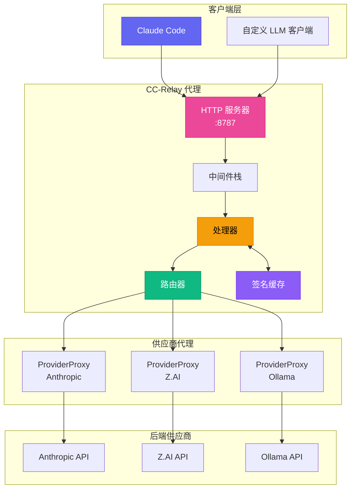
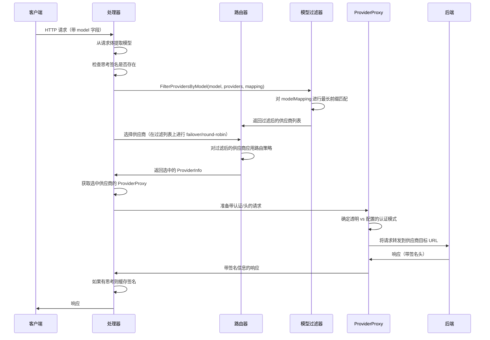
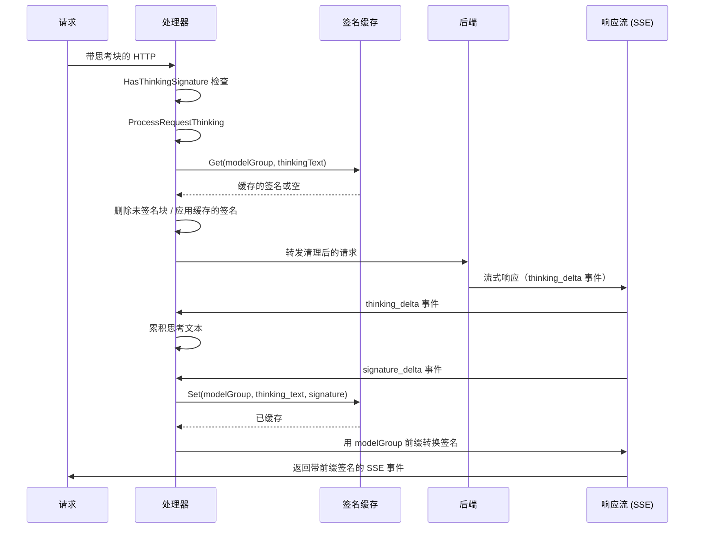
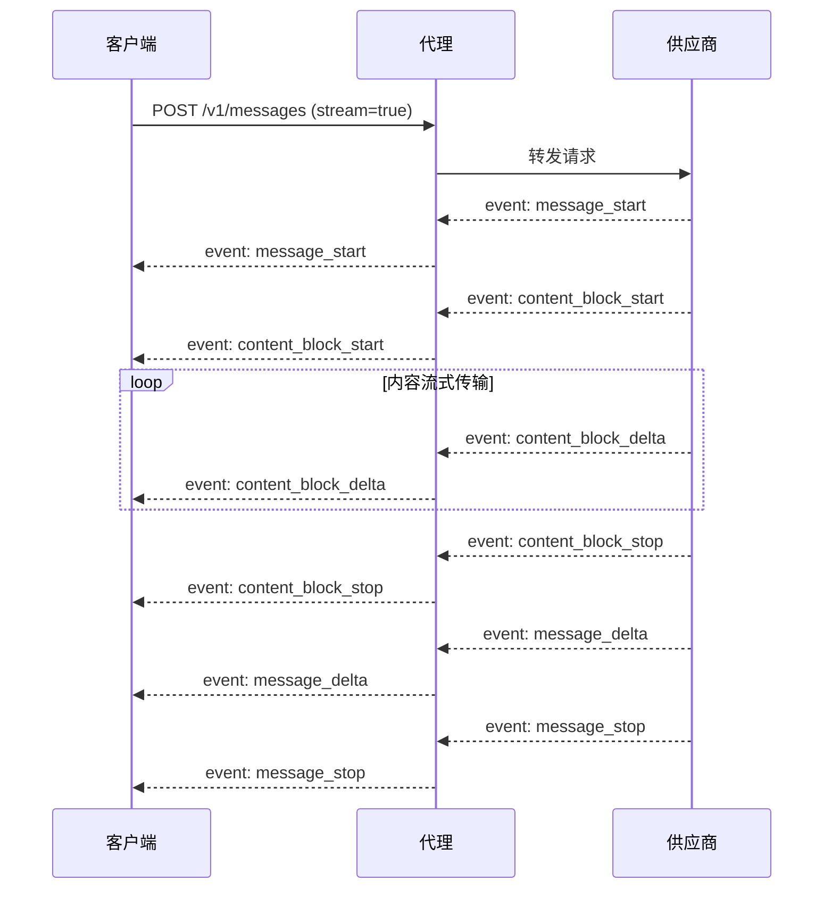
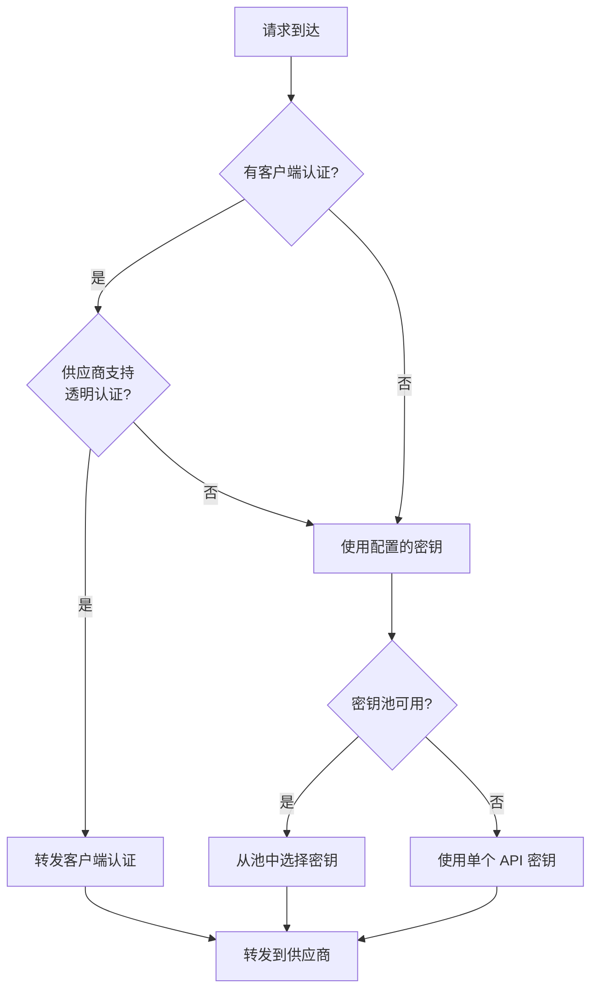

CC-Relay 是一个为 LLM 应用设计的高性能多供应商 HTTP 代理。它提供智能路由、思考签名缓存以及供应商之间的无缝故障转移。

## 系统概述



## 核心组件

### 1. 处理器

**位置**: `internal/proxy/handler.go`

处理器是请求处理的中央协调器：

```go
type Handler struct {
    providerProxies map[string]*ProviderProxy  // 每个供应商的反向代理
    defaultProvider providers.Provider          // 单供应商模式的后备
    router          router.ProviderRouter       // 路由策略实现
    healthTracker   *health.Tracker             // 熔断器跟踪
    signatureCache  *SignatureCache             // 思考签名缓存
    routingConfig   *config.RoutingConfig       // 基于模型的路由配置
    providers       []router.ProviderInfo       // 可用供应商
}
```

**职责:**
- 从请求体中提取模型名称
- 检测用于供应商亲和性的思考签名
- 通过路由器选择供应商
- 委派给适当的 ProviderProxy
- 处理思考块并缓存签名

### 2. ProviderProxy

**位置**: `internal/proxy/provider_proxy.go`

每个供应商获得一个预配置了 URL 和认证的专用反向代理：

```go
type ProviderProxy struct {
    Provider           providers.Provider
    Proxy              *httputil.ReverseProxy
    KeyPool            *keypool.KeyPool  // 用于多密钥轮换
    APIKey             string            // 后备单一密钥
    targetURL          *url.URL          // 供应商基础 URL
    modifyResponseHook ModifyResponseFunc
}
```

**主要特性:**
- URL 解析在初始化时执行一次（不是每个请求）
- 支持透明认证（转发客户端凭证）或配置的认证
- 为流式响应自动注入 SSE 头
- 集成密钥池以分散速率限制

### 3. 路由器

**位置**: `internal/router/`

路由器选择哪个供应商处理每个请求：

| 策略 | 描述 |
|----------|-------------|
| `failover` | 带自动重试的基于优先级（默认） |
| `round_robin` | 顺序轮换 |
| `weighted_round_robin` | 按权重比例分配 |
| `shuffle` | 公平随机分配 |
| `model_based` | 按模型名称前缀路由 |

### 4. 签名缓存

**位置**: `internal/proxy/signature_cache.go`

为跨供应商兼容性缓存思考块签名：

```go
type SignatureCache struct {
    cache cache.Cache  // 基于 Ristretto 的缓存
}

// 缓存键格式: "sig:{modelGroup}:{textHash}"
// TTL: 3 小时（与 Claude API 匹配）
```

## 请求流程

### 多供应商路由



### 思考签名处理

当启用扩展思考时，供应商返回已签名的思考块。这些签名必须在后续轮次由同一供应商验证。CC-Relay 通过缓存解决跨供应商签名问题：



**签名共享的模型组:**

| 模型模式 | 组 | 签名共享 |
|--------------|-------|-------------------|
| `claude-*` | `claude` | 是，跨所有 Claude 模型 |
| `gpt-*` | `gpt` | 是，跨所有 GPT 模型 |
| `gemini-*` | `gemini` | 是，使用哨兵值 |
| 其他 | 精确名称 | 不共享 |

### SSE 流式传输流程



**必需的 SSE 头:**
```
Content-Type: text/event-stream
Cache-Control: no-cache, no-transform
X-Accel-Buffering: no
Connection: keep-alive
```

## 中间件栈

**位置**: `internal/proxy/middleware.go`

| 中间件 | 用途 |
|------------|---------|
| `RequestIDMiddleware` | 为追踪生成/提取 X-Request-ID |
| `LoggingMiddleware` | 记录带时间的请求/响应 |
| `AuthMiddleware` | 验证 x-api-key 头 |
| `MultiAuthMiddleware` | 支持 API 密钥和 Bearer 令牌认证 |

## 供应商接口

**位置**: `internal/providers/provider.go`

```go
type Provider interface {
    Name() string
    BaseURL() string
    Owner() string
    Authenticate(req *http.Request, key string) error
    ForwardHeaders(originalHeaders http.Header) http.Header
    SupportsStreaming() bool
    SupportsTransparentAuth() bool
    ListModels() []Model
    GetModelMapping() map[string]string
    MapModel(requestModel string) string
}
```

**已实现的供应商:**

| 供应商 | 类型 | 特性 |
|----------|------|----------|
| `AnthropicProvider` | `anthropic` | 原生格式，完整功能支持 |
| `ZAIProvider` | `zai` | Anthropic 兼容，GLM 模型 |
| `OllamaProvider` | `ollama` | 本地模型，无提示缓存 |

## 认证模式

### 透明认证
当客户端提供凭证且供应商支持时：
- 客户端的 `Authorization` 或 `x-api-key` 头原样转发
- CC-Relay 作为纯代理运行

### 配置的认证
使用 CC-Relay 管理的密钥时：
- 客户端凭证被移除
- CC-Relay 注入配置的 API 密钥
- 支持密钥池轮换以分散速率限制



## 健康追踪和熔断器

**位置**: `internal/health/`

CC-Relay 跟踪供应商健康状态并实现熔断器模式：

| 状态 | 行为 |
|--------|----------|
| CLOSED | 正常运行，请求通过 |
| OPEN | 供应商标记为不健康，请求快速失败 |
| HALF-OPEN | 冷却后用有限请求探测 |

**触发 OPEN 状态:**
- HTTP 429（速率限制）
- HTTP 5xx（服务器错误）
- 连接超时
- 连续失败超过阈值

## 目录结构

```
cc-relay/
├── cmd/cc-relay/           # CLI 入口点
│   ├── main.go             # 根命令
│   ├── serve.go            # serve 命令
│   └── di/                 # 依赖注入
│       └── providers.go    # 服务装配
├── internal/
│   ├── config/             # 配置加载
│   ├── providers/          # 供应商实现
│   │   ├── provider.go     # 供应商接口
│   │   ├── base.go         # 基础供应商
│   │   ├── anthropic.go    # Anthropic 供应商
│   │   ├── zai.go          # Z.AI 供应商
│   │   └── ollama.go       # Ollama 供应商
│   ├── proxy/              # HTTP 代理服务器
│   │   ├── handler.go      # 主请求处理器
│   │   ├── provider_proxy.go # 每供应商代理
│   │   ├── thinking.go     # 思考块处理
│   │   ├── signature_cache.go # 签名缓存
│   │   ├── sse.go          # SSE 工具
│   │   └── middleware.go   # 中间件链
│   ├── router/             # 路由策略
│   │   ├── router.go       # 路由器接口
│   │   ├── failover.go     # 故障转移策略
│   │   ├── round_robin.go  # 轮询策略
│   │   └── model_filter.go # 基于模型的过滤
│   ├── health/             # 健康追踪
│   │   └── tracker.go      # 熔断器
│   ├── keypool/            # API 密钥池
│   │   └── keypool.go      # 密钥轮换
│   └── cache/              # 缓存层
│       └── cache.go        # Ristretto 包装器
└── docs-site/              # 文档
```

## 性能考虑

### 连接处理
- **连接池**: 到后端的 HTTP 连接被重用
- **HTTP/2 支持**: 在支持的地方使用多路复用请求
- **即时刷新**: SSE 事件无缓冲刷新

### 并发
- **每请求一个 goroutine**: 轻量级 Go 并发
- **上下文传播**: 正确的超时和取消
- **线程安全缓存**: Ristretto 提供并发访问

### 内存
- **流式响应**: 不缓冲响应体
- **签名缓存**: 带 LRU 驱逐的有限大小
- **请求体恢复**: 高效的请求体重读

## 下一步

- [配置参考](/docs/configuration/)
- [路由策略](/docs/routing/)
- [供应商设置](/docs/providers/)
