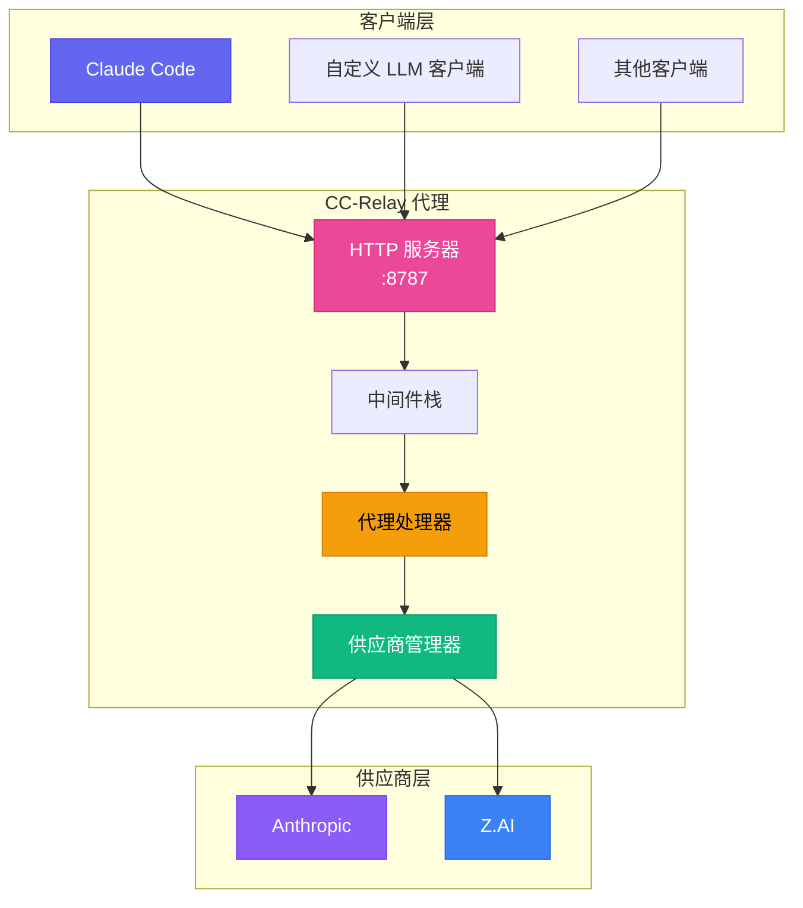
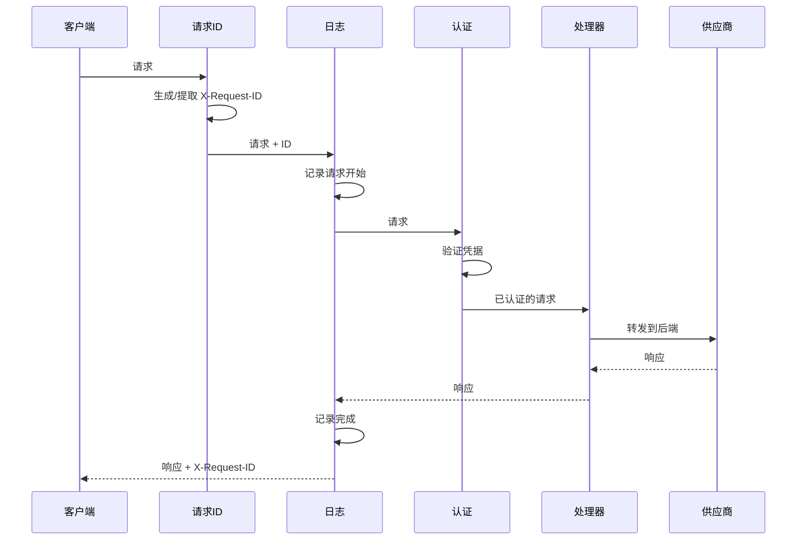
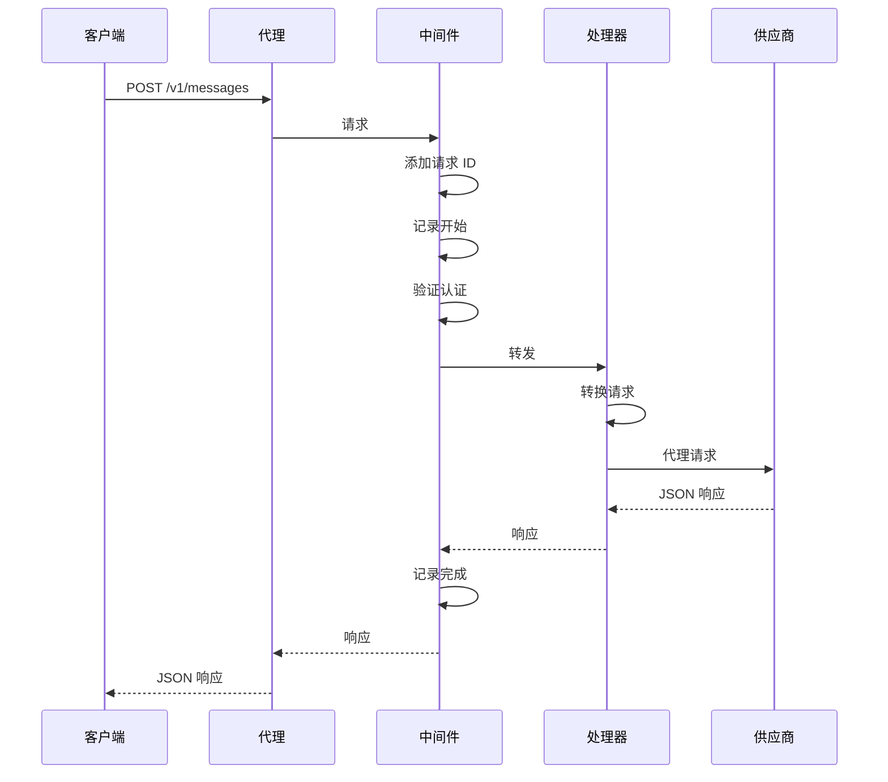
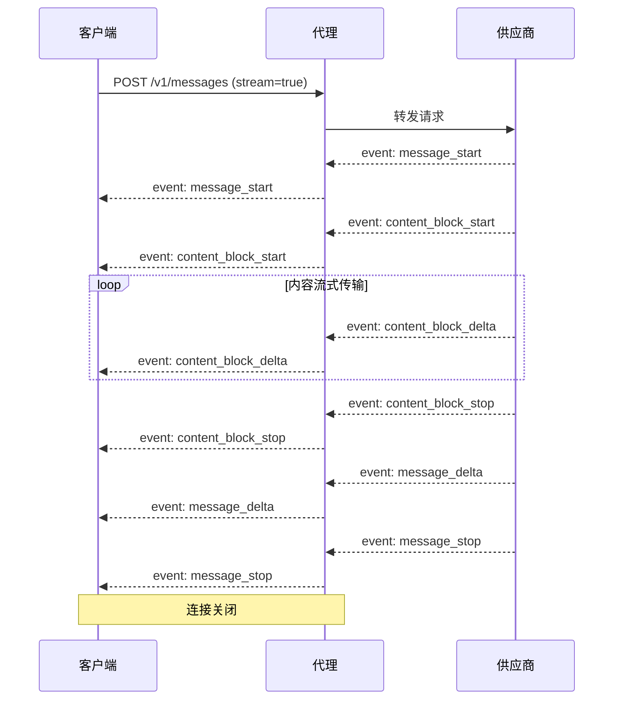
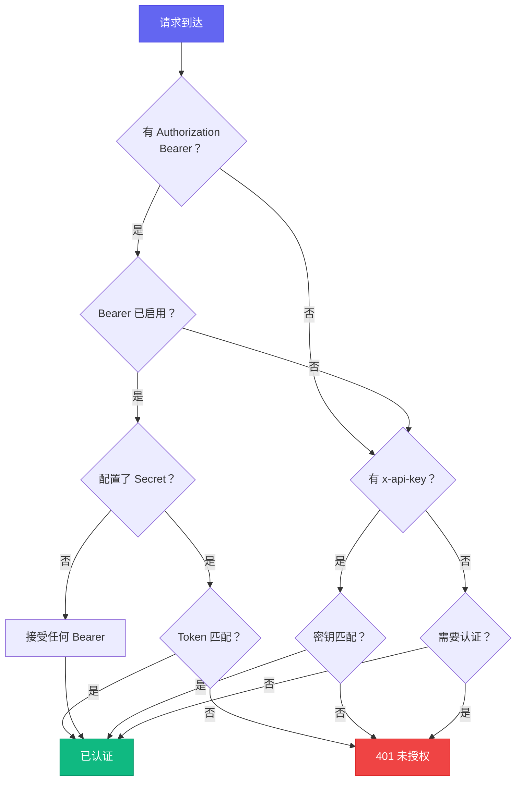

CC-Relay 设计为高性能的多供应商 HTTP 代理，位于 LLM 客户端（如 Claude Code）和后端供应商之间。

## 系统概览



## 核心组件

### 1. HTTP 代理服务器

**位置**：`internal/proxy/`

HTTP 服务器实现了与 Claude Code 完全兼容的 Anthropic Messages API（`/v1/messages`）。

**功能：**
- SSE 流式传输，保持正确的事件顺序
- 请求验证和转换
- 中间件链（请求 ID、日志、认证）
- 用于超时和取消的上下文传播
- 支持 HTTP/2 并发请求

**端点：**

| 端点 | 方法 | 描述 |
|----------|--------|-------------|
| `/v1/messages` | POST | 代理请求到后端供应商 |
| `/v1/models` | GET | 列出所有供应商的可用模型 |
| `/v1/providers` | GET | 列出活动供应商及其元数据 |
| `/health` | GET | 健康检查端点 |

### 2. 中间件栈

**位置**：`internal/proxy/middleware.go`

中间件链按顺序处理请求：



**中间件组件：**

| 中间件 | 用途 |
|------------|---------|
| `RequestIDMiddleware` | 生成/提取 X-Request-ID 用于追踪 |
| `LoggingMiddleware` | 记录请求/响应及时间 |
| `AuthMiddleware` | 验证 x-api-key 请求头 |
| `MultiAuthMiddleware` | 支持 API 密钥和 Bearer Token 认证 |

### 3. 供应商管理器

**位置**：`internal/providers/`

每个供应商实现 `Provider` 接口：

```go
type Provider interface {
    // Name 返回供应商标识符
    Name() string

    // BaseURL 返回后端 API 基础 URL
    BaseURL() string

    // Owner 返回所有者标识符（如 "anthropic"、"zhipu"）
    Owner() string

    // Authenticate 添加供应商特定的认证
    Authenticate(req *http.Request, key string) error

    // ForwardHeaders 返回要转发到后端的请求头
    ForwardHeaders(originalHeaders http.Header) http.Header

    // SupportsStreaming 指示供应商是否支持 SSE
    SupportsStreaming() bool

    // ListModels 返回可用模型
    ListModels() []Model
}
```

**已实现的供应商：**

| 供应商 | 类型 | 描述 |
|----------|------|-------------|
| `AnthropicProvider` | `anthropic` | Anthropic 直接 API |
| `ZAIProvider` | `zai` | Z.AI/智谱 GLM（Anthropic 兼容） |

### 4. 代理处理器

**位置**：`internal/proxy/handler.go`

代理处理器使用 Go 的 `httputil.ReverseProxy` 高效转发请求：

```go
type Handler struct {
    provider  providers.Provider
    proxy     *httputil.ReverseProxy
    apiKey    string
    debugOpts config.DebugOptions
}
```

**主要特性：**
- SSE 流式传输立即刷新（`FlushInterval: -1`）
- 供应商特定的认证
- 转发 `anthropic-*` 请求头
- 使用 Anthropic 格式的错误处理

### 5. 配置管理器

**位置**：`internal/config/`

**功能：**
- YAML 解析及环境变量扩展
- 供应商和服务器配置验证
- 支持多种认证方式

## 请求流程

### 非流式请求



### 流式请求（SSE）



## SSE 流式传输

CC-Relay 保持精确的 SSE 事件顺序以确保 Claude Code 兼容性：

**必需的请求头：**
```
Content-Type: text/event-stream
Cache-Control: no-cache, no-transform
X-Accel-Buffering: no
Connection: keep-alive
```

**事件顺序：**
1. `message_start` - 消息元数据
2. `content_block_start` - 内容块开始
3. `content_block_delta` - 内容块（重复）
4. `content_block_stop` - 内容块结束
5. `message_delta` - 使用信息
6. `message_stop` - 消息完成

`X-Accel-Buffering: no` 请求头对于防止 nginx/Cloudflare 缓冲 SSE 事件至关重要。

## 认证流程



## API 兼容性

### Anthropic API 格式

CC-Relay 实现与 Anthropic Messages API 的完全兼容：

**端点**：`POST /v1/messages`

**请求头**：
- `x-api-key`：API 密钥（由 CC-Relay 管理）
- `anthropic-version`：API 版本（如 `2023-06-01`）
- `content-type`：`application/json`

**请求体**：
```json
{
  "model": "claude-sonnet-4-5-20250514",
  "max_tokens": 1024,
  "messages": [
    {"role": "user", "content": "Hello!"}
  ],
  "stream": true
}
```

### 供应商转换

当前支持的两个供应商（Anthropic 和 Z.AI）都使用相同的 Anthropic 兼容 API 格式：

| 供应商 | 转换 |
|----------|----------------|
| **Anthropic** | 无（原生格式） |
| **Z.AI** | 仅模型名称映射 |

## 性能考虑

### 连接处理

CC-Relay 使用 Go 标准库 HTTP 客户端并优化设置：

- **连接池**：复用到后端的 HTTP 连接
- **HTTP/2 支持**：可选的 h2c 多路复用请求
- **立即刷新**：SSE 事件立即刷新

### 并发

- **每请求一个 Goroutine**：轻量级并发模型
- **上下文传播**：正确的超时和取消处理
- **线程安全日志**：使用 zerolog 进行结构化日志

### 内存管理

- **流式响应**：不缓冲响应体
- **请求体限制**：可配置的最大请求体大小
- **优雅关闭**：30 秒超时等待进行中的请求

## 目录结构

```
cc-relay/
├── cmd/cc-relay/        # CLI 入口点
│   ├── main.go          # 根命令
│   ├── serve.go         # Serve 命令
│   ├── status.go        # Status 命令
│   ├── version.go       # Version 命令
│   ├── config.go        # Config 命令
│   ├── config_init.go   # Config init 子命令
│   ├── config_cc.go     # Config cc 子命令
│   ├── config_cc_init.go    # Claude Code 配置
│   └── config_cc_remove.go  # 移除 CC 配置
├── internal/
│   ├── config/          # 配置加载
│   │   ├── config.go    # 配置结构
│   │   └── loader.go    # YAML/环境变量加载
│   ├── providers/       # 供应商实现
│   │   ├── provider.go  # 供应商接口
│   │   ├── base.go      # 基础供应商
│   │   ├── anthropic.go # Anthropic 供应商
│   │   └── zai.go       # Z.AI 供应商
│   ├── proxy/           # HTTP 代理服务器
│   │   ├── server.go    # 服务器设置
│   │   ├── routes.go    # 路由注册
│   │   ├── handler.go   # 代理处理器
│   │   ├── middleware.go # 中间件链
│   │   ├── sse.go       # SSE 工具
│   │   ├── errors.go    # 错误响应
│   │   └── logger.go    # 日志设置
│   ├── auth/            # 认证
│   │   ├── auth.go      # 认证接口
│   │   ├── apikey.go    # API 密钥认证
│   │   ├── oauth.go     # Bearer Token 认证
│   │   └── chain.go     # 认证链
│   └── version/         # 版本信息
└── config.yaml          # 示例配置
```

## 未来架构

以下功能计划在未来版本中实现：

- **路由组件**：智能路由策略（轮询、故障转移、基于成本）
- **速率限制器**：每个 API 密钥的令牌桶速率限制
- **健康追踪器**：带自动恢复的熔断器
- **gRPC 管理 API**：实时统计和配置
- **TUI 仪表盘**：基于终端的监控界面
- **更多供应商**：Ollama、AWS Bedrock、Azure、Vertex AI

## 下一步

- [配置参考](/zh/docs/configuration/)
- [API 文档](/zh/docs/api/)
