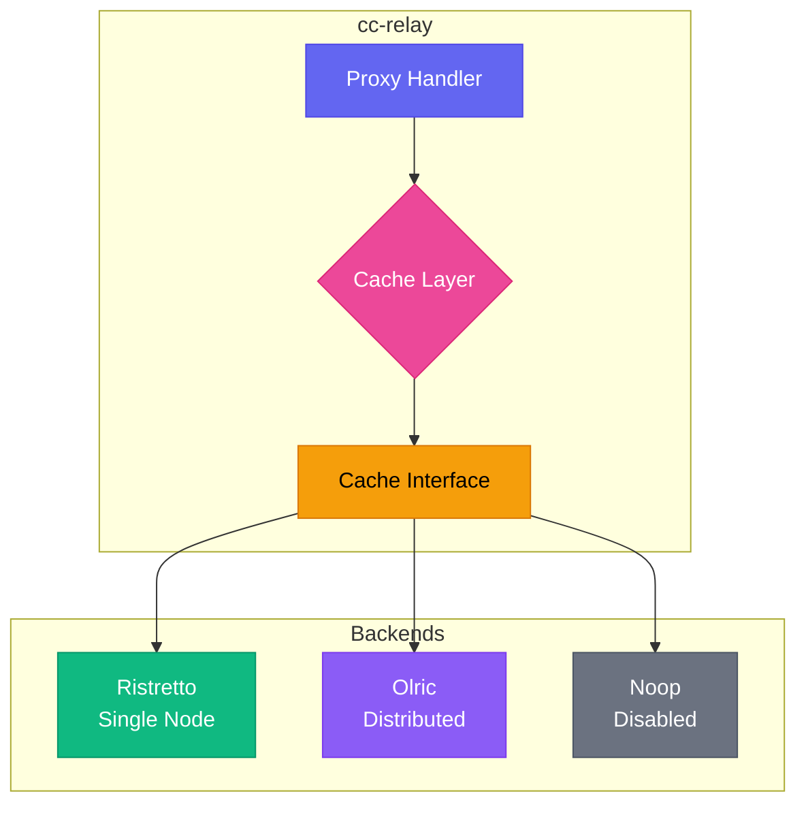
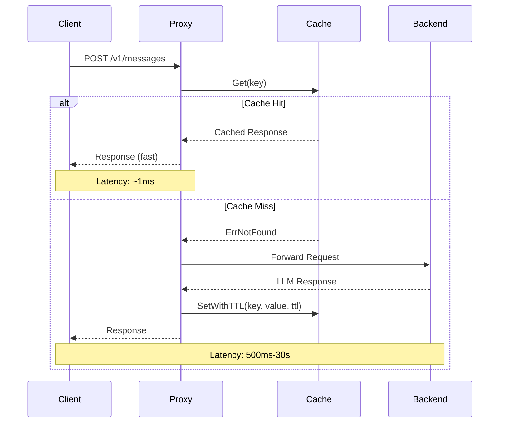

CC-Relay 包含一个灵活的缓存层，可以通过缓存 LLM 供应商的响应来显著降低延迟和后端负载。

## 概述

缓存子系统支持三种操作模式：

| 模式 | 后端 | 描述 |
|------|------|------|
| `single` | Ristretto | 高性能本地内存缓存（默认） |
| `ha` | Olric | 用于高可用性部署的分布式缓存 |
| `disabled` | Noop | 无缓存的直通模式 |

**何时使用每种模式：**

- **Single 模式**：开发、测试或单实例生产部署。提供最低延迟，无网络开销。
- **HA 模式**：需要跨节点缓存一致性的多实例生产部署。
- **Disabled 模式**：调试、合规要求或在其他地方处理缓存的情况。

## 架构



缓存层实现了一个统一的 `Cache` 接口，抽象了所有后端：

```go
type Cache interface {
    Get(ctx context.Context, key string) ([]byte, error)
    Set(ctx context.Context, key string, value []byte) error
    SetWithTTL(ctx context.Context, key string, value []byte, ttl time.Duration) error
    Delete(ctx context.Context, key string) error
    Exists(ctx context.Context, key string) (bool, error)
    Close() error
}
```

## 缓存流程



## 配置

### Single 模式（Ristretto）

Ristretto 是基于 Caffeine 库研究的高性能并发缓存。它使用 TinyLFU 准入策略以获得最佳命中率。

```yaml
cache:
  mode: single

  ristretto:
    # 4 位访问计数器的数量
    # 建议：预期最大项目数的 10 倍以获得最佳准入策略
    # 示例：对于 100,000 项，使用 1,000,000 个计数器
    num_counters: 1000000

    # 缓存值的最大内存（字节）
    # 104857600 = 100 MB
    max_cost: 104857600

    # 每个 Get 缓冲区的键数（默认：64）
    # 控制准入缓冲区大小
    buffer_items: 64
```

**内存计算：**

`max_cost` 参数控制缓存可用于值的内存量。要估算适当的大小：

1. 估算平均响应大小（LLM 响应通常为 1-10 KB）
2. 乘以您想要缓存的唯一请求数
3. 为元数据添加 20% 的开销

示例：10,000 个缓存响应 x 平均 5 KB = 50 MB，因此设置 `max_cost: 52428800`

### HA 模式（Olric）

Olric 提供具有自动集群发现和数据复制的分布式缓存。

**客户端模式**（连接到外部集群）：

```yaml
cache:
  mode: ha

  olric:
    # Olric 集群成员地址
    addresses:
      - "olric-1:3320"
      - "olric-2:3320"
      - "olric-3:3320"

    # 分布式映射名称（默认："cc-relay"）
    dmap_name: "cc-relay"
```

**嵌入式模式**（单节点 HA 或开发）：

```yaml
cache:
  mode: ha

  olric:
    # 运行嵌入式 Olric 节点
    embedded: true

    # 嵌入式节点的绑定地址
    bind_addr: "0.0.0.0:3320"

    # 用于集群发现的对等地址（可选）
    peers:
      - "cc-relay-2:3320"
      - "cc-relay-3:3320"

    dmap_name: "cc-relay"
```

### Disabled 模式

```yaml
cache:
  mode: disabled
```

所有缓存操作立即返回而不存储数据。`Get` 操作始终返回 `ErrNotFound`。

## 缓存模式比较

| 特性 | Single（Ristretto） | HA（Olric） | Disabled（Noop） |
|------|-------------------|------------|-----------------|
| **后端** | 本地内存 | 分布式 | 无 |
| **使用场景** | 开发、单实例 | 生产 HA | 调试 |
| **持久化** | 无 | 可选 | N/A |
| **多节点** | 无 | 有 | N/A |
| **延迟** | 约 1 微秒 | 约 1-10 ms（网络） | 约 0 |
| **内存** | 仅本地 | 分布式 | 无 |
| **一致性** | N/A | 最终一致性 | N/A |
| **复杂度** | 低 | 中 | 无 |

## 可选接口

一些缓存后端通过可选接口支持额外功能：

### 统计信息

```go
if sp, ok := cache.(cache.StatsProvider); ok {
    stats := sp.Stats()
    fmt.Printf("Hits: %d, Misses: %d\n", stats.Hits, stats.Misses)
}
```

统计信息包括：
- `Hits`：缓存命中次数
- `Misses`：缓存未命中次数
- `KeyCount`：当前键数
- `BytesUsed`：大约使用的内存
- `Evictions`：因容量而被驱逐的键

### 健康检查（Ping）

```go
if p, ok := cache.(cache.Pinger); ok {
    if err := p.Ping(ctx); err != nil {
        // 缓存不健康
    }
}
```

`Pinger` 接口主要用于分布式缓存（Olric）以验证集群连接性。

### 批量操作

```go
// 批量 Get
if mg, ok := cache.(cache.MultiGetter); ok {
    results, err := mg.GetMulti(ctx, []string{"key1", "key2", "key3"})
}

// 批量 Set
if ms, ok := cache.(cache.MultiSetter); ok {
    err := ms.SetMultiWithTTL(ctx, items, 5*time.Minute)
}
```

## 性能提示

### 优化 Ristretto

1. **适当设置 `num_counters`**：使用预期最大项目数的 10 倍。太低会降低命中率；太高会浪费内存。

2. **根据响应大小调整 `max_cost`**：LLM 响应差异很大。监控实际使用情况并调整。

3. **明智地使用 TTL**：动态内容使用短 TTL（1-5 分钟），确定性响应使用长 TTL（1 小时以上）。

4. **监控指标**：跟踪命中率以验证缓存有效性：
   ```
   hit_rate = hits / (hits + misses)
   ```
   目标是 80% 以上的命中率以实现有效缓存。

### 优化 Olric

1. **部署在 cc-relay 实例附近**：网络延迟主导分布式缓存性能。

2. **单节点部署使用嵌入式模式**：在保持 HA 就绪配置的同时避免外部依赖。

3. **适当调整集群大小**：每个节点应有足够的内存用于完整数据集（Olric 复制数据）。

4. **监控集群健康**：在健康检查中使用 `Pinger` 接口。

### 通用提示

1. **缓存键设计**：使用基于请求内容的确定性键。包括模型名称、提示哈希和相关参数。

2. **避免缓存流式响应**：由于其增量性质，流式 SSE 响应默认不缓存。

3. **考虑缓存预热**：对于可预测的工作负载，使用常见查询预先填充缓存。

## 故障排除

### 预期命中时发生缓存未命中

1. **检查键生成**：确保缓存键是确定性的，不包含时间戳或请求 ID。

2. **验证 TTL 设置**：项目可能已过期。检查 TTL 对于您的使用场景是否太短。

3. **监控驱逐**：高驱逐计数表示 `max_cost` 太低：
   ```go
   stats := cache.Stats()
   if stats.Evictions > 0 {
       // 考虑增加 max_cost
   }
   ```

### Ristretto 不存储项目

Ristretto 使用可能拒绝项目以保持高命中率的准入策略。这是正常行为：

1. **新项目可能被拒绝**：TinyLFU 要求项目通过重复访问"证明"其价值。

2. **等待缓冲区刷新**：Ristretto 缓冲写入。在测试中调用 `cache.Wait()` 以确保写入被处理。

3. **检查成本计算**：成本 > `max_cost` 的项目永远不会被存储。

### Olric 集群连接问题

1. **验证网络连接**：确保所有节点可以在端口 3320（或配置的端口）上相互访问。

2. **检查防火墙规则**：Olric 需要节点之间的双向通信。

3. **验证地址**：在客户端模式下，确保列表中至少有一个地址可达。

4. **监控日志**：启用调试日志以查看集群成员事件：
   ```yaml
   logging:
     level: debug
   ```

### 内存压力

1. **减少 `max_cost`**：降低缓存大小以减少内存使用。

2. **使用更短的 TTL**：更快地使项目过期以释放内存。

3. **切换到 Olric**：将内存压力分布到多个节点。

4. **使用指标监控**：跟踪 `BytesUsed` 以了解实际内存消耗。

## 错误处理

缓存包为常见情况定义了标准错误：

```go
import "github.com/anthropics/cc-relay/internal/cache"

data, err := c.Get(ctx, key)
switch {
case errors.Is(err, cache.ErrNotFound):
    // 缓存未命中 - 从后端获取
case errors.Is(err, cache.ErrClosed):
    // 缓存已关闭 - 重新创建或失败
case err != nil:
    // 其他错误（网络、序列化等）
}
```

## 下一步

- [配置参考](/zh-cn/docs/configuration/)
- [架构概述](/zh-cn/docs/architecture/)
- [API 文档](/zh-cn/docs/api/)
