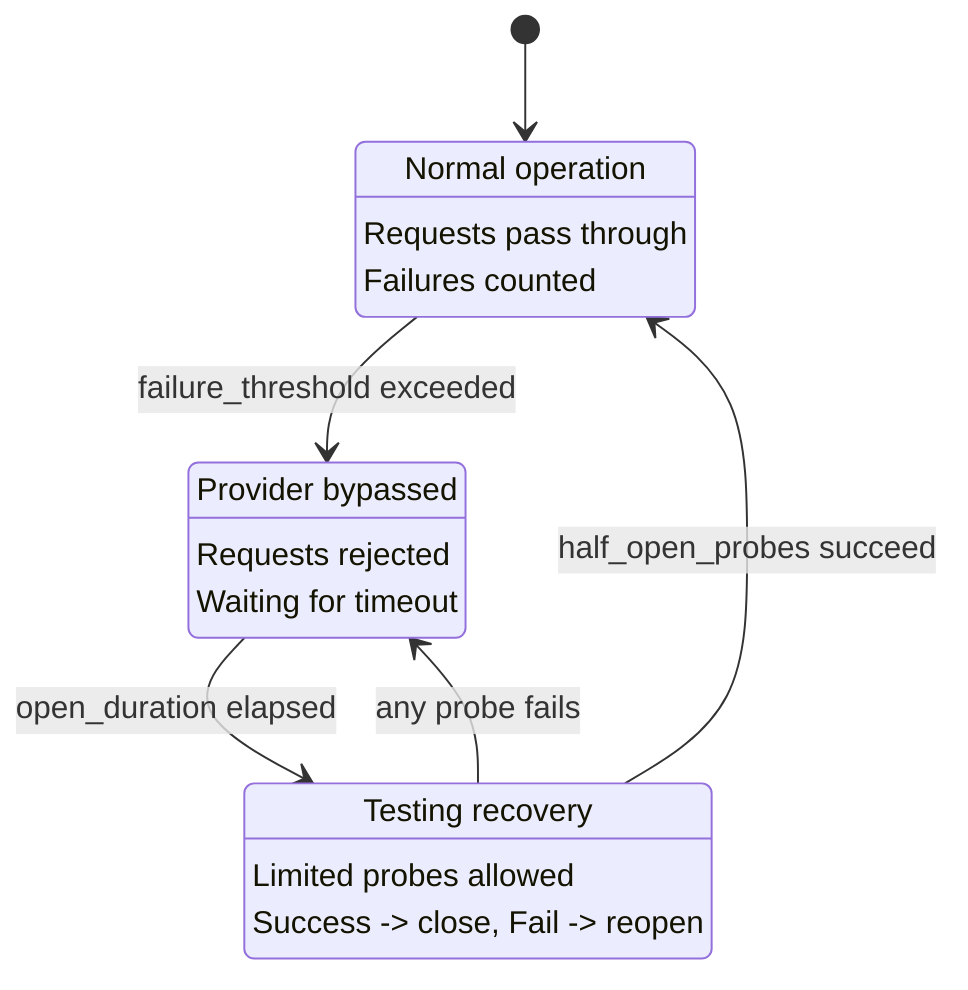

CC-Relay 包含一个熔断器系统，可自动检测故障供应商并暂时将其从路由中排除。这可以防止级联故障，并在供应商接收新请求之前给予其恢复时间。

## 概述

熔断器按供应商跟踪故障，并在三种状态之间转换：

| 状态 | 描述 | 行为 |
|------|------|------|
| CLOSED | 正常运行 | 请求通过，统计故障 |
| OPEN | 绕过供应商 | 请求被拒绝，等待恢复 |
| HALF-OPEN | 测试恢复 | 允许有限的探测，成功则关闭 |

## 熔断器状态

熔断器实现了一个状态机，保护您的系统免受重复访问故障供应商的影响：



### 状态转换

**CLOSED 到 OPEN:** 当供应商累积 `failure_threshold` 次连续故障时，熔断器打开。这会立即停止向该供应商路由请求。

**OPEN 到 HALF-OPEN:** 经过 `open_duration_ms` 后，熔断器转换到半开状态。这允许有限的探测请求来测试供应商是否已恢复。

**HALF-OPEN 到 CLOSED:** 如果 `half_open_probes` 次连续请求成功，熔断器关闭并恢复正常运行。

**HALF-OPEN 到 OPEN:** 如果在半开状态下任何探测请求失败，熔断器立即重新打开，超时重新开始。

## 配置

在 `config.yaml` 中配置健康跟踪：

```yaml
health:
  # 健康检查设置
  health_check:
    # 启用定期健康检查（默认: true）
    enabled: true
    # 检查间隔（毫秒，默认: 10000 = 10秒）
    interval_ms: 10000

  # 熔断器设置
  circuit_breaker:
    # 熔断器打开前的连续故障次数（默认: 5）
    failure_threshold: 5

    # 熔断器在半开之前保持打开的时间（毫秒，默认: 30000 = 30秒）
    open_duration_ms: 30000

    # 半开状态下允许的探测次数（默认: 3）
    half_open_probes: 3
```

**注意:** `example.yaml` 显示了一个略有不同的结构，包含 `recovery_timeout_seconds` 和 `triggers`。实际实现使用如上所示的 `open_duration_ms` 和 `half_open_probes`。

## 配置参考

| 选项 | 默认值 | 描述 |
|------|--------|------|
| `health_check.enabled` | `true` | 为打开的熔断器启用定期健康检查 |
| `health_check.interval_ms` | `10000` | 健康检查探测之间的毫秒数 |
| `circuit_breaker.failure_threshold` | `5` | 熔断器打开前的连续故障次数 |
| `circuit_breaker.open_duration_ms` | `30000` | 熔断器在半开之前保持打开的毫秒数 |
| `circuit_breaker.half_open_probes` | `3` | 关闭熔断器所需的成功探测次数 |

## 工作原理

### 故障计数

熔断器计算连续故障。当达到 `failure_threshold` 时，熔断器打开。

**算作故障的情况:**

| 错误类型 | 状态码 | 算作故障? |
|----------|--------|----------|
| Rate Limited | `429` | 是 |
| Internal Server Error | `500` | 是 |
| Bad Gateway | `502` | 是 |
| Service Unavailable | `503` | 是 |
| Gateway Timeout | `504` | 是 |
| Request Timeout | (超时) | 是 |
| Network Error | (连接失败) | 是 |

**不算作故障的情况:**

| 错误类型 | 状态码 | 算作故障? |
|----------|--------|----------|
| Bad Request | `400` | 否 |
| Unauthorized | `401` | 否 |
| Forbidden | `403` | 否 |
| Not Found | `404` | 否 |
| 其他 4xx | (除 429 外) | 否 |

客户端错误（除 429 外的 4xx）表示请求本身的问题，而不是供应商健康问题，因此不会影响熔断器状态。

### 成功重置

当请求成功时，故障计数器重置为零。这意味着只要成功穿插其中，偶发的故障不会触发熔断器。

### 健康检查探测

当熔断器处于 OPEN 状态时，cc-relay 运行定期健康检查，以比等待完整超时更快地检测恢复：

1. 健康检查每 `health_check.interval_ms` 毫秒运行一次
2. 检查仅针对具有 OPEN 熔断器的供应商（不是 CLOSED 或 HALF-OPEN）
3. 成功的健康检查将熔断器转换为 HALF-OPEN
4. 健康检查使用轻量级 HTTP 连接测试，而不是完整的 API 调用

## 与路由的集成

熔断器与所有路由策略集成：

### 供应商排除

具有 OPEN 熔断器的供应商会自动从路由决策中排除：

- **Failover 策略:** 跳到优先级链中的下一个供应商
- **Round-robin:** 从轮换中排除
- **Weighted round-robin:** 权重实际上变为零
- **Shuffle:** 从牌堆中排除

### 自动恢复

恢复是完全自动的：

1. 供应商开始故障（rate limited、错误、超时）
2. 在 `failure_threshold` 次故障后，熔断器打开
3. 请求路由到其他健康的供应商
4. 在 `open_duration_ms` 后，熔断器变为半开
5. 有限的探测请求测试供应商
6. 如果探测成功，熔断器关闭，供应商重新加入轮换

恢复不需要手动干预。

## 调试头

当启用 `routing.debug: true` 时，cc-relay 在响应头中包含健康状态：

| 头部 | 值 | 何时 |
|------|-----|------|
| `X-CC-Relay-Provider` | 供应商名称 | 始终（当启用 debug 时） |
| `X-CC-Relay-Strategy` | 使用的策略 | 始终（当启用 debug 时） |

要启用调试头：

```yaml
routing:
  strategy: failover
  debug: true  # 启用诊断头
```

**安全警告:** 调试头会暴露内部路由决策。仅在开发或受信任的环境中使用。切勿在有不受信任客户端的生产环境中启用。

## 故障排除

### 供应商持续被绕过

**症状:** 供应商的熔断器不断打开，即使供应商看起来很健康。

**可能的原因:**

1. **`failure_threshold` 太低:** 增加以容忍更多瞬时故障
   ```yaml
   circuit_breaker:
     failure_threshold: 10  # 更宽容
   ```

2. **速率限制触发打开:** 如果您达到速率限制，请向池中添加更多 API 密钥，而不是调整熔断器

3. **慢响应导致超时:** 增加服务器超时
   ```yaml
   server:
     timeout_ms: 300000  # 5 分钟
   ```

### 恢复时间太长

**症状:** 供应商已恢复，但熔断器长时间保持打开。

**解决方案:**

1. **减少打开持续时间:**
   ```yaml
   circuit_breaker:
     open_duration_ms: 15000  # 15 秒而不是 30 秒
   ```

2. **启用更快的健康检查:**
   ```yaml
   health_check:
     enabled: true
     interval_ms: 5000  # 每 5 秒检查一次
   ```

### 熔断器在有效错误时打开

**症状:** 当供应商返回客户端错误（400、401）时熔断器打开。

**这不应该发生。** 客户端错误（除 429 外的 4xx）不算作故障。如果您看到这种情况：

1. 检查实际响应是否为 429（速率受限）
2. 验证错误不是实际上被错误报告的 5xx
3. 启用调试日志以查看实际响应代码：
   ```yaml
   logging:
     level: debug
   ```

### 所有供应商不健康

**症状:** 所有熔断器打开，请求完全失败。

**可能的原因:**

1. **网络连接问题:** 检查 cc-relay 是否可以到达所有供应商
2. **无效的 API 密钥:** 验证密钥是否有效（尽管 401 不应触发打开）
3. **全局中断:** 所有供应商确实不可用

**即时缓解:**

- 增加 `failure_threshold` 以使熔断器保持关闭更长时间
- 减少 `open_duration_ms` 以更快地尝试恢复

## 后续步骤

- [配置参考](/zh-cn/docs/configuration/) - 完整配置选项
- [路由策略](/zh-cn/docs/routing/) - 如何选择供应商
- [架构概述](/zh-cn/docs/architecture/) - 系统内部
